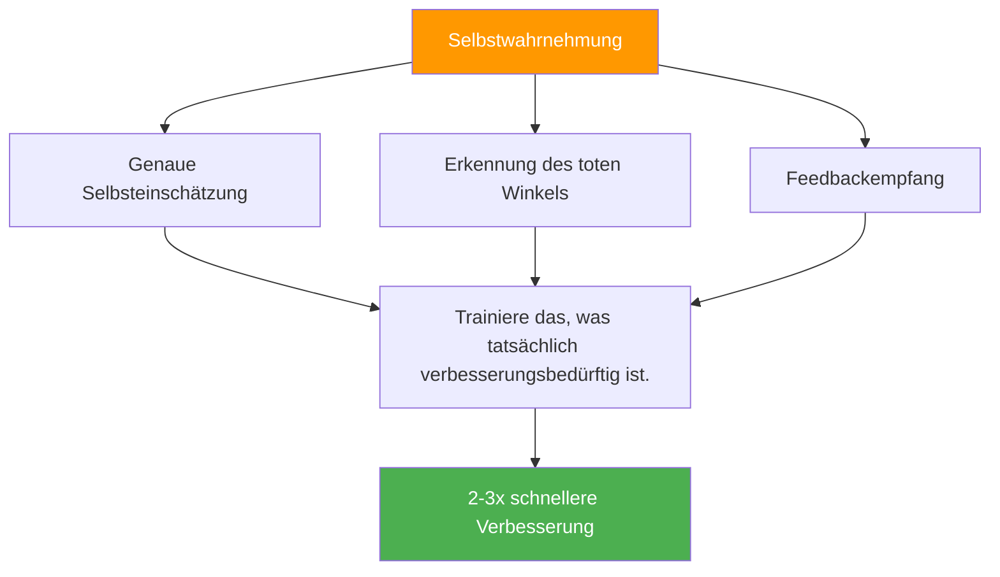

# Der Vorteil der Selbstwahrnehmung

::: tip Die Meta-Fähigkeit, die alles vervielfacht
**Gewichtung: 400 Punkte** — Spieler mit einer genauen Selbsteinschätzung verbessern sich 2-3 Mal schneller, weil sie das trainieren, woran tatsächlich gearbeitet werden muss.
:::

## Warum dies Ihr versteckter Multiplikator ist

> „Was man nicht sieht, kann man nicht verbessern.“

Die meisten Spieler verbringen Stunden mit Üben, aber **üben sie die richtigen Dinge?** Selbstwahrnehmung ist die übergeordnete Fähigkeit, die sicherstellt, dass Ihre Trainingszeit tatsächlich effektiv ist.

### Der Verbesserungsmultiplikatoreffekt



Ohne Selbstwahrnehmung könntest du:
- Übe das, was du bereits gut kannst (fühlt sich gut an, begrenztes Wachstum).
- Technische Mängel übersehen, die man nicht sehen kann
- Verluste werden fälschlicherweise externen Faktoren zugeschrieben
- Widerstehe Feedback, das dir helfen könnte

Mit Selbstwahrnehmung können Sie:
- Identifizieren Sie die tatsächlichen Schwächen präzise
- Nützliches Feedback annehmen und umsetzen
- Verstehe, wie sich Druck auf dein spezifisches Spiel auswirkt.
- Kenne deine Verhaltensmuster unter verschiedenen Bedingungen

---

## Das Selbstbewusstseinsparadoxon

::: danger Die unbequeme Wahrheit
Die Forschung zeigt übereinstimmend: Menschen mit einem Bedarf an mehr Selbstwahrnehmung glauben typischerweise, über ausgezeichnete Selbstkenntnisse zu verfügen. Menschen mit hoher Selbstwahrnehmung hinterfragen sich ständig und suchen nach Feedback von außen.

Welcher Typ bist du?
:::

Dies wird als **Dunning-Kruger-Effekt** auf die Selbstwahrnehmung bezeichnet. Der Mangel an Bewusstsein, der Sie zurückhält, hindert Sie auch daran zu erkennen, dass Ihnen dieses Bewusstsein fehlt.

### Die Lösung: Außenspiegel

Da wir unserer inneren Wahrnehmung nicht vollständig vertrauen können, benötigen wir äußere Spiegel:

| Spiegel | Was es offenbart |
|--------|-----------------|
| **Videoanalyse** | Die technische Realität im Vergleich zu dem, was Sie glauben zu tun |
| **Leistungsdaten** | Muster, die Ihnen vielleicht nicht auffallen |
| **Feedback von Teamkollegen** | Wie Sie unter Druck wahrgenommen werden |
| **Trainerbeobachtung** | Expertenblick auf Ihr Spiel |

---

## Das Johari-Fenster für Boule-Spieler

Das Johari-Fenster ist ein psychologisches Modell, das abbildet, was Sie und andere über Ihr Spiel wissen:

```
                    Known to Self    Unknown to Self
                   ┌────────────────┬────────────────┐
 Known to Others   │     OPEN       │     BLIND      │
                   │  Arena         │  Spot          │
                   │                │                │
                   │ Your conscious │ What others    │
                   │ skills and     │ see but you    │
                   │ tendencies     │ don't          │
                   ├────────────────┼────────────────┤
 Unknown to Others │    HIDDEN      │   UNKNOWN      │
                   │    Facade      │   Potential    │
                   │                │                │
                   │ What you know  │ Undiscovered   │
                   │ but don't      │ capabilities   │
                   │ share          │                │
                   └────────────────┴────────────────┘
```

### Ihr Ziel: Erweitern Sie den &quot;offenen&quot; Bereich

**1. Reduzieren Sie Ihre toten Winkel**
- Videoanalyse suchen
- Bitten Sie um konkretes Feedback
- Achten Sie auf Muster in den Ergebnissen.

**2. Mehr teilen (Versteckte Inhalte reduzieren)**
- Sag deinen Teamkollegen Bescheid, wenn du Schwierigkeiten hast.
- Besprechen Sie Ihre Vorgehensweise offen.
- Bitten Sie um Hilfe, wenn nötig.

**3. Entdecke dein unbekanntes Potenzial**
- Probieren Sie neue Ansätze aus
- Experiment im Training
- Verlasse deine Komfortzone

---

## Selbstwahrnehmung vs. Selbstkritik

::: warning Kritische Unterscheidung
Selbstwahrnehmung ist **neutrale Beobachtung** der Realität.
Selbstkritik ist eine **negative Beurteilung** von sich selbst.

Das sind nicht dieselben Dinge.
:::

| Selbstwahrnehmung | Selbstkritik |
|----------------|----------------|
| &quot;Ich habe heute drei Karussells verpasst.&quot; | &quot;Ich bin furchtbar schlecht in Karreaux.&quot; |
| „Ich verkrampfe mich in knappen Spielen.“ | &quot;Ich versage immer unter Druck.&quot; |
| „Wenn ich müde bin, ist mein Zeigen weniger präzise.“ | „Ich kann lange Turniere nicht aushalten.“ |
| „Ich kommuniziere weniger, wenn ich verliere.“ | &quot;Ich bin ein schlechter Teamkollege, wenn ich gestresst bin.&quot; |

**Der Unterschied ist wichtig, weil:**
- Selbstwahrnehmung führt zu gezielter Verbesserung
- Selbstkritik führt zu Scham und Vermeidung.
- Selbstwahrnehmung ist faktisch und spezifisch.
- Selbstkritik ist emotional und verallgemeinert.

---

## Die drei Ebenen der Selbstwahrnehmung

### Stufe 1: Technisches Selbstbewusstsein
*„Wie schneide ich eigentlich ab?“*

- Genauigkeit unter verschiedenen Bedingungen
- Technische Ausführungsmuster
- Einfluss des physikalischen Zustands auf die Leistung

### Stufe 2: Psychologische Selbstwahrnehmung
*„Wie reagiere ich mental und emotional?“*

- Stressreaktionen und Auslöser
- Schwankungen des Vertrauens
- Fokusmuster und Ablenker

### Stufe 3: Soziale Selbstwahrnehmung
*„Wie wirke ich auf andere und wie sehen sie mich?“*

- Kommunikationsmuster im Team
- Führungsmomente (oder -lücken)
- Wie sich deine Emotionen auf deine Teamkollegen auswirken

---

## Selbsteinschätzung: Ihr aktuelles Selbstbewusstsein

Bewerten Sie sich selbst ehrlich (1 = Nie, 5 = Immer):

| Frage | Punktzahl |
|----------|-------|
| Ich kann meine Leistung in verschiedenen Situationen präzise vorhersagen. | /5 |
| Ich weiß, unter welchen Umständen ich unter meinen Möglichkeiten bleibe. | /5 |
| Ich verstehe, wie meine Teamkollegen mich unter Druck wahrnehmen. | /5 |
| Ich begrüße und integriere kritisches Feedback. | /5 |
| Meine Selbsteinschätzung stimmt mit der Einschätzung meines Trainers/meiner Teamkollegen überein. | /5 |
| Ich kann meine Leistung objektiv analysieren, ohne emotional darauf zu reagieren. | /5 |
| Ich merke, wie sich mein eigener mentaler Zustand während des Wettkampfs verändert. | /5 |

**Wertung:**
- **28-35:** Hohes Selbstbewusstsein (aber bleiben Sie bescheiden – suchen Sie weiterhin nach Anregungen)
- **21-27:** Mäßiges Selbstbewusstsein (gute Grundlage für die Weiterentwicklung)
- **14-20:** Selbstwahrnehmungslücke (Dieses Modul ist entscheidend für Sie)
- **Unter 14:** Wesentliche blinde Flecken (diese Arbeit sollte Priorität haben)

---

## In diesem Modul

### [Feedback erhalten und nutzen](/en/education/self-awareness/feedback)
- Quellen für objektives Feedback
- Wie man effektiv um Feedback bittet
- Feedback ohne Abwehrhaltung annehmen
- Feedback in die Tat umsetzen

### [Videoanalyse zur Selbsterkenntnis](/en/education/self-awareness/video)
- Was und wann aufgezeichnet werden soll
- Worauf Sie in Ihrem Filmmaterial achten sollten
- Vergleich der Selbstwahrnehmung mit der Videorealität
- Videoanalyseprotokolle

---

## Schneller Sieg: Die drei Fragen

Frage dich nach deinem nächsten Training oder Spiel:

1. **Was habe ich meiner Meinung nach gut gemacht?** (Bitte seien Sie konkret.)
2. **Was würde ein objektiver Beobachter sagen?** (Wahrnehmung von Realität trennen)
3. **Was ist eine Sache, die ich vermeide zu betrachten?** (Finde den blinden Fleck)

Notieren Sie Ihre Antworten. Vergleichen Sie sie im Laufe der Zeit. Es werden sich Muster herauskristallisieren.

---

## Verwandte Faktoren

- [Mentales Spiel](/en/education/mental-game/) — Selbstwahrnehmung unterstützt mentales Training
- [Teamdynamik](/en/education/team-dynamics/) — Verstehe, wie andere dich wahrnehmen
- [Motivation](/en/education/motivation/) — Kenne deine wahren Antriebe
- [Technik](/en/education/technique/) — Videoanalyse enthüllt technische Wahrheit

