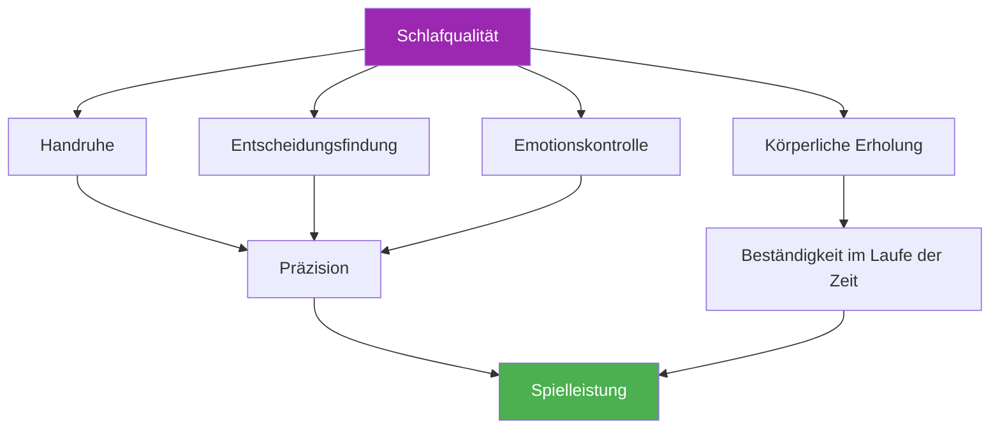

# Schlaf und Erholung

::: tip Ein kritischer Leistungsfaktor
**Gewichtung: 400 Punkte** – Schlaf ist der am meisten unterschätzte Faktor in Präzisionssportarten. Ihre Hände, Entscheidungen und Emotionen hängen alle von einer guten Erholung ab.
:::

## Der verborgene Leistungsvorteil

> „Der Spieler, der besser geschlafen hat, gewinnt oft.“

Im Gegensatz zu Ausdauersportarten, bei denen Athleten Ermüdung manchmal einfach ignorieren können, ist beim Pétanque **Präzision absolut unerlässlich**. Ihre Fähigkeit, eine Kugel zentimetergenau neben das Schwein zu platzieren, hängt von Systemen ab, die äußerst empfindlich auf Schlafmangel reagieren.

- Feinmotorik
- Entscheidungsfindung unter Druck
- Emotionsregulation
- Gedächtniskonsolidierung

Dieses Modul zeigt Ihnen, warum Schlaf Ihr größter ungenutzter Wettbewerbsvorteil sein könnte.

---

## Wie sich Schlaf auf dein Spiel auswirkt

### Handruhe und Motorkontrolle

Studien zeigen, dass die Feinmotorik **pro Stunde angesammelten Schlafdefizits um 10–15 % abnimmt**. Für Boule-Spieler äußert sich dies wie folgt:

- **Verstärkte Mikrozittern** – Für Sie nicht spürbar, aber die Freisetzungskonsistenz beeinträchtigend.
- **Verminderte Propriozeption** – Geringeres Bewusstsein für Griffdruck und Armposition
- **Langsamere Fehlerkorrektur** – Ihr Körper kann die für die Genauigkeit notwendigen Mikroanpassungen nicht vornehmen.

::: warning Warum das Zeigen zuerst leidet
Das Zielen erfordert die feinste motorische Kontrolle aller Schussarten. Es ist oft die erste Fähigkeit, die nachlässt, wenn man unter Schlafmangel leidet – selbst wenn man sich „gut fühlt“.
:::

### Entscheidungsfindung &amp; Taktiken

Ihr präfrontaler Cortex – zuständig für Planung, Risikobewertung und strategisches Denken – reagiert äußerst empfindlich auf Schlafentzug:

- **Die Risikobewertung ist beeinträchtigt** — Sie versuchen möglicherweise Schüsse mit geringerer Erfolgsquote.
- **Die taktische Flexibilität nimmt ab** – Anpassungen während des Spiels werden schwieriger.
- **Das „2-Uhr-nachts-Entscheidungs“-Phänomen** – Entscheidungen, die im müden Zustand vernünftig erscheinen, wirken im Nachhinein fragwürdig.

### Emotionsregulation

Schlafentzug verursacht **Hyperaktivität in der Amygdala**, dem emotionalen Zentrum des Gehirns:

- Der Druck fühlt sich intensiver an.
- Die Frustration nach Fehlschüssen wird verstärkt
- Die Erholung von Rückschlägen dauert länger
- Die Teamdynamik kann unter verkürzten Geduldsproben leiden.

### Gedächtniskonsolidierung

Das motorische Gedächtnis festigt sich im Schlaf – insbesondere während der Tiefschlafphasen:

- **Üben ohne Schlaf = eingeschränkte Merkfähigkeit**
- „Eine Nacht darüber schlafen“ funktioniert tatsächlich bei Technikänderungen.
- Die Formel: **Qualitativ hochwertiges Training + qualitativ hochwertiger Schlaf = dauerhafte Fertigkeit**

---

## Der Zusammenhang zwischen Schlaf und Leistung

---

## Die Realität des Schlafdefizits

### Was ist Schlafdefizit?

Schlafdefizit ist **kumulativ**. Eine Stunde weniger Schlaf wirkt sich nicht nur auf den aktuellen Tag aus – es summiert sich:

| Tage | Stunden kurz | Gesamtverschuldung | Auswirkungen auf die Leistung |
|------|-------------|------------|-------------------|
| 1 | -1 Stunde | 1 Stunde | Minimal |
| 3 | -1 Stunde/Tag | 3 Stunden | Bemerkbar |
| 7 | -1 Stunde/Tag | 7 Stunden | Bedeutsam |
| 14 | -1 Stunde/Tag | 14 Stunden | Schwer |

::: danger Der Wochenendmythos
Man kann den verpassten Schlaf nicht vollständig am Wochenende nachholen. Zusätzlicher Schlaf hilft zwar, beseitigt aber nicht den angehäuften Rückstand. Regelmäßigkeit ist wichtiger als gelegentliches langes Ausschlafen.
:::

### Wie viel benötigen Sie?

Die Regel „8 Stunden für alle“ ist ein Mythos. Die individuellen Bedürfnisse variieren.

- **Die meisten Erwachsenen:** 7-9 Stunden
- **Einige funktionieren gut bei:** 6-7 Stunden
- **Für einige gilt:** 9+ Stunden

**Finden Sie Ihren optimalen Schlafbedarf:**
1. Während eines Urlaubs (ohne Wecker) sollten Sie 5-7 Tage lang natürlich schlafen.
2. Nach der anfänglichen „Aufholphase“ sollten Sie darauf achten, wie lange Sie schlafen.
3. Das dürfte Ihrem biologischen Bedarf nahekommen.

---

## Die Wissenschaft in Kürze

### Wichtige Schlafphasen

| Bühne | Funktion | Relevanz von Pétanque |
|-------|----------|-------------------|
| **Tiefschlaf (N3)** | Körperliche Erholung, Wachstumshormon | Muskelregeneration, Energiewiederherstellung |
| **REM-Schlaf** | Emotionale Verarbeitung, Gedächtniskonsolidierung | Erhalt motorischer Fähigkeiten, emotionale Widerstandsfähigkeit |
| **Leichter Schlaf (N1-N2)** | Übergang, Wartung | Unterstützt die Gesamtarchitektur |

### Wichtigste Forschungsergebnisse

1. **Stanford Basketballstudie** — Spieler, die ihren Schlaf auf 10 Stunden verlängerten, verbesserten ihre Freiwurfgenauigkeit um 9 % (Mah et al., 2011).
2. **Aufschlaggenauigkeit beim Tennis** — Schlafentzug reduzierte die Aufschlaggenauigkeit um 53 % (Reyner &amp; Horne, 2013).
3. **Metaanalyse zur Reaktionszeit** – Schon eine einzige Nacht mit schlechtem Schlaf verlangsamt die Reaktionszeit um 300 % (Lim &amp; Dinges, 2010).

---

## Selbsteinschätzung: Ihre Schlafrealität

Bewerten Sie sich selbst ehrlich (1-5):

| Frage | Punktzahl |
|----------|-------|
| Ich schlafe die meisten Nächte gleich viel. | /5 |
| Ich schlafe innerhalb von 15-20 Minuten ein. | /5 |
| Ich wache nachts selten auf. | /5 |
| Ich wache erfrischt auf. | /5 |
| Ich behalte meine Energie den ganzen Tag über aufrecht. | /5 |

**Wertung:**
- **20-25:** Ausgezeichnete Schlafgewohnheiten
- **15-19:** Gut, aber mit Verbesserungspotenzial
- **10-14:** Schlaf beeinträchtigt wahrscheinlich Ihre Leistungsfähigkeit
- **Unter 10:** Schlafverbesserung sollte Priorität haben.

---

## In diesem Modul

### [Schlafprotokolle für Wettkämpfe](/de/education/sleep/competition)
- Die Woche vor dem Wettkampf
- Reise- und Zeitzonenmanagement
- Protokolle für kurze Nickerchen
- Notfallstrategien für „Ich konnte nicht schlafen“

### [Schlafhygiene für Sportler](/de/education/sleep/habits)
- Die 10 Grundregeln für einen erholsamen Schlaf
- Vorlagen für die Abendroutine
- Die 30-Tage-Schlaf-Challenge
- Behebung häufiger Probleme

---

## Schneller Sieg: Heute Abend

Wenn Sie sonst nichts tun, setzen Sie wenigstens diese beiden Änderungen noch heute Abend um:

1. **Festlegen Sie eine feste Weckzeit** – Morgen zur gleichen Zeit wie heute, innerhalb von 30 Minuten.
2. **30 Minuten vor dem Schlafengehen keine Bildschirme mehr!** – Stattdessen lesen, dehnen oder sich auf den nächsten Tag vorbereiten.

Allein diese beiden Änderungen können die Schlafqualität innerhalb weniger Tage verbessern.

---

## Verwandte Faktoren

Schlaf steht in engem Zusammenhang mit allen anderen Aspekten Ihrer Leistungsfähigkeit:

- [Spannungsmanagement](/de/education/tension/) — PMR- und Entspannungstechniken fördern den Schlaf
- [Ernährung](/de/education/nutrition/) — Mahlzeitenzeiten und Blutzucker beeinflussen die Schlafqualität
- [Mentales Spiel](/de/education/mental-game/) — Schlaf unterstützt die kognitive Funktion und die emotionale Kontrolle
- Selbstwahrnehmung – Erkennen, wann Müdigkeit das Spiel beeinträchtigt

