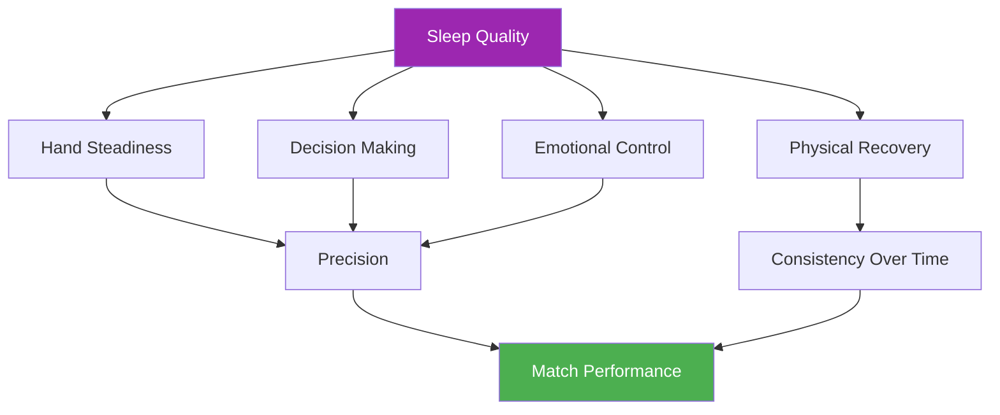

# Sleep & Recovery

::: tip A Critical Performance Factor
**Weight: 400 points** — Sleep is the most underrated factor in precision sports. Your hands, decisions, and emotions all depend on quality rest.
:::

## The Hidden Performance Edge

> "The player who slept better often wins."

In pétanque, unlike endurance sports where athletes can sometimes "push through" fatigue, **precision is non-negotiable**. Your ability to place a boule within centimeters of the cochonnet depends on systems that are exquisitely sensitive to sleep deprivation:

- Fine motor control
- Decision-making under pressure
- Emotional regulation
- Memory consolidation

This module reveals why sleep may be your biggest untapped competitive advantage.

---

## How Sleep Affects Your Game

### Hand Steadiness & Motor Control

Research shows that fine motor control degrades **10-15% per hour of accumulated sleep debt**. For pétanque players, this manifests as:

- **Increased micro-tremors** — Imperceptible to you, but affecting release consistency
- **Reduced proprioception** — Less awareness of grip pressure and arm position
- **Slower error correction** — Your body can't make the micro-adjustments that produce accuracy

::: warning Why Pointing Suffers First
Pointing requires the finest motor control of any shot. It's often the first skill to degrade when you're under-slept—even when you "feel fine."
:::

### Decision-Making & Tactics

Your prefrontal cortex—responsible for planning, risk assessment, and strategic thinking—is highly sensitive to sleep loss:

- **Risk assessment becomes impaired** — You may attempt lower-percentage shots
- **Tactical flexibility decreases** — Harder to adapt mid-game
- **The "2am decision" phenomenon** — Choices that seem reasonable when tired look questionable in hindsight

### Emotional Regulation

Sleep deprivation causes **hyperactivity in the amygdala**, your brain's emotional center:

- Pressure feels more intense
- Frustration after misses is amplified
- Recovery from setbacks takes longer
- Team dynamics can suffer from shortened tempers

### Memory Consolidation

Motor memory consolidates during sleep—particularly during deep sleep phases:

- **Practice without sleep = limited retention**
- **"Sleeping on it" actually works** for technique changes
- The formula: **Quality Practice + Quality Sleep = Permanent Skill**

---

## The Sleep-Performance Connection

---

## The Sleep Debt Reality

### What Is Sleep Debt?

Sleep debt is **cumulative**. Missing one hour of sleep doesn't just affect that day—it accumulates:

| Days | Hours Short | Total Debt | Performance Impact |
|------|-------------|------------|-------------------|
| 1 | -1 hour | 1 hour | Minimal |
| 3 | -1 hour/day | 3 hours | Noticeable |
| 7 | -1 hour/day | 7 hours | Significant |
| 14 | -1 hour/day | 14 hours | Severe |

::: danger The Weekend Myth
You **cannot fully "catch up"** on weekends. While extra sleep helps, it doesn't erase accumulated debt. Consistency is more important than occasional long sleeps.
:::

### How Much Do You Need?

The "8 hours for everyone" is a myth. Individual needs vary:

- **Most adults:** 7-9 hours
- **Some function well on:** 6-7 hours
- **Some require:** 9+ hours

**Finding YOUR optimal sleep need:**
1. During a vacation (no alarm), let yourself sleep naturally for 5-7 days
2. After the initial "catch-up" phase, note how long you sleep
3. That's likely close to your biological need

---

## The Science in Brief

### Sleep Stages That Matter

| Stage | Function | Pétanque Relevance |
|-------|----------|-------------------|
| **Deep Sleep (N3)** | Physical recovery, growth hormone | Muscle recovery, energy restoration |
| **REM Sleep** | Emotional processing, memory consolidation | Motor skill retention, emotional resilience |
| **Light Sleep (N1-N2)** | Transition, maintenance | Supports overall architecture |

### Key Research Findings

1. **Stanford Basketball Study** — Players who extended sleep to 10 hours improved free-throw accuracy by 9% (Mah et al., 2011)
2. **Tennis Serve Accuracy** — Sleep restriction reduced serve accuracy by 53% (Reyner & Horne, 2013)
3. **Reaction Time Meta-Analysis** — Even one night of poor sleep slows reaction time by 300% (Lim & Dinges, 2010)

---

## Self-Assessment: Your Sleep Reality

Rate yourself honestly (1-5):

| Question | Score |
|----------|-------|
| I get the same amount of sleep most nights | /5 |
| I fall asleep within 15-20 minutes | /5 |
| I rarely wake during the night | /5 |
| I wake feeling refreshed | /5 |
| I maintain energy throughout the day | /5 |

**Scoring:**
- **20-25:** Excellent sleep habits
- **15-19:** Good, but room for improvement
- **10-14:** Sleep is likely affecting your performance
- **Below 10:** Sleep improvement should be a priority

---

## In This Module

### [Competition Sleep Protocols](/de/education/sleep/competition)
- The week before competition
- Travel and time zone management
- Power napping protocols
- Emergency "I couldn't sleep" strategies

### [Sleep Hygiene for Athletes](/de/education/sleep/habits)
- The 10 sleep fundamentals
- Evening routine templates
- The 30-day sleep challenge
- Troubleshooting common issues

---

## Quick Win: Tonight

If you do nothing else, implement these two changes tonight:

1. **Set a consistent wake time** — Same time tomorrow as today, within 30 minutes
2. **No screens 30 minutes before bed** — Read, stretch, or prepare for tomorrow instead

These two changes alone can improve sleep quality within days.

---

## Related Factors

Sleep connects to everything else in your performance:

- [Tension Management](/de/education/tension/) — PMR and relaxation techniques aid sleep
- [Nutrition](/de/education/nutrition/) — Meal timing and blood sugar affect sleep quality
- [Mental Game](/de/education/mental-game/) — Sleep supports cognitive function and emotional control
- [Self-Awareness](/de/education/self-awareness/) — Recognizing when fatigue is affecting your game

