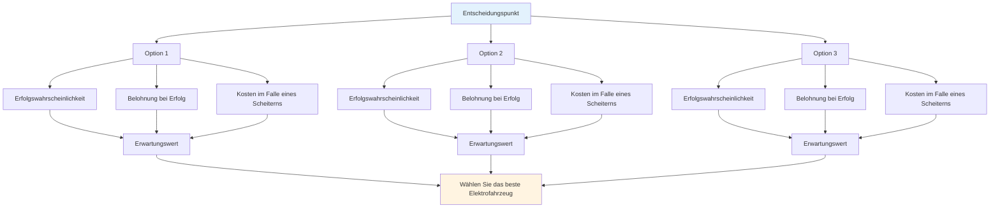

# Wahrscheinlichkeitsbasierte Entscheidungsfindung
<AdBanner />

Taktisches Denken auf höchstem Niveau nutzt Wahrscheinlichkeitsrechnung, um bessere Entscheidungen zu treffen. Anstatt zu raten oder sich auf sein Bauchgefühl zu verlassen, analysiert man systematisch seine Optionen.

::: tip Die große Idee
**Denken Sie in Wahrscheinlichkeiten, nicht in Gewissheiten.** Die beste Entscheidung ist nicht immer die aggressivste oder die sicherste – es ist diejenige, die Ihnen über viele ähnliche Situationen hinweg den besten erwarteten Nutzen bringt.
:::

## Das Grundgerüst

Jeder Wurf besteht aus drei Komponenten:

| Komponente | Frage | Beispiel |
|-----------|----------|---------|
| **Erfolgswahrscheinlichkeit** | Wie wahrscheinlich ist es, dass ich dies umsetze? | 70 % Erfolgsquote bei dieser Entfernung |
| **Belohnung bei Erfolg** | Was habe ich davon? | Punktgewinn, Positionsgewinn |
| **Kosten bei Misserfolg** | Was verliere ich? | Dem Gegner einen leichten Punkt ermöglichen |

::: info Die Formel
**Erwartungswert = (Wahrscheinlichkeit × Belohnung) - ((1 - Wahrscheinlichkeit) × Kosten)**

Gute Entscheidungen maximieren den erwarteten Wert im Laufe der Zeit.
:::

## Denken in Wahrscheinlichkeiten

Bei der Entscheidung zwischen den Optionen sollten Sie Folgendes berücksichtigen:
- Wie hoch ist meine realistische Erfolgsquote für jede Option?
- Was habe ich davon, wenn es funktioniert?
- Welche Kosten entstehen, wenn es fehlschlägt?
- Wie beeinflusst die Spielsituation meine Entscheidung?

Die beste Option ist nicht immer die aggressivste oder die sicherste – es ist diejenige, die in vielen ähnlichen Situationen das beste Ergebnis liefert.

## Kenne deine Zahlen

Um Wahrscheinlichkeitsrechnung anwenden zu können, müssen Sie Ihre tatsächlichen Erfolgsquoten kennen:

| Wurfart | Distanz | Ihre Erfolgsquote |
|------------|----------|-------------------|
| Punkt (nahe) | 6-7 m | ___% |
| Punkt (mittel) | 8-9 m | ___% |
| Punkt (lang) | 10 m+ | ___% |
| Schuss (aus nächster Nähe) | 6-7 m | ___% |
| Schießen (mittel) | 8-9 m | ___% |
| Schießen (lang) | 10 m+ | ___% |

<AdInArticle />

Verfolgen Sie diese Werte in der Praxis. Seien Sie ehrlich – die meisten Spieler überschätzen ihre Erfolgsquoten.

## Anpassung an die Bedingungen

Ihre Grundgebühren ändern sich je nach:

| Faktor | Auswirkung auf die Erfolgsquote |
|--------|----------------------|
| Unbekanntes Terrain | -10 bis -20 % |
| Drucksituation | -5 bis -15 % |
| Ermüdung | -5 bis -10% |
| Selbstvertrauen (hoch) | +5 bis +10% |
| Jüngste Erfolge | +5 % |
| Jüngstes Versagen | -5 bis -10% |

Seien Sie bei diesen Anpassungen realistisch.

## Das Boule-Vorteilsprinzip

Wenn du mehr Kugeln übrig hast als dein Gegner:

**Priorität 1: Den Punkt sichern**
- Stellen Sie zunächst sicher, dass Sie mindestens einen Punkt halten.
- Werde nicht gierig, bevor du die Grundlagen gesichert hast.

**Priorität 2: Maximale Punktzahl bei kalkuliertem Risiko**
- Sobald Sie die Position halten, prüfen Sie, ob Sie weitere Punkte hinzufügen können.
- Jeder weitere Wurf ist eine Risiko-Nutzen-Abwägung.
- Verwandle einen sicheren 2-Punkte-Sieg nicht durch Übermut in eine Niederlage.

**Weniger Boules übrig:** Jeder Wurf muss sitzen. Sichere Spielzüge reichen möglicherweise nicht aus – überlegen Sie sich risikoreichere Optionen, um am Ende wieder aufzuholen.

## Das „Une Boule Devant“-Prinzip

Eine Boule-Kugel vor dem Buben (zwischen Bube und Gegner) ist äußerst wertvoll:
- Es blockiert direkte Linien
- Es zwingt die Gegner, einen Umweg zu machen oder ihn zu überqueren.
- Es kann ankommende Kugeln ablenken
- Es ist eine „Geldkugel“ – es lohnt sich, sie zu schützen.

**Taktische Implikation:** Manchmal ist es besser, eine blockierende Boule zu platzieren, als zu versuchen, so nah wie möglich heranzukommen.

## Risikotoleranz nach Spielstaat

### Mit Zeitlimit

Bei Spielen mit Zeitlimit ist die Punktedifferenz entscheidend:

| Spielstand | Risikoansatz |
|-----------------|---------------|
| Führung mit 4+ | Sehr konservativ – Blei schützen, Zeit stoppen |
| Führung mit 1:3 | Konservativ – keine Punkte verschenken |
| Gebunden | Ausgewogene – kalkulierte Risiken |
| Rückstand 1-3 | Aggressiv – Bedürfnis, Boden gutzumachen |
| Rückstand 4+ | Sehr aggressiv – wir müssen Risiken eingehen, die Zeit drängt. |

### Ohne Zeitbegrenzung

Wenn kein Zeitdruck besteht:
- Halte dich an deinen Spielplan – ändere deine Strategie nicht nur wegen des Spielstands.
- Das Ergebnis wird schwanken – vertraue deiner Herangehensweise.
- Überlegen Sie sich nur dann eine Änderung Ihrer Strategie, wenn diese gegen diesen Gegner eindeutig nicht funktioniert.
- Panikreaktionen, wenn man in Rückstand gerät, verschlimmern die Situation oft nur.

### Anpassungen im Endspiel

**Wenn man dieses Ende gewinnt, gewinnt man das Spiel:**
- Sei konservativer.
- Riskieren Sie nicht, mehrere Punkte zu verlieren.
- Ein einzelner Punkt könnte genügen.

**Verliert man dieses Ende, verliert man das Spiel:**
- Größere Risiken eingehen
- Es müssen mehrere Punkte erzielt werden.
- Vorsichtiges Spielen wird dich nicht retten

## Häufige Fehler bei Wahrscheinlichkeitsrechnungen

### 1. Selbstüberschätzung
„Den Wurf kann ich treffen“ – aber schaffst du es auch 7 von 10 Mal? Sei ehrlich.

### 2. Ignorieren der Basiszinssätze
Deine Trefferquote ändert sich nicht, nur weil der Moment wichtig ist.

### 3. Sunk-Cost-Fallacy (Fallacy der versunkenen Kosten)
„Ich habe schon zweimal daneben geworfen, ich sollte weiterwerfen“ – jeder Wurf ist unabhängig.

### 4. Ergebnisverzerrung
Ein riskanter Schuss, der gelang, war dennoch riskant. Ein sicherer Spielzug, der scheiterte, war dennoch richtig.

### 5. Die Optionen des Gegners ignorieren
Überlege, was sie nach deinem Wurf tun werden, egal ob er gelingt oder nicht.

## Praktische Anwendung

### Vor jedem Wurf

1. **Optionen identifizieren** (zielen, schießen, blocken usw.).
2. Schätzen Sie die Erfolgswahrscheinlichkeit für jedes Element ein.
3. **Berücksichtigen Sie die möglichen Folgen** (Erfolg und Misserfolg)
4. **Spielstand berücksichtigen** (Punktzahl, verbleibende Boules)
5. **Wählen Sie** die Option mit dem besten erwarteten Wert
6. **Volle Hingabe** – kein Zögern während der Ausführung

### Intuition entwickeln

Mit der Zeit wird das Denken in Wahrscheinlichkeiten intuitiv:
- Verfolgen Sie Ihre Ergebnisse ehrlich.
- Entscheidungen nach den Spielen überprüfen
- Erkennen Sie Muster in Ihren Erfolgsquoten
- Passen Sie Ihr mentales Modell an

## Wichtigste Erkenntnis

> Gute Entscheidungen führen nicht immer zu guten Ergebnissen. Aber gute Entscheidungen führen im Laufe der Zeit zu besseren Resultaten.

Denken Sie in Wahrscheinlichkeiten. Kennen Sie Ihre Zahlen. Treffen Sie die kluge Entscheidung, nicht die auf gut Glück basierende.

<AdBanner />
