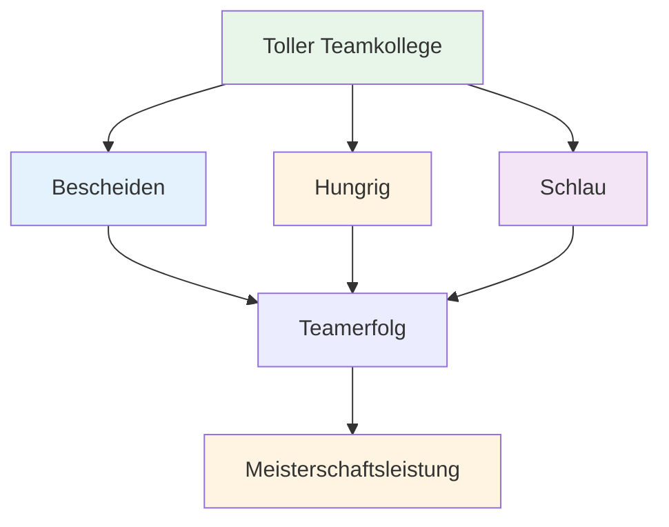

# Ein großartiger Teamplayer sein
<AdBanner />

Pétanque wird oft in Teams gespielt – Doppel- oder Dreierteams. Individuelles Können ist wichtig, aber die Teamdynamik kann über Erfolg oder Misserfolg entscheiden. Die besten Teams sind nicht immer die technisch versiertesten – sie sind diejenigen, die am besten zusammenarbeiten.

::: tip Die große Idee
**Die besten Teams sind nicht immer die technisch versiertesten – sie sind diejenigen, die am besten zusammenarbeiten.** Bescheidenheit, Ehrgeiz und emotionale Intelligenz machen dich zu einem großartigen Teammitglied.
:::

## Was zeichnet einen großartigen Teamkollegen aus?

Forschung und Erfahrung weisen auf drei Schlüsseleigenschaften hin:

### 1. Bescheiden
- Stellt den Erfolg des Teams über den persönlichen Ruhm.
- Würdigt die Beiträge anderer
- Gibt Fehler ohne Ausreden zu.
- Offen für Feedback und Lernen
- Er muss nicht der Star sein.

### 2. Hungrig
- Selbstmotiviert und zielstrebig
- Erledigt die Arbeit, ohne dazu aufgefordert zu werden.
- Wir sind stets bestrebt, uns zu verbessern
- Bringt Energie ins Team
- Verlässt sich nicht auf Talent.

### 3. Intelligent (emotional)
- Kann Situationen und Menschen gut einschätzen
- Weiß, wann er sprechen und wann er zuhören soll.
- Sie kontrollieren ihre eigenen Emotionen
- Unterstützt Teammitglieder angemessen
- Geht konstruktiv mit Konflikten um

## Die Grundlagen für den Erfolg eines Teams

### Gemeinsame Ziele und Vision

Starke Teams zeichnen sich durch Folgendes aus:
- Klare, vereinbarte Ziele
- Individuelle Ziele im Einklang mit den Teamzielen
- Gemeinsames Verständnis davon, wie Erfolg aussieht
- Engagement für die gemeinsame Mission

**Fragen zur Besprechung mit Ihrem Team:**
- Was wollen wir gemeinsam erreichen?
- Wie sieht Erfolg für uns aus?
- Wie tragen unsere individuellen Ziele zum Erfolg des Teams bei?

### Effektive Kommunikation

Kommunikation ist das Lebenselixier der Teamleistung.

**Gute Teamkommunikation:**
- Offen und ehrlich
- Respektvoll, auch bei Meinungsverschiedenheiten.
- Klar und präzise
- Zwei-Wege-Kommunikation (Sprechen UND Hören)
- Zeitnah (die richtigen Informationen zur richtigen Zeit)

<AdInArticle />

**Während der Spiele:**
- Besprechen Sie die Strategie vor jedem Ende
- Beobachtungen zum Gelände und zu den Gegnern austauschen
- Koordinieren, wer wann wirft.
- Unterstützt euch gegenseitig nach Würfen (ob gut oder schlecht).

### Vertrauen und Respekt

Ohne Vertrauen zerfallen Teams unter Druck.

**Vertrauensbildung:**
- Sei zuverlässig (halte deine Versprechen).
- Sei kompetent (erledige deine Arbeit gut).
- Sei ehrlich (auch wenn es schwerfällt).
- Verletzlichkeit zeigen (Schwierigkeiten eingestehen)
- Unterstütze andere konsequent

**Respekt zeigen:**
- Wertschätzen Sie den Beitrag jedes Einzelnen
- Hören Sie sich verschiedene Perspektiven an.
- Würdigen Sie den Einsatz, nicht nur die Ergebnisse.
- Behandeln Sie die Rolle jedes Einzelnen als wichtig

### Klare Rollen

Jeder sollte Folgendes verstehen:
- Ihre Hauptaufgaben
- Wie sie zum Team beitragen
- Worauf andere sie hoffen
- Wann man die Initiative ergreifen und wann man sich zurückziehen sollte

**Im Dreiergespann:**
| Rolle | Hauptfokus | Wichtigste Eigenschaften |
|------|--------------|---------------|
| Zeiger | Platziere die Boules in der Nähe des Ziels. | Präzision, Konsistenz |
| Mitte | Der Situation anpassen | Vielseitigkeit, Lesespiel |
| Schütze | Gegnerische Boules entfernen | Genauigkeit unter Druck |

Die Rollen können flexibel gestaltet werden, aber Klarheit ist hilfreich.

## Teamdynamik während des Wettbewerbs

### Vor dem Spiel
- Gemeinsam ankommen, gemeinsam aufwärmen
- Allgemeine Strategie besprechen
- Den Ton angeben (positiv, fokussiert)
- Erkundige dich, wie es allen geht.

### Während des Spiels
- Kommunikation zwischen den Enden
- Bleiben Sie unabhängig vom Ergebnis positiv.
- Unterstützt euch gegenseitig nach Fehlern
- Gemeinsam Erfolge feiern (kurz)
- Konzentriere dich auf den Prozess, nicht auf das Ergebnis.

### Nach Fehlern
Was Sie NICHT tun sollten:
- Zeigen Sie Ihre Frustration sichtbar
- Kritisieren oder beschuldigen
- Sich zurückziehen oder schweigen
- Denken Sie darüber nach, was passiert ist.

Was zu tun:
- Schnelle Bestätigung („kein Problem“)
- Konzentriere dich auf den nächsten Wurf.
- Achten Sie auf eine positive Körpersprache.
- Vertraue darauf, dass dein Teamkollege sich erholt.

### Nach dem Spiel
- Gemeinsame Nachbesprechung (was funktioniert hat, was nicht)
- Individuelle Beiträge anerkennen
- Besprechen Sie Verbesserungen für das nächste Mal
- Beziehungen unabhängig vom Ergebnis pflegen

## Kommunikationsmuster

### Konstruktives Feedback
**Schlecht:** &quot;Du verfehlst diese Schüsse immer wieder.&quot;
**Besser:** „Mir ist aufgefallen, dass die Schüsse nach links gehen – möchten Sie Ihre Haltung anpassen?“

### Unterstützende Reaktion auf Fehler
**Schlecht:** *Schweigen oder sichtbare Frustration*
**Besser:** „Schwierige Frage. Du bist als Nächste dran.“

### Strategische Diskussion
**Schlecht:** &quot;Schieß einfach drauf&quot;
**Besser:** „Was meinst du – mit dem Finger blocken oder versuchen zu schießen? Ich sehe Vor- und Nachteile auf beiden Wegen.“

## Aufbau einer Teamkultur

Großartige Teams entwickeln Gemeinsamkeiten:
- **Werte:** Wofür wir stehen
- **Normen:** Unser Verhalten
- **Sprache:** Wie wir kommunizieren
- **Rituale:** Was wir gemeinsam tun

**Beispiele:**
- Vor und nach dem Essen immer die Hand schütteln
- Konkrete Ermutigungsformulierungen
- gemeinsames Ritual vor dem Spiel
- Mahlzeit oder Getränk nach dem Spiel

## In diesem Abschnitt

- **[Teamkommunikation](/en/education/team-player/communication)** – Ausführlicher Leitfaden für effektive Kommunikation

## Wichtigste Erkenntnis

> Ihr Team ist nur so stark wie seine schwächste Beziehung, nicht wie sein schwächstes Mitglied.

Investiere in deine Teammitglieder. Baue Vertrauen auf. Kommuniziere gut. Gewinnt gemeinsam.

<AdBanner />
