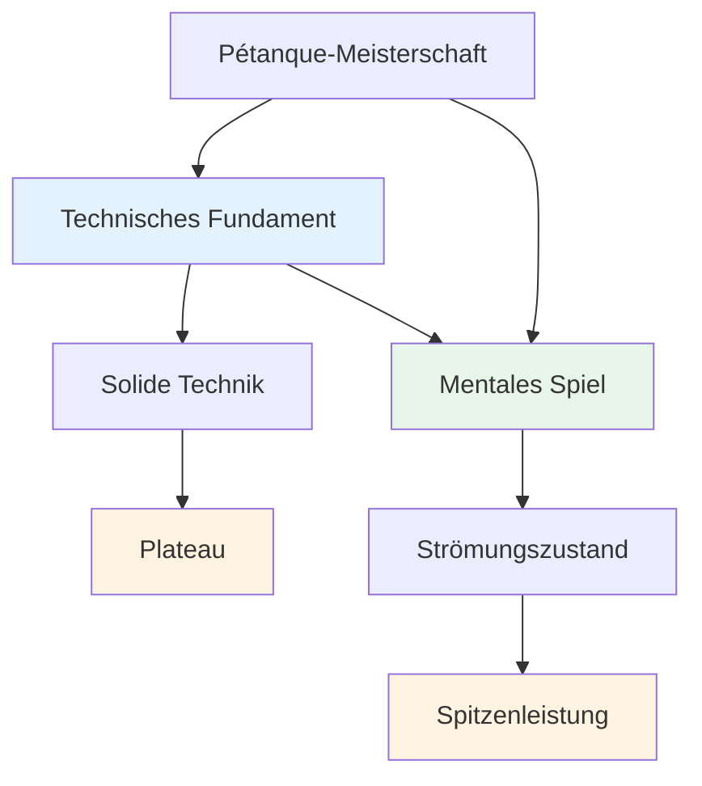

# Technische Beratung

## Eine Anmerkung zur Technik

Unser Hauptaugenmerk liegt zwar auf dem mentalen Spiel und dem Flow-Zustand, aber wir erkennen an, dass die Technik das Fundament ist, auf dem alles andere aufbaut.

::: info Unsere Philosophie
**Technik ist die Grundlage, aber Flow ist die Grenze.** Um ein Elite-Niveau zu erreichen, braucht man eine solide Technik, aber mentale Meisterschaft ist das, was einen darüber hinausbringt.
:::

## Der häufigste Fehler in der technischen Ausbildung

::: info Dieser Abschnitt ist für erfahrene Spieler.
Wenn Sie neu im Pétanque sind, müssen Sie Ihre Grundtechnik natürlich von Grund auf entwickeln – und das ist eine ganz andere Sache.

**Dieser Rat richtet sich an Spieler mit jahrelanger Erfahrung,** die bereits eine etablierte Technik entwickelt haben, die sich natürlich, entspannt und zuverlässig anfühlt. Sie haben Ihren eigenen Wurfstil gefunden. Nun stellt sich die Frage: Wie können Sie sich weiterentwickeln?
:::

::: warning Die häufigste Falle
Wenn erfahrene Spieler sich verbessern wollen, besinnen sie sich oft auf die Grundlagen – sie optimieren Griff, Armschwung, Abwurfpunkt und Körperhaltung. Stundenlanges Training. Unaufhörliches Feintuning.

**Aber sie haben die wichtigste Frage ausgelassen:** Was genau soll die Boule bewirken?
:::

Bevor du an deiner Technik arbeitest, musst du dir über das **Ergebnis** im Klaren sein, das du erreichen willst. Nicht „Ich will mehr Schläge landen“ oder „Ich will konstanter sein“ – das sind keine Ergebnisse, sondern Wünsche.

Ein reales Ergebnis sieht folgendermaßen aus:
- &quot;Ich möchte einen hohen Lobball, der innerhalb von 20 cm vom Landepunkt stoppt.&quot;
- „Ich möchte eine rollende Aufnahme, die auf diesem Terrain eine Linkskurve beschreibt.“
- &quot;Ich möchte einen sanften Rückstoß, der die Zielkugel kaum berührt.&quot;

**Erkunden Sie zunächst die [Wurfpalette](/de/education/technique/throws)**, um zu verstehen, was möglich ist. Entscheiden Sie dann, welchen Wurf Sie in Ihr Repertoire aufnehmen möchten. Erst dann sollten Sie daran arbeiten, wie sich Arm, Handgelenk und Körper bewegen müssen, um dieses Ergebnis zu erzielen.

## Der richtige Weg, um an der Technik zu arbeiten

Wir sagen nicht, dass du nie an deinem Arm, Handgelenk, deiner Bewegungsausführung oder deiner Körperhaltung arbeiten solltest. **Technisches Training zur Ausführung ist absolut sinnvoll** – aber es muss dem richtigen Zweck dienen.

::: info Der richtige Zweck technischer Arbeiten
**Korrekte Absicht:** „Ich möchte meiner Farbpalette eine neue Decke hinzufügen.“

**Falsches Ziel:** „Ich möchte mehr Würfe treffen“ oder „Ich möchte konstanter sein“
:::

So funktioniert es:

1. **Erkunden Sie die [Wurfpalette](/de/education/technique/throws)** — Finden Sie heraus, welchen Wurf oder welche Technik Sie Ihrem Repertoire hinzufügen möchten.
2. **Visualisieren Sie das Ergebnis** — Was soll die Boulekugel machen? Welche Flugbahn, Landung, Rotation und welches Verhalten benötigen Sie?
3. **Dann arbeiten Sie an der Ausführung** – Jetzt können Sie sich auf Arm-, Handgelenk- und Körperhaltung sowie die Freigabe konzentrieren, um dieses spezifische Ergebnis zu erzielen.

Dieser Ansatz gibt Ihrer technischen Ausbildung **klare Richtung und messbare Fortschritte**. Sie üben nicht einfach nur – Sie erweitern gezielt Ihre Fähigkeiten.

::: tip Beispiel: Hinzufügen einer Plombée
**Ziel:** Füge deinem Zeige-Repertoire einen Drop Shot (Plombée) hinzu.

**Ergebnisvisualisierung:** Die Boule sollte einen hohen Bogen beschreiben, sanft mit Rückwärtsdrall landen und fast sofort zum Stillstand kommen.

**Technischer Fokus:** Höherer Abwurfpunkt, mehr Handgelenkeinsatz für Rückwärtsdrall, weicherer Griff

**Erfolgsmessung:** Können Sie diesen Wurf ausführen, wann immer Sie es wünschen? Das ist das Ziel.
:::

## Bessere Schüsse vs. Mehr Schüsse: Den Unterschied verstehen

Es gibt einen entscheidenden Unterschied, den viele Spieler übersehen:

::: tip Die wichtigste Erkenntnis
**Wenn du bessere Fotos machen willst** → Arbeite an deiner Technik.

**Wenn du mehr Würfe treffen willst** → Arbeite an deiner mentalen Stärke.
:::

### Was bedeutet das?

**Bessere Aufnahmen zu machen** bedeutet, sein technisches Repertoire zu erweitern:
- Hinzufügen neuer Wurfarten (Plombée, Portée, Demi-Portée)
- Verbesserung der Präzision bei bestimmten Schussarten
- Neue Fähigkeiten entwickeln, die Sie derzeit noch nicht besitzen
- **Dies erfordert technisches Können und körperliches Training.**

**Mehr Würfe zu verwandeln** bedeutet, das umzusetzen, was man bereits kann:
- Die Schläge ausführen, die man im Training bereits schafft
- Konstante Leistung unter Druck
- Vertraue deiner Technik, wenn es darauf ankommt
- **Dies erfordert mentales Training und den Zugang zum Flow-Zustand.**

### Der Realitätscheck

Fragen Sie sich ehrlich:
- Gelingt dir der Wurf im Training, wenn du entspannt bist? ✅ **Dann beherrschst du die Technik.**
- Fällt es dir schwer, im Wettkampf mitzuhalten? ⚠️ **Dann brauchst du mentales Training, nicht mehr technische Übungen.**

::: warning Häufiger Fehler
Viele erfahrene Spieler verbringen Jahre damit, ihre bereits vorhandene Technik zu verfeinern, dabei müssten sie eigentlich die mentale Stärke entwickeln, diese Technik auch unter Druck umzusetzen.

**Du brauchst keinen besseren Armschwung. Du brauchst einen ruhigeren Geist.**
:::

### Der Weg nach vorn

**Für bessere Aufnahmen (neue Funktionen):**
- Entdecke die [Palette der Würfe](/de/education/technique/throws)
- Wähle einen bestimmten neuen Wurf aus, den du entwickeln möchtest
- Üben Sie die technische Ausführung

**Für mehr Schüsse (Konstanz unter Druck):**
- Arbeit an [Mentaler Stärke](/de/education/mental-game/mental-strength/)
- Lerne, auf [The Zone](/de/education/mental-game/the-zone/) zuzugreifen
- Entwickle [Pre-Shot-Routinen](/de/education/mental-game/mental-strength/pre-shot-routine)

## Unsere Sichtweise

::: tip Man muss nicht alles beherrschen.
**Sie müssen nicht alle Techniken beherrschen**, aber das Verständnis des gesamten Spektrums an Möglichkeiten hilft Ihnen dabei:

- ✅ Wissen, was möglich ist
- ✅ Treffen Sie fundierte Entscheidungen darüber, was Sie entwickeln möchten.
- ✅ Das Spiel auf einer tieferen Ebene wertschätzen.
- ✅ Verstehen, was Spitzenspieler können
:::

::: info Das Ziel
Wenn Sie einen technischen Schwerpunkt haben und Ihr Repertoire erweitern möchten, beschreibt dieser Abschnitt das Endziel – die gesamte Palette an Würfen, die einem Pétanque-Spieler zur Verfügung stehen.

**Denk daran:** Es geht nicht darum, alles zu beherrschen. Es geht darum, über genügend technische Grundlagen zu verfügen, um in den Flow-Zustand zu gelangen und deinem Körper zu ermöglichen, den richtigen Wurf ganz natürlich auszuführen.
:::

## Themen

### [Palette of Throws](/de/education/technique/throws)
Welche Wurftechniken gibt es alle? Ein umfassender Überblick über die technischen Möglichkeiten beim Pétanque.

::: tip Nach der Technik – was kommt als Nächstes?
Sobald man über eine solide Technik verfügt, kommt das eigentliche Wachstum von Folgendem:
- **[The Zone](/de/education/mental-game/the-zone/)** – Erreichen von Flow-Zuständen
- **[Mentale Stärke](/de/education/mental-game/mental-strength/)** – Umgang mit Druck
- **[Trainingsmethoden](/de/education/technique/training/)** – Wie man effektiv übt
:::

