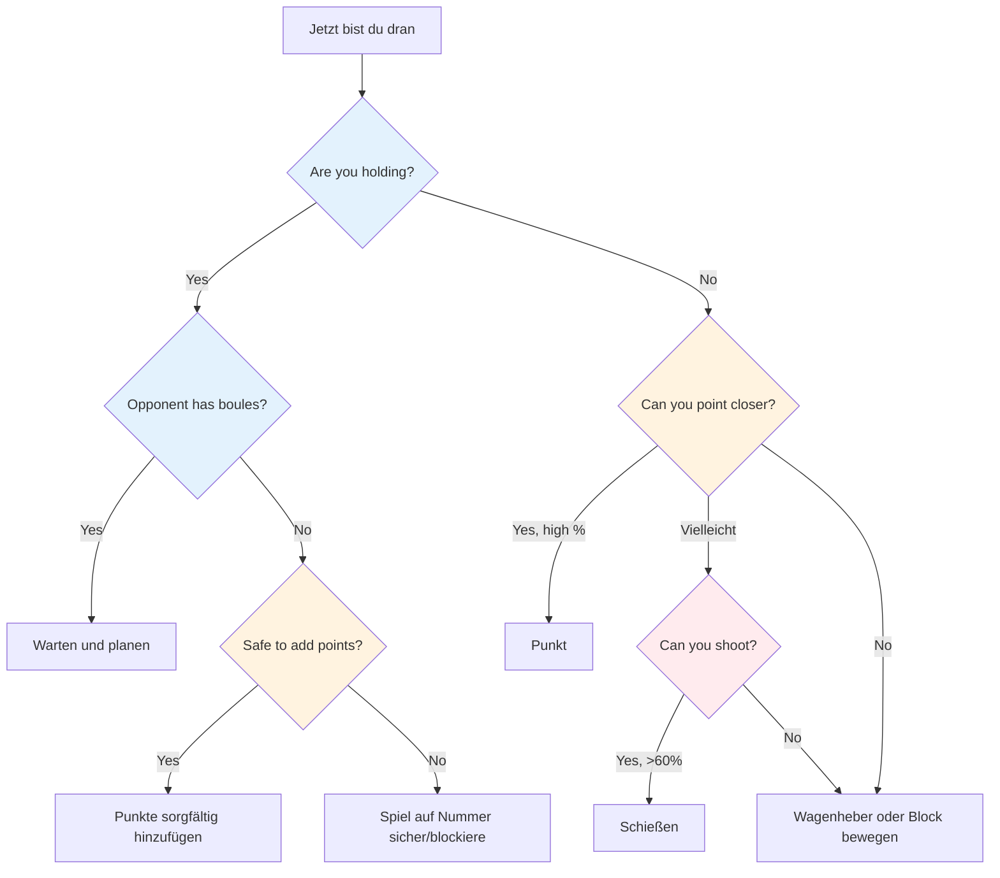
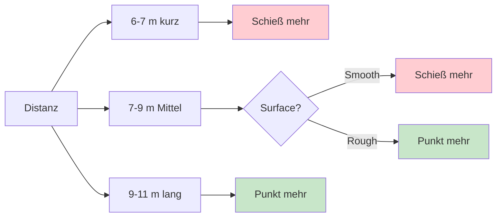

# Taktisches Denken beim Boule

Auf höchstem Niveau wird technisches Können vorausgesetzt. Was die Gewinner von den anderen unterscheidet, ist taktische Intelligenz – zu wissen, welchen Wurf man wann versucht. Die besten Spieler lesen das Spiel mehrere Züge voraus und nutzen jeden Vorteil.

::: tip Das Kernprinzip
**Auf Spitzenniveau liegt der Unterschied selten in der Technik – es ist die Entscheidungsfindung.** Die Mannschaft, die weniger taktische Fehler macht, gewinnt.
:::

## Schnellentscheidungsrahmen

## Die taktische Denkweise

### In Wahrscheinlichkeiten denken

Jeder Wurf hat eine Erfolgswahrscheinlichkeit. Eine gute Taktik bedeutet, Würfe so auszuwählen, dass sie folgende Kriterien erfüllen:
- Die Erfolgswahrscheinlichkeit ist hoch genug
- Der Gewinn rechtfertigt das Risiko
- Scheitern tut nicht allzu weh.

**Beispielentscheidung:**
- Schwieriger Schuss: 40 % Erfolg, bringt 3 Punkte
- Sicherer Punkt: 80 % Erfolg, bringt 1 Punkt ein.

Was ist besser? Das hängt vom Spielstand, der Situation und Ihrem Selbstvertrauen ab.

### Alle Optionen in Betracht ziehen

Vor jedem Wurf sollten Sie Folgendes beachten:
1. **Tipp:** Platziere eine Kugel in der Nähe des Zielmarkers.
2. **Schuss:** Entferne eine gegnerische Boule.
3. **Blockieren:** Platziere eine Kugel, um den Weg zu blockieren.
4. **Den Wagenheber bewegen:** Den Wagenheber absichtlich anstoßen
5. **Opfer:** Eine ungünstige Position in Kauf nehmen, um später eine bessere Ausgangsposition zu erreichen.

Entscheide dich nicht automatisch für die naheliegende Wahl. Denke über Alternativen nach.

### Lesen Sie die Situation

Zu berücksichtigende Faktoren:
- Aktueller Spielstand (Wer führt, mit welchem Vorsprung)
- Verbleibende Boules (Ihre und ihre)
- Position im Gelände
- Gegnerische Tendenzen
- Die Stärken Ihres Teams

## Taktische Grundprinzipien

::: tip Die 6 taktischen Prinzipien
1. **Steuern Sie den Jack** – Position ist Strom
2. **Distanz- und Oberflächenstrategie** – Den Bedingungen anpassen
3. **Bestimmen Sie den Spielstil** - Setzen Sie Ihre Stärken ein.
4. **Risiko und Nutzen abwägen** – Risiko der Situation anpassen
5. **Setze Boules mit Bedacht ein** – Manchmal muss man 1 Ball abgeben, um 3 zu vermeiden.
6. **Vorausschauend denken** – Visualisieren Sie die nächsten 2-3 Züge
:::

### Prinzip 1: Den Jack kontrollieren

Das Team, das die Jack-Position kontrolliert, hat einen deutlichen Vorteil.

**Kontrollmöglichkeiten:**
- Gewinne das Recht, den Buben zu werfen.
- Bringen Sie den Wagenheber an einen geeigneten Ort.
- Schützen Sie den Wagenheber vor Verrutschen.

**Strategie zur Jack-Platzierung:**
- Short Jack: Begünstigt das Schießen, Ziele auf kurze Distanz lassen sich leichter treffen.
- Long Jack: Bevorzugt das Zeigen, das Schießen wird schwieriger
- Naheliegende Hindernisse: Stellen Herausforderungen für die Gegner dar.

**Schwächen des Gegners ausnutzen:**
- Beobachten Sie ihre Zeigetechnik – verwenden sie immer denselben Bogen oder Stil?
- Wenn sie sich nicht anpassen können (z. B. nur rollen, nur loben), platzieren Sie den Jack so, dass er zu unbequemen Würfen gezwungen wird.
- Platzieren Sie den Wagenheber in Abständen oder Positionen, die seine Grenzen aufzeigen.
- Nutze eine Schwäche nur dann aus, wenn du sie nicht selbst besitzt – konzentriere dich zuerst auf die Stärken deines eigenen Teams.

### Prinzip 2: Distanz- und Flächenstrategie

Das optimale Gleichgewicht zwischen Zielen und Schießen hängt stark von Entfernung und Gelände ab:

::: info Distanzstrategie
**Kurz (6-7 m):** Bevorzugtes Schießen – leichter zu treffen auf kurze Distanz
**Mittel (7-9 m):** Die Oberfläche ist entscheidend.
- Glatte Oberfläche → mehr Schüsse abgeben
- Raue Oberfläche → Punkt mehr

**Lang (9–11 m):** Zielen ist vorzuziehen – die Schussgenauigkeit nimmt deutlich ab.
:::

**Ihre persönliche Trefferquote:**
- Wenn Ihre Trefferquote bei über 75 % liegt, schießen Sie öfter.
- Überlegen Sie, ob Sie versuchen sollten, durch Schüsse die Punkte Ihres Gegners zu reduzieren (auch wenn Sie dadurch nicht in Führung gehen).
- Das Abschießen, um die gegnerischen Punktkugeln zu reduzieren (von 3 auf 1), ist eine wertvolle Schadensbegrenzung.

**Schießen als langfristige Strategie:**
- Wenn Sie mit allen Ihren Boule-Kugeln spielen, berücksichtigen Sie Ihre kumulative Erfolgsquote.
- Berechnung: Wenn Sie alle Schüsse treffen, erhalten Sie deutlich mehr Punkte.
- Selbst das Verfehlen einiger Schüsse kann die Punkte des Gegners reduzieren.
- Beispiel: Man verfehlt 1-2 Schüsse, beseitigt aber trotzdem die Bedrohungen und erzielt dann einen großen Gewinn, wenn man alle trifft.
- Das ist ein kalkuliertes Risiko – man nimmt einige Verluste in Kauf, um im Erfolgsfall größere Gewinne zu erzielen.

### Prinzip 3: Den Spielstil diktieren

Auf Spitzenniveau beherrschen die meisten Spieler sowohl das Point Guard als auch den Wurf. Entscheidend ist, das Spiel in die Stärken des eigenen Teams zu lenken.

**Wenn Ihr Team über starke Schützen verfügt:**
- Schieße so viel wie möglich – nutze deinen Vorteil!
- Verschwende deine Kraft nicht mit Zeigen, wenn du durch Schießen dominieren kannst.
- Kontrolliere das Spiel, indem du Bedrohungen beseitigst, bevor sie sich anhäufen.
- Kurze bis mittlere Jack-Jack-Schüsse bleiben effektiv

**Gegen gleichwertig starke Schützen:**
- Verwehrt ihnen leichte Ziele, indem ihr zuerst schießt.
- Spielt aus großer Distanz, um die Trefferquote aller zu senken.
- Das Team, das den ersten Schuss abgibt, kontrolliert oft das Ende.

**Wenn Ihre Gegner im Schussverhältnis überlegen sind:**
- Spiele konsequent Long Jacks – selbst Top-Schützen verlieren ihre Trefferquote auf 10 m+.
- Erzwinge einen Zeigekampf, in dem du mithalten kannst.
- Lass sie aus schwierigen Winkeln oder durch Hindernisse hindurch schießen.

### Prinzip 4: Risiko und Ertrag abwägen

| Situation | Risikotoleranz |
|-----------|---------------|
| Komfortabler Vorsprung | Niedrig - schützen Sie Ihre Bleie |
| Knappes Spiel | Mittel - kalkulierte Risiken |
| Deutlich hinterher | Hoch – man muss Risiken eingehen. |
| Endergebnis | Hängt von der Punktedifferenz ab. |

### Prinzip 5: Nutze deine Boules mit Bedacht

Boule-Management trennt die Elitespieler:
- Wenn dem Gegner die Boules ausgehen, entscheiden Sie sorgfältig: Punkte hinzufügen oder auf Nummer sicher gehen?
- Wenn du im Rückstand bist, überlege, ob du den Punkt realistischerweise noch aufholen kannst.
- Manchmal ist es besser, einen Punkt abzugeben, als Boules zu verschwenden und drei Punkte zu verlieren.
- Behalte stets den Überblick über die verbleibenden Boules – deine und die der anderen.

### Prinzip 6: Mehrere Schritte im Voraus denken

Elitedenken:
- Visualisieren Sie vor dem Wurf die nächsten 2-3 Boules beider Teams.
- Was ist die beste Reaktion deines Gegners, wenn du Erfolg hast? Und was, wenn du scheiterst?
- Wie bereitet dieser Wurf deinen nächsten vor?
- Betrachten Sie das Endspielszenario von der aktuellen Position aus.

## Häufige taktische Situationen

### Du hältst die Hand, dein Gegner hat noch Boules übrig.

Du musst warten – sie sind an der Reihe zu werfen. Nutze diese Zeit, um:
- Analysieren Sie, was sie wahrscheinlich tun werden.
- Plane deine Reaktion auf ihre möglichen Würfe.
- Bleib konzentriert und bereit

### Du hältst die Kugeln und dein Gegner hat keine mehr.

Jetzt können Sie Ihre restlichen Boule-Kugeln spielen. **Optionen:**
- Fügen Sie weitere Punkte hinzu, wenn dies gefahrlos möglich ist.
- Block zum Schutz vor Wagenheberbewegungen
- Spielt auf Nummer sicher – riskiert nicht, einen 2-Punkte-Sieg in eine Niederlage zu verwandeln.

**Wichtige Entscheidung:** Ist das Risiko, zusätzliche Punkte zu erhalten, es wert, das Spiel dadurch möglicherweise zu öffnen?

### Du hältst nicht

Du musst werfen. **Optionen:**
- Punkt näher als ihre beste Boule
- Schießen Sie ihre beste Boule
- Verschiebe den Buben zu deinen Boule-Bällen
- Blocken, um ihre Punktzahl zu begrenzen (falls Sie den Punkt nicht erzielen können).

**Entscheidungsfaktoren:** Ihre Trefferquote, Anzahl der verbleibenden Boules (beider Teams), aktuelle Punktzahl

### Letzte Boule-Situationen

Wenn Sie die letzte Kugel haben:
- Maximaler Druck, aber auch maximale Kontrolle
- Nehmen Sie sich Zeit – prüfen Sie alle Optionen.
- Überlegen Sie: Zielen, schießen oder den Jack bewegen?
- Mit vollem Engagement ausführen

Wenn der Gegner die letzte Kugel hat:
- Du hast getan, was du konntest – akzeptiere das Ergebnis.
- Schaffen Sie nach Möglichkeit eine Situation, die für sie keine einfache Lösung bietet.
- Mehrere Bedrohungen sind besser als eine.

## Die Gegner lesen

Auf Spitzenniveau ist Scouting entscheidend. Kenne deine Gegner, bevor du spielst.

### Informationen vor dem Spiel
- Welchen Spielstil bevorzugen sie (Werferteam vs. Verteidigungsteam)?
- Wer ist ihr stärkster Schütze? Wer ist ihr bester Pointer?
- Welche Entfernungen bevorzugen sie?
- Wie verhalten sie sich unter Druck in Finalspielen?

### Spielbeobachtung
- Verfolgen Sie ihre Erfolgsquoten während des gesamten Spiels.
- Achten Sie darauf, ob jemand einen schlechten Tag hat.
- Ermitteln Sie, wer gut mit Druck umgehen kann und wer nicht.
- Passen Sie die Position Ihrer Hebebühne entsprechend Ihren Beobachtungen an.

### Nutze, was du findest
- Wenn möglich, sollten Sie die schwächeren Spieler ins Visier nehmen.
- Zwingen Sie ihren schwachen Schützen zum Schießen oder ihren schwachen Zeigefinger zum Zeigen.
- Wenn jemand Schwierigkeiten hat, sollte man den Druck aufrechterhalten.

## In diesem Abschnitt

- **[Wahrscheinlichkeitsbasierte Entscheidungen](/en/education/technique/tactics/probability)** – Mathematik nutzen, um bessere Entscheidungen zu treffen

## Zusammenfassung: Alle taktischen Regeln

::: tip Regel Nr. 1: Die Wahrscheinlichkeitsregel
**Wähle Würfe, bei denen die Erfolgswahrscheinlichkeit das Risiko rechtfertigt.**
Zu berücksichtigen sind: Erfolgsquote, Belohnung bei Erfolg, Kosten bei Misserfolg
:::

::: tip Regel Nr. 2: Die Jack-Kontrollregel
**Das Team, das die Jack-Position kontrolliert, hat den Vorteil.**
Nutze die Platzierung der Spielfigur, um die Schwächen deines Gegners auszunutzen und deine Stärken zu fördern.
:::

::: tip Regel Nr. 3: Die Abstandsregel
**Auf kurze Distanz ist Schießen besser, auf lange Distanz Zielen besser.**
Mittlere Distanz: Die Oberflächenbeschaffenheit bestimmt die Balance
:::

::: tip Regel Nr. 4: Die Stilregel
**Zwinge dein Team, das Spiel in die von ihm bevorzugte Richtung zu lenken.**
Wer gut schießen kann, sollte mehr schießen. Verschenkt euren Vorteil nicht.
:::

::: tip Regel Nr. 5: Die Boule-Management-Regel
Manchmal ist es besser, einen Punkt abzugeben, als drei zu riskieren.
Wissen, wann man Verluste begrenzen und Boules für das nächste Ende aufsparen sollte
:::

::: tip Regel Nr. 6: Die Regel des Vorausdenkens
**Stellen Sie sich die nächsten 2-3 Spielzüge beider Teams vor.**
Was ist ihre beste Reaktion? Wie bereitet das deinen nächsten Wurf vor?
:::

::: tip Regel Nr. 7: Die Pfadfinderregel
**Informiere dich über deine Gegner, bevor du spielst.**
Verfolgen Sie ihre Präferenzen, Erfolgsquoten und Reaktionen auf Druck.
:::

## Wichtigste Erkenntnis

> Auf Spitzenniveau liegt der Unterschied selten in der Technik – es ist die Entscheidungsfindung. Das Team, das weniger taktische Fehler macht, gewinnt.

Lies das Spiel. Kenne deine Stärken. Nutze ihre Schwächen aus. Handle selbstbewusst.

