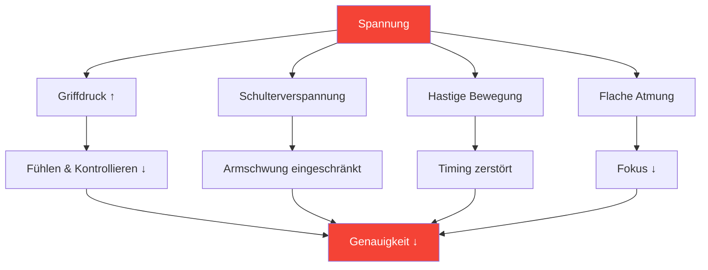

# Spannung im Präzisionssport verstehen

::: tip Spannung ist der Feind der Präzision.
**Gewichtung: 300 Punkte** — Man kann nicht gleichzeitig angespannt und präzise sein. Der Umgang mit Anspannung ist für eine konstante Leistung unerlässlich.
:::

## Das Präzisionsparadoxon

> „Je mehr man sich anstrengt, desto schlechter läuft es.“

Das ist keine Schwäche – es ist Physik und Physiologie. Pétanque erfordert entspannte, fließende Bewegungen. Anspannung zerstört genau die Eigenschaften, die für präzise Würfe notwendig sind.

### Wie Anspannung die Präzision zerstört



---

## Körperliche vs. mentale Anspannung

Spannung existiert in zwei miteinander verbundenen Formen:

### Körperliche Spannung

Muskelverspannungen, die sich direkt auf Ihren Wurf auswirken:

| Bereich | Auswirkung auf den Wurf |
|------|-----------------|
| **Griff** | Gefühlsverlust, ungleichmäßige Freigabe |
| **Unterarm** | Eingeschränkte Handgelenksbewegung |
| **Schulter** | Verkürzter, abgehackter Armschwung |
| **Nacken** | Eingeschränkte Kopfposition, Sicht |
| **Kiefer** | Steht im Zusammenhang mit der allgemeinen Körperspannung. |
| **Kern** | Gleichgewichts- und Gewichtsverlagerungsprobleme |

### Psychische Anspannung

Psychischer Stress, der körperliche Symptome hervorruft:

- Rasante Gedanken
- Sorgen Sie sich um die Ergebnisse
- Angst vor dem Scheitern
- Druckbewusstsein
- Vergangene Fehler wiederholen

::: warning Die Spannungsschleife
Psychische Anspannung → Körperliche Anspannung → Schlechte Leistung → Mehr psychische Anspannung

Das Durchbrechen dieser Schleife ist für ein gleichmäßiges Spiel unerlässlich.
:::

---

## Das Yerkes-Dodson-Gesetz

Der Zusammenhang zwischen Erregung (Aktivierungsniveau) und Leistung folgt einer umgekehrten U-Kurve:

```
Performance
    ↑
    │         ★ Optimal Zone
    │        /\
    │       /  \
    │      /    \
    │     /      \
    │    /        \
    │   /          \
    └──┴────────────┴──→ Arousal
     Low           High

   "Flat"   "Alert"   "Tense"
   Unfocused Relaxed  Anxious
```

### Zu niedrig (Untererregung)
- Flach, unkonzentriert
- Nachlässige Fehler
- Mangelnde Intensität
- Die Bewegungen ausführen

### Zu hoch (übererregt)
- Angespannt, gehetzt
- Überdenken
- Fester Griff, eingeschränkte Bewegung
- Fehler lassen sich nicht wieder gutmachen.

### Optimale Zone
- Aufmerksam, aber entspannt
- Fokussiert und dennoch flexibel
- Angemessene Intensität
- Schnelle Erholung

---

## Finde deine optimale Zone

Jeder Spieler hat ein anderes optimales Erregungsniveau:

### Der Selbstbewertungsprozess

1. **Erinnere dich an deine besten Leistungen**
   - Wie haben Sie sich körperlich gefühlt?
   - Wie hoch war Ihr Energieniveau?
   - Wie würden Sie Ihre Erregung einschätzen (1-10)?

2. **Erinnere dich an deine schlechtesten Leistungen**
   - Warst du zu emotionslos oder zu angespannt?
   - Welche körperlichen Symptome haben Sie bemerkt?
   - Was hat diesen suboptimalen Zustand ausgelöst?

3. **Erkennen Sie Ihr Muster**
   - Neigen Sie eher zu Übererregung oder zu Untererregung?
   - Welche Situationen lösen Ihr Verhaltensmuster aus?
   - Was hilft Ihnen, wieder in Bestform zu kommen?

### Gängige Spielerprofile

| Profil | Tendenz | Risikosituationen | Strategie |
|---------|----------|-----------------|----------|
| **Der Sorgenmacher** | Übererregung | Hohe Einsätze, knappe Spiele | Entspannungstechniken |
| **Der Flatliner** | Untererregung | Niedrige Einsätze, frühe Runden | Aktivierungstechniken |
| **Der Reaktor** | Variable | Nach Fehlwürfen verschiebt sich das Momentum. | Emotionsregulation |
| **Der Verfolger** | Übermäßige Erregung beim Hinterhergehen | Comebacks, Zeitdruck | Akzeptanztechniken |

---

## Spannungssignale erkennen

### Physische Warnzeichen

Lerne, diese zu erkennen, bevor sie deinen Wurf beeinträchtigen:

| Signal | Standort | Aktion |
|--------|----------|--------|
| **Fester Griff** | Hand | Vor jedem Wurf weicher machen. |
| **Hochgezogene Schultern** | Oberer Rücken | Hinlegen und rollen |
| **Zusammengebissene Zähne** | Gesicht | Mund leicht öffnen |
| **Flacher Atemzug** | Brust | Tief durchatmen |
| **Eilige Bewegung** | Ganzer Körper | Bewusst langsamer fahren. |
| **Unruhiges Herumzappeln** | Allgemein | Erden |

### Psychische Warnzeichen

- Rasante Gedanken
- Zunahme negativer Selbstgespräche
- Konzentriere dich auf das Ergebnis, nicht auf den Prozess
- Bewusstsein für den Einsatz/das Ergebnis
- Nachdenken über vergangene Fehler

---

## Selbstprüfung der Spannungs- und Leistungskennzahlen

Nutzen Sie diese Kurzbeurteilung zwischen den Würfen oder in den Pausen:

**Physischer Scan (5 Sekunden):**
1. Griff → Weich?
2. Schultern → nach unten?
3. Kiefer → Entspannt?
4. Atmung → Langsam und tief?

**Mentale Überprüfung (5 Sekunden):**
1. Gedanken → Auf die Gegenwart fokussiert?
2. Energie → Optimaler Bereich?
3. Nächste Aktion → Löschen?

::: tip Mach es dir zur Gewohnheit
Die besten Spieler machen das automatisch. Durch Wiederholung kannst du dir das auch beibringen.
:::

---

## In diesem Modul

### [Techniken zur Spannungsentspannung](/en/education/tension/techniques)
- Progressive Muskelentspannung (PMR)
- Schnellverschlusstechniken für den Wettkampf
- Atemprotokolle
- Vorwurfspannung zurücksetzen

### [Umgang mit Spannungen im Wettbewerb](/en/education/tension/competition)
- Vorbereitung vor dem Spiel
- Protokolle während des Spiels
- Notfallwiederherstellung aufgrund zu starker Anspannung
- Fehlerbehebung

---

## Schneller Sieg: Der 10-Sekunden-Reset

Befolgen Sie vor Ihrem nächsten Wurf dieses kurze Protokoll:

1. **Schultern** — Lassen Sie sie bewusst sinken
2. **Griff** – 20 % leichter
3. **Kiefer** – Entspannen, Zunge vom Gaumen
4. **Atem** — Einmal langsam und vollständig ausatmen

Das dauert 10 Sekunden und kann Ihren nächsten Wurf sofort verbessern.

---

## Verwandte Faktoren

- Mentale Stärke – Umgang mit Druck
- [Schlaf &amp; Erholung](/en/education/sleep/) — Ruhe reduziert die Grundspannung
- [Achtsamkeit](/en/education/mental-game/mindfulness/) — Bewusstsein für den gegenwärtigen Moment
- [Die Zone](/en/education/mental-game/the-zone/) — Optimaler Leistungszustand

