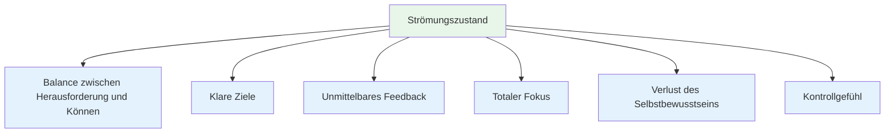
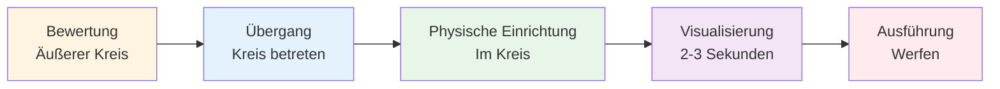
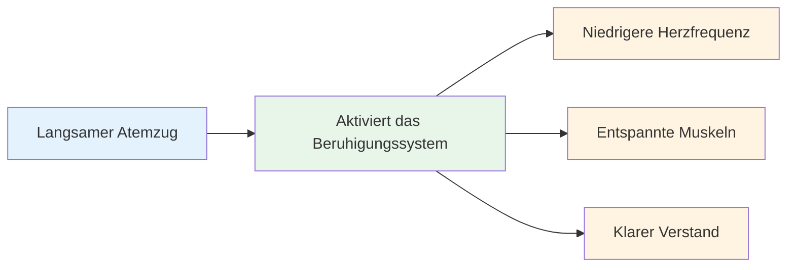
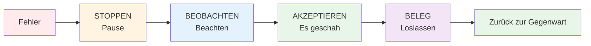

# Den Flow erreichen: Praktische Techniken
<AdBanner />

Der Flow-Zustand entsteht nicht einfach so. Mit Übung können Sie lernen, ihn konstanter zu erreichen. Hier sind bewährte Techniken, die von Spitzensportlern angewendet werden.

::: tip Die große Idee
**Man kann trainieren, zuverlässiger in den Flow-Zustand zu gelangen.** Der Flow-Zustand ist keine Magie – es ist eine Fähigkeit, die man durch spezifische Techniken und konsequentes Üben entwickelt.
:::

## Die sechs Bedingungen für den Fluss

Untersuchungen zeigen, dass Strömungszustände bestimmte Bedingungen erfordern:

| Zustand | Was es bedeutet | Beim Boule |
|-----------|---------------|-------------|
| **Ausgewogenheit zwischen Herausforderung und Können** | Die Aufgabe ist anspruchsvoll, aber machbar. | Auf Ihrem Niveau konkurrieren – nicht zu einfach und nicht unmöglich |
| **Klare Ziele** | Du weißt genau, was du versuchst. | Spezifisches Ziel, klare Absicht für jeden Wurf |
| **Sofortiges Feedback** | Du siehst die Ergebnisse deiner Handlungen | Der Ball landet, man weiß, ob es geklappt hat. |
| **Volle Konzentration** | Volle Aufmerksamkeit der Aufgabe | Keine Ablenkungen, nur der gegenwärtige Moment. |
| **Verlust des Selbstbewusstseins** | Ich mache mir keine Gedanken darüber, wie du aussiehst. | Mir ist egal, wer zuschaut. |
| **Gefühl der Kontrolle** | Fühlen Sie sich in der Lage, damit umzugehen. | Vertraue auf deine Ausbildung und dein Können. |

::: info Wichtigste Erkenntnis
Wenn diese sechs Bedingungen erfüllt sind, wird ein reibungsloser Ablauf möglich. Ihre Aufgabe ist es, diese Bedingungen gezielt herbeizuführen.
:::

## Technik 1: Die Vorbereitungsroutine

Deine Vorbereitungsroutine vor dem Wurf ist dein Tor zum Flow. Es ist eine gleichbleibende Abfolge, die deinem Gehirn signalisiert: „Jetzt geht’s los.“

### Aufbau Ihrer Routine

Eine gute Routine enthält folgende Elemente:

::: details 1. Visuelle Beurteilung (außerhalb des Kreises)
- Lies das Gelände
- Wählen Sie Ihr Ziel und Ihren Landeplatz.
- Entscheide dich für die Wurfart

**Hier findet das Denken statt.** Nehmen Sie sich hier Zeit.
:::

::: details 2. Übergang (Eintritt in den Kreis)
- Atme tief durch
- Lass die Analyse los.
- Wechsel in den Ausführungsmodus

**Dies ist der Schalter.** Die Analyse endet hier.
:::

::: details 3. Physischer Auslöser (im Kreis)
- Eine konsistente Haltungseinstellung
- Eine spezifische Griffprüfung
- Eine kleine Bewegung, die sich für dich natürlich anfühlt

**Sorgen Sie für Konsistenz.** Jedes Mal gleich.
:::

::: details 4. Visualisierung (Kurz, 2-3 Sekunden)
- Verfolge den Weg des Balls
- Spüre den erfolgreichen Wurf
- Nehmen Sie Kontakt zu Ihrem Ziel auf

**Halten Sie es kurz.** Zu lang = übermäßiges Nachdenken.
:::

::: details 5. Ausführung
- Konzentriere dich nur auf das Ziel
- Vertraue deinem Körper
- Ohne Zögern freigeben

**Nur äußerer Fokus.** Ziel, nicht Technik.
:::

### Warum Routinen funktionieren

Deine Routine wird zu einer Art „Achtsamkeitsglocke“ – einem Signal, das deinen Gehirnzustand verändert. Bei genügend Wiederholung löst allein der Beginn deiner Routine den mentalen Übergang in den Flow-Zustand aus.

::: tip Praxistipp
Wende deine Routine bei JEDEM Wurf im Training an – nicht nur im Wettkampf. Die Routine muss automatisiert werden.
:::

<AdInArticle />

## Technik 2: Externer Fokus

Worauf Sie Ihre Aufmerksamkeit richten, ist von enormer Bedeutung.

| Fokus-Typ | Was Sie denken | Beispielgedanken |
|------------|---------------------|------------------|
| **Intern** ❌ | Ihre Körpermechanik | &quot;Meinen Ellbogen gerade halten&quot;  &quot;Ordnungsgemäß durchführen&quot;  &quot;Nicht zu fest greifen&quot; |
| **Extern** ✅ | Ziel und Ergebnis | &quot;Lande genau dort.&quot;  &quot;Sieh dir den Weg an&quot;  &quot;Das Ziel getroffen&quot; |

::: tip Forschungsergebnis
Studien belegen übereinstimmend, dass **externe Konzentration bei erfahrenen Spielern zu besseren Ergebnissen führt**. Dein Körper weiß, was zu tun ist – lass ihn einfach arbeiten.
:::

### Praxis Externer Fokus
- Wählen Sie eine bestimmte Stelle am Boden (nicht einfach nur „in der Nähe des Wagenhebers“).
- Visualisiere den gesamten Weg des Balls.
- Richte deinen Blick auf das Ziel, nicht auf deine Hand

::: warning Häufiger Fehler
Unter Druck neigen Spieler oft dazu, sich auf ihre inneren Gedanken zu konzentrieren („Bloß nicht meine Technik ruinieren“). Genau dann ist es aber am wichtigsten, sich auf die äußeren Umstände zu konzentrieren.
:::

## Technik 3: Der Linkshändergriff

Diese ungewöhnliche Technik hat eine wissenschaftliche Grundlage.

::: info Die Wissenschaft
Drücken Sie Ihre linke Hand (falls Sie Rechtshänder sind) 10-15 Sekunden lang zusammen, bevor Sie werfen:
- ✅ Aktiviert die rechte Gehirnhälfte (räumliches, intuitives Denken)
- ✅ Beruhigt die linke Hemisphäre (verbal, analytisch)
- ✅ Reduziert übermäßiges Nachdenken
:::

**So verwenden Sie es:**
1. Balle deine Nicht-Wurfhand zur Faust.
2. 10-15 Sekunden lang fest drücken.
3. Lass los und beginne deine Routine.
4. Werfen

::: tip Wann verwenden?
Das funktioniert am besten, wenn man merkt, dass man zu viel nachdenkt oder sich unter Druck gesetzt fühlt. Es ist wie ein „Reset-Knopf“ fürs Gehirn.
:::

## Technik 4: Atemkontrolle

Ihre Atmung beeinflusst direkt Ihren mentalen Zustand.

**Bevor Sie den Kreis betreten:**
- Atme langsam und tief ein.
- Vollständig ausatmen
- Spüre, wie deine Schultern sinken.

**Im Kreis:**
- Atmen Sie natürlich
- Halte beim Wurf nicht den Atem an.
- Lass das Ausatmen deine Entspannung begleiten.

::: details Die 4-7-8-Technik (für hohen Druck)
1. Vier Sekunden lang einatmen.
2. Halten Sie die Position für 7 Sekunden.
3. Atmen Sie 8 Sekunden lang aus.
4. Wiederholen Sie dies ein- oder zweimal.

**Warum es funktioniert:** Dadurch wird Ihr parasympathisches Nervensystem (das &quot;Beruhigungssystem&quot;) aktiviert.
:::

## Technik 5: Auslöserwörter

Ein bestimmtes Wort oder eine bestimmte Phrase kann Ihren mentalen Zustand augenblicklich verändern.

::: tip Beliebte Triggerwörter
- &quot;Glatt&quot;
- &quot;Vertrauen&quot;
- „Sieh es, sei es“
- &quot;Loslassen&quot;
- &quot;Fließen&quot;
- &quot;Einfach&quot;
:::

**So entwickeln Sie Ihre:**
1. Denken Sie an eine Situation, in der Sie perfekt abgeschnitten haben.
2. Welches Wort beschreibt dieses Gefühl am besten?
3. Verwenden Sie dieses Wort in Ihrer Routine
4. Sprich es innerlich, während du dich zum Wurf vorbereitest.

::: info Warum es funktioniert
Durch Wiederholung wird das Wort mit Ihrem optimalen Leistungszustand verknüpft. Es ist eine mentale Abkürzung zum Flow.
:::

## Technik 6: Nach Fehlern neu starten

Fehler passieren. Wichtig ist, dass aus einem Fehlwurf nicht zwei werden.

**Die SOAS-Methode:**

| Schritt | Aktion | Was es bedeutet |
|------|--------|---------------|
| **Stoppen | Innehalten, nicht sofort reagieren | Nicht die Hände hochreißen, nicht fluchen |
| **Beobachten | Beobachte das Geschehene ohne zu urteilen. | „Der Ball ging nach links“, nicht „Ich bin schrecklich“. |
| **Akzeptieren | Es ist passiert, es ist vollbracht | Die Vergangenheit lässt sich nicht ändern. |
| **Beleg | Lass los, gib es frei | Kehren Sie zum gegenwärtigen Moment zurück |

::: warning Wichtige Kompetenz
Das erfordert Übung, verhindert aber die Frustrationsspirale, die den Flow unterbricht. Übe SOAS im Alltag, damit es im Wettkampf automatisch abläuft.
:::

## Aufbau Ihres Flow-Toolkits

Nicht jede Technik funktioniert für jeden. Probieren Sie verschiedene Techniken aus und finden Sie heraus, was Ihnen hilft:

| Situation | Probieren Sie dies aus |
|-----------|----------|
| Überdenken | Linkshänder-Druck, externer Fokus |
| Nervös/angespannt | Atemkontrolle, Auslösewort |
| Nach einem Fehler | SOAS-Methode |
| Wichtiger Wurf | Vollständige Vorbereitungsroutine |
| Konzentrationsverlust | Zurück zu den grundlegenden Routinen |

## Übung macht den Meister

Diese Techniken funktionieren nur, wenn man sie übt:

1. **Nutze deine Routine bei jedem Trainingswurf** – nicht nur bei Wettkämpfen.
2. **Druck simulieren** – Konsequenzen in der Praxis erzeugen
3. **Achte darauf, wann du im Flow bist** – was hat ihn ausgelöst?
4. **Rückblick nach den Sitzungen** – Was hat geholfen, was nicht?

## Wichtigste Erkenntnis

::: tip Erinnern
**Der Flow ist kein Glücksfall. Er ist eine Fähigkeit, die man entwickeln kann.**

Beginne mit deiner Vorbereitungsroutine. Halte sie konsequent durch. Vertraue ihr. Der Flow kommt von ganz allein.
:::

<AdBanner />
