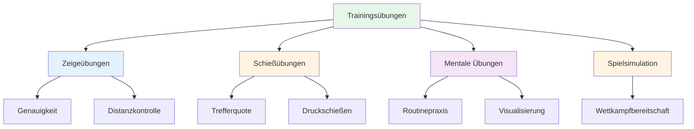

# Trainingsübungen

Hier findest du bewährte Übungen, die von Spitzenspielern eingesetzt werden. Jede Übung hat einen bestimmten Zweck – wähle diejenige aus, die du entwickeln möchtest.

::: tip Die große Idee
**Jede Übung hat einen bestimmten Zweck.** Werfen Sie die Boulekugeln nicht einfach wahllos – wählen Sie Übungen, die Ihre Schwächen gezielt angehen und Sie bei der Erreichung Ihrer Ziele unterstützen. Verfolgen Sie Ihre Fortschritte, um Verbesserungen festzustellen.
:::

## Zeigeübungen

### Die Gasse
**Zweck:** Isolierung des Abwurfwinkels und der Linienkonsistenz.

**Aufstellen:**
- Platzieren Sie zwei Markierungen im Abstand von 30-40 cm, etwa 1 Meter vom Kreis entfernt.
- Das Ziel ist 7-9 Meter entfernt.

**Bohren:**
- Wirf durch die &quot;Gasse&quot; (zwischen den Markierungen)
- Jeder Wurf, der eine Markierung trifft, ist &quot;tot&quot;.
- Fokus auf einen einheitlichen Freigabepunkt

**Progression:**
- Verenge die Gasse, während du dich verbesserst
- Variieren Sie die Zielentfernung
- Füge eine spezifische Landezone hinzu

### Präzisionszonen
**Zweck:** Entwicklung von Genauigkeit in bestimmten Bereichen

**Aufstellen:**
- Markieren Sie Zonen um ein Ziel herum (z. B. Kreise bei 20 cm, 40 cm, 60 cm).
- Oder man nutzt natürliche Markierungen im Gelände.

**Wertung:**
- Innerhalb von 20 cm: 3 Punkte
- Innerhalb von 40 cm: 2 Punkte
- Innerhalb von 60 cm: 1 Punkt
- Außerhalb: 0 Punkte

**Bohren:**
- Wirf 10 Boules und notiere deine Punktzahl.
- Ziel: Kontinuierliche Verbesserung über die Trainingseinheiten hinweg

### Distanzvariation
**Zweck:** Entwicklung der Tiefenkontrolle

**Aufstellen:**
- Platzieren Sie Ziele in 6 m, 7 m, 8 m, 9 m und 10 m Entfernung.

**Bohren:**
- Werfen Sie in zufälliger Reihenfolge auf jede Entfernung.
- Der Partner ruft die Entfernung an
- Konzentriere dich auf die Gewichtsanpassung, nicht auf die Technik.

**Variation:**
- Fügen Sie nach der Freigabe die Aufrufe „short“ und „long“ hinzu.
- Muss während des Fluges korrigiert werden (entwickelt ein Gefühl dafür)

## Schießübungen

### Die Schießleiter
**Zweck:** Erhöhung der Genauigkeit unter progressivem Druck

**Aufstellen:**
- Platziere eine Boule-Zielscheibe in 6 Metern Entfernung.
- Markieren Sie Abstände bei 7 m, 8 m, 9 m, 10 m

**Bohren:**
- Beginnen Sie bei 6 Metern.
- Treffer = einen Meter zurückweichen
- Fehlschlag = einen Meter vorwärts (oder neu starten)
- Ziel: 10 Meter erreichen

**Varianten:**
- Strenge Version: Jeder Fehlwurf führt zurück zu 6 m.
- Zeitversion: Wie weit kommst du in 10 Minuten?
- Teamversion: Wechseln Sie sich mit dem Partner ab.

### The Barrier (Blox)
**Zweck:** Erzwingen von Schüssen mit hohem Bogen

**Aufstellen:**
- Platzieren Sie eine Barriere (Stock, Schnur oder Hindernis) zwischen sich und dem Ziel.
- Die Barriere sollte hoch genug sein, um einen Lob zu erfordern.

**Bohren:**
- Um das Ziel zu treffen, muss die Barriere überwunden werden.
- Jeder Wurf, der die Barriere trifft, ist &quot;tot&quot;.
- Entwickelt einen hohen Auslösepunkt

**Warum das wichtig ist:**
- Bei Wettkämpfen ist es oft erforderlich, über Hindernisse hinweg zu schießen.
- Verleiht Ihnen mehr Vielseitigkeit beim Fotografieren

### Hindernisparcours
**Zweck:** Entwicklung von Aufnahmen aus verschiedenen Blickwinkeln

**Aufstellen:**
- Platziere die Zielkugel in der Mitte
- Füge Hindernisse (andere Boules, Markierungen) darum herum hinzu.

**Bohren:**
- Schieße aus verschiedenen Positionen rund um den Kreis.
- Man muss den passenden Winkel finden.
- Entwickelt das Lesen von Schusslinien

## Mentale Trainingsübungen

### Routinewiederholung
**Zweck:** Automatisieren Sie Ihre Vorbereitungsroutine.

**Bohren:**
- Übe deine gesamte Routine ohne zu werfen.
- Gehen Sie jeden Schritt bewusst durch.
- Führe 10-20 Wiederholungen durch.
- Füge dann den Wurf hinzu.

**Fokus:**
- Konstantes Timing
- Klarer Übergang vom Denken zur Ausführung
- Immer die gleiche Routine

### Druckpunkte
**Zweck:** Üben Sie das Auftreten unter Druck

**Aufstellen:**
- Erstellen Sie ein „Must-Machen“-Szenario
- Strafen für das Versäumnis festlegen

**Beispiele:**
- „Schaffe 3 in Folge oder fange von vorne an.“
- &quot;Verpasse den Wurf und mach 10 Liegestütze.&quot;
- &quot;Kündige dein Ziel an, bevor du wirfst.&quot;

**Schlüssel:**
- Der Druck sollte sich real anfühlen.
- Üben Sie Ihre mentale Reaktion auf Druck
- Setze deine Routine genau wie im Wettkampf ein.

### Genesungspraxis
**Zweck:** Die Gewohnheit entwickeln, mental schnell wieder in einen Normalzustand zu versetzen.

**Bohren:**
- absichtlich einen schlechten Boule werfen
- Wenden Sie sofort SOAS an (Stoppen, Beobachten, Akzeptieren, Ausrutschen).
- Wirf die nächste Boule-Kugel mit vollem Einsatz.

**Fokus:**
- Grübele nicht über den Fehler nach.
- Vor dem nächsten Wurf vollständig zurücksetzen.
- Achten Sie auf eine positive Körpersprache.

## Spielsimulationsübungen

### Millieus Freude
**Zweck:** Rhythmusblockaden durchbrechen, Vielseitigkeit aufbauen

**Bohren:**
- Wechsle bei jedem Wurf zwischen Zeigen und Werfen ab.
- Keine zwei aufeinanderfolgenden Würfe der gleichen Art
- Entwickelt die Fähigkeit, zwischen verschiedenen Modi zu wechseln

### Szenario-Spiel
**Zweck:** Übung taktischer Entscheidungsfindung

**Aufstellen:**
- Realistische Spielsituationen schaffen
- Punkte und Boule-Zählungen zuweisen

**Beispiele:**
- &quot;Du liegst 10:8 hinten, dein Gegner hat 2 Punkte, du hast 2 Boules.&quot;
- „Unentschieden 6:6, Sie haben die letzte Kugel, sie haben 1 Punkt.“

**Bohren:**
- Entscheide, was du tun willst.
- Mit vollem Engagement ausführen
- Überprüfen Sie die Entscheidung anschließend.

### Matchplay mit Regeln
**Zweck:** Wettbewerbssimulation

**Varianten:**
- Spiel bis 13 (vollständiges Spiel)
- Spielt bis 7 (kürzer, mehr Spiele)
- „Druckpunkte“ – bestimmte Ziele sind doppelt wertvoll
- „Plötzlicher Tod“ – wer als Erster eine Runde verliert, verliert das Spiel.

## Ihre Übungen verfolgen

Führen Sie für jede Übung ein Protokoll:

| Datum | Bohren | Ergebnis | Anmerkungen |
|------|-------|--------------|-------|
| | | | |

**Verlauf im Zeitverlauf:**
- Machst du Fortschritte?
- Welche Übungen helfen am meisten?
- Wo haben Sie Schwierigkeiten?

## Aufbau einer Übungseinheit

### Aufwärmen (10 Min.)
- Einfache Würfe zum Aufwärmen
- Kein Druck, einfach fühlen

### Technischer Fokus (20-30 Min.)
- Ein oder zwei Übungen zur Förderung spezifischer Fähigkeiten
- Blockiertes Üben neuer Fähigkeiten
- Zufälliges Üben für etablierte Fertigkeiten

### Druck-/Spielsimulation (20-30 Min.)
- Folgen hinzufügen
- Realistische Szenarien erstellen
- Mentale Fähigkeiten üben

### Abkühlphase (10 Min.)
- Einfache Würfe
- Reflektieren Sie die Sitzung
- Notieren Sie sich, woran Sie als Nächstes arbeiten müssen.

## Wichtigste Erkenntnis

> Bohrmaschinen sind Werkzeuge. Wählen Sie das richtige Werkzeug für Ihr Projekt.

Werfen Sie nicht einfach nur Boule-Kugeln. Trainieren Sie zielgerichtet.

