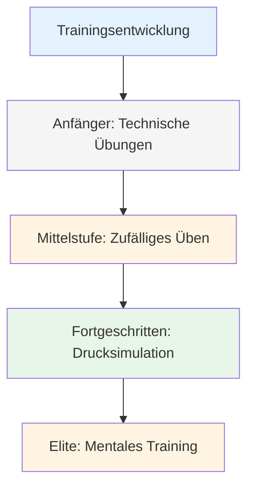
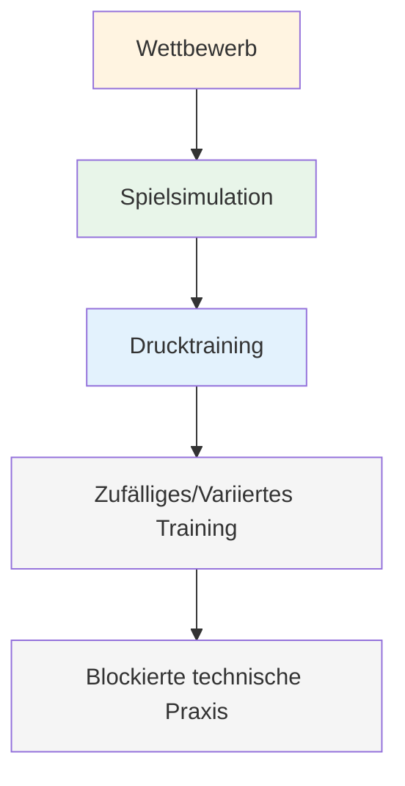

# Trainingsmethoden
<AdBanner />

Wenn deine Technik solide ist, was übst du dann? Hier stagnieren viele Spieler – sie feilen immer weiter an ihrer Technik, obwohl das eigentliche Entwicklungspotenzial woanders liegt.

::: tip Die große Idee
Die meisten Spieler stagnieren, weil sie sich immer nur auf die Technik konzentrieren, während das eigentliche Entwicklungspotenzial woanders liegt. Spitzenspieler trainieren Anpassungsfähigkeit, Entscheidungsfindung und mentale Stärke – nicht nur die Technik.
:::

## Über die technische Wiederholung hinaus

Die meisten Spieler trainieren durch das Wiederholen von Würfen. Das ist wichtig für Anfänger, aber fortgeschrittene Spieler brauchen mehr:

| Schulungsart | Was es entwickelt | Wann verwenden? |
|--------------|------------------|-------------|
| Technische Übungen | Mechanik, Form | Neue Fähigkeiten erlernen, Probleme lösen |
| Zufällige Übung | Anpassungsfähigkeit, Entscheidungsfindung | Wettkampfvorbereitung |
| Drucksimulation | Mentale Stärke | Vor wichtigen Ereignissen |
| Mentales Training | Fokus, Erholung, Selbstvertrauen | Andauernd, oft vernachlässigt |

## Die Trainingspyramide

::: warning Häufiger Fehler
**Die meisten Spieler verbringen zu viel Zeit im unteren Bereich.** Elite-Spieler arbeiten auf allen Ebenen der Pyramide, wobei der Schwerpunkt beim Aufstieg auf den oberen Ebenen liegt.
:::

## Blockiertes vs. zufälliges Training

### Blockierte Übung
Den gleichen Wurf mehrmals wiederholen:
- 20 Punkte aus 7 Metern
- 20 Schüsse auf dasselbe Ziel
- Gleiche Distanz, gleicher Wurf

**Gut geeignet für:** Erste Lernschritte, Aufbau von Selbstvertrauen, Aufwärmen
**Einschränkung:** Lässt sich nicht gut auf Wettbewerbe übertragen.

### Zufällige Übung
Variiere alles:
- Unterschiedliche Wurfdistanzen.
- Abwechselnd zielen und schießen
- Die Ziele ändern sich ständig.

**Gut geeignet für:** Wettkampfvorbereitung, Aufbau von Anpassungsfähigkeit
**Fühlt sich an:** Schwieriger, mehr Fehler, weniger &quot;produktiv&quot;
**Realität:** Bessere langfristige Kundenbindung und Transferleistung

### Die Forschung

Studien zeigen übereinstimmend:
- Blockiertes Üben fühlt sich besser an (schnelle Verbesserung sichtbar)
- Zufälliges Üben führt zu besseren Wettkampfleistungen
- Der „Kampf“ des zufälligen Übens ist der Ort, an dem Lernen stattfindet.

<AdInArticle />

## Drucksimulation

Man kann dem Druck im Wettkampf nicht standhalten, wenn man ihn im Training nie erlebt hat.

### Übungsdruck erzeugen

**Folgen:**
- Liegestütze für Fehlversuche
- Der Verlierer kauft Kaffee
- Punkte zählen für etwas

**Szenarien:**
- Situationen, die man unbedingt schaffen muss
- Wir liegen mit 12:10 zurück und müssen punkten.
- Letzte Boule des Spiels

**Publikum:**
- Übung mit Menschenbeobachtung
- Nimm dich selbst auf Video auf
- Kündige an, was du vorhast

**Ermüdung:**
- Üben, wenn man müde ist
- Ende der langen Sitzung
- Nach der körperlichen Betätigung

### Die Schießleiter

Eine klassische Druckübung:
1. Beginnen Sie bei 6 Metern.
2. Ziel getroffen = einen Meter zurückgehen
3. Fehlschlag = einen Meter vorwärts (oder von vorne beginnen)
4. Ziel: 10 Meter erreichen

Dadurch entsteht im Verlauf des Prozesses ein natürlicher Druck.

## Mentale Trainingseinheiten

Widmen Sie sich gezielt Zeit für mentale Fähigkeiten:

### Visualisierungssitzung (15-20 Min.)
1. Suche dir einen ruhigen Ort
2. Schließe deine Augen
3. Stell dir vor, du nimmst an einem Wettbewerb teil.
4. Erfolgreiche Würfe im Detail ansehen
5. Spüre das Selbstvertrauen und den Flow.
6. Üben Sie den Umgang mit Drucksituationen

### Routineübungen vor dem Schuss
- Übe deine Routine, ohne zu werfen.
- Konzentriere dich auf die mentalen Übergänge
- Gewöhnen Sie sich die Gewohnheit der konsequenten Vorbereitung an.

### Genesungspraxis
- absichtlich Fehler in der Praxis machen
- Üben Sie Ihre SOAS-Antwort
- Entwickeln Sie die Gewohnheit, Ihren Geist schnell wieder ins Gleichgewicht zu bringen.

## Strukturierung deiner Trainingswoche

### Beispiel: Ambitionierter Amateur (6 Stunden/Woche)

| Tag | Dauer | Fokus |
|-----|----------|-------|
| Montag | 1,5 Std. | Technik: Spitzübungen |
| Mittwoch | 1,5 Std. | Technik: Schießübungen |
| Freitag | 1 Stunde | Mental: Visualisierung, regelmäßiges Üben |
| Samstag | 2 Std. | Spielgeschehen mit Druckelementen |

### Beispiel: Wettkampfspieler (10 Stunden/Woche)

| Tag | Dauer | Fokus |
|-----|----------|-------|
| Montag | 2 Std. | Technisch: Zeigen (blockiert → zufällig) |
| Dienstag | 1 Stunde | Mentales Training + Visualisierung |
| Mittwoch | 2 Std. | Technik: Schuss (blockiert → zufällig) |
| Donnerstag | 1 Stunde | Videorezension + geistige Arbeit |
| Freitag | 2 Std. | Drucksimulation, Spielszenarien |
| Samstag | 2 Std. | Wettkampf oder Spiel |

## Trainingsprinzipien

### 1. Qualität vor Quantität
- 30 konzentrierte Minuten sind besser als 2 Stunden sinnloses Wiederholen.
- Stoppen, wenn die Konzentration nachlässt
- Besser frühzeitig aufhören, als schlechte Gewohnheiten zu pflegen.

### 2. Bewusstes Üben
- Setzen Sie sich für jede Trainingseinheit ein konkretes Ziel.
- Arbeite am Rande deiner Fähigkeiten
- Feedback einholen (Video, Partner, Ergebnisse)
- Passen Sie Ihre Einstellungen an die Erkenntnisse an, die Sie gewonnen haben.

### 3. Genesung ist wichtig
- Ruhetage sind Teil des Trainings
- Schlaf beeinflusst die Leistungsfähigkeit erheblich.
- Mentale Erschöpfung ist real – respektiere sie.

### 4. Alles dokumentieren
- Führe ein Trainingsprotokoll
- Notieren Sie, was funktioniert und was nicht.
- Regelmäßig überprüfen
- Passen Sie Ihren Tarif anhand der Daten an.

## In diesem Abschnitt

- **[Trainingsübungen](/en/education/training/drills)** - Spezielle Übungen für verschiedene Fertigkeiten

## Wichtigste Erkenntnis

> Wie du trainierst, bestimmt deine Leistung. Trainiere so, wie du spielen willst.

Gestalte dein Training abwechslungsreich. Integriere mentale Übungen. Setze dich unter Druck. Verfolge deine Fortschritte.

<AdBanner />
