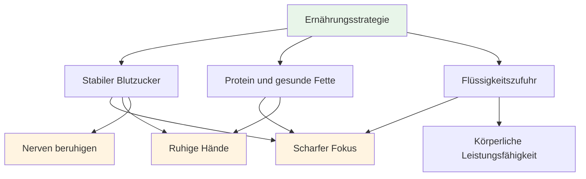
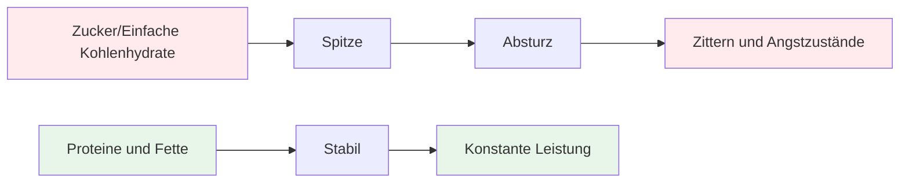
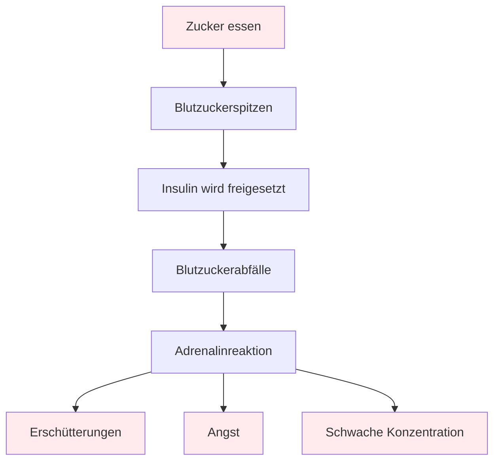

# Ernährung

## Präzisionskraft für optimale Leistung

Pétanque ist ein Präzisionssport. Ihr Gehirn ist Ihr wichtigstes Werkzeug – füttern Sie es mit stabiler Energie, nicht mit Achterbahnfahrten.

::: tip Das Kernprinzip
**Stabiler Blutzucker = Hohe Konzentration + Ruhige Hände**

Vermeiden Sie Blutzuckerspitzen. Setzen Sie auf Proteine und gesunde Fette. Achten Sie auf ausreichende Flüssigkeitszufuhr.
:::

## Grundprinzipien

### Stabiler Blutzucker ist alles

::: warning Auswirkungen von Blutzuckerschwankungen
Zucker und einfache Kohlenhydrate verursachen Blutzuckerspitzen und -abfälle, die sich direkt auswirken auf:
- ❌ Mentale Konzentration und Klarheit
- ❌ Ruhige Hände (Zittern durch Blutzuckerabfall)
- ❌ Qualität der Entscheidungsfindung
- ❌ Emotionale Stabilität und Gelassenheit
:::

### Priorisieren Sie Protein und gesunde Fette

::: tip Die besten Lebensmittel für Präzisionsarbeit
Fett und Eiweiß liefern anhaltende Energie ohne den anschließenden Energieabfall:
- ✅ Nüsse, Avocado, Olivenöl, Eier, Käse
- ✅ Langsame Verdauung = gleichmäßige Energie den ganzen Tag
- ✅ Kein Nachmittagstief bei langen Turnieren
:::

### Vermeiden Sie die Zuckerfalle

::: danger Zu vermeidende Lebensmittel
Besondere Vorsicht ist geboten bei:
- ❌ &quot;Energy&quot;-Riegel und -Getränke (oft zuckerhaltig)
- ❌ Fruchtsäfte und Smoothies (konzentrierter Zucker)
- ❌ Weißbrot, Gebäck, Snacks aus Automaten
:::

## Kurzanleitung für den Wettkampftag

| Timing | Was man essen sollte | Warum |
|--------|-------------|-----|
| **2-3 Stunden vorher** | Ausgewogene Mahlzeit: Eiweiß, Fett, Gemüse | Stabile Energie ohne Müdigkeit |
| **Während des Wettkampfs** | Wasser + kleine proteinreiche Snacks (Nüsse, Käse, Trockenfleisch) | Konzentriere dich und bewahre eine ruhige Hand |
| **Ganztägig meiden** | Zuckerhaltige Snacks und Getränke | Unfälle und Erschütterungen verhindern |

::: tip Schnelle Snacks für den Wettkampf
**Bitte bringen Sie Folgendes mit:**
- Gemischte Nüsse (ungesalzen)
- Hartgekochte Eier
- Käsewürfel
- Trockenfleisch vom Rind oder Truthahn
- Gemüse mit Hummus

**Lassen Sie diese Dinge zu Hause:**
- Süßigkeiten und Schokolade
- Energy-Drinks
- Gebäck
- Fruchtsaft
:::

## Die Wissenschaft

::: info Warum das für Pétanque wichtig ist
Im Gegensatz zum Ausdauersport erfordert Pétanque:
- **Präzision** – Ruhige Hände, kein Zittern
- **Mentale Klarheit** – Den ganzen Tag über scharfe Entscheidungen treffen.
- **Nerven beruhigen** – Geringe Angst unter Druck

Zuckerbasierte Energie wirkt all dem entgegen.
:::

## Mehr erfahren

Detaillierte Ernährungsstrategien, Wettkampfprotokolle und die wissenschaftlichen Grundlagen stabiler Energieversorgung finden Sie hier:

::: tip Vollständiger Ernährungsleitfaden
→ **[Ernährung für optimale Leistung](./education/nutrition/)** – Vollständiger Leitfaden in unserem Bildungsbereich

Beinhaltet:
- Detaillierte Speiseplanung
- Wettkampftagsprotokoll
- Die kohlenhydratarme Option für Leistungssportler
- Hydratationsstrategien
- Lebensmittel, die helfen vs. Lebensmittel, die schaden
:::

