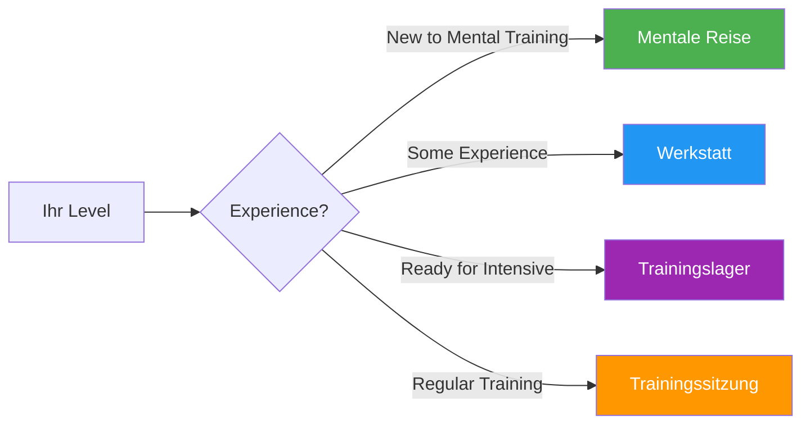

# Anleitungen &amp; Werkzeuge

Praktische Hilfsmittel für Spieler, Trainer und Vereine zur Umsetzung strukturierter mentaler Trainingsprogramme.

## Wählen Sie Ihr Format

## Leitfadenformate

### 🌱 [Mentale Reise](/de/guides/mental-journey/)
**Für Anfänger** – 2-3-stündige Einführung

Ideal für Spieler, die neu im Mentaltraining sind. Eine sanfte Einführung in die Kernkonzepte mit praktischen Übungen.

- Dauer: 2-3 Stunden
- Gruppengröße: 4-12 Spieler
- Materialien: Werden bereitgestellt
- [Anleitung ansehen →](/de/guides/mental-journey/)

---

### 🎯 [Workshop](/de/guides/workshop/)
**Für Fortgeschrittene** — 3-4 Stunden Tieftauchgang

Strukturiertes Workshop-Format für Vereine und Mannschaften, die sich intensiver mit mentalem Training auseinandersetzen möchten.

- Dauer: 3-4 Stunden
- Gruppengröße: 6-8 Spieler
- Beinhaltet: Koordinatorenleitfaden + herunterladbare Materialien
- [Anleitung ansehen →](/de/guides/workshop/)

---

### 🏕️ [Trainingslager](/de/guides/training-camp/)
**Für engagierte Teams** — Intensivwochenende

Ein komplettes Wochenendprogramm mit Theorie, Praxis und Wettkampf. Ideal für Teams, die sich auf wichtige Turniere vorbereiten.

- Dauer: 2-3 Tage
- Gruppengröße: 10-20 Spieler
- Beinhaltet: Vollständiges Programm + Organisationsmaterialien
- [Anleitung ansehen →](/de/guides/training-camp/)

---

### 🔄 [Training Session](/de/guides/training-session/)
**Für regelmäßiges Training** — 2-4 Stunden strukturierte Trainingseinheiten

Rahmenkonzept für regelmäßige Trainingseinheiten, die neben technischen Übungen auch mentale Fähigkeiten einbeziehen.

- Dauer: 2-4 Stunden
- Gruppengröße: 4 Spieler (ein Team)
- Fokus: Wettbewerbssimulation mit Reflexion
- [Anleitung ansehen →](/de/guides/training-session/)

---

## Vorlagen &amp; Werkzeuge

Herunterladbare Vorlagen zur Unterstützung Ihrer Entwicklung:

### 📋 [Zielvorlage](/de/guides/templates/goal-template)
Strukturiertes Arbeitsblatt zur Festlegung und Verfolgung Ihrer Pétanque-Ziele mithilfe des SMART-Rahmens.

### 📓 [Tagebuchvorlage](/de/guides/templates/diary-template)
Vorlage für ein Trainings- und Wettkampftagebuch zur Erfassung von Fortschritten, Erkenntnissen und Verbesserungspotenzialen.

---

## Welches Format ist das richtige für Sie?

| Format | Am besten geeignet für | Zeitaufwand | Tiefe |
|--------|----------|-----------------|-------|
| **Mentale Reise** | Erste Einführung | 2-3 Stunden | ⭐ |
| **Werkstatt** | Vereinstrainingstage | 3-4 Stunden | ⭐⭐ |
| **Trainingslager** | Teamvorbereitung | Wochenende | ⭐⭐⭐ |
| **Trainingseinheit** | Laufende Entwicklung | Regelmäßig 2-4 Stunden | ⭐⭐ |

::: tip Für Trainer und Vereinsleiter
Jeder Leitfaden enthält Materialien sowohl für Teilnehmende als auch für Moderatoren/Organisatoren. Im Abschnitt „Für Koordinatoren“ finden Sie herunterladbare PDFs und Präsentationsfolien.
:::

## Verwandte Ressourcen

- [🎯 Selbsteinschätzung](/de/assessment/) — Bewerten Sie Ihre 8 Faktoren und legen Sie Prioritäten fest.
- [📚 Bildungsportal](/de/education/) — Vertiefende Analyse der 8 Leistungsfaktoren
- [📝 Artikel](/de/articles/) — Forschung und Erkenntnisse

