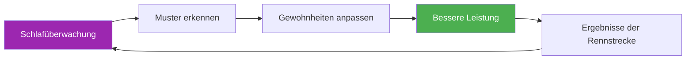

# Schlaftracker-Vorlage

> „Der Spieler, der besser geschlafen hat, gewinnt oft.“

Verfolge deine Schlafmuster und setze sie in Zusammenhang mit deiner Leistungsfähigkeit, um deine Regeneration zu optimieren.

::: tip Warum sollte man den Schlaf tracken?
**Schlaf ist das wichtigste Mittel zur Regeneration.** Spitzensportler, die ihren Schlaf regelmäßig überwachen, berichten von mehr Energie, schnelleren Reaktionszeiten und einer verbesserten Entscheidungsfindung unter Druck.
:::

---

## Schneller Tageseintrag

### Dies für jeden Tag kopieren

---

**Datum:** ________

| **Schlafenszeit:** ________ | **Wachzeit:** ________ |
**Gesamtschlaf:** ________ Stunden

**Schlafqualität (1-10):** _____

**Faktoren, die den Schlaf beeinflussen:**
- [ ] Koffein nach 14 Uhr
- [ ] Alkohol
- [ ] Bildschirmzeit vor dem Schlafengehen
- [ ] Stress/Sorgen
- [ ] Lärm-/Lichtstörung
- [ ] Temperaturprobleme
- [ ] Spätes Essen
- [ ] Andere: ________

**Morgenenergie (1-10):** _____

**Anmerkungen:**

---

## Wöchentliche Schlafübersicht

### Diesen Text jede Woche kopieren

---

**Woche vom:** ________

| Tag | Schlafenszeit | Aufwachen | Std | Qualität | Energie | Anmerkungen |
|-----|---------|------|-------|---------|--------|-------|
| Montag | /10 | /10 |
| Di. | /10 | /10 |
| Heiraten | /10 | /10 |
| Donnerstag | /10 | /10 |
| Freitag | /10 | /10 |
| Sa | /10 | /10 |
| Sonne | /10 | /10 |

| **Wöchentlicher Durchschnitt:** _____ Stunden | Qualität: _____/10 | Energie: _____/10 |

**Beste Nacht:** ________ Warum? ________

**Schlimmste Nacht:** ________ Warum? ________

**Erkanntes Muster:**

---

## Schlafprotokoll vor dem Wettkampf

### 3 Tage vor dem Wettkampf

| Nacht | Ziel-Schlafenszeit | Tatsächlich | Std | Qualität | Anmerkungen |
|-------|----------------|--------|-------|---------|-------|
| -3 Tage |
| -2 Tage |
| -1 Tag |

**Energieniveau am Wettkampftag (1-10):** _____

**Leistungskorrelation:**
- Hat der Schlaf mein Spiel beeinflusst? Ja / Nein / Vielleicht
- Wie?

---

## Checkliste für die Schlafumgebung

Bewerten Sie Ihre Schlafumgebung:

| Faktor | Punktzahl (1-10) | Verbesserungsbedarf? |
|--------|--------------|---------------------|
| **Dunkelheit** |
| **Temperatur** (ideal: 16–19 °C) |
| **Geräuschpegel** |
| **Matratzenkomfort** |
| **Kissenauflage** |
| **Luftqualität** |
| **Telefon außerhalb des Zimmers** |

---

## Schlafhygienegewohnheiten

Verfolge, welchen Gewohnheiten du folgst:

### Abendroutine (2 Stunden vor dem Schlafengehen)

- [ ] Nach 14 Uhr kein Koffein mehr.
- [ ] Kein Alkohol (oder maximal 1 Getränk, mindestens 3 Stunden vor dem Schlafengehen)
- [ ] Leichtes Abendessen, nicht zu spät
- [ ] Gedämpftes Licht im Haus
- [ ] Keine intensive körperliche Betätigung
- [ ] Bildschirmzeitsperre (1 Stunde vor dem Schlafengehen)
- [ ] Entspannungsaktivität (Lesen, Dehnen, Atmen)

### Schlafzimmerregeln

- [ ] Raumtemperatur 16-19°C
- [ ] Völlige Dunkelheit (oder Schlafmaske)
- [ ] Telefon auf lautlos, mit dem Display nach unten (oder außerhalb des Raumes)
- [ ] Regelmäßige Schlafenszeit (±30 Minuten)
- [ ] Bett nur zum Schlafen (nicht zum Arbeiten/Scrollen).

**Diese Woche eingehaltene Gewohnheiten:** _____/12

---

## Zusammenhang zwischen Schlaf und Leistung

Verfolgen Sie die Beobachtung über 4 Wochen, um Muster zu erkennen:

| Woche | Durchschnittlicher Schlaf | Durchschnittliche Qualität | Trainingsleistung | Wettbewerbsergebnis |
|------|-----------|-------------|---------------------|-------------------|
| 1 | Stunden | /10 | /10 |
| 2 | Stunden | /10 | /10 |
| 3 | Stunden | /10 | /10 |
| 4 | Stunden | /10 | /10 |

**Entdeckte Korrelation:**

---

## Reiseschlafprotokoll

Für Auswärtswettbewerbe:

**Vor Reiseantritt:**
- [ ] Passen Sie die Schlafenszeit je nach Zeitzone um 30 Minuten an (früher/später).
- [ ] Packen Sie alles Notwendige für einen erholsamen Schlaf ein (Schlafmaske, Ohrstöpsel, Kissen).
- [ ] Buchen Sie ein ruhiges Zimmer (abseits vom Aufzug/der Straße).

**Am Zielort:**
- [ ] Raumtemperatur sofort einstellen
- [ ] Lichtquellen blockieren
- [ ] Halten Sie Ihre gewohnte Schlafenszeitroutine zu Hause ein.
- [ ] Vermeiden Sie Nickerchen länger als 20 Minuten nach der Reise.

**Hinweise für die nächste Reise:**

---

---

## Schneller Gewinn: Starten Sie noch heute Abend

::: info Die 3-Tage-Herausforderung
Dokumentieren Sie Ihren Schlaf nur drei Tage lang. Wahrscheinlich entdecken Sie dabei ein Muster, von dem Sie bisher nichts wussten.
:::

1. **Heute Abend** – Beachten Sie Ihre Schlafenszeit und alle relevanten Faktoren.
2. **Morgen früh** — Bewerten Sie Qualität und Energie sofort
3. **Drei Tage lang wiederholen** — Nach Mustern suchen

---

## Verwandte Ressourcen

- [Schlaf- und Erholungsaufklärung](/en/education/sleep/) — Die Wissenschaft hinter dem Schlaf
- [Checkliste für den Wettkampf](/en/guides/templates/pre-competition-checklist) — Vollständiger Vorbereitungsleitfaden
- [Trainingstagebuch](/en/guides/templates/diary-template) — Alle Aspekte des Trainings erfassen

