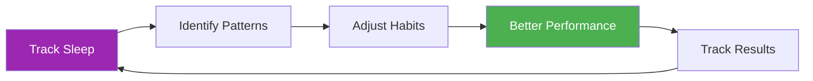

# Sleep Tracker Template

> "The player who slept better often wins."

Track your sleep patterns and correlate them with performance to optimize recovery.

::: tip Why Track Sleep?
**Sleep is the #1 recovery tool.** Elite athletes who track sleep consistently report better energy, faster reaction times, and improved decision-making under pressure.
:::

---

## Quick Daily Entry

### Copy This for Each Day

---

**Date:** ________

**Bedtime:** ________ | **Wake time:** ________
**Total sleep:** ________ hours

**Sleep Quality (1-10):** _____

**Factors affecting sleep:**
- [ ] Caffeine after 2pm
- [ ] Alcohol
- [ ] Screen time before bed
- [ ] Stress/worry
- [ ] Noise/light disturbance
- [ ] Temperature issues
- [ ] Late meal
- [ ] Other: ________

**Morning energy (1-10):** _____

**Notes:**

---

## Weekly Sleep Summary

### Copy This Each Week

---

**Week of:** ________

| Day | Bedtime | Wake | Hours | Quality | Energy | Notes |
|-----|---------|------|-------|---------|--------|-------|
| Mon | | | | /10 | /10 | |
| Tue | | | | /10 | /10 | |
| Wed | | | | /10 | /10 | |
| Thu | | | | /10 | /10 | |
| Fri | | | | /10 | /10 | |
| Sat | | | | /10 | /10 | |
| Sun | | | | /10 | /10 | |

**Weekly Average:** _____ hours | Quality: _____/10 | Energy: _____/10

**Best night:** ________ Why? ________

**Worst night:** ________ Why? ________

**Pattern noticed:**

---

## Pre-Competition Sleep Protocol

### 3 Days Before Competition

| Night | Target Bedtime | Actual | Hours | Quality | Notes |
|-------|----------------|--------|-------|---------|-------|
| -3 days | | | | | |
| -2 days | | | | | |
| -1 day | | | | | |

**Competition day energy (1-10):** _____

**Performance correlation:**
- Did sleep affect my play? Yes / No / Maybe
- How?

---

## Sleep Environment Checklist

Rate your sleep environment:

| Factor | Score (1-10) | Improvement needed? |
|--------|--------------|---------------------|
| **Darkness** | | |
| **Temperature** (16-19°C ideal) | | |
| **Noise level** | | |
| **Mattress comfort** | | |
| **Pillow support** | | |
| **Air quality** | | |
| **Phone out of room** | | |

---

## Sleep Hygiene Habits

Track which habits you're following:

### Evening Routine (2 hours before bed)

- [ ] No caffeine after 2pm
- [ ] No alcohol (or limit to 1 drink, 3+ hours before bed)
- [ ] Light dinner, not too late
- [ ] Dim lights in home
- [ ] No intense exercise
- [ ] Screen curfew (1 hour before bed)
- [ ] Relaxation activity (reading, stretching, breathing)

### Bedroom Rules

- [ ] Room temperature 16-19°C
- [ ] Complete darkness (or sleep mask)
- [ ] Phone on silent, face down (or out of room)
- [ ] Consistent bedtime (±30 min)
- [ ] Bed only for sleep (not work/scrolling)

**Habits followed this week:** _____/12

---

## Sleep & Performance Correlation

Track over 4 weeks to see patterns:

| Week | Avg Sleep | Avg Quality | Training Performance | Competition Result |
|------|-----------|-------------|---------------------|-------------------|
| 1 | hrs | /10 | /10 | |
| 2 | hrs | /10 | /10 | |
| 3 | hrs | /10 | /10 | |
| 4 | hrs | /10 | /10 | |

**Correlation discovered:**

---

## Travel Sleep Protocol

For away competitions:

**Before travel:**
- [ ] Adjust bedtime 30 min earlier/later for time zone
- [ ] Pack sleep essentials (mask, earplugs, pillow)
- [ ] Book quiet room (away from elevator/street)

**At destination:**
- [ ] Set room temperature immediately
- [ ] Block light sources
- [ ] Maintain home bedtime routine
- [ ] Avoid naps >20 min after travel

**Notes for next trip:**

---

---

## Quick Win: Start Tonight

::: info The 3-Day Challenge
Track your sleep for just 3 days. You'll likely discover a pattern you didn't know existed.
:::

1. **Tonight** — Note your bedtime and any factors
2. **Tomorrow morning** — Rate quality and energy immediately
3. **Repeat for 3 days** — Look for patterns

---

## Related Resources

- [Sleep & Recovery Education](/de/education/sleep/) — The science behind sleep
- [Competition Checklist](/de/guides/templates/pre-competition-checklist) — Full preparation guide
- [Training Diary](/de/guides/templates/diary-template) — Track all aspects of training

