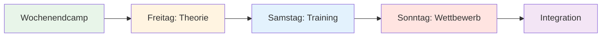
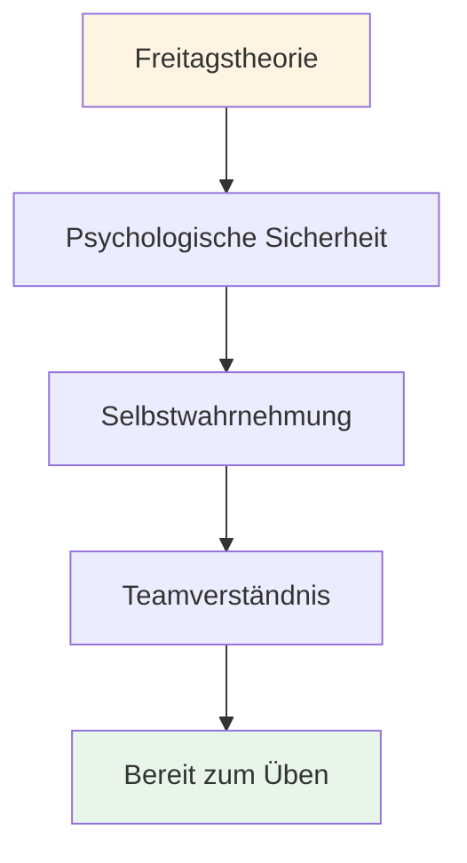

# Trainingslager: Intensives Mentaltraining am Wochenende

## Überblick

Ein umfassendes Wochenend-Trainingslager (Freitag bis Sonntag) für 10–20 Spieler, das mentale Spieltheorie, Training auf der Piste und Wettkampfpraxis kombiniert. Dieses intensive Format ermöglicht transformatives Lernen durch die Integration aller drei Elemente.

::: tip Dieser Leitfaden enthält zwei Abschnitte.
- **[Für Teilnehmer](#for-participants)** – Was die Spieler am Wochenende erwartet
- **[Für Organisatoren](#for-organizers)** – Wie man das Trainingslager plant und durchführt
:::

::: tip Die Philosophie des Trainingslagers
Theorie ohne Praxis ist bloß Information. Praxis ohne Theorie ist bloß Wiederholung. Wettbewerb ohne Reflexion ist bloßes Spielen. Dieses Wochenende vereint alle drei Aspekte für ein transformatives Lernerlebnis.
:::

## Schnellzugriff

| Abschnitt | Zweck | Zugang |
|---------|---------|--------|
| **Für Teilnehmer** | Wochenendprogramm und was Sie mitbringen sollten | [Abschnitt anzeigen](#for-participants) |
| **Für Organisatoren** | Vollständiger Planungs- und Moderationsleitfaden | [Abschnitt anzeigen](#for-organizers) |
| **Tagesablauf** | Detaillierter Zeitplan und Aktivitäten | [Freitag](#freitagabend-mentales-spiel-fundamentaltraining-3-4-stunden) • [Samstag](#samstag-praxis-anwendung-ganztags) • [Sonntag](#sonntag-wettbewerbsintegration-ganztags) |
| **Verwandte Leitfäden** | Andere Trainingsformate | [Mentale Reise](/de/guides/mental-journey/) • [Workshop](/de/guides/workshop/) |

---

## Für Teilnehmer

### Was Sie erwartet

Dieses intensive Wochenende wird dich mental, physisch und emotional fordern. Du lernst mentale Spielstrategien kennen, übst sie auf der Piste und wendest sie im Wettkampf an – und knüpfst dabei enge Kontakte zu anderen Spielern.

**Wochenendstruktur:**

### Tagesübersicht

#### Freitagabend: Grundlagen der mentalen Stärke (3-4 Stunden)
**Was:** Theorieeinheit zu mentalen Spielkonzepten
**Ort:** Besprechungsraum (Innenbereich)
**Format:** Gesprächsrunde und Übungen

**Sie werden lernen:**
- Die Zone und die Strömungszustände
- Innerer Kritiker vs. Innerer Coach
- Druckreaktionsmuster
- Grundlagen der Vorbereitungsroutine

**Aktivitäten:**
- Einchecken und Hausordnung
- Der Eisberg des Boule
- Erstellung eines Benutzerhandbuchs
- Angst im Hut-Übung

#### Samstag: Übung &amp; Anwendung (Ganztägig)
**Vormittag (3 Stunden):** Strukturiertes Üben mit mentaler Fokussierung
**Nachmittag (3 Stunden):** Drucksimulationsübungen
**Abend (2 Stunden):** Reflexion und Integration

**Sie werden üben:**
- Vorwurfroutinen bei realen Würfen
- Techniken nach Fehlern zurücksetzen
- Fokusanker unter Druck
- Teamkommunikationsprotokolle

**Format:**
- Übungen in Kleingruppen (3-4 Spieler)
- Videoanalyse mentaler Muster
- Druckszenarien
- Abendliche Nachbesprechung

#### Sonntag: Wettbewerb &amp; Integration (Ganztägig)
**Vormittag (3 Stunden):** Turnierbetrieb
**Nachmittag (2 Stunden):** Finalrunden
**Abend (1 Stunde):** Abschließende Reflexion

**Sie bewerben sich:**
- Alle mentalen Hilfsmittel im Wettbewerb
- Teamprotokolle unter Druck
- Fehlerkorrektur in Echtzeit
- Nachspielreflexionsprozess

### Was Sie mitbringen sollten

**Erforderlich:**
- Ihre Boulekugeln und Ausrüstung
- Bequeme Kleidung für jedes Wetter
- Notizbuch und Stift
- Offenheit und Bereitschaft zum Teilen
- Wasserflasche

**Optional:**
- Trainingstagebuch
- Fragen zu spezifischen mentalen Herausforderungen
- Beispiele für Drucksituationen, denen Sie begegnen

**Nicht erforderlich:**
- Technische Coaching-Anfragen (hier liegt der Fokus auf dem mentalen Spiel)
- Ego oder das Bedürfnis, sich zu beweisen
- Urteil über andere

### Grundregeln für das Wochenende

::: tip Der Container
Alle Teilnehmer stimmen Folgendem zu:
1. **Vertraulichkeit** – Was geteilt wird, bleibt hier.
2. **Respekt** – Die Verletzlichkeit anderer achten.
3. **Teilnahme** – Beteiligen Sie sich vollumfänglich an allen Aktivitäten.
4. **Wachstumsorientiertes Denken** – Unbehagen als Lernprozess begreifen
5. **Unterstützung** – Helfen Sie Ihren Teamkollegen, Konzepte anzuwenden.
:::

### Was Sie mitnehmen werden

**Wissen:**
- Tiefes Verständnis Ihrer mentalen Muster
- Praktische Hilfsmittel für das Druckmanagement
- Teamprotokolle für den Wettbewerb
- Personalisierte Vorbereitungsroutine

**Fähigkeiten:**
- Fähigkeit zum Zugriff auf Flusszustände
- Techniken zur Fehlerbehebung
- Inner Coach-Neuausrichtung
- Fokusanker

**Verbindung:**
- Stärkere Bindungen zu Teamkollegen
- Gemeinsame Sprache für mentale Spiele
- Unterstützungsnetzwerk für kontinuierliches Wachstum

**Materialien:**
- Ausgefüllte Arbeitsblätter und Übungen
- Videoanalyse Ihrer mentalen Muster
- Aktionsplan für die nächsten 30 Tage
- Zugang zu allen Bildungsmodulen

### Typischer Zeitplan

**Freitag:**
- 18:00 Uhr – Ankunft und Check-in
- 19:00 Uhr – Abendessen
- 20:00 - Eröffnungssitzung (Theorie)
- 23:00 Uhr – Freizeit / Ruhezeit

**Samstag:**
- 08:00 Uhr - Frühstück
- 09:00 Uhr - Morgendliches Training
- 12:00 Uhr - Mittagessen
- 13:30 Uhr – Nachmittagstraining
- 17:00 Uhr – Pause
- 18:00 Uhr – Abendessen
- 19:30 Uhr – Abendliche Reflexionsrunde
- 21:00 Uhr – Freizeit / Ruhezeit

**Sonntag:**
- 08:00 Uhr - Frühstück
- 09:00 Uhr – Turnierbeginn
- 12:00 Uhr - Mittagessen
- 13:00 Uhr – Finalrunden
- 15:00 Uhr – Preisverleihung und Ehrungen
- 16:00 Uhr – Abschlussrunde
- 17:00 Uhr – Abfahrt

---

## Für Organisatoren

### Planungsübersicht

Dieser Abschnitt bietet Ihnen alles, was Sie für die Organisation und Durchführung eines erfolgreichen Wochenend-Trainingslagers für 10-20 Spieler benötigen.

### Vorbereitung des Camps (6-8 Wochen vorher)

### Gruppengröße und -struktur

**Optimal:** 10-20 Spieler
- **Kleines Camp (10-12):** Intimerer, intensiverer Austausch
- **Großes Camp (16-20):** Vielfältigere Perspektiven, erfordert Untergruppen

**Teamstruktur:**
- Teilt euch für Training und Wettkampf in Teams von 3-4 Personen auf.
- Verschiedene Könnensstufen und Spielstile mischen
- Die Teams sollten im Laufe des Wochenendes rotieren.

### Personalbedarf

| Rolle | Verantwortlichkeiten | Menge |
|------|------------------|----------|
| **Koordinator für mentale Leistungsfähigkeit** | Theoriesitzungen und Gruppendynamik moderieren | 1 |
| **Technischer Trainer** | Praxis überwachen, Feedback geben | 1-2 |
| **Wettbewerbsleiter** | Turnier organisieren, Logistik managen | 1 |
| **Unterstützungspersonal** | Mahlzeiten, Aufbau, Verwaltung | 1-2 |

### Standortanforderungen

::: info Einrichtungsbedarf
**Piste:**
- Mehrere Gelände (mindestens 3-4 Pisten)
- Möglichst unterschiedliche Oberflächen (Kies, Sand, hart)
- Beleuchtung für das Abendspiel

**Innenraum:**
- Platz für 20 Personen im Kreis (Theoriesitzungen)
- Abseits der Piste
- Whiteboard/Projektor
- Bequeme Sitzgelegenheiten

**Unterkunft:**
- Vor Ort oder in unmittelbarer Nähe (fußläufig erreichbar)
- Gemeinsame Zimmer fördern die Bindung.
- Ruhiger Ort zum Nachdenken

**Gastronomie:**
- Ernährungsorientierte Mahlzeiten (siehe [Lebensmittelpyramide](./food))
- Vermeiden Sie Zuckerschocks
- Trinkstationen
:::

### Materialliste

::: details Vollständige Materialliste
**Theoriesitzungen:**
- [ ] Stühle für einen Kreis (keine Tische)
- [ ] Boule und Cochonnet für die Mitte
- [ ] Flipcharts und Marker
- [ ] Haftnotizen
- [ ] Arbeitsblätter (Benutzerhandbuch, Innerer Kritiker usw.)
- [ ] Papier und Stifte
- [ ] Projektor (für Website-Inhalte)

**Übungseinheiten:**
- [ ] Maßband
- [ ] Kegel/Markierungen für Bohrer
- [ ] Videokamera/Stativ
- [ ] Klemmbrett und Papier (zur Nachverfolgung)
- [ ] Pfeife

**Wettbewerb:**
- [ ] Spielbögen
- [ ] Turnierbaum
- [ ] Preise/Anerkennung
- [ ] Erste-Hilfe-Set

**Logistik:**
- [ ] Namensschilder
- [ ] Teilnehmerliste mit Kontaktdaten
- [ ] Notfallkontaktinformationen
- [ ] Wasserflaschen
- [ ] Sonnenschutzmittel
- [ ] Taschentücher (für emotionale Arbeit!)
:::

## Wochenendprogramm

### Freitagabend (3 Stunden)

**18:00-18:30 - Ankunft &amp; Begrüßung**
- Einchecken
- Zimmerbelegung
- Wochenendübersicht

**18:30-19:30 - Abendessen**
- Ernährungsorientierte Mahlzeit
- Informelle Vorstellungen

**19:30-22:30 - Theorieeinheit: Grundlagen**

Nutzen Sie den [Workshop-Leitfaden](./workshop) für eine detaillierte Anleitung:

1. **Grundregeln (15 Min.)** – Psychologische Sicherheit schaffen
2. **Check-in-Matrix (20 Min.)** – Gruppenenergie einschätzen
3. **Der Eisberg (30 Min.)** – Innere Gedanken erforschen
4. **Benutzerhandbuch (45 Min.)** – Teamverständnis aufbauen
5. **Angst mit Hut (45 Min.)** – Durchbrechen der Isolation
6. **Auschecken (15 Min.)** – Kreislauf schließen

**22:30 - Freizeit**
- Informelles geselliges Beisammensein
- Ruhe und Besinnung

### Samstag (Ganztägig – Theorie + Praxis)

**08:00-09:00 - Frühstück &amp; Achtsamkeit**
- Ruhiges Frühstück
- Optionale 15-minütige geführte Meditation
- Setze dir Ziele für den Tag

**09:00-10:30 Uhr – Theorieeinheit: Inhalte und Erfahrungen verknüpfen**

Wählen Sie 3-4 Themen von der Website der Akademie und erkunden Sie das innere Spiel:

**Beispielthemen:**

1. **[Ernährung](./education/nutrition/)** (20 Min.)
   - „Wie verändert sich Ihre Essenswahl unter Druck?“
   - „Isst du, was dein Körper braucht oder was deine Angst will?“
   - Übung: Ernährungsplan für den Wettkampftag

2. **[Mentale Stärke](./education/mental-game/mental-strength/)** (25 Min.)
   - „Wie stehst du zum Scheitern?“
   - „Wie redet man mit sich selbst, nachdem man einen Fehlschuss kassiert hat?“
   - Aktivität: Den inneren Kritiker in einen inneren Coach umwandeln

3. **[Achtsamkeit](./education/mental-game/mindfulness/)** (25 Min.)
   - „Wohin gehen Ihre Gedanken während der Pause vor dem Wurf?“
   - „Was reißt dich aus dem gegenwärtigen Moment?“
   - Übung: 5-minütiger Körperscan

4. **[Taktiken](./education/technique/tactics/)** (20 Min.)
   - „Basiert Ihre Schusswahl auf Strategie oder Angst?“
   - &quot;Wann sollte man auf Nummer sicher gehen und wann Risiken eingehen?&quot;
   - Diskussion: Risikoprofile in der Gruppe

**10:30-10:45 - Pause**

**10:45-12:30 - Integration auf der Piste: Übungen mit mentaler Konzentration**

**Übung 1: Den Schuss ansagen (30 Min.)**

Aus dem [Workshop-Leitfaden](./workshop) – Üben Sie, Ihre Absicht und Ihren Zweifel zu übernehmen:

1. Das Ziel ankündigen: „Ich schieße auf das Eisen.“
2. Selbsteinschätzung: „Ich würde mein Selbstvertrauen mit 7 von 10 Punkten bewerten.“
3. Benennen Sie den inneren Gedanken: „Meine innere Stimme macht sich Sorgen wegen des Rückwärtsdralls.“
4. Führe den Schuss aus
5. Reflektiere: „Was ist passiert? Was hast du daraus gelernt?“

**Übung 2: Kognitive Interferenz (30 Min.)**

Testen Sie, ob die Technik automatisiert ist:
- Der Koordinator stellt komplexe Fragen, während der Spieler schießt.
- &quot;Nenne 5 Hauptstädte&quot; oder &quot;Zähle von 100 in 7er-Schritten rückwärts&quot;
- Erfolg = Die Technik ist implizit, sie wird nicht bewusst verarbeitet.

**Übung 3: Praxis mit der Bedienungsanleitung (30 Min.)**

Die Benutzerhandbücher ab Freitag anwenden:
- Spielt in Dreierteams.
- Nach jedem Schuss reagieren die Teammitglieder gemäß der Bedienungsanleitung.
- „Marc braucht nach einem Fehlwurf Ruhe“ – das Team respektiert das.
- Nachbesprechung: „Wie hat es sich angefühlt, verstanden zu werden?“

**12:30-14:00 Uhr - Mittagessen &amp; Pause**
- Ernährungsorientierte Mahlzeit
- Zeit der Stille zum Nachdenken
- Optional: Individuelle Check-ins mit dem Koordinator

**14:00-17:00 Uhr - Übungseinheit: Geländeanpassung**

**Ziel:** Anpassungsfähigkeit und mentale Flexibilität aufbauen

**Aufstellen:**
- Rotieren Sie durch 3-4 verschiedene Gelände/Pisten
- 45 Minuten pro Geländeabschnitt
- Fokus auf mentale Anpassung, nicht nur auf technische.

**Rotationsstruktur:**

| Terrain | Mentale Konzentration | Üben |
|---------|--------------|----------|
| **Gelände 1: Weich/Sand** | Akzeptanz von Unsicherheit | „Die Geberin – akzeptiere, was ist.“ |
| **Gelände 2: Hart/Schotter** | Präzision unter Druck | &quot;Vertraue deiner Technik&quot; |
| **Gelände 3: Uneben** | Emotionsregulation | &quot;Bleib ruhig, wenn es unfair ist.&quot; |
| **Gelände 4: Wettbewerb** | Zugriff auf den Flussstatus | &quot;Finde die Zone&quot; |

**Moderation:**
- Der technische Trainer gibt Feedback zur Technik
- MPC fragt: „Was geht Ihnen gerade durch den Kopf?“
- Spielertagebuch zwischen den Rotationen

**17:00-18:00 Uhr - Pause &amp; Reflexion**
- Individuelles Tagebuch
- „Was hast du heute über dich selbst gelernt?“
- „Was ist eine Sache, die du morgen anders machen wirst?“

**18:00-19:00 Uhr - Abendessen**

**19:00-21:00 Uhr - Abendtheorie: Tiefe Verletzlichkeit**

**Aktivität 1: Den inneren Kritiker neu definieren (45 Min.)**

Das vollständige Protokoll finden Sie im [Workshop-Leitfaden](./workshop):
1. Identifizieren Sie die genaue Kritikerphrase
2. Umdeutung als innerer Coach
3. Partnerpraxis

**Aktivität 2: Wettkampfvorbereitung (45 Min.)**

Morgen ist Wettkampftag. Bereite dich mental vor:

1. **Visualisierung (15 Min.)**
   - Augen schließen
   - Stell dir die perfekte Aufnahme vor
   - Spüre das Selbstvertrauen
   - Beachten Sie die Ruhe

2. **Teamprotokolle (20 Min.)**
   - Signale zur Unterstützung schaffen
   - &quot;Ich brauche einen Reset&quot; = Touch-Boules
   - „Ich brauche etwas Ermutigung“ = Faustgruß
   - „Ich brauche Abstand“ = Schritt zurücktreten

3. **Ziele setzen (10 Min.)**
   - „Morgen werde ich mich auf … konzentrieren.“
   - „Mein Ziel ist nicht zu gewinnen, sondern…“
   - &quot;Ich werde üben...&quot;

**Auschecken (30 Min.)**
- Teile eine deiner Ängste bezüglich morgen.
- Eine gemeinsame Absicht teilen
- Gruppenunterstützung

**21:00 Uhr - Freizeit**
- Früh ins Bett (morgen Wettkampf!)
- Stille Betrachtung

### Sonntag (Wettkampftag)

**08:00-09:00 - Frühstück &amp; Mentale Vorbereitung**
- Leichtes Frühstück (siehe [Ernährungsleitfaden](./education/nutrition/))
- 15-minütige Achtsamkeitsübung
- Teambesprechungen

**09:00-09:30 - Wettbewerbsbesprechung**

**Format:** Rundenturnier
- Teams von 3
- Spiel bis 13 Punkte
- Jeder spielt gegen jeden
- Konzentriere dich auf den PROZESS, nicht auf das Ergebnis.

**Die Besonderheit: Bewertung der mentalen Leistungsfähigkeit**

::: tip Doppeltes Punktesystem
**Traditionell:** Gewonnene Punkte
**Mentale Leistungsfähigkeit:** Bewertet mit dem MPC

Punkte für mentale Leistungsfähigkeit (0-5 pro Spiel):
- Verwendete Werkzeuge aus dem Benutzerhandbuch
- Unterstützte Teammitglieder effektiv
- Den inneren Kritiker im Griff behalten
- Im Hier und Jetzt geblieben (nicht in der Vergangenheit verweilt)
- Psychologische Sicherheit nachgewiesen

**Sieger:** Beste Gesamtpunktzahl (traditionell + mental)
:::

**09:30-13:00 Uhr - Vormittagswettbewerb**
- Rundenspiele
- MPC beobachtet und bewertet
- Der technische Trainer gibt zwischen den Spielen kurzes Feedback.
- Flüssigkeitszufuhr und Snackpausen

**13:00-14:00 Uhr - Mittagessen**
- Ernährungsorientiert
- Informelle Reflexion
- Ausruhen

**14:00-17:00 Uhr - Nachmittagswettbewerb**
- Fortsetzung des Rundensystems
- Halbfinale und Finale
- Zunehmender Druck
- Die Erkenntnisse des Morgens anwenden

**17:00-17:30 - Preisverleihung &amp; Ehrungen**

**Kategorien:**
- Traditioneller Gewinner
- Gewinner der mentalen Leistungsfähigkeit
- Am meisten verbessert
- Bester Teamkollege
- Tapferkeitsauszeichnung (für besonders gefährdete Personen)

**17:30-19:00 - Abschließende Reflexionsrunde**

**Entscheidend:** Hier wird das Gelernte gefestigt.

**Struktur:**

**1. Individuelle Reflexion (15 Min.)**
Ins Tagebuch schreiben:
- Was hast du dieses Wochenende über dich selbst gelernt?
- Was hat Sie überrascht?
- Was werden Sie anders machen?
- Was nimmst du mit nach Hause?

**2. Austausch in Kleingruppen (30 Min.)**
Gruppen von 4-5 Personen:
- Wichtige Erkenntnisse teilen
- Was hat am meisten Anklang gefunden?
- Was war am schwierigsten?
- Was war am wertvollsten?

**3. Vollständige Gruppenintegration (30 Min.)**
Kreis bilden:
- Jeder teilt EINE zentrale Erkenntnis mit.
- MPC validiert und verbindet Themen
- Diskutieren Sie: „Wie werden Sie dies anwenden?“

**4. Verpflichtungen (15 Min.)**
- Jede Person gibt eine Verpflichtung ab.
- „Bei meinem nächsten Wettkampf werde ich…“
- Gruppenzeugen und Unterstützer

**5. Abschluss (15 Min.)**
- Wir danken den Teilnehmern für ihren Mut.
- Erinnern Sie an die Vertraulichkeit
- Tausche Kontakte aus
- Nachbereitung planen (optionale Online-Sitzung)

**19:00 Uhr - Abendessen &amp; Abreise**

## Moderationstipps

### Ausgewogenheit zwischen Theorie und Praxis

::: warning Überlastungstheorie
**Der Fehler:** Zu viel Gerede, zu wenig Taten

**Die Bilanz:**
- Theorie schafft Bewusstsein
- Übung macht den Meister
- Integration von Wettbewerbstests
- Reflexion festigt das Lernen

**Faustregel:** 30 % Theorie, 40 % Praxis, 20 % Wettbewerb, 10 % Reflexion
:::

### Gruppendynamik managen

**Der wettbewerbsfähige Alpha:**
- Will um jeden Preis gewinnen
- Widersteht der Anfälligkeit
- **Strategie:** Wettbewerbsorientierung in die Bewertung der mentalen Leistungsfähigkeit kanalisieren

**Der stille Beobachter:**
- Nimmt alles in sich auf, teilt aber nichts.
- **Strategie:** Niedrigriskante Einstiegsmöglichkeiten schaffen, Beobachtung als Teilnahme anerkennen

**Der Skeptiker:**
- &quot;Dieses ganze Gefühlsduselei funktioniert nicht.&quot;
- **Strategie:** Verbales Aikido – Ausrichten und Drehen (siehe [Workshop-Leitfaden](./workshop))

**Der/Die Überteiler/in:**
- Beherrscht die Diskussion
- **Strategie:** „Vielen Dank, hören wir nun die Meinungen anderer.“

### Umgang mit emotionalen Momenten

**Jemand weint während Fear in a Hat:**
- ✅ Normalisieren: „Tränen sind ein Zeichen von Mut, nicht von Schwäche“
- ✅ Bieten Sie Taschentücher an, aber hetzen Sie nicht.
- ✅ Fragen Sie: „Was brauchen Sie jetzt?“
- ❌ Nicht: „Es ist okay, weine nicht“

**Konflikt zwischen Spielern:**
- ✅ Pause und Ansprache
- ✅ &quot;Was passiert gerade?&quot;
- ✅ Als Lernmoment nutzen
- ❌ Nicht tun: Ignorieren oder verharmlosen

**Jemand schaltet ab:**
- ✅ Checken Sie während der Pause privat ein.
- ✅ „Mir ist aufgefallen, dass du still geworden bist. Was ist los?“
- ✅ Bieten Sie Optionen an: auf andere Weise teilnehmen, eine Pause einlegen
- ❌ Nicht tun: Öffentlich anprangern

## Nachbereitung des Camps

### Sofort (24-48 Stunden)

**An alle Teilnehmer senden:**
- Dankesnachricht
- Zusammenfassung der wichtigsten Erkenntnisse
- Fotos vom Wochenende
- Kontaktliste (mit Genehmigung)
- Link zu Ressourcen auf der Website

**Individuelle Check-ins:**
- Schreibe jedem, der viel geteilt hat
- Wie freust du dich auf das Wochenende?
- Beheben Sie alle Nachwirkungen von Sicherheitslücken.

### Kurzfristig (2 Wochen)

**Optionale Online-Sitzung (60-90 Min.):**
- Wie haben Sie die gewonnenen Erkenntnisse angewendet?
- Was funktioniert? Wo gibt es Schwierigkeiten?
- Unterstützung durch Gleichaltrige und Problemlösung
- Verpflichtungen bekräftigen

### Langfristig (1-3 Monate)

**Teilnehmer der Umfrage:**
- Was ist in deinem Spiel anders?
- Welche Werkzeuge verwenden Sie noch?
- Was könnte das nächste Camp verbessern?
- Würden Sie es weiterempfehlen?

**Auswirkungen auf die Strecke:**
- Wettbewerbsergebnisse
- Selbstberichtetes Selbstvertrauen
- Teamdynamik
- Fortgesetztes Engagement

## Anpassung an unterschiedliche Gruppengrößen

### Kleines Camp (10-12 Spieler)

**Vorteile:**
- Vertiefter Austausch
- Mehr individuelle Aufmerksamkeit
- Stärkere Bindungen

**Anpassungen:**
- Eine Gruppe für alle Theorien
- Mehr Zeit pro Person für Aktivitäten
- Intimes Wettkampfformat

### Großes Camp (16-20 Spieler)

**Vorteile:**
- Unterschiedliche Perspektiven
- Mehr Wettbewerbsvielfalt
- Skaleneffekte

**Anpassungen:**
- Für einige Theorieeinheiten in 2 Gruppen aufgeteilt.
- 2 MPC/Moderatoren werden benötigt
- Größerer Turnierbaum
- Strukturiertere Rotationen

## Budgetüberlegungen

### Einnahmen

| Artikel | Preis pro Person | 20 Personen | 10 Personen |
|------|------------------|-----------|-----------|
| **Anmeldung** | 150-250 € | 3.000–5.000 € | 1.500–2.500 € |

### Kosten

| Kategorie | Kosten | Anmerkungen |
|----------|------|-------|
| **Objektvermietung** | 500–1.000 € | Wochenendtarif |
| **Unterkunft** | 40–60 €/Person/Nacht | Mehrbettzimmer |
| **Mahlzeiten** | 30-40 €/Person/Tag | 6 Mahlzeiten |
| **Personal** | 500–1.000 € | MPC + Trainer |
| **Materialien** | 100-200 € | Arbeitsblätter, Materialien |
| **Preise** | 100-200 € | Anerkennungsartikel |

**Gesamtpreis pro Person:** 120-180 €
**Marge:** 30-70 €/Person (oder Kostendeckung für Gemeinschaftsprojekte)

## Erfolgskennzahlen

### Sofortige Indikatoren

- [ ] Psychologische Sicherheit (1-10 Durchschnitt &gt;7)
- [ ] Beteiligungsquote (&gt;80 % aktives Teilen)
- [ ] Abschlussquote (&gt;90 % bleiben das gesamte Wochenende)
- [ ] Zufriedenheitswert (1-10, Durchschnitt &gt;8)

### Langfristige Indikatoren

- [ ] Verhaltensänderung (Einsatz von Instrumenten im Wettbewerb)
- [ ] Leistungsverbesserung (Selbstauskunft)
- [ ] Gemeinschaftsbildung (in Kontakt bleiben)
- [ ] Weiterempfehlungen (Empfehlungen an andere)

## Häufige Fehler, die es zu vermeiden gilt

::: danger Fallstricke
**1. Zu viel Inhalt**
- Ich versuche, alles abzudecken.
- **Korrektur:** Fokus auf Tiefe, nicht auf Breite

**2. Reflexion überspringen**
- Eile zur nächsten Aktivität
- **Behebung:** Verarbeitungszeit einbauen

**3. Widerstand ignorieren**
- Skepsis überwinden
- **Lösung:** Sprechen Sie es direkt mit verbalem Aikido an.

**4. Technisches Coaching während der Theorie**
- Mischrollen
- **Behebung:** Klare Abgrenzung zwischen MPC und technischem Coach

**5. Keine Nachverfolgung**
- Das Wochenende ist vorbei, der Unterricht endet.
- **Lösung:** Nachbereitungstermine für das Camp planen
:::

## Ressourcen

### Diese Website

- [Workshop-Leitfaden](./workshop) - Ausführliche Moderationsprotokolle
- [Leitfaden für die Trainingssitzung](./training-session) - Für fortlaufendes Üben
- [Ernährung](./education/nutrition/) - Wettkampftagsprotokolle
- Mentale Stärke – Konzepte des inneren Spiels
- Achtsamkeit – Präsenztechniken
- [Taktiken](./education/technique/tactics/) - Strategisches Denken

### Leseempfehlungen

- *Das innere Spiel des Tennis* von Timothy Gallwey
- *Mindset* von Carol Dweck
- *Die furchtlose Organisation* von Amy Edmondson

