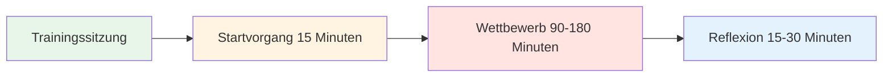

# Trainingseinheit: Leitfaden für die Wettkampfpraxis


## Wie 4 Spieler regelmäßig zusammen trainieren können

Dieser Leitfaden zeigt, wie man eine regelmäßige Trainingsgruppe von 4 Spielern bildet, die 2–4 Stunden lang auf verschiedenen Untergründen und in unterschiedlichen Umgebungen gegeneinander antritt. So wird ein realistischer Wettkampf simuliert und gleichzeitig psychologische Sicherheit sowie mentale Leistungsfähigkeit gestärkt.

::: tip Die Philosophie der Trainingssitzung
**Wettkampf ohne Reflexion ist bloßes Spielen. Training ohne Wettkampf ist bloßes Üben.** Dieses Format vereint beides: vollen Einsatz zeigen und anschließend tiefgründig reflektieren.
:::

## Schnellzugriff

| Abschnitt | Zweck | Zugang |
|---------|---------|--------|
| **Finde deine Gruppe** | Wie man die richtigen 4 Spieler rekrutiert | [Abschnitt anzeigen](#finding-your-group) |
| **Sitzungsstruktur** | 2-Stunden- und 4-Stunden-Formate | [Abschnitt anzeigen](#session-structure) |
| **Startprotokoll** | Wie man jede Sitzung beginnt | [Abschnitt anzeigen](#startup-protocol-15-min) |
| **Reflexionsleitfaden** | Nachbesprechungsprozess nach der Sitzung | [Abschnitt anzeigen](#reflection-protocol-15-30-min) |
| **Verwandte Leitfäden** | Andere Trainingsformate | [Mentale Reise](/en/guides/mental-journey/) • [Workshop](/en/guides/workshop/) • [Trainingslager](/en/guides/training-camp/) |



## Warum 4 Spieler?

**Die perfekte Zahl:**
- **2v2-Format** – Spiegelt den echten Wettkampf wider.
- **Rotationsoptionen** - Partner wechseln, Einzelspiele
- **Lernen unter Gleichaltrigen** – Unterschiedliche Spielstile
- **Verantwortlichkeit** – Bei 3 Personen ist eine Stornierung schwierig
- **Intimität** – Klein genug für tiefgründige Gespräche

::: info Die Gruppendynamik
Mit vier Spielern entsteht die ideale Balance zwischen Wettbewerbsintensität und psychologischer Sicherheit. Man kämpft hart, unterstützt sich aber auch gegenseitig in seiner Entwicklung.
:::

## Finde deine Gruppe

### Ideale Gruppenzusammensetzung

**Schwierigkeitsgrad:**
- Ähnliches Niveau (innerhalb von 1-2 Stufen)
- Alle sind dem Ziel der Verbesserung verpflichtet.
- Mischung aus Zeige- und Schützen
- Unterschiedliche Spielstile

**Denkweise:**
- Angreifbar
- Bereit zur Reflexion
- Wettbewerbsorientiert, aber unterstützend
- Wachstumsorientiert

**Logistik:**
- Wohnen Sie innerhalb von 30 Minuten voneinander entfernt
- Kann sich an einen regelmäßigen Zeitplan halten
- Ähnliche Verfügbarkeit

### Rekrutierung Ihrer Gruppe

**Wo man Spieler findet:**
- Die Elitespieler Ihres Vereins
- Stammgäste des Regionalturniers
- Online-Pétanque-Communities
- Bitten Sie Ihren Trainer um Empfehlungen.

**Die Einladung:**
> „Ich stelle eine kleine Trainingsgruppe mit 4 Spielern zusammen, die regelmäßig Wettkämpfe bestreiten und an ihrer mentalen Stärke arbeiten wollen. Wir würden uns wöchentlich für 2-3 Stunden treffen, intensiv spielen und anschließend das Gelernte reflektieren. Interesse?“

## Sitzungsstruktur

### 2-stündige Sitzung

| Zeit | Aktivität | Dauer |
|------|----------|----------|
| **Start-up** | Einchecken &amp; Einrichten | 15 Minuten |
| **Wettbewerb** | 2-gegen-2-Matches | 90 Minuten |
| **Spiegelung** | Nachbesprechung und Lernen | 15 Minuten |

### 3-stündige Sitzung

| Zeit | Aktivität | Dauer |
|------|----------|----------|
| **Start-up** | Einchecken &amp; Einrichten | 15 Minuten |
| **Wettbewerbsrunde 1** | 2-gegen-2-Matches | 60 Minuten |
| **Brechen** | Ruhepause &amp; informelles Gespräch | 15 Minuten |
| **Wettbewerbsrunde 2** | Partnerwechsel | 60 Minuten |
| **Spiegelung** | Tiefgehende Nachbesprechung | 30 Minuten |

### 4-stündige Sitzung

| Zeit | Aktivität | Dauer |
|------|----------|----------|
| **Start-up** | Einchecken &amp; Einrichten | 20 Minuten |
| **Wettbewerbsrunde 1** | 2-gegen-2-Matches | 75 Minuten |
| **Brechen** | Pause &amp; Imbiss | 15 Minuten |
| **Wettbewerbsrunde 2** | Partnerwechsel | 75 Minuten |
| **Brechen** | Ausruhen | 10 Minuten |
| **Wettbewerbsrunde 3** | Einzelspieler oder Herausforderung | 45 Minuten |
| **Spiegelung** | Tiefgehende Nachbesprechung und Planung | 30 Minuten |


## Startprotokoll (15-20 Minuten)

### 1. Physische Einrichtung (5 Min.)

**Wähle das Gelände:**
- Wechseln Sie jede Woche die Oberflächen.
- Unterschiedliche Schwierigkeitsgrade und Bedingungen
- Manchmal wählt man unbequemes Terrain absichtlich.

**Den Raum einrichten:**
- Grenzen deutlich markieren
- Bereiten Sie die Messwerkzeuge vor.
- Wasserstation
- Bei Bedarf Schatten spenden

### 2. Mentaler Check-in (10 Min.)

**Der Check-in-Kreis:**

Stellt euch im Kreis auf (noch keine Boule-Kugeln) und geht im Kreis herum:

**Jede Person teilt Folgendes mit:**
1. **Energieniveau** (1-10): &quot;Ich bin heute bei einer 7.&quot;
2. **Mentale Verfassung**: „Ich bin konzentriert“ oder „Ich bin durch Arbeitsstress abgelenkt“
3. **Vorsatz**: „Heute möchte ich daran arbeiten, nach Fehlschüssen ruhig zu bleiben.“

**Warum das wichtig ist:**
- Fördert das Bewusstsein für den mentalen Zustand
- Erzeugt Empathie in der Gruppe
- Legt den individuellen Fokus für die Sitzung fest
- Normalisiert, dass man an manchen Tagen „nicht so gut drauf“ ist.

**Tipp für den Moderator:** Wechseln Sie jede Woche, wer zuerst dran ist.

### 3. Erinnerung an die Grundregeln (5 Min.)

**In jeder Sitzung kurz daran erinnern:**

::: tip Sitzungsregeln
1. **Voller Einsatz!** – Spiele, um zu gewinnen, ohne Kompromisse!
2. **Förderung des Wachstums** – Gegenseitiges Lernen
3. **Benutzerhandbücher beachten** – Respektieren Sie die individuellen Behandlungswünsche jedes Nutzers.
4. **Bleibt im Moment** – Keine Handys während des Spiels
5. **Seien Sie ehrlich im Reflektieren** – Teilen Sie mit, was wirklich in Ihnen vorgeht.
6. **Vertraulichkeit** – Was hier geteilt wird, bleibt hier.
:::

**Die Balance:**
> „Wir spielen wie in einem Turnier, aber wir unterstützen uns wie Teamkollegen. Hart im Spiel, sanft im Umgang miteinander.“

## Wettbewerbsregeln

### Spielformat

**Standard 2v2:**
- Spiel bis 13 Punkte
- Standard-Pétanque-Regeln
- Führe die Punkte ehrlich.
- Bei Bedarf messen (nicht raten).

**Rotationsoptionen:**

**Woche 1:** A+B vs. C+D
**Woche 2:** A+C vs. B+D
**Woche 3:** A+D vs. B+C
**Woche 4:** Einzel-Rundenturnier

### Schaffung eines wettbewerbsorientierten Umfelds

::: warning Entscheidend: Machen Sie es real
**Dies ist kein lockeres Training.** Behandeln Sie es wie ein Turnier:

✅ **Tun Sie Folgendes:**
- Führen Sie das offizielle Ergebnis.
- Genau messen
- Pfiff wegen Fußfehlern
- Nimm es ernst
- Feiere gelungene Aufnahmen
- Enttäuschung über Fehlschläge zeigen

❌ **Nicht tun:**
- Gewähren Sie eine zweite Chance
- Sei übermäßig lässig
- Schlechte Entscheidungen durchgehen lassen
- Witze ziehen sich durch das ganze Spiel
- Ausreden erfinden
:::

### Der mentale Leistungs-Twist

**Ergebnisliste zweier Tracks:**

1. **Traditionelle Punktewertung** - Gewonnene Punkte
2. **Mentale Leistungsbewertung** – Wie gut Sie Ihr inneres Spiel im Griff hatten

**Kriterien für die mentale Leistungsfähigkeit (Selbstbewertung von 1-5 nach jedem Spiel):**

| Kriterium | 1 (Schlecht) | 3 (Gut) | 5 (Ausgezeichnet) |
|-----------|----------|----------|---------------|
| **Blieb anwesend** | Verweilte bei vergangenen Aufnahmen | Meistens vorhanden | Völlig im Moment |
| **Den inneren Kritiker im Griff** | Harte Selbstgespräche | Erwischt und umgedeutet | Inner Coach verwendet |
| **Emotionsregulation** | Sichtbare Frustration | Blieb größtenteils ruhig | Durchweg ruhig |
| **Unterstützter Partner** | Ignoriert oder beschuldigt | Grundlegende Unterstützung | Gebrauchte Bedienungsanleitung |
| **Fokus** | Zerstreut, unkonzentriert | Hauptsächlich fokussiert | Laserfokussiert |

**Gesamt:** /25 pro Spiel

**Warum das wichtig ist:**
- Verlagert den Fokus vom Ergebnis auf den Prozess
- Fördert das Bewusstsein für mentale Fähigkeiten
- Schafft Verantwortlichkeit für die innere Arbeit
- Würdigt mentale Leistungsfähigkeit, nicht nur den Sieg.

### Veränderung der Umwelt

**Wechsle zwischen verschiedenen Herausforderungen:**

**Woche 1: Heimstrecke**
- Ihre reguläre Piste
- Komfortable Bedingungen
- Fokus: Selbstvertrauen aufbauen

**Woche 2: Schwieriges Gelände**
- Unebene, anspruchsvolle Oberfläche
- Schwerpunkt: Emotionsregulation, Akzeptanz

**Woche 3: Anderer Ort**
- Die Piste eines anderen Vereins
- Schwerpunkt: Anpassungsfähigkeit

**Woche 4: Druckbedingungen**
- Zuschauer (laden andere zum Zuschauen ein)
- Schwerpunkt: Umgang mit externem Druck

**Woche 5: Wetter-Herausforderung**
- Wind, Hitze oder Kälte
- Fokus: Mentale Stärke

**Woche 6: Zeitdruck**
- Wurfuhr (30 Sekunden pro Wurf)
- Schwerpunkt: Entscheidungsfindung unter Druck

```mermaid
graph TD
    A[Umgebung variieren] --> B[Unterschiedliche Oberflächen]
    A --> C[Verschiedene Standorte]
    A --> D[Unterschiedliche Bedingungen]
    A --> E[Unterschiedliche Drücke]

    B --> F[Anpassungsfähigkeit aufbauen]
    C --> F
    D --> F
    E --> F

    style A fill:#e8f5e9
    style F fill:#fff4e1


## Reflection Protocol (15-30 minutes)

**Critical:** This is where the learning happens. Don't skip it!

### Short Reflection (15 min)

**After each game, quick debrief:**

**Go around the circle, each person shares:**

1. **Mental Performance Score** (1-5): "I give myself a 4 today"
2. **One thing that went well mentally**: "I stayed calm after my miss in the 3rd end"
3. **One thing to work on**: "I need to catch my inner critic faster"

**Group discussion:**
- "What did you notice about your inner game today?"
- "When did you feel most in the zone?"
- "When did you lose focus?"

### Deep Reflection (30 min)

**After final game, deeper debrief:**

**Structure:**

**1. Individual Journaling (5 min)**

Write privately:
- What happened in my mind during pressure moments?
- When did I use my Inner Coach vs. Inner Critic?
- How did I support my partner?
- What pattern am I noticing about myself?

**2. Pair Sharing (10 min)**

Partner up, share:
- One insight from journaling
- One question you're sitting with
- One commitment for next session

**3. Group Integration (15 min)**

Full circle:
- Each person shares ONE key learning
- Group identifies themes
- Discuss: "What are we learning as a group?"
- Set focus for next session

**Closing:**
- Thank each other for showing up
- Confirm next session date/time
- One-word check-out: "How are you leaving?"


## User Manual Integration

### Creating Your User Manuals

**In your first session together, each person completes:**

| Section | Prompt | Example |
|---------|--------|---------|
| **My Stress Signature** | "When I'm anxious, I..." | "...go completely quiet" |
| **How to Support Me** | "After a miss, I need..." | "...silence, not encouragement" |
| **My Trigger** | "I get defensive when..." | "...someone questions my shot choice" |
| **My Reset Signal** | "When I need a mental reset, I..." | "...touch my boules and take 3 breaths" |

**Share with the group and keep copies.**

### Using User Manuals During Play

**During competition:**
- Partner knows how to support you
- Teammates respect your needs
- No guessing about what helps

**Example:**
- Marc's User Manual says: "After a miss, I need 30 seconds of silence"
- His partner knows: Don't immediately encourage, give space
- Result: Marc feels understood, recovers faster

**This is psychological safety in action.**

## Advanced Variations

### The Mental Challenge Week

**Once a month, add a mental challenge:**

**Week 1: Silent Game**
- No talking during play
- Only non-verbal communication
- Focus: Internal awareness

**Week 2: Positive Self-Talk Only**
- Catch and reframe every negative thought
- Say Inner Coach phrase out loud
- Focus: Cognitive restructuring

**Week 3: Pressure Simulation**
- Play with spectators
- Announce score loudly
- Focus: External pressure management

**Week 4: Gratitude Game**
- After each end, state one thing you're grateful for
- Focus: Positive mindset

### The Vulnerability Round

**Every 4-6 weeks, dedicate a session to deeper sharing:**

**Format:**
- 30 min: Play one game
- 60 min: Deep reflection using [Workshop](./workshop) activities
- 30 min: Play final game applying insights

**Activities to use:**
- Fear in a Hat
- Reframing Inner Critic
- The Iceberg
- User Manual updates

**Why this matters:**
- Prevents the group from becoming just "playing buddies"
- Maintains psychological safety
- Deepens learning
- Builds authentic connection

## Tracking Progress

### Individual Tracking

**Keep a training journal:**

After each session, record:
- Date, location, conditions
- Partners and opponents
- Traditional score
- Mental performance score (1-5)
- Key insights
- Patterns noticed
- Commitments for next time

**Monthly review:**
- What's improving?
- What patterns keep showing up?
- What's my mental performance trend?
- What do I need to focus on?

### Group Tracking

**Shared document (Google Sheet):**

| Date | Location | Teams | Score | Mental Perf | Key Learning |
|------|----------|-------|-------|-------------|--------------|
| Jan 7 | Club A | A+B vs C+D | 13-11 | 4.2 avg | Staying calm in wind |
| Jan 14 | Club B | A+C vs B+D | 13-8 | 3.8 avg | Managing inner critic |

**Benefits:**
- See progress over time
- Notice group patterns
- Celebrate improvements
- Identify focus areas

## Sustaining the Group

### Commitment Agreement

**At the start, agree on:**

**Frequency:**
- Weekly? Bi-weekly? Monthly?
- Same day/time each week?
- How many sessions committed to? (suggest minimum 8-12)

**Cancellation Policy:**
- 24-hour notice required
- Maximum 2 cancellations per person per quarter
- If someone cancels repeatedly, have a conversation

**Rotation:**
- Who chooses location each week?
- Who facilitates reflection?
- How do we keep it fresh?

### Handling Conflicts

**When tension arises:**

::: warning Address It, Don't Avoid It
**The mistake:** Letting resentment build

**The solution:** Use it as a learning moment

**Script:**
> "I notice some tension. Can we pause and talk about what's happening? This is exactly the kind of moment we can learn from."
:::

**Common conflicts:**
- Disagreement on calls
- Perceived unfairness
- Personality clashes
- Competitive intensity

**Resolution process:**
1. Pause the game
2. Each person shares their perspective
3. Group validates both sides
4. Agree on how to move forward
5. Return to play

**This builds psychological safety.**

### Keeping It Fresh

**Avoid stagnation:**

**Every 8-12 weeks, change something:**
- Invite a 5th player for variety
- Play at a tournament together
- Do a mini training camp (full day)
- Bring in a guest coach
- Try a new format (singles, different scoring)
- Do a deep vulnerability session

**The goal:** Keep learning, keep growing, keep it interesting

## Integration with Tournaments

### Pre-Tournament Prep

**2 weeks before a major tournament:**

**Session focus:**
- Play on similar terrain
- Simulate tournament pressure
- Practice competition-day nutrition
- Rehearse pre-shot routines
- Visualize success

**Mental preparation:**
- What's your intention for the tournament?
- What's your Inner Coach phrase?
- What's your reset signal?
- How will you handle pressure?

### Post-Tournament Debrief

**After a tournament:**

**Dedicate a session to reflection:**

**Structure:**
- 30 min: Share tournament experience
- 30 min: What worked? What didn't?
- 30 min: What did you learn about yourself?
- 30 min: Play a game applying learnings

**Questions:**
- When did you feel most in the zone?
- When did you lose it?
- How did you handle pressure?
- What would you do differently?
- What are you proud of?

**This cements learning and builds resilience.**

## Resources & Tools

### From This Site

- [Workshop Guide](./workshop) - Deep facilitation protocols
- [Training Camp Guide](./training-camp) - Weekend intensive format
- [Nutrition](./education/nutrition/) - Competition-day protocols
- [Mental Strength](./education/mental-game/mental-strength/) - Inner game concepts
- [Mindfulness](./education/mental-game/mindfulness/) - Presence techniques
- [Tactics](./education/technique/tactics/) - Strategic thinking

### Recommended Tools

**Journaling:**
- Physical notebook or digital app
- Prompt: "What happened in my mind today?"

**Video Analysis:**
- Phone camera on tripod
- Review technique and body language
- Notice patterns

**Meditation Apps:**
- Headspace, Calm, Insight Timer
- 5-10 minutes before sessions

**Tracking:**
- Google Sheets for group data
- Personal spreadsheet for trends

## Success Stories

### Example: The Stockholm Four

**Group:** 4 elite players, ages 28-45
**Frequency:** Weekly, 3 hours
**Duration:** 18 months

**Results:**
- All 4 improved tournament rankings
- 2 made national team
- Mental performance scores increased from 3.2 to 4.5 average
- Group still meets 3 years later

**Key factors:**
- Consistent commitment
- Deep vulnerability work
- Honest reflection
- Mutual support

### Example: The Barcelona Crew

**Group:** 4 club players wanting to compete regionally
**Frequency:** Bi-weekly, 2 hours
**Duration:** 6 months

**Results:**
- Confidence increased dramatically
- All 4 entered first regional tournament
- 1 placed in top 8
- Group expanded to 8 players

**Key factors:**
- Started small and built trust
- Focused on mental game
- Celebrated small wins
- Kept it fun

## Common Challenges

### "We just end up playing, not reflecting"

**Solution:**
- Set a timer
- Designate a "reflection keeper"
- Make reflection non-negotiable
- Start with just 10 minutes

### "One person dominates"

**Solution:**
- Use structured sharing (everyone gets 2 minutes)
- Rotate who speaks first
- Gently redirect: "Let's hear from others"

### "It's getting stale"

**Solution:**
- Change locations
- Try new formats
- Do a vulnerability session
- Invite a guest
- Take a break and come back fresh

### "Someone's not committed"

**Solution:**
- Have an honest conversation
- Revisit commitment agreement
- Consider finding a replacement
- It's okay if someone leaves

## Getting Started Checklist

::: details Your First Session Checklist

**Before Session 1:**
- [ ] Find your 4 players
- [ ] Agree on frequency and duration
- [ ] Choose first location
- [ ] Share this guide with everyone
- [ ] Create group chat

**Session 1 Agenda:**
- [ ] Introductions and intentions
- [ ] Agree on ground rules
- [ ] Complete User Manuals
- [ ] Play first game
- [ ] Short reflection
- [ ] Schedule next 4 sessions

**Ongoing:**
- [ ] Rotate locations
- [ ] Track progress
- [ ] Deep reflection every 4-6 weeks
- [ ] Adjust format as needed
- [ ] Celebrate improvements
:::

## Final Thoughts

::: tip The Power of Regular Practice
**Consistency beats intensity.** Four players meeting regularly, competing hard, and reflecting deeply will improve faster than sporadic tournament play alone.

**Why?**
- Regular feedback loop
- Psychological safety to experiment
- Accountability and support
- Deliberate practice on mental game
- Community and connection

**The result:** You don't just get better at pétanque. You become a more complete competitor.
:::


