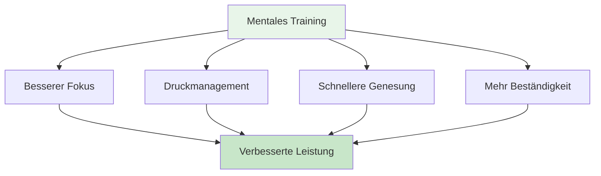

# Mentale Reise für Anfänger

## Willkommen auf deiner Reise zum mentalen Spiel

Egal ob Sie als Spieler Ihr mentales Spiel verbessern möchten oder als Trainer mentales Training in Ihr Team einführen wollen, dieser Leitfaden hilft Ihnen bei den ersten Schritten in die Welt der Sportpsychologie für Pétanque.

::: tip Für wen ist das gedacht?
- **Spieler**, die das mentale Spiel verstehen wollen
- **Trainer** führen mentales Training in ihre Teams ein
- **Vereine**, die Workshops zum mentalen Training organisieren
- **Jeder**, der sich für die Psychologie des Boule-Spiels interessiert
:::

## Schnellzugriff

| Ressource | Zweck | Zugang |
|----------|---------|--------|
| **Erste Schritte** | Einführung in die Konzepte des mentalen Spiels | [Weiterlesen](#warum-mentales-training-wichtig-ist) |
| **Sitzungsleitfaden** | Vollständiger Leitfaden für 2-3-stündige Workshops für Kursleiter | [Anleitung ansehen](/de/mental-journey/session-guide) |
| **Materialien** | Teilnehmerleitfäden, Folien und Arbeitsblätter | [Materialien ansehen](/de/mental-journey/materials) |
| **Verwandte Leitfäden** | Erweiterte Formate | [Workshop](/de/workshop) • [Trainingslager](/de/training-camp) |

## Warum mentales Training wichtig ist

Beim Pétanque beeinflusst die mentale Einstellung die Leistung auf jedem Niveau. Die meisten Spieler konzentrieren sich jedoch zu 90 % auf die Technik und nur zu 10 % auf die mentale Stärke. Dieser Leitfaden hilft Ihnen, dieses Verhältnis ins Gleichgewicht zu bringen.

## Was Sie lernen werden

### Für Spieler

**Kernkonzepte:**
1. **Die Zone** – Flow-Zustände verstehen und wie man sie erreicht
2. **Der innere Kritiker** – Negative Selbstgespräche erkennen und bewältigen
3. **Reaktion auf Druck** – Warum du im Wettkampf anders spielst
4. **Der Schalter** – Vom Denken zum Handeln

**Praktische Fähigkeiten:**
- Einfache Vorbereitungsroutine
- 3-Atemzug-Reset-Technik
- Fehlerkorrekturprotokoll
- Fokusanker für den Wettbewerb

### Für Trainer/Guides

**So moderieren Sie:**
1. Psychologische Sicherheit schaffen
2. Leitung von Gruppendiskussionen
3. Theorie und Praxis verbinden
4. Umgang mit unterschiedlichen Persönlichkeiten

**Sitzungsstruktur:**
- 2-3-stündiges Workshop-Format
- Diskussionsanregungen und Übungen
- Herunterladbare Materialien
- Folgeaktivitäten

## Erste Schritte

### Option 1: Selbststudium (Für Spieler)

**Woche 1: Die Grundlagen verstehen**
1. Lesen Sie das Modul [The Zone](/de/education/the-zone/).
2. Probieren Sie die 3-Atemzug-Reset-Technik.
3. Achten Sie darauf, wann Sie sich im „technischen Modus“ und wann im „Flow-Modus“ befinden.

**Woche 2: Sensibilisierung**
1. Lesen Sie das Modul [Mentale Stärke](/de/education/mental-strength/).
2. Identifiziere deine inneren Kritikermuster
3. Üben Sie neutrale Beobachtung nach Fehlern

**Woche 3: Struktur schaffen**
1. Lesen Sie das Modul [Achtsamkeit](/de/education/mindfulness/).
2. Beginnen Sie mit einer täglichen 5-minütigen Übungsphase.
3. Entwickle eine einfache Vorbereitungsroutine.

**Woche 4: Integration**
1. Setzen Sie Ihre Routine in der Praxis ein.
2. Verfolge deine mentale Leistungsfähigkeit in der [Tagebuchvorlage](/de/diary-template)
3. Setzen Sie sich mentale Spielziele mithilfe der [Zielvorlage](/de/goal-template).

### Option 2: Gruppenworkshop (Für Coaches)

**Führen Sie eine 2-3-stündige Sitzung durch:**

Nutzen Sie unseren umfassenden [Sitzungsleitfaden](/de/mental-journey/session-guide), der Folgendes beinhaltet:
- Vollständige Sitzungsstruktur
- Diskussionsanregungen
- Gruppenübungen
- Herunterladbare Materialien

**Was Sie benötigen:**
- 6-12 Teilnehmer
- Ruhiger Raum mit Sitzgelegenheiten im Kreis
- Whiteboard oder Flipchart
- Leinwand oder Projektor zur Präsentation von Materialien
- 2-3 Stunden ununterbrochene Zeit

## Die drei Säulen des mentalen Trainings

### 1. Bewusstsein
**Was es ist:** Die eigenen Gedanken, Gefühle und Verhaltensmuster wahrnehmen.

**Warum das wichtig ist:** Was man nicht bemerkt, kann man nicht verändern.

**So geht&#39;s:**
- Tägliche Achtsamkeitsübung (5-10 Minuten)
- Rückblick auf das Spiel
- Führen eines Trainingstagebuchs

### 2. Akzeptanz
**Was es ist:** Gedanken und Gefühle ohne Wertung zulassen.

**Warum das wichtig ist:** Der Kampf gegen die eigenen inneren Erfahrungen erzeugt Spannungen.

**So geht&#39;s:**
- Neutrale Beobachtungspraxis
- Arbeit zwischen innerem Coach und innerem Kritiker
- Den Perfektionismus loslassen

### 3. Aktion
**Worum geht es?** Hilfreiche Reaktionen trotz schwieriger Gedanken auswählen

**Warum das wichtig ist:** Mentales Training bedeutet, trotz Nervosität gute Leistungen zu erbringen.

**So geht&#39;s:**
- Vorbereitungsroutinen
- Reset-Protokolle
- Drucksimulation im Training

## Häufig gestellte Fragen

### &quot;Ich bin nicht gut genug, um mir Gedanken über mentales Training zu machen.&quot;
Mentales Training ist auf jedem Niveau hilfreich. Tatsächlich fördert ein früher Beginn die Entwicklung besserer Gewohnheiten. Man muss kein Spitzensportler sein, um von einem besseren Verständnis der eigenen Psyche zu profitieren.

### &quot;Ist das nicht einfach nur &#39;positiv denken&#39;?&quot;
Nein. Mentales Training bedeutet, trotz negativer Gedanken gute Leistungen zu erbringen, nicht, sie zu eliminieren. Es geht um praktische Fähigkeiten, nicht um positives Denken.

### „Wie lange dauert es, bis Ergebnisse sichtbar sind?“
Manche Techniken (wie die 3-Atemzug-Reset-Technik) wirken sofort. Tiefgreifendere Veränderungen (wie ein anhaltender Flow-Zustand) erfordern 2-3 Monate Übung.

### &quot;Brauche ich einen Sportpsychologen?&quot;
Nicht unbedingt. Dieser Leitfaden bietet praktische Hilfsmittel, die Sie sofort anwenden können. Professionelle Hilfe ist bei komplexeren Problemen wertvoll, aber die meisten Spieler können selbstständig beginnen.

### &quot;Wird das meine Technik verbessern?&quot;
Mentales Training ersetzt nicht das technische Training. Aber es hilft Ihnen, Ihre Technik konstant abzurufen, insbesondere unter Druck.

## Verfügbare Ressourcen

### Für Spieler
- [Bildungsmodule](/de/education/) - 8 umfassende Leitfäden
- [Zielvorlage](/de/goal-template) – Strukturieren Sie Ihre Entwicklung
- [Tagebuchvorlage](/de/diary-template) - Verfolge deinen Fortschritt
- [Fallstudien](/de/case-studies) - Beispiele aus der Praxis

### Für Trainer/Guides
- [Sitzungsleitfaden](/de/mental-journey/session-guide) - Kompletter 2-3-stündiger Workshop
- [Moderationsmaterialien](/de/mental-journey/materials) - Digitale Leitfäden &amp; Folien
- [Workshop-Leitfaden](/de/workshop) – Fortgeschrittenes 3-4-Stunden-Format
- [Trainingslager-Leitfaden](/de/training-camp) - Wochenendprogramm

## Nächste Schritte

### Für Einzelspieler
1. **Beginnen Sie mit Bewusstsein** - Lesen Sie [The Zone](/de/education/the-zone/)
2. **Probieren Sie eine Technik aus:** – Nutzen Sie diese Woche die 3-Atemzug-Technik.
3. **Verfolgen Sie Ihre Erfahrungen** – Beobachten Sie die Änderungen
4. **Schrittweise aufbauen** – Jede Woche eine neue Fähigkeit hinzufügen

### Für Trainer/Gruppen
1. **Lesen Sie den Sitzungsleitfaden** – Machen Sie sich mit der Struktur vertraut
2. **Materialien herunterladen** – Handouts und Präsentationsfolien herunterladen
3. **Termin vereinbaren** – 2–3 Stunden einplanen
4. **Bereiten Sie sich vor** – Lesen Sie die Hinweise des Moderators.
5. **Leite den Workshop** – Folge der Anleitung

## Unterstützung

**Haben Sie Fragen zum Einstieg?**
- E-Mail: [patrik.wiik@gmail.com](mailto:patrik.wiik@gmail.com)
- Beispiele finden Sie in den [Fallstudien](/de/case-studies).
- Beteilige dich an Diskussionen in deinem Club.

---

::: tip Bereit zum Start?
**Spieler:** Beginnen Sie mit dem Modul [The Zone](/de/education/the-zone/).

**Coaches:** Gehen Sie zu [Sitzungsleitfaden](/de/mental-journey/session-guide)

**Materialien herunterladen:** Besuchen Sie [Facilitator Materials](/de/mental-journey/materials)
:::

