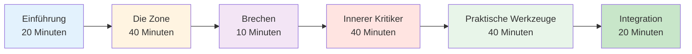

# Sitzungsleitfaden: Einführung in das mentale Spiel (2-3 Stunden)


## Überblick

Dieser Leitfaden hilft Ihnen bei der Durchführung einer 2- bis 3-stündigen Einführung in das Mentaltraining für Pétanque-Spieler. Ideal für Trainer, Vereinsverantwortliche oder erfahrene Spieler, die Mentaltraining in ihr Team integrieren möchten.

::: tip Dieser Leitfaden enthält zwei Abschnitte.
- **[Für Teilnehmer](#for-participants)** – Was die Spieler lernen werden
- **[Für Moderatoren](#for-facilitators)** – So führen Sie die Sitzung durch
:::

## Schnellzugriff

| Abschnitt | Zweck | Zugang |
|---------|---------|--------|
| **Für Teilnehmer** | Was Sie von der Sitzung erwarten können | [Abschnitt anzeigen](#for-participants) |
| **Für Moderatoren** | Vollständiger Sitzungsplan und Zeitplan | [Abschnitt anzeigen](#for-facilitators) |
| **Sitzungsmaterialien** | Leitfäden, Folien und Arbeitsblätter | [Materialien ansehen](/de/mental-journey/materials) |
| **Checkliste zur Vorbereitung** | Was Sie vor der Sitzung vorbereiten sollten | [Checkliste ansehen](#preparation-1-week-before) |

---

## Für Teilnehmer

### Was Sie erwartet

In dieser Session lernen Sie das mentale Spiel Pétanque anhand von Diskussionen, Übungen und praktischen Techniken kennen, die Sie sofort anwenden können.

**Sie werden lernen:**
- Warum mentales Training für die Leistung wichtig ist
- Der Unterschied zwischen „technischem Modus“ und „Flow-Modus“
- Wie Sie Ihren inneren Kritiker erkennen und mit ihm umgehen können
- Einfache Techniken zur Druckbewältigung
- Eine grundlegende Vorbereitungsroutine

**Was Sie benötigen:**
- Offenheit und Bereitschaft zum Teilen
- Notizbuch und Stift
- Ihre eigenen Erfahrungen zum Besprechen
- 2-3 Stunden konzentrierte Zeit

### Sitzungsstruktur



### Wichtige Konzepte, die Sie erkunden werden

#### 1. Die Zone (Strömungszustand)
- Wie es sich anfühlt, wenn alles zusammenpasst
- Warum das Nachdenken über die Technik die Leistung beeinträchtigt
- Der &quot;Wechsel&quot; von der Planung zur Ausführung

#### 2. Der innere Kritiker
- Wie sich negatives Selbstgespräch auf die Leistung auswirkt
- Der Unterschied zwischen innerem Kritiker und innerem Coach
- Neutrale Beobachtung vs. hartes Urteil

#### 3. Druckreaktion
- Warum du im Wettkampf anders spielst
- Körperliche Anzeichen von Druck
- Schnelle Reset-Techniken

#### 4. Praktische Werkzeuge
- 3-Atemzug-Reset
- Einfache Vorbereitungsroutine
- Fehlerkorrekturprotokoll

### Was Sie mitbringen sollten

**Erforderlich:**
- Du selbst und deine Erfahrungen
- Bereitschaft zur Teilnahme

**Optional:**
- Beispiele für mentale Herausforderungen, denen Sie begegnen
- Fragen zu konkreten Situationen
- Notizbuch für persönliche Notizen

### Nach der Sitzung

Sie erhalten:
- Zusammenfassung der wichtigsten Konzepte
- Übungsaufgaben für die Woche
- Links zu detaillierten Schulungsmodulen
- Zielvorlage für die mentale Spielentwicklung


---

## Für Moderatoren

### Vorbereitungs-Checkliste

**1 Woche vorher:**
- [ ] Zimmer für 2-3 Stunden buchen
- [ ] Laden Sie 6-12 Teilnehmer ein
- [ ] Materialseiten als Lesezeichen speichern (siehe [Materialien](/de/mental-journey/materials))
- [ ] Lesen Sie diese Anleitung sorgfältig durch.
- [ ] Bereiten Sie ein Flipchart oder eine Whiteboard-Tafel vor.

**1 Tag zuvor:**
- [ ] Teilnahme bestätigen
- [ ] Raum einrichten (Kreisbestuhlung)
- [ ] Jegliche Technologie (Folien usw.) testen.
- [ ] Materialien vorbereiten

**1 Stunde vorher:**
- [ ] Früh anreisen
- [ ] Die Sitzplätze werden im Kreis angeordnet.
- [ ] Einrichtungsmaterialien
- [ ] Zentriere dich

### Ihre Rolle als Moderator

::: warning Wichtig
Sie sind **kein** Therapeut oder technischer Coach. Sie sind ein **Moderator**, der:
- Leitfäden Diskussion
- Schafft einen sicheren Raum
- Verbindet Konzepte mit Erfahrungen
- Steuert die Gruppendynamik
:::

**Wichtigste Fähigkeiten:**
- Aktives Zuhören
- Neutrale Präsenz
- Umgang mit unterschiedlichen Persönlichkeiten
- Zu wissen, wann man weiterziehen sollte

### Detaillierter Sitzungsplan

---

#### Teil 1: Einführung (20 Minuten)

**Ziele:**
- Psychologische Sicherheit schaffen
- Erwartungen festlegen
- Gruppenverbindung aufbauen

**Skript:**

„Herzlich willkommen! In dieser Session geht es um das mentale Spiel beim Pétanque – die Gedanken, Gefühle und Verhaltensmuster, die Ihre Leistung beeinflussen.“

**Grundregeln:**
1. Was hier geteilt wird, bleibt hier.
2. Keine Wertung der Erfahrungen anderer
3. Die Teilnahme ist freiwillig.
4. Es gibt keine falschen Antworten.

**Kurzrunde:** Name, Spieldauer und eine mentale Herausforderung, der Sie sich stellen müssen.

**Hinweise für den Moderator:**
- Gehen Sie zunächst auf die Modellschwachstellen ein.
- Die Vorstellungsrunden sollten kurz sein (jeweils 1 Minute).
- Gemeinsame Themen erkennen
- Alle Antworten prüfen

---

#### Teil 2: Die Zone / Der Flow-Zustand (40 Minuten)

**Ziele:**
- Strömungszustände verstehen
- Technischen Modus vs. Arbeitsablaufmodus erkennen
- Lerne das &quot;Schalter&quot;-Konzept kennen.

**Einstiegsfrage:**
„Denken Sie an eine Zeit, in der Sie Ihr bestes Boule-Spiel absolviert haben. Wie hat es sich angefühlt? Was war anders?“

**Diskussionsanregungen:**
1. „Wie viele von euch haben schon mal ein Spiel erlebt, bei dem einfach alles perfekt geklappt hat?“
2. Woran haben Sie in diesen Momenten gedacht?
3. &quot;Worin unterscheidet sich das von Situationen, in denen man Schwierigkeiten hat?&quot;

**Wichtigste Lerninhalte:**

Benutze das Whiteboard zum Zeichnen:
```
PLANNING MODE          →    EXECUTION MODE
(Outside circle)            (Inside circle)
- Analyze situation         - Eyes on target
- Choose strategy           - Trust training
- Decide throw type         - Automatic movement
```

**Übung: Der Schalter (10 Minuten)**

„Lasst uns den Wechselmoment üben:
1. Aufstehen
2. Stell dir vor, du befindest dich außerhalb des Kreises – denk an einen Schuss.
3. Atme tief durch
4. Schritt vorwärts (in einen imaginären Kreis)
5. Lass beim Gehen die Analyse los.
6. Konzentriere dich nur auf ein imaginäres Ziel.

**Nachbesprechung:**
- &quot;Was ist Ihnen aufgefallen?&quot;
- „War es leicht oder schwer, das Denken loszulassen?“
- „Wie könnte sich das auf reale Spiele anwenden lassen?“

---

#### Teil 3: Pause (10 Minuten)

**Maßnahmen des Moderators:**
- Fördern Sie informelle Gespräche
- Gruppenenergie beachten
- Bereiten Sie sich auf den nächsten Abschnitt vor

---

#### Teil 4: Der innere Kritiker (40 Minuten)

**Ziele:**
- Negative Selbstgesprächsmuster erkennen
- Unterscheide den inneren Kritiker vom inneren Coach
- Üben Sie eine neutrale Beobachtung

**Öffnung:**
„Wir alle haben eine innere Stimme, die unsere Leistung kommentiert. Manchmal ist sie hilfreich, manchmal harsch. Lasst uns das genauer betrachten.“

**Übung: Inventar des inneren Kritikers (15 Minuten)**

„Schreibe auf dein Blatt Papier:
1. Was deine innere Stimme nach einem missglückten Wurf sagt
2. Was es aussagt, wenn man unter Druck steht
3. Was es über Ihre Fähigkeiten aussagt

*Bitte geben Sie sich 5 Minuten Zeit zum Schreiben.*

„Wer ist nun bereit, ein Beispiel zu nennen?“

**Hinweise für den Moderator:**
- Normalisiere harte Selbstgespräche
- Versuche nicht, jemanden zu &quot;reparieren&quot;.
- Achten Sie auf wiederkehrende Muster

**Unterrichtsmethode: Innerer Kritiker vs. Innerer Coach (15 Minuten)**

Zeichne zwei Spalten auf die Tafel:

| Innerer Kritiker | Inner Coach |
|--------------|-------------|
| &quot;Wie konnte man das übersehen?!&quot; | &quot;Das ging nach links.&quot; |
| &quot;Du versagst immer.&quot; | &quot;Versuchen wir es noch einmal.&quot; |
| &quot;Du bist schrecklich.&quot; | &quot;Was kann ich lernen?&quot; |

**Diskussion:**
- „Fällt Ihnen der Unterschied auf?“
- Welche Stimme hilft bei der Performance?
- „Kannst du die Stimme verändern?“

**Übung: Reframing (10 Minuten)**

„Nehmen Sie eine Ihrer Aussagen des inneren Kritikers. Wie würde ein innerer Coach sie formulieren?“

Nennen Sie Beispiele.

---

#### Teil 5: Praktische Hilfsmittel (40 Minuten)

**Ziele:**
- Lerne die 3-Atemzug-Reset-Technik.
- Erstelle eine einfache Vorbereitungsroutine.
- Fehlerkorrektur verstehen

**Werkzeug 1: 3-Atemzug-Reset (10 Minuten)**

„Das ist Ihr Notfall-Reset-Knopf. Benutzen Sie ihn, wenn Sie merken, dass der Druck steigt.“

**Zeigen:**
1. Atmen Sie 4 Sekunden lang ein.
2. Halten Sie die Taste für 2 Sekunden gedrückt.
3. Atmen Sie 6 Sekunden lang aus.
4. 3 Mal wiederholen

„Lasst uns jetzt zusammen üben.“

*Führe die Gruppe durch 3 Zyklen*

**Nachbesprechung:**
- „Was haben Sie an Ihrem Körper bemerkt?“
- Wann könnte man das verwenden?

**Tool 2: Einfache Vorbereitungsroutine (15 Minuten)**

„Eine Routine hilft Ihnen dabei, konsequent von der Planung zur Ausführung überzugehen.“

**Grundstruktur:**
```
Outside Circle (Planning):
- Look at situation
- Decide on throw
- See the result in your mind

Walking to Circle (Transition):
- One deep breath
- Let go of analysis

Inside Circle (Execution):
- Eyes on target only
- Trust your training
- Execute
```

**Übung:**
„Erstelle deine eigene 3-Schritte-Routine. Schreib sie auf.“

Nennen Sie Beispiele.

**Werkzeug 3: Protokoll zur Fehlerbehebung (15 Minuten)**

„Spitzenspieler machen nicht weniger Fehler. Sie erholen sich schneller davon.“

**3-Schritte-Protokoll:**
1. **Beobachten** – Stellen Sie die Tatsache neutral dar („Das ging nach links“).
2. **Lernen** – Informationen extrahieren („Der Wind ist stärker als ich dachte“)
3. **Zurücksetzen** – Vorwärts bewegen (3-Atemzüge, Blick geradeaus)

**Üben:**
„Denken Sie an einen Fehler, der Ihnen kürzlich unterlaufen ist. Gehen Sie die drei Schritte durch.“

---

#### Teil 6: Integration &amp; Abschluss (20 Minuten)

**Ziele:**
- Gelerntes festigen
- Aktionspläne erstellen
- Ressourcen bereitstellen

**Reflexionsfragen:**
1. Welche Erkenntnis nehmen Sie mit?
2. &quot;Was ist eine Sache, die du diese Woche ausprobieren wirst?&quot;
3. Welche Fragen bleiben offen?

**Aktionsplanung (10 Minuten)**

„Schreiben Sie auf Ihr Handout:
1. Eine Technik, die Sie diese Woche üben werden
2. Wann und wo du es üben wirst
3. Wie Sie Ihren Fortschritt verfolgen werden

**Ressourcen:**
- Zusammenfassungsblatt aushändigen
- Webseite teilen: carreau.app
- Empfohlenes Einstiegsmodul: [The Zone](/de/education/the-zone/)

**Abschlussrunde:**
„Ein Wort, das beschreibt, wie du dich gerade fühlst.“

**Schlussworte:**
„Mentales Training ist eine Fähigkeit wie jede andere – es braucht Übung. Fangen Sie klein an, haben Sie Geduld mit sich selbst und beobachten Sie die Veränderungen. Vielen Dank für Ihre Offenheit heute.“

---

### Tipps für Moderatoren

#### Umgang mit schwierigen Situationen

**Wenn jemand dominiert:**
- „Vielen Dank, [Name]. Wir möchten nun auch die anderen hören.“
- Nutzen Sie eine strukturierte Gesprächsführung.

**Wenn sich jemand widersetzt:**
- Streitet euch nicht.
- „Das ist eine berechtigte Ansicht. Was denken andere?“
- Mit ihrem Anliegen übereinstimmen

**Wenn jemand emotional wird:**
- Normalisiere es
- „Das berührt etwas Reales. Danke fürs Teilen.“
- Versuche nicht, es zu reparieren

**Falls die Diskussion ins Stocken gerät:**
- Verwenden Sie spezifische Eingabeaufforderungen.
- Teilen Sie Ihr eigenes Beispiel.
- Wechseln Sie zu einer Übung

#### Energiemanagement

**Hoher Energiebedarf:** Nutzen Sie Übungen und Bewegung.
**Geringe Energie:** Stellen Sie provokante Fragen
**Verstreut:** Zurück zur Struktur bringen
**Zeitform:** Humor einsetzen oder Pause

### Nach der Sitzung

**Nachverfolgen:**
- Senden Sie innerhalb von 24 Stunden eine zusammenfassende E-Mail.
- Fügen Sie Links zu Ressourcen hinzu.
- Bieten Sie an, Fragen zu beantworten
- Vereinbaren Sie einen optionalen Folgetermin

**Selbstreflexion:**
- Was hat gut funktioniert?
- Was würdest du ändern?
- Was hat Sie überrascht?
- Was hast du gelernt?


---

## Materialien

- [Teilnehmerleitfaden](/de/mental-journey/materials#participant-guide)
- [Folien für den Moderator](/de/mental-journey/materials#facilitator-slides)
- [Zusammenfassungsblatt](/de/mental-journey/materials#summary-sheet)
- [Übungsblätter](/de/mental-journey/materials#exercise-worksheets)

---

::: tip Bereit zur Moderation?
1. Lesen Sie diese Anleitung sorgfältig durch.
2. Materialien herunterladen
3. Üben Sie die Übungen selbst
4. Vereinbaren Sie Ihren Termin
5. Vertraue dem Prozess
:::

