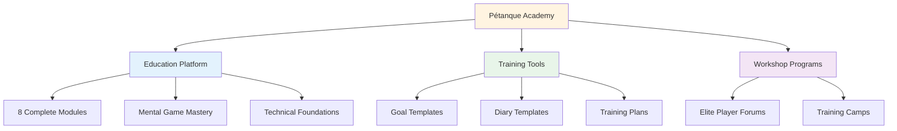
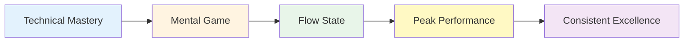

# Neuigkeiten & Updates

<AdBanner />

## Willkommen bei der Pétanque-Akademie

::: tip Plattform jetzt live! 🎉
Die Pétanque-Akademie ist nun voll funktionsfähig!

Wir haben eine umfassende Plattform ins Leben gerufen, die Elite-Pétanque-Spielern helfen soll, ihr volles Potenzial durch mentale Spielbeherrschung, strukturiertes Training und praktische Hilfsmittel auszuschöpfen.
:::

<AdInArticle />

## Was ist jetzt verfügbar?

### 📚 Umfassende Bildungsplattform

Wir haben **8 umfassende Schulungsmodule** eingeführt, die alles von Flow-Zuständen bis hin zur Ernährung abdecken:

| Modul | Was ist drin? | Hauptmerkmale |
|--------|---------------|--------------|
| **[The Zone](/en/education/the-zone/)** | Flow-Zustandsbeherrschung | 4 detaillierte Anleitungen zum Einstieg und zur Aufrechterhaltung des Arbeitsflusses |
| **[Mental Strength](/en/education/mental-strength/)** | Druckhandhabung | Vorbereitungsroutinen vor dem Dreh, Umgang mit dem inneren Kritiker |
| **[Mindfulness](/en/education/mindfulness/)** | Gegenwärtiges Bewusstsein | Tägliche Übungen, Wettkampftechniken |
| **[Goals](/en/education/goals/)** | Strategische Planung | SMART-Ziele, Hierarchie, Trackingsysteme |
| **[Tactics](/en/education/tactics/)** | Spielstrategie | Entscheidungsfindung, Wahrscheinlichkeit, Positionierung |
| **[Team Player](/en/education/team-player/)** | Teamfähigkeit | Kommunikation, Vertrauen, Teamdynamik |
| **[Training](/en/education/training/)** | Übungsmethoden | Übungen, gezieltes Üben, Fortschritt |
| **[Nutrition](/en/education/nutrition/)** | Hochleistungskraftstoff | Blutzuckermanagement, Wettkampfernährung |

### 🛠️ Praktische Werkzeuge

**Sofort einsatzbereite Vorlagen und Programme:**

- **[Workshop](/en/workshop)** - Strukturierte 3-stündige Sitzungen zur mentalen Spielentwicklung
- **[Trainingslager](/en/training-camp)** - Intensive Wochenendprogramme für Spitzenspieler
- **[Training Session](/en/training-session)** - 2-3 Stunden Übungsrahmen
- **[Zielvorlage](/en/goal-template)** – Komplettes System zur Zielsetzung und -verfolgung
- **[Tagebuchvorlage](/en/diary-template)** – Tagebuch für tägliche Übungen und Reflexionen

### 🎯 Technischer Leitfaden

**[Technische Hinweise](/en/technical/)** Abschnitt enthält:
- Vollständiger Leitfaden für alle Boule-Würfe
- Strategien zur Trajektorienauswahl
- Techniken zur Spinkontrolle
- Rahmen für die Schussauswahl

### 🍽️ Ernährung für optimale Leistung

**[Essen](/en/food)** - Umfassender Leitfaden zu:
- Blutzuckermanagement für einen stabilen Fokus
- Ernährungsstrategien vor dem Wettkampf
- Energieoptimierung für Turniere

## Unsere Mission

::: tip Die nächste Stufe
Spitzenspieler beherrschen die Technik bereits. Der nächste Durchbruch liegt im **mentalen Bereich** – darin, den Flow-Zustand zu erreichen, mit Druck umzugehen und konstant Höchstleistungen zu erbringen.

**Die Pétanque Academy bietet den kompletten Leitfaden.**
:::

## Plattformstatistiken

::: info Was wir aufgebaut haben
- ✅ **8 Lernmodule** mit über 30 ausführlichen Anleitungen
- ✅ **5 praktische Werkzeuge** sofort einsatzbereit
- ✅ **10 Sprachen** – weltweit verfügbar
- ✅ **Über 100 Seiten** mit Inhalten auf Spitzenniveau
- ✅ **Meerjungfrauen-Diagramme** für visuelles Lernen
- ✅ **Vorlagen zum Kopieren und Einfügen** für den sofortigen Einsatz
:::

## So starten Sie

### Für neue Besucher

**Beginnen Sie mit den Grundlagen:**

1. **[Ambition](/en/ambition)** – Die Philosophie hinter der Eliteentwicklung verstehen
2. **[Die Zone](/en/education/the-zone/)** – Lerne mehr über Flow-Zustände.
3. **[Zielvorlage](/en/goal-template)** – Setzen Sie sich Ihre ersten strukturierten Ziele

### Für erfahrene Spieler

**Vertiefen Sie sich in fortgeschrittene Themen:**

1. **[Mentale Stärke](/en/education/mental-strength/)** – Drucksituationen meistern
2. **[Taktiken](/en/education/tactics/)** – Strategische Entscheidungsfindung verfeinern
3. **[Workshop](/en/workshop)** – Strukturierte mentale Trainingseinheiten durchführen

### Für Teams

**Gemeinsame Exzellenz aufbauen:**

1. **[Teamplayer](/en/education/team-player/)** - Verbesserung der Teamdynamik
2. **[Trainingslager](/en/training-camp)** - Wochenend-Intensivkurse organisieren
3. **[Trainingssitzung](/en/training-session)** - Strukturierte Teamübungen

## Was macht dieses Produkt anders?

::: warning Warum die Pétanque Academy heraussticht
**Die meisten Trainings konzentrieren sich auf die Technik. Wir konzentrieren uns auf das, was Spitzenspieler tatsächlich brauchen:**

1. **Mentale Spielbeherrschung** – Der entscheidende Unterschied auf hohem Niveau
2. **Praktische Werkzeuge** – Nicht nur Theorie, sondern sofort einsatzbereite Vorlagen
3. **Strukturierte Programme** – Klare Rahmenbedingungen für Workshops und Camps
4. **Evidenzbasiert** – Basierend auf sportpsychologischer Forschung und Flow-Erkrankungen
5. **Für Elite-Spieler** - Entwickelt für Spieler, die die Grundlagen bereits beherrschen
:::

## Mach mit!

**Möchten Sie mitwirken oder Feedback geben?**

Besuchen Sie unsere **[Über uns](/en/about)**-Seite, um mehr zu erfahren:
- Erfahren Sie mehr über die Plattform
- Teilen Sie uns Ihr Feedback mit.
- Spezifische Inhalte anfordern
- Nehmen Sie Kontakt mit uns auf

---

::: tip Starte deine Reise noch heute!
Alles, was du brauchst, um dein Spiel auf die nächste Stufe zu heben, ist bereits hier. Wähle ein Modul, schnapp dir eine Vorlage und leg los.

**Willkommen an der Pétanque-Akademie – wo aus Spitzenspielern außergewöhnliche Spieler werden.**
:::

<AdBanner />
