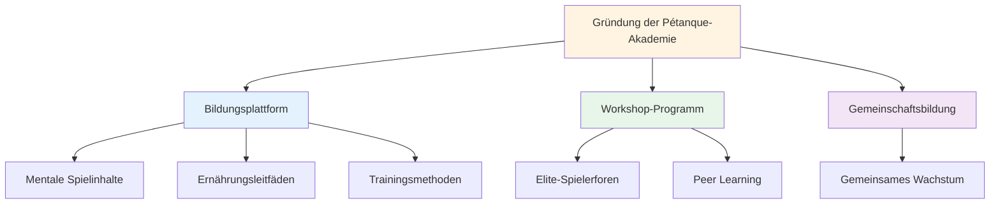
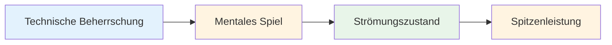

# Nachricht
<AdBanner />

## Willkommen bei der Pétanque-Akademie

::: tip Spannender Start! 🎉
**Dies ist das erste Startup!**

Wir freuen uns, die Pétanque Academy zu gründen – eine neue Initiative, die sich der Förderung von Pétanque-Spielern der Spitzenklasse widmet, damit diese ihr volles Potenzial ausschöpfen können.
:::

<AdInArticle />

## Was kommt

::: info Bleiben Sie dran für
- 📅 **Kommende Workshops** – Kleingruppentraining für Spitzenspieler
- 📚 **Neue Lerninhalte** – Mentaltraining, Ernährung, Trainingsmethoden
- 🎯 **Community-Events** – Vernetze dich mit gleichgesinnten Spielern
- 💡 **Spielergeschichten und Einblicke** – Lerne aus den Erfahrungen anderer
:::

## Unsere Mission

::: tip Die nächste Stufe
Spitzenspieler beherrschen die Technik bereits. Der nächste Durchbruch liegt im mentalen Bereich – darin, den Flow-Zustand zu erreichen, mit Druck umzugehen und konstant Höchstleistungen zu erbringen.
:::

## Los geht&#39;s

Während Sie auf die Ankündigung der Workshops warten, erkunden Sie unseren umfassenden Bildungsbereich:

| Abschnitt | Was Sie lernen werden | Hier beginnen |
|---------|-------------------|------------|
| **Die Zone** | Wie man konsistent in Flow-Zustände gelangt | [Flow verstehen](/en/education/the-zone/) |
| **Mentale Stärke** | Umgang mit Druck und Aufbau von Routinen | [Mentales Spiel](/en/education/mental-strength/) |
| **Achtsamkeit** | Gegenwärtiges Bewusstsein für die Leistung | [Achtsamkeitsübung](/en/education/mindfulness/) |
| **Ernährung** | Versorge dein Gehirn mit Energie für stabile Konzentration | [Präzisionsernährung](/en/education/nutrition/) |
| **Ziele** | Sinnvolle Ziele setzen und erreichen | [Zielsetzung](/en/education/goals/) |

::: info Begleite uns auf der Reise
Dies ist erst der Anfang. Wir bauen etwas Besonderes für Spitzenspieler, die den nächsten Schritt machen wollen. Willkommen an der Pétanque-Akademie.
:::

<AdBanner />
