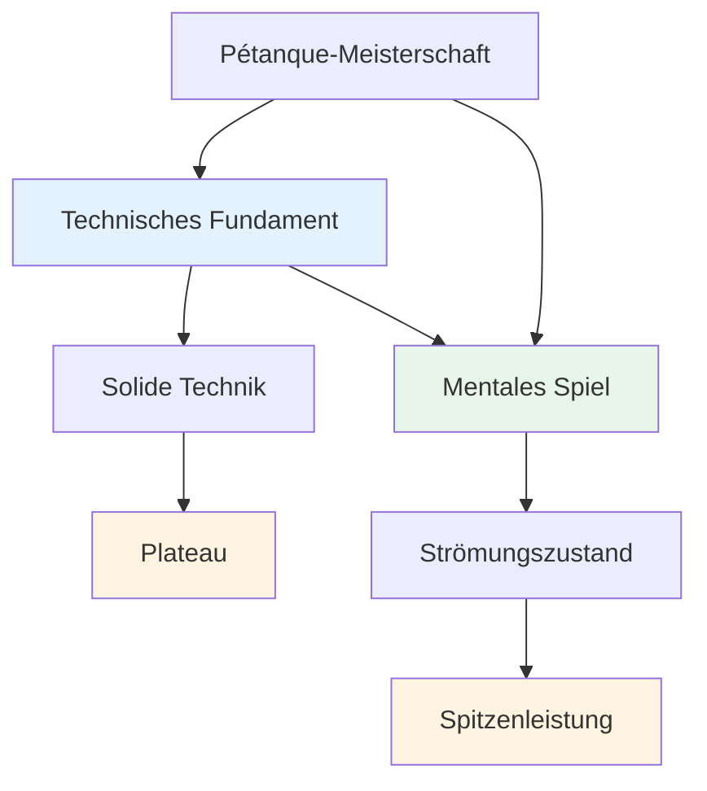

# Technische Beratung

## Eine Anmerkung zur Technik

Unser Hauptaugenmerk liegt zwar auf dem mentalen Spiel und dem Flow-Zustand, aber wir erkennen an, dass die Technik das Fundament ist, auf dem alles andere aufbaut.

::: info Unsere Philosophie
**Technik ist die Grundlage, aber Flow ist die Grenze.** Um ein Elite-Niveau zu erreichen, braucht man eine solide Technik, aber mentale Meisterschaft ist das, was einen darüber hinausbringt.
:::

## Unsere Perspektive

::: tip Man muss nicht alles beherrschen.
**Sie müssen nicht alle Techniken beherrschen**, aber das Verständnis des gesamten Spektrums an Möglichkeiten hilft Ihnen dabei:

- ✅ Wissen, was möglich ist
- ✅ Treffen Sie fundierte Entscheidungen darüber, was Sie entwickeln möchten.
- ✅ Das Spiel auf einer tieferen Ebene wertschätzen.
- ✅ Verstehen, was Spitzenspieler können
:::

::: info Das Ziel
Wenn Sie einen technischen Schwerpunkt haben und Ihr Repertoire erweitern möchten, beschreibt dieser Abschnitt das Endziel – die gesamte Palette an Würfen, die einem Pétanque-Spieler zur Verfügung stehen.

**Denk daran:** Es geht nicht darum, alles zu beherrschen. Es geht darum, über genügend technische Grundlagen zu verfügen, um in den Flow-Zustand zu gelangen und deinem Körper zu ermöglichen, den richtigen Wurf ganz natürlich auszuführen.
:::

## Themen

### [Wurfpalette](/en/technical/throws)
Welche Wurftechniken gibt es alle? Ein umfassender Überblick über die technischen Möglichkeiten beim Pétanque.

::: tip Nach der Technik – was kommt als Nächstes?
Sobald man über eine solide Technik verfügt, kommt das eigentliche Wachstum von Folgendem:
- **[Die Zone](/en/education/the-zone/)** – Zugriff auf Flow-Zustände
- **[Mentale Stärke](/en/education/mental-strength/)** – Umgang mit Druck
- **[Trainingsmethoden](/en/education/training/)** – Wie man effektiv übt
:::

