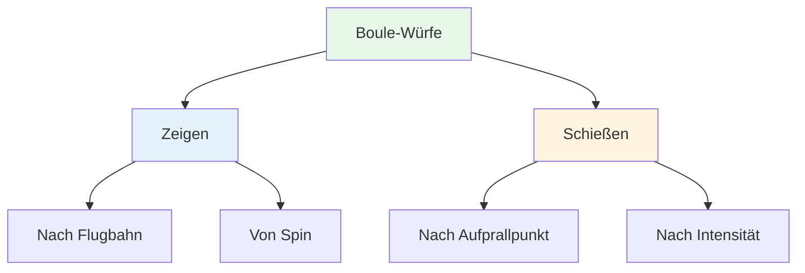
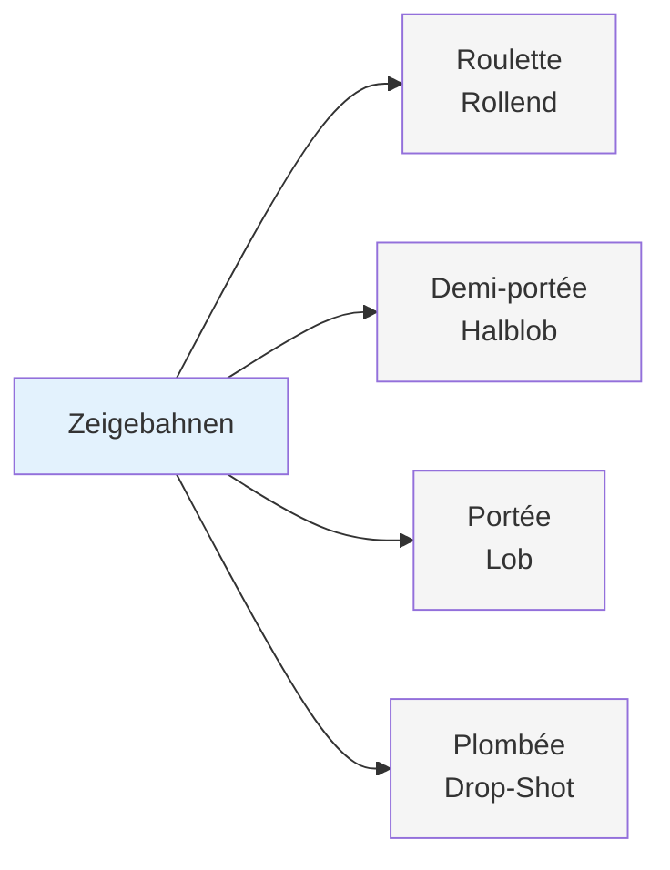
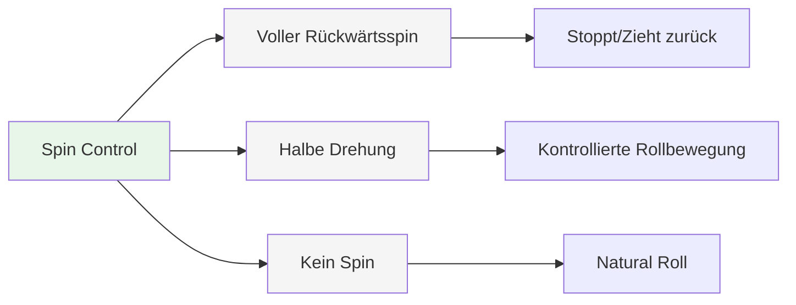
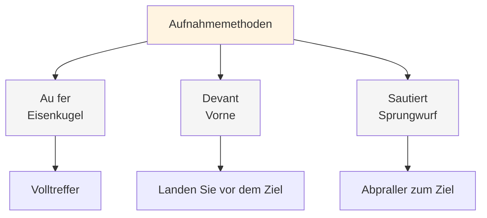
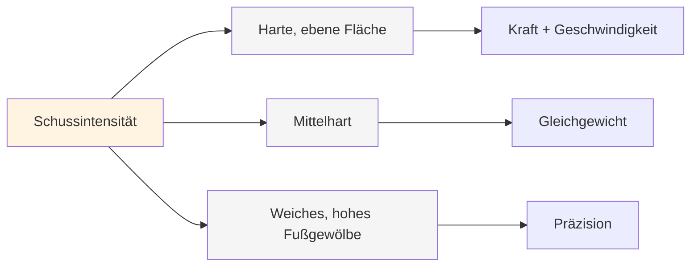
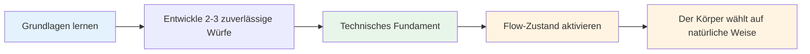

# Palette an Überwürfen

## Das komplette technische Repertoire

Dies ist eine Übersicht der Würfe beim Pétanque. Sie müssen nicht alle beherrschen, aber das Wissen um die verschiedenen Würfe hilft Ihnen, das Spiel in seiner Gesamtheit zu verstehen.

::: tip Das große Ganze
**Das Verständnis des gesamten Spektrums hilft Ihnen, fundierte Entscheidungen darüber zu treffen, was Sie entwickeln möchten.** Sie müssen nicht alles beherrschen – konzentrieren Sie sich auf das, was für Ihr Spiel funktioniert.
:::

## Zeigetechniken

### Nach Flugbahn

| Werfen | Französischer Begriff | Flugbahn | Wann verwenden? |
|-------|-------------|------------|-------------|
| **Rollend** | Roulette | Niedrig, rollt fast bis zum Ende | Glattes Gelände, kurze Distanz |
| **Halb-Lob** | Demi-portée | Mittelgroß, landet auf halber Strecke | Am häufigsten, vielseitig |
| **Lob** | Portée | Hoch, landet nahe am Ziel | Hindernisse, unwegsames Gelände |
| **Drop Shot** | Plombée | Sehr hoch, fällt senkrecht ab | Enge Räume, präzise Platzierung |

### Von Spin

| Drehart | Auswirkungen auf die Landung | Wann verwenden? |
|-----------|-------------------|-------------|
| **Voller Rückwärtsdrall** | Hält beim Landen an oder zieht zurück. | Schnelles Anhalten erforderlich, Vorbeirollen vermeiden. |
| **Halbe Drehung** | Mäßiger Rückwärtsdrall, kontrolliertes Rollen | Am vielseitigsten, am berechenbarsten |
| **Kein Spin** | Neutrale, natürliche Rollbewegung bei der Landung | Das Gelände bestimmt den Rollvorgang. |

## Schießtechniken

### Nach Aufprallpunkt

| Technik | Französischer Begriff | Aufprallpunkt | Eigenschaften |
|-----------|-------------|--------------|-----------------|
| **Eisenschuss** | Au fer | Volltreffer auf die Boule | Am häufigsten wird sauberer Kontakt verwendet. |
| **Vorne** | Devant | Landung kurz vor dem Ziel | Sicherer, weniger Präzision erforderlich |
| **Sprungwurf** | Sautiert | Abprallen ins Ziel | Fortgeschritten, für Hindernisse |

### Nach Intensität

| Intensität | Flugbahn | Wann verwenden? |
|-----------|------------|-------------|
| **Harter Flachschuss** | Direkt, kraftvoll, flach | Klare Linie, aber beim Schlag ist Distanz nötig. |
| **Mittelschwer** | Ausgewogene Leistung und Kontrolle | Am vielseitigsten |
| **Weich mit hohem Fußgewölbe** | Lob-Schuss, fällt von oben | Hindernisse, enge Räume |

## Die komplette Palette

::: details Kurzübersicht: Alle Würfe
**Zeigen Sie:**
- Roulette (Würfeln)
- Demi-portée (half-lob)
- Portée (lob)
- Plombée (Drop Shot)
- Volle Drehung / Halbe Drehung / Keine Drehung

**Schießen:**
- Au fer (Eisenkugeln)
- Devant (vorne)
- Sautée (Sprungwurf)
- Hart flach / Mittel / Weich hochgewölbt
:::

## Meisterschaftspfad

::: tip Erinnern
**Das Ziel ist nicht, alles zu beherrschen.** Es geht darum, über genügend technische Grundlagen zu verfügen, um in den Flow-Zustand zu gelangen und den Körper den richtigen Wurf auf natürliche Weise wählen zu lassen.

Konzentrieren Sie sich auf:
1. **2-3 Zeigetechniken**, auf die Sie sich verlassen können
2. **1-2 Schießmethoden**, die für Sie funktionieren
3. **Konstante Leistung** unter Druck
4. **Mentales Spiel** zum Erreichen des Flow-Zustands
:::

::: info Nächste Schritte
Sobald man über eine solide Technik verfügt, kommt das eigentliche Wachstum von Folgendem:
- **[The Zone](/en/education/the-zone/)** – Konsistenter Zugriff auf Flow-Zustände
- **[Trainingsmethoden](/en/education/training/)** – Wie man effektiv übt
- **[Mentale Stärke](/en/education/mental-strength/)** – Leistung unter Druck
:::

