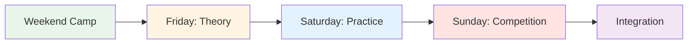
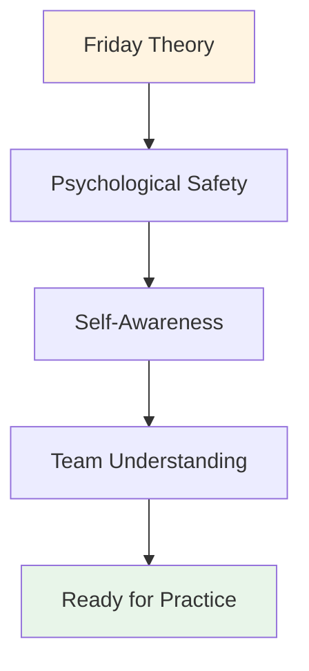

# Trainingslager: Wochenendleitfaden

## Wie man ein Wochenend-Trainingslager für 10-20 Spieler durchführt

Dieser umfassende Leitfaden hilft Ihnen bei der Organisation und Durchführung eines Wochenend-Trainingscamps, das Theorie, Praxis und Wettkampf vereint. Kombinieren Sie die mentalen Trainingsinhalte dieser Website mit praktischen Übungen auf der Piste, um maximale Wirkung zu erzielen.

::: Tipp: Die Philosophie des Trainingslagers
Theorie ohne Praxis ist bloß Information. Praxis ohne Theorie ist bloß Wiederholung. Wettbewerb ohne Reflexion ist bloßes Spielen. Dieses Wochenende vereint alle drei Aspekte für ein transformatives Lernerlebnis.
:::

## Vorbereitung des Camps

### Gruppengröße und -struktur

**Optimal:** 10-20 Spieler
- **Kleines Camp (10-12):** Intimerer, intensiverer Austausch
- **Großes Camp (16-20):** Vielfältigere Perspektiven, erfordert Untergruppen

**Teamstruktur:**
- Für Training und Wettkampf in Teams von 3-4 Personen aufteilen.
- Verschiedene Fähigkeitsstufen und Spielstile mischen
- Die Teams sollten im Laufe des Wochenendes rotieren.

### Personalbedarf

| Rolle | Verantwortlichkeiten | Menge |
|------|------------------|----------|
| **Koordinator/in für mentale Leistungsfähigkeit** | Theorieeinheiten und Gruppendynamik leiten | 1 |
| **Technischer Coach** | Training beaufsichtigen, Feedback geben | 1-2 |
| **Wettkampfleitung** | Turnierorganisation, Logistikmanagement | 1 |
| **Hilfspersonal** | Mahlzeiten, Aufbau, Verwaltung | 1-2 |

### Standortanforderungen

::: Informationen zum Anlagenbedarf
**Piste:**
- Mehrere Gelände (mindestens 3-4 Pisten)
- Wenn möglich, unterschiedliche Oberflächen (Kies, Sand, hart)
- Beleuchtung für das Abendspiel

**Innenraum:**
- Platz für 20 Personen im Kreis (Theoriesitzungen)
- Von der Piste getrennt
- Whiteboard/Projektor
- Bequeme Sitzgelegenheiten

**Unterkunft:**
- Vor Ort oder in unmittelbarer Nähe (fußläufig erreichbar)
- Mehrbettzimmer fördern die Bindung zwischen den Partnern.
- Ein ruhiger Ort zum Nachdenken

**Gastronomie:**
- Ernährungsorientierte Mahlzeiten (siehe [Lebensmittelpyramide](./food))
- Vermeiden Sie Zuckerschocks
- Trinkstationen
:::

### Materialliste

::: Details Vollständige Materialliste
**Theoriesitzungen:**
- [ ] Stühle für einen Kreis (keine Tische)
- [ ] Boule und Cochonnet für die Mitte
- [ ] Flipcharts und Marker
- [ ] Haftnotizen
- [ ] Arbeitsblätter (Benutzerhandbuch, Innerer Kritiker usw.)
- [ ] Papier und Stifte
- [ ] Projektor (für Website-Inhalte)

**Übungseinheiten:**
- [ ] Maßband
- [ ] Kegel/Markierungen für Bohrer
- [ ] Videokamera/Stativ
- [ ] Klemmbrett und Papier (Tracking)
- [ ] Pfeife

**Wettbewerb:**
- [ ] Punktetabellen
- [ ] Turnierbaum
- [ ] Preise/Anerkennung
- [ ] Erste-Hilfe-Set

**Logistik:**
- [ ] Namensschilder
- [ ] Teilnehmerliste mit Kontaktdaten
- [ ] Notfallkontaktinformationen
- [ ] Wasserflaschen
- [ ] Sonnenschutzmittel
- [ ] Taschentücher (für emotionale Arbeit!)
:::

## Wochenendprogramm

### Freitagabend (3 Stunden)

**18:00-18:30 - Ankunft &amp; Begrüßung**
- Einchecken
- Zimmerzuteilung
- Wochenendübersicht

**18:30-19:30 - Abendessen**
- Ernährungsorientierte Mahlzeit
- Informelle Vorstellungen

**19:30-22:30 - Theorieeinheit: Grundlagen**

Nutzen Sie den [Workshop-Leitfaden](./workshop) für eine detaillierte Anleitung:

1. **Grundregeln (15 Min.)** – Psychologische Sicherheit schaffen
2. **Check-in-Matrix (20 Min.)** – Gruppenenergie einschätzen.
3. **Der Eisberg (30 Min.)** – Innere Gedanken erforschen
4. **Benutzerhandbuch (45 Min.)** – Teamverständnis aufbauen
5. **Angst mit Hut (45 Min.)** – Isolation durchbrechen
6. **Auschecken (15 Min.)** – Den Kreislauf schließen.

**22:30 - Freizeit**
- Informelles geselliges Beisammensein
- Ruhe und Besinnung

### Samstag (Ganztägig - Theorie + Praxis)

**08:00-09:00 - Frühstück &amp; Achtsamkeit**
- Ruhiges Frühstück
- Optionale 15-minütige geführte Meditation
- Ziele für den Tag setzen

**09:00-10:30 Uhr – Theorieeinheit: Inhalte und Erfahrungen verknüpfen**

Wählen Sie 3-4 Themen von der Website der Akademie und erkunden Sie das innere Spiel:

**Beispielthemen:**

1. **[Ernährung](./education/nutrition/)** (20 Min.)
   - „Wie verändert sich Ihre Essenswahl unter Druck?“
   - &quot;Esst ihr, was euer Körper braucht oder was eure Angst verlangt?&quot;
   - Übung: Ernährungsplan für den Wettkampftag

2. **[Mentale Stärke](./education/mental-strength/)** (25 Min.)
   - &quot;Wie stehst du zum Scheitern?&quot;
   - „Wie redet man mit sich selbst, nachdem man einen Fehlschuss kassiert hat?“
   - Aktivität: Den inneren Kritiker in einen inneren Coach umwandeln

3. **[Achtsamkeit](./education/mindfulness/)** (25 Min.)
   - &quot;Wohin gehen Ihre Gedanken während der Pause vor dem Wurf?&quot;
   - &quot;Was reißt dich aus dem gegenwärtigen Moment heraus?&quot;
   - Übung: 5-minütiger Körperscan

4. **[Taktiken](./education/tactics/)** (20 Min.)
   - &quot;Basiert Ihre Schusswahl auf Strategie oder Angst?&quot;
   - &quot;Wann sollte man auf Nummer sicher gehen und wann Risiken eingehen?&quot;
   - Diskussion: Risikoprofile in der Gruppe

**10:30-10:45 - Pause**

**10:45-12:30 - Integration auf der Piste: Übungen mit mentaler Konzentration**

**Übung 1: Den Schuss ansagen (30 Min.)**

Aus dem [Workshop-Leitfaden](./workshop) – Üben Sie, Ihre Absicht und Ihren Zweifel zu übernehmen:

1. Das Ziel ankündigen: „Ich schieße auf das Eisen“
2. Geben Sie Ihr Selbstvertrauen an: „Ich würde sagen, ich bin eine 7 von 10.“
3. Benennen Sie den inneren Gedanken: „Meine innere Stimme macht sich Sorgen wegen des Rückwärtsdralls.“
4. Führe den Schuss aus.
5. Reflektiere: „Was ist passiert? Was hast du daraus gelernt?“

**Übung 2: Kognitive Interferenz (30 Min.)**

Testen Sie, ob die Technik automatisiert ist:
- Der Koordinator stellt komplexe Fragen, während der Spieler schießt.
- &quot;Nenne 5 Hauptstädte&quot; oder &quot;Zähle von 100 in 7er-Schritten rückwärts&quot;
- Erfolg = Die Technik ist implizit, sie wird nicht bewusst verarbeitet

**Übung 3: Praxis mit der Bedienungsanleitung (30 Min.)**

Die Benutzerhandbücher ab Freitag anwenden:
- Spielt in Dreierteams
Nach jedem Schuss reagieren die Teammitglieder gemäß der Bedienungsanleitung.
- „Marc braucht nach einem Fehlwurf Ruhe“ – das Team respektiert das.
- Nachbesprechung: „Wie hat es sich angefühlt, verstanden zu werden?“

**12:30-14:00 Uhr - Mittagessen &amp; Pause**
- Ernährungsorientierte Mahlzeit
- Zeit der Stille zur Besinnung
- Optional: Individuelle Check-ins mit dem Koordinator

**14:00-17:00 Uhr - Übungseinheit: Geländeanpassung**

**Ziel:** Anpassungsfähigkeit und mentale Flexibilität aufbauen

**Aufstellen:**
- Rotieren Sie durch 3-4 verschiedene Gelände/Pisten
- 45 Minuten pro Geländeabschnitt
- Fokus auf mentale Anpassung, nicht nur auf technische Anpassung

**Rotationsstruktur:**

| Gelände | Mentale Konzentration | Übung |
|---------|--------------|----------|
| **Gelände 1: Weich/Sand** | Akzeptanz der Ungewissheit | „Die Donnée – akzeptiere, was ist“ |
| **Gelände 2: Hart/Schotter** | Präzision unter Druck | &quot;Vertraue deiner Technik&quot; |
| **Gelände 3: Uneben** | Emotionsregulation | &quot;Bleib ruhig, wenn es unfair ist&quot; |
| **Gelände 4: Wettbewerb** | Zugriff auf den Flow-Zustand | &quot;Finde die Zone&quot; |

**Moderation:**
Der technische Trainer gibt Feedback zur Technik.
- MPC fragt: &quot;Was geht Ihnen gerade durch den Kopf?&quot;
- Spielertagebuch zwischen den Rotationen

**17:00-18:00 Uhr - Pause &amp; Reflexion**
- Individuelles Tagebuch
- &quot;Was hast du heute über dich selbst gelernt?&quot;
- &quot;Was ist eine Sache, die du morgen anders machen wirst?&quot;

**18:00-19:00 Uhr - Abendessen**

**19:00-21:00 Uhr - Abendtheorie: Tiefe Verletzlichkeit**

**Aktivität 1: Den inneren Kritiker neu definieren (45 Min.)**

Das vollständige Protokoll finden Sie im [Workshop-Leitfaden](./workshop):
1. Identifizieren Sie die genaue Formulierung des Kritikers.
2. Sich als innerer Coach neu interpretieren
3. Partnerpraxis

**Aktivität 2: Wettkampfvorbereitung (45 Min.)**

Morgen ist Wettkampftag. Bereite dich mental vor:

1. **Visualisierung (15 Min.)**
   - Augen schließen
   - Stell dir die perfekte Aufnahme vor
   Spüre das Selbstvertrauen
   - Beachten Sie die Ruhe

2. **Teamprotokolle (20 Min.)**
   - Signale zur Unterstützung erzeugen
   - &quot;Ich brauche einen Reset&quot; = Berührungskugeln
   - &quot;Ich brauche Ermutigung&quot; = Faustgruß
   - „Ich brauche Abstand“ = Schritt zurücktreten

3. **Ziele setzen (10 Min.)**
   - „Morgen werde ich mich auf … konzentrieren.“
   - „Mein Ziel ist nicht zu gewinnen, sondern...“
   - &quot;Ich werde üben...&quot;

**Auschecken (30 Min.)**
Teile eine deiner Ängste bezüglich morgen.
- Eine gemeinsame Absicht teilen
- Gruppenunterstützung

**21:00 Uhr - Freizeit**
- Früh ins Bett (morgen Wettkampf!)
- Stille Betrachtung

### Sonntag (Wettkampftag)

**08:00-09:00 - Frühstück &amp; Mentale Vorbereitung**
- Leichtes Frühstück (siehe [Ernährungsleitfaden](./education/nutrition/))
- 15-minütige Achtsamkeitsübung
- Teambesprechungen

**09:00-09:30 - Wettbewerbsbesprechung**

**Format:** Rundenturnier
- Teams von 3
- Spielen Sie bis 13 Punkte
- Jeder spielt jeden
- Fokus auf den PROZESS, nicht auf das Ergebnis

**Die Besonderheit: Bewertung der mentalen Leistungsfähigkeit**

::: Tipp: Doppeltes Punktesystem
**Traditionell:** Gewonnene Punkte
**Mentale Leistungsfähigkeit:** Bewertet mit dem MPC

Punkte für mentale Leistungsfähigkeit (0-5 pro Spiel):
- Verwendete Werkzeuge aus dem Benutzerhandbuch
- Unterstützte Teammitglieder effektiv
- Den inneren Kritiker im Griff behalten
- Im Hier und Jetzt geblieben (nicht in der Vergangenheit verweilt)
- Nachgewiesene psychologische Sicherheit

**Sieger:** Beste Gesamtpunktzahl (traditionell + mental)
:::

**09:30-13:00 Uhr - Vormittagswettbewerb**
- Rundenspiele
- MPC beobachtet und bewertet
Der technische Trainer gibt zwischen den Spielen kurzes Feedback.
- Trink- und Snackpausen

**13:00-14:00 Uhr - Mittagessen**
- Ernährungsorientiert
- Informelle Reflexion
- Ausruhen

**14:00-17:00 Uhr - Nachmittagswettbewerb**
- Fortsetzung des Rundlaufs
- Halbfinale und Finale
- Zunehmender Druck
- Die Erkenntnisse des Morgens anwenden

**17:00-17:30 - Preisverleihung &amp; Ehrungen**

**Kategorien:**
- Traditioneller Gewinner
- Gewinner der mentalen Leistungsfähigkeit
- Größte Verbesserung
- Bester Teamkollege
- Tapferkeitsauszeichnung (für besonders schutzbedürftige Personen)

**17:30-19:00 - Abschließende Reflexionsrunde**

**Entscheidend:** Hier wird das Gelernte gefestigt.

**Struktur:**

**1. Individuelle Reflexion (15 Min.)**
Ins Tagebuch schreiben:
- Was hast du dieses Wochenende über dich selbst gelernt?
- Was hat Sie überrascht?
Was werden Sie anders machen?
- Was nimmst du mit nach Hause?

**2. Austausch in Kleingruppen (30 Min.)**
Gruppen von 4-5 Personen:
- Wichtige Erkenntnisse teilen
Was hat am meisten Anklang gefunden?
Was war am schwierigsten?
- Was war am wertvollsten?

**3. Vollständige Gruppenintegration (30 Minuten)**
Kreis bilden:
- Jeder teilt EINE zentrale Erkenntnis mit.
- MPC validiert und verbindet Themes
- Diskutieren Sie: „Wie werden Sie dies anwenden?“

**4. Verpflichtungen (15 Min.)**
Jede Person gibt eine Verpflichtung ab.
- &quot;Bei meinem nächsten Wettkampf werde ich...&quot;
- Gruppenzeugen und Unterstützer

**5. Abschluss (15 Min.)**
- Vielen Dank an die Teilnehmer für ihren Mut
- Auf die Vertraulichkeit hinweisen
- Kontakte austauschen
- Nachbereitung planen (optionale Online-Sitzung)

**19:00 Uhr - Abendessen &amp; Abreise**

## Moderationstipps

### Balancetheorie und -praxis

::: Warnung: Überlaste die Theorie nicht!
**Der Fehler:** Zu viel Gerede, zu wenig Taten

**Die Bilanz:**
- Theorie schafft Bewusstsein
Übung macht den Meister
- Integration von Wettbewerbstests
- Reflexion festigt das Lernen

**Faustregel:** 30 % Theorie, 40 % Praxis, 20 % Wettbewerb, 10 % Reflexion
:::

### Management der Gruppendynamik

**Der wettbewerbsfähige Alpha:**
- Will um jeden Preis gewinnen
- Widersteht Anfälligkeit
- **Strategie:** Wettbewerbsorientierung in die Bewertung der mentalen Leistungsfähigkeit kanalisieren

**Der stille Beobachter:**
- Nimmt alles in sich auf, teilt aber nichts.
- **Strategie:** Niedrigriskante Einstiegsmöglichkeiten schaffen, Beobachtung als Teilnahme anerkennen

**Der Skeptiker:**
- &quot;Dieses ganze Gefühlszeug funktioniert nicht.&quot;
- **Strategie:** Verbales Aikido – Ausrichten und Pivotieren (siehe [Workshop-Leitfaden](./workshop))

**Der/Die Überteiler/in:**
- Beherrscht die Diskussion
- **Strategie:** „Vielen Dank, hören wir uns nun die Meinungen anderer an.“

### Umgang mit emotionalen Momenten

**Jemand weint während Fear in a Hat:**
- ✅ Normalisieren: „Tränen sind ein Zeichen von Mut, nicht von Schwäche“
- ✅ Bieten Sie Taschentücher an, aber hetzen Sie nicht.
- ✅ Fragen Sie: &quot;Was brauchen Sie jetzt?&quot;
- ❌ Nicht: „Es ist okay, weine nicht“

**Konflikt zwischen Spielern:**
- ✅ Pause und Ansprache
- ✅ &quot;Was passiert gerade?&quot;
- ✅ Als Lernmoment nutzen
- ❌ Nicht: Ignorieren oder verharmlosen

**Jemand schaltet ab:**
- ✅ Privat während der Pause einchecken
- ✅ „Mir ist aufgefallen, dass du still geworden bist. Was ist los?“
- ✅ Bieten Sie Optionen an: auf andere Weise teilnehmen, eine Pause einlegen
- ❌ Nicht tun: Öffentlich anprangern

## Nachbereitung des Camps

### Sofort (24-48 Stunden)

**An alle Teilnehmer senden:**
- Dankesnachricht
- Zusammenfassung der wichtigsten Erkenntnisse
- Fotos vom Wochenende
- Kontaktliste (mit Genehmigung)
- Link zu Ressourcen auf der Website

**Individuelle Check-ins:**
- Schreibe jedem, der viel geteilt hat
- &quot;Wie fühlst du dich mit Blick aufs Wochenende?&quot;
- Beheben Sie alle verbleibenden Sicherheitslücken

### Kurzfristig (2 Wochen)

**Optionale Online-Sitzung (60-90 Min.):**
- Wie haben Sie die gewonnenen Erkenntnisse angewendet?
- Was funktioniert? Was ist schwierig?
- Unterstützung und Problemlösung durch Gleichaltrige
- Verpflichtungen bekräftigen

### Langfristig (1-3 Monate)

**Umfrageteilnehmer:**
- Was ist in eurem Spiel anders?
Welche Werkzeuge verwenden Sie noch?
Was würde das nächste Camp verbessern?
Würden Sie es weiterempfehlen?

**Auswirkungen auf die Strecke:**
- Wettbewerbsergebnisse
- Selbstberichtetes Selbstvertrauen
- Teamdynamik
- Fortgesetztes Engagement

## Anpassung an unterschiedliche Gruppengrößen

### Kleines Camp (10-12 Spieler)

**Vorteile:**
- Vertiefter Austausch
- Mehr individuelle Betreuung
- Stärkere Bindungen

**Anpassungen:**
- Eine einzige Gruppe für die gesamte Theorie
- Mehr Zeit pro Person für Aktivitäten
- Intimes Wettbewerbsformat

### Großes Camp (16-20 Spieler)

**Vorteile:**
- Unterschiedliche Perspektiven
- Mehr Wettbewerbsvielfalt
- Skaleneffekte

**Anpassungen:**
- Aufteilung in 2 Gruppen für einige Theorieeinheiten
- 2 MPC/Moderatoren werden benötigt
- Größerer Turnierbaum
- Strukturiertere Rotationen

## Budgetüberlegungen

### Einnahmen

| Artikel | Preis pro Person | 20 Personen | 10 Personen |
|------|------------------|-----------|-----------|
| **Anmeldung** | 150–250 € | 3.000–5.000 € | 1.500–2.500 € |

### Ausgaben

| Kategorie | Kosten | Anmerkungen |
|----------|------|-------|
| **Objektmiete** | 500–1.000 € | Wochenendpreis |
| **Unterkunft** | 40-60 €/Person/Nacht | Mehrbettzimmer |
| **Mahlzeiten** | 30-40 €/Person/Tag | 6 Mahlzeiten |
| **Mitarbeiter** | 500-1.000 € | MPC + Trainer |
| **Materialien** | 100-200 € | Arbeitsblätter, Zubehör |
| **Preise** | 100–200 € | Anerkennungsartikel |

**Gesamtpreis pro Person:** 120-180 €
**Marge:** 30-70 €/Person (oder Kostendeckung für Gemeinschaftsprojekte)

## Erfolgskennzahlen

### Sofortindikatoren

- [ ] Psychologische Sicherheitsbewertung (1-10, Durchschnitt &gt;7)
- [ ] Beteiligungsrate (&gt;80 % aktives Teilen)
- [ ] Abschlussquote (&gt;90 % bleiben das gesamte Wochenende)
- [ ] Zufriedenheitswert (1-10 Durchschnitt &gt;8)

### Langfristige Indikatoren

- [ ] Verhaltensänderung (Einsatz von Instrumenten im Wettbewerb)
- [ ] Leistungsverbesserung (Selbstauskunft)
- [ ] Gemeinschaftsbildung (in Kontakt bleiben)
- [ ] Weiterempfehlungen (Empfehlungen an andere)

## Häufige Fehler, die Sie vermeiden sollten

::: Gefahren Fallstricke
**1. Zu viel Inhalt**
- Ich versuche, alles abzudecken.
- **Korrektur:** Fokus auf Tiefe, nicht auf Breite

**2. Reflexion überspringen**
- Eile zur nächsten Aktivität
- **Behebung:** Verarbeitungszeit einbauen

**3. Widerstand ignorieren**
- Skepsis überwinden
- **Lösung:** Sprechen Sie es direkt mit verbalem Aikido an.

**4. Technisches Coaching während der Theorie**
- Rollenmischung
- **Behebung:** Klare Abgrenzung zwischen MPC und technischem Coach

**5. Keine Nachverfolgung**
Das Wochenende ist vorbei, der Unterricht endet.
- **Behebung:** Nachbereitungstermine für das Camp planen
:::

## Ressourcen

### Von dieser Website

- [Workshop-Leitfaden](./workshop) - Ausführliche Moderationsprotokolle
- [Leitfaden für die Trainingssitzung](./training-session) - Für fortlaufendes Üben
- [Ernährung](./education/nutrition/) - Wettkampftagsprotokolle
- [Mentale Stärke](./education/mental-strength/) - Konzepte des inneren Spiels
- [Achtsamkeit](./education/mindfulness/) - Präsenztechniken
- [Taktiken](./education/tactics/) - Strategisches Denken

### Empfohlene Lektüre

- *Das innere Spiel des Tennis* von Timothy Gallwey
- *Mindset* von Carol Dweck
- *Die furchtlose Organisation* von Amy Edmondson

