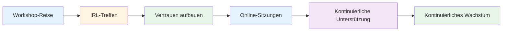
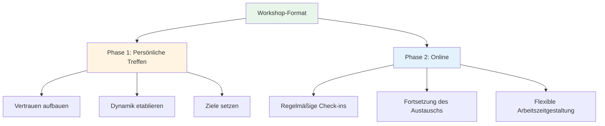
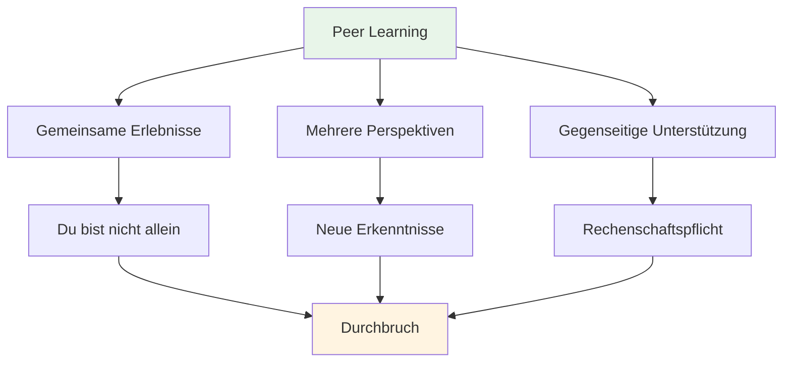

# Werkstatt

## Foren für Elite-Spieler

Unsere Workshops sind intime Foren, in denen Spitzenspieler Erfahrungen austauschen und ihre innersten Gedanken über das Spiel, die Leistung und die mentalen Herausforderungen offenbaren.

::: tip Was unsere Workshops so besonders macht
**Kleine, sorgfältig ausgewählte Gruppen von Spitzenspielern in einem geschützten Raum für offene Diskussionen.** Dies ist keine Vorlesung, sondern ein Lernerlebnis unter Gleichgesinnten, bei dem man sich austauscht, voneinander lernt und gemeinsam wächst.
:::

## Format

### Kleingruppen
::: info Gruppengröße
- **6-8 Spieler** pro Workshop
- Sorgfältig zusammengestellte Gruppen für optimale Dynamik
- Ein sicherer Raum für ehrliche Diskussionen
- Alle tragen ihren Teil bei, alle lernen.
:::

### Hybridansatz

| Phase | Format | Zweck | Vorteile |
|-------|--------|---------|----------|
| **Erstes Treffen** | persönlich (IRL) | Fundament bauen | Vertrauen, Verbundenheit, Gruppendynamik |
| **Laufende Kurse** | Online | Schwung beibehalten | Regelmäßige Unterstützung, Flexibilität, Verantwortlichkeit |

::: details Phase 1: Persönliches Treffen
**Warum zuerst ein persönliches Treffen?**
- Vertrauen und Verbindung durch persönliche Begegnungen aufbauen
- Gruppendynamik und Sicherheit schaffen
- Gemeinsam Absichten und Ziele festlegen
- Schaffen Sie die Grundlage für ehrlichen Austausch

**Was geschieht:**
- Vorstellungsrunde und Zielsetzung
- Erste Übungen und Diskussionen
- Festlegung von Gruppennormen
- Beziehungsaufbau
:::

::: details Phase 2: Online-Sitzungen
**Warum online für die laufende Weiterbildung?**
- Regelmäßige Check-ins ohne Reise
- Fortsetzung des Austauschs und der Unterstützung
- Flexible Terminplanung für vielbeschäftigte Spieler
- Die Dynamik zwischen den persönlichen Treffen aufrechterhalten

**Was geschieht:**
- Fortschrittsberichte und Herausforderungen
- Unterstützung durch Gleichaltrige und Problemlösung
- Rechenschaftsprüfungen
- Kontinuierliches Lernen und Wachstum
:::

## Was Sie erwartet

### Themen, die wir erforschen

| Bereich | Fokus | Ergebnisse |
|------|-------|----------|
| **Mentales Spiel** | Strömungszustand, Druck, Fokus | Konstante Höchstleistung |
| **Persönliche Herausforderungen** | Ängste, Blockaden, Frustrationen | Durchbrüche und Lösungen |
| **Lernen unter Gleichaltrigen** | Gemeinsame Erfahrungen | Neue Perspektiven und Erkenntnisse |
| **Praktische Werkzeuge** | Techniken und Übungen | Sofortige Bewerbung |
| **Gemeinschaft** | Kontinuierliche Unterstützung | Langfristiges Wachstum |

::: tip Workshop-Erfahrung
- 🧠 Tiefgründige Diskussionen über die mentalen Aspekte des Spiels
- 💬 Austausch persönlicher Erfahrungen und Herausforderungen
- 🤝 Unterstützung und Verantwortlichkeit unter Gleichgesinnten
- 🛠️ Praktische Übungen und Techniken
- 👥 Eine Community von Spielern, die sich dem Wachstum verschrieben haben
:::

## Wer sollte mitmachen?

::: info Ideale Teilnehmer
- **Elite-Spieler**, die den nächsten Schritt machen wollen
- Spieler, die die Technik **meisterhaft beherrschen**, aber mehr wollen
- Für alle, die sich für das **mentale Spiel** interessieren.
- Spieler, die offen für **ehrliche Selbstreflexion** sind.
- Engagiert für **persönliches Wachstum**
:::

::: warning Passt nicht gut, wenn
- Sie suchen ausschließlich technisches Coaching.
- Du fühlst dich unwohl dabei, dich in einer Gruppe zu teilen.
- Du bist nicht bereit, dich verletzlich zu zeigen.
- Sie wollen schnelle Lösungen, ohne die Arbeit selbst erledigen zu müssen.
:::

## Der Wert des Lernens mit Gleichaltrigen

::: tip Warum Peer-Gruppen funktionieren
Spitzenspieler stehen vor einzigartigen Herausforderungen, die andere nicht verstehen. In einem Workshop triffst du auf Menschen, die genau das **kennen** – den Druck, die Erwartungen, die mentalen Kämpfe. So entsteht ein geschützter Raum für echtes Wachstum.
:::

## Bereit mitzumachen?

::: info Nächste Schritte
Workshops werden in unserem [News](/en/news/)-Bereich angekündigt. Bleiben Sie dran für die nächsten Termine und Informationen zur Anmeldung.
:::

