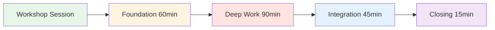
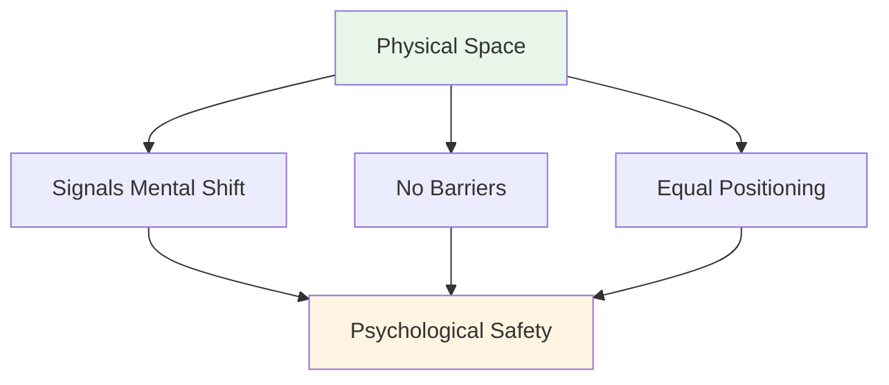
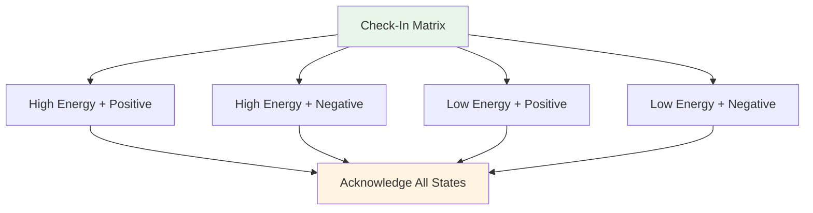
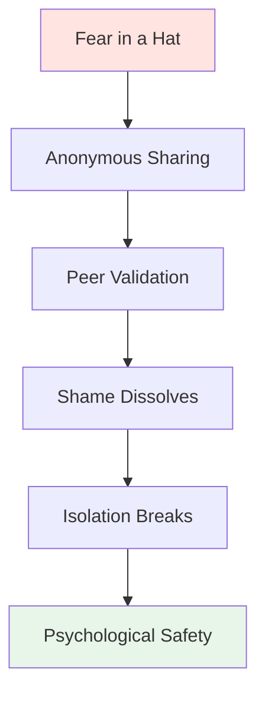

# Workshop: Leitfaden für die theoretische Sitzung

<AdBanner />

## Ein umfassender Leitfaden für Koordinatoren

Dieser Leitfaden unterstützt Sie bei der Durchführung eines 3- bis 4-stündigen theoretischen Workshops mit 6 bis 8 Spitzenspielern. Als **Koordinator für mentale Leistungsfähigkeit (MPC)** moderieren Sie intensive Gespräche über die mentale Komponente des Spiels und schaffen so eine psychologische Sicherheitsatmosphäre, die sich positiv auf die Leistung auf der Piste auswirkt.

::: Warnung: Kritisches Konzept
**Sie sind kein technischer Trainer oder Therapeut.** Ihre Rolle besteht darin, ein auf Verletzlichkeit basierendes Lernverfahren zu ermöglichen, das den Spielern hilft, den Zusammenhang zwischen ihren inneren Gedanken und ihrer Leistung zu verstehen.
:::

## Vorbereitung auf den Workshop

### Die Rolle des Koordinators

::: Informationen zu Ihren Verantwortlichkeiten
- **Moderieren statt belehren** – Sie lenken die Diskussion, anstatt Techniken zu vermitteln.
- **Raum schaffen** - Psychologische Sicherheit schaffen und aufrechterhalten
- **Theorie und Praxis verbinden** – Website-Inhalte mit inneren Erfahrungen verknüpfen
- **Gruppendynamik beobachten** – Achten Sie darauf, wer sich beteiligt und wer Widerstand leistet.
- **Grenzen wahren** - Wissen, wann professionelle Hilfe nötig ist
:::

### Wesentliche Kompetenzen

| Kompetenz | Was sie bedeutet | Wie man sie entwickelt |
|------------|---------------|----------------|
| **Emotionale Intelligenz** | Mikroexpressionen des Unbehagens erkennen | Aktive Beobachtung üben |
| **Neutrale Autorität** | Respekt ohne technische Macht erlangen | Glaubwürdigkeit durch Präsenz aufbauen |
| **Sportkontext** | Druckmechanik verstehen | Pétanque-Terminologie und -Kultur kennenlernen |
| **Verbales Aikido** | Sich dem Widerstand anpassen, nicht dagegen ankämpfen | Nicht-defensive Kommunikation üben |

::: Details Wichtige Pétanque-Begriffe, die man kennen sollte
- **Carreau** - Ein perfekter Stoß, der die Boule des Gegners verdrängt.
- **Bibber** - Das &quot;Jauchzen&quot; - unwillkürliches Zittern während der Freisetzung
- **Donnée** - Das &quot;Gegebene&quot; - das Terrain so akzeptieren, wie es ist
- **Portée** - Werfen ohne Aufprall
- **Roulette** - Rollender Schuss
- **Cochonnet** - Die Zielkugel (Jack)
:::

## Physischer Aufbau: Der magische Kreis

### Standortanforderungen

::: Warnung: Kritische Einrichtung
**Wählen Sie einen neutralen Ort abseits der Piste.** Dies signalisiert einen Wechsel von körperlicher zu geistiger Arbeit.

Anforderungen:
- ✅ Schalldicht oder privat
- ✅ Angenehme Temperatur
- ✅ Keine Ablenkungen (Handys aus)
- ✅ Wenn möglich, natürliches Licht
- ✅ Vom Trainingsbereich getrennt
:::

### Die Kreiskonfiguration

**Sitzplätze:**
- Ein perfekter Stuhlkreis
- **KEINE TISCHE** - Tische schaffen Barrieren und verdecken die Körpersprache
- Alle Stühle auf gleicher Höhe (keine elektrischen Verstellmöglichkeiten)
Der Koordinator sitzt im Kreis (nicht vorne).

**Zentrumsobjekte:**
- Kugeln und Cochonnet in die Mitte legen
- Verankert die Arbeit im Sport
- Visuelle Erinnerung an das gemeinsame Ziel

## Sitzungsstruktur (3-4 Stunden)

### Phase 1: Grundlagen (60 Minuten)

#### 1. Begrüßung &amp; Grundregeln (15 Min.)

**Der Gesellschaftsvertrag:**

::: tip für den Container – Wichtige Grundregeln
Bevor die Weitergabe von Informationen beginnt, muss die Gruppe Folgendem zustimmen:

1. **Vertraulichkeit** – Was hier gesagt wird, bleibt hier.
2. **Die Vegas-Regel** – Lektionen verlassen den Raum, Geschichten bleiben.
3. **Keine Reparaturversuche** – Beobachten und verstehen, nicht versuchen, das Problem zu lösen.
4. **Recht auf Weitergabe** – Schutzbedürftigkeit darf nicht erzwungen werden
5. **Respektiere den Prozess** – Vertraue dem Unbehagen.
:::

**Ihr Skript:**
„Willkommen. Dieser Raum ist anders als die Piste. Hier erforschen wir, was *in dir* vorgeht, wenn du am Abschlag stehst. Alles, was du hier teilst, ist vertraulich. Die gewonnenen Erkenntnisse kannst du mitnehmen, aber die persönlichen Geschichten bleiben. Ihr seid nicht hier, um einander zu verändern – sondern um einander zu verstehen. Und ihr könnt jederzeit passen. Sind alle damit einverstanden?“

#### 2. Aktivität: Die Check-in-Matrix (20 Min.)

**Ziel:** Das Eingeständnis von Müdigkeit oder Stress normalisieren

**Materialien:** Whiteboard oder Flipchart, Haftnotizen

**Verfahren:**
1. Zeichnen Sie eine 2x2-Matrix: Hohe/Niedrige Energie (vertikal), Positiv/Negativ (horizontal)
2. Jeder Spieler schreibt seinen Namen auf einen Haftzettel.
3. Platziere die Notiz in ihrem aktuellen Quadranten.
4. Besprechen Sie: „Wir haben drei Personen in der Kategorie ‚Niedrige Energie/Negativ‘. Wie wirkt sich das auf unsere heutige Sitzung aus?“

**Tipps zur Moderation:**
- Beurteilen Sie keinen Quadranten als &quot;schlecht&quot;.
- Frage: &quot;Was braucht dein Körper jetzt?&quot;
- Muster erkennen: „Ihr drei seid im selben Raum – was hat es damit auf sich?“

#### 3. Aktivität: Der Eisberg des Boule (25 Min.)

**Ziel:** Verborgene innere Gedanken visualisieren

**Materialien:** Großes Papier, Filzstifte

**Verfahren:**
1. Zeichne einen Eisberg auf Papier
2. **Über Wasser:** Schreiben Sie „Technik, Wurf, Ergebnis“ auf.
3. **Unter Wasser:** Frage: „Was geht in deinem Kopf vor, das niemand sieht?“

**Aufgaben:**
- &quot;Wovor hast du Angst, wenn du zum Schuss antrittst?&quot;
- &quot;Vor welchem Urteil haben Sie Angst?&quot;
- &quot;Was sagt deine innere Stimme, wenn du daneben schießt?&quot;

**Die Erkenntnisfrage:**
Was passiert mit Ihrem Wurfarm, wenn die Unterwasser-Ausrüstung zu schwer wird?

Dies stellt einen Zusammenhang zwischen mentaler Belastung und körperlicher Anspannung her (dem Bibber-/Jauchzer-Syndrom).

::: Details Häufige Reaktionen unter Wasser
- Angst, das Team im Stich zu lassen
- Mach dir keine Sorgen, dumm auszusehen
- Zweifel an der Fähigkeit
- Vergleich mit anderen
- Der Druck, seinen Wert zu beweisen
- Angst vor der Beurteilung durch Trainer/Teamkollegen
- Hochstapler-Syndrom
:::

<AdInArticle />

### Phase 2: Konzentriertes Arbeiten (90 Minuten)

#### 4. Aktivität: Das Benutzerhandbuch (30 Min.)

**Ziel:** Empathie in die Praxis umsetzen – Teammitgliedern helfen, einander zu verstehen

**Materialien:** Arbeitsblätter (eines pro Spieler)

**Vorlage für das Benutzerhandbuch:**

| Abschnitt | Aufforderung | Beispiel |
|---------|--------|---------|
| **Meine Stresssignatur** | &quot;Wenn ich ängstlich bin, werde ich...&quot; | &quot;...völlig still&quot; |
| **Wie man mit mir umgeht** | &quot;Wenn ich einen entscheidenden Wurf verpasse, brauche ich...&quot; | &quot;...Schweigen, keine Ermutigung&quot; |
| **Mein innerer Gedanke** | &quot;Die Lüge, die ich mir selbst erzähle, ist...&quot; | &quot;...dass ich nicht gut genug bin&quot; |
| **Mein Trigger** | &quot;Ich reagiere defensiv, wenn...&quot; | &quot;...jemand meine Schusswahl in Frage stellt&quot; |

**Verfahren:**
1. Geben Sie den Spielern 10 Minuten Zeit, um die Aufgabe in Stille zu lösen.
2. Reihum – jede Person übernimmt EINEN Abschnitt.
3. Andere können klärende Fragen stellen (keine Ratschläge!).
4. Der Koordinator prüft jeden Anteil.

**Moderationsskript:**
„Das ist eure Bedienungsanleitung. Wenn eure Teamkollegen wissen, dass ihr in stressigen Situationen still werdet, nehmen sie es euch nicht übel. Wenn sie wissen, dass ihr nach einem Fehlschlag Ruhe braucht, versuchen sie nicht, euch zu ‚reparieren‘. So fördern wir Teamintelligenz.“

#### 5. Verbindung von Website-Inhalten mit inneren Gedanken (30 Min.)

**Ziel:** Technische Inhalte mit psychologischen Erfahrungen verknüpfen

Wählen Sie 2-3 Abschnitte von der Website der Akademie aus und erkunden Sie das innere Spiel:

**Beispiel 1: Technik – Der Griff und das Loslassen**

**Die Vertrauensfrage:**
„Wenn du in einem Turnier bei 12:12 stehst, fühlt sich deine Hand dann so an, wie es in der Technikbeschreibung beschrieben ist? Sind es die Muskeln, die sich verändern, oder der Gedanke ‚Lass den Ball nicht fallen‘, der deinen Griff verändert?“

**Das Mikrobeben:**
„Wer von Ihnen spürt das ‚Mikrozittern‘ der Angst? Welcher innere Gedanke löst das aus?“

**Beispiel 2: Taktik – Zeigen vs. Schießen**

**Risikoprofil:**
„Wenn im Leitfaden steht ‚Schießen Sie auf Sieg‘, reagieren Sie dann mit Begeisterung oder mit Furcht? Was sagt Ihnen das über Ihr Verhältnis zum Risiko aus?“

**Der Betrüger:**
„Zeigen Sie jemals, obwohl Sie *wissen*, dass Sie schießen sollten, nur um die Peinlichkeit eines Fehlschusses zu vermeiden? Was kostet diese Sicherheit?“

**Beispiel 3: Ernährung – Wettkampftag**

**Die Komfortessen-Falle:**
„Isst du, was dein Körper braucht oder was deine Angst verlangt? Woher weißt du den Unterschied?“

::: tip Moderationstechnik
Halten Sie keine Vorträge über den Inhalt. Stellen Sie Fragen, die die technischen Informationen mit ihren Lebenserfahrungen verknüpfen. Die Erkenntnisse kommen von ihnen, nicht von Ihnen.
:::

#### 6. Aktivität: Angst im Hut (30 Min.)

**Ziel:** Den Isolationskreislauf durchbrechen – zeigen, dass Gleichaltrige ähnliche tiefe Unsicherheiten haben

**Materialien:** Papier, Stift, Hut/Tasche

**Verfahren:**
1. Jeder schreibt anonym über eine tiefgreifende Karriere-/Teamangst.
2. Papier falten und untermischen
3. Jeder Spieler zeichnet eine Note (nicht seine eigene).
4. Lies es laut vor.
5. Bestätigen Sie es: „Ich kann verstehen, warum jemand so empfindet, denn…“

**Beispielhafte Ängste:**
- „Ich fürchte, ich habe meinen Leistungszenit erreicht und werde mich nie wieder verbessern.“
- &quot;Ich mache mir Sorgen, dass meine Teamkollegen mich für überschätzt halten.&quot;
- &quot;Ich fürchte, ich werde im entscheidenden Moment versagen.&quot;
- &quot;Ich habe Angst, von jüngeren Spielern ersetzt zu werden.&quot;

**Die Kraft:**
Wenn Spieler ihre geheime Angst laut vorgelesen und von Gleichaltrigen bestätigt hören, löst sich die Scham auf. Sie erkennen: „Ich bin nicht allein. Das ist normal.“

**Rolle des Koordinators/der Koordinatorin:**
- Jede Angst als berechtigt anerkennen.
- Verharmlosen Sie nicht: „Das stimmt nicht!“ entwertet das Gefühl.
- Frage: „Wie viele von Ihnen haben etwas Ähnliches empfunden?“

### Phase 3: Integration (45 Minuten)

#### 7. Aktivität: Den inneren Kritiker neu definieren (25 Min.)

**Ziel:** Kognitive Umstrukturierung – Veränderung des inneren Dialogs

**Materialien:** Arbeitsblatt

**Verfahren:**

**Schritt 1: Den Kritiker identifizieren (10 Min.)**
„Schreiben Sie genau den Satz auf, den Ihr innerer Kritiker nach einem Fehler sagt. Nicht die höfliche Version – sondern die brutale.“

Beispiele:
- &quot;Du versagst immer.&quot;
- &quot;Alle sehen dir beim Scheitern zu.&quot;
- &quot;Du blamierst dich.&quot;
- &quot;Du gehörst hier nicht hin&quot;

**Schritt 2: Die Perspektive des inneren Coaches einnehmen (10 Min.)**
„Schreiben Sie das nun als Ihren inneren Coach um – bestimmt, aber unterstützend.“

Beispiele:
- Kritiker: &quot;Du versagst immer.&quot; → Trainer: &quot;Neustart und durchatmen. Nächster Versuch.&quot;
- Kritiker: „Alle sehen dir beim Scheitern zu.“ → Trainer: „Konzentriere dich auf das Ziel, nicht auf die Zuschauer.“
- Kritiker: &quot;Du blamierst dich.&quot; → Trainer: &quot;Einen Versuch nach dem anderen. Du hast das schon einmal geschafft.&quot;

**Schritt 3: Partnerübung (5 Min.)**
„Teilen Sie Ihren Coach-Satz mit einem Partner. Er wird Sie daran erinnern, wenn er den Kritiker in sich auftauchen sieht.“

#### 8. Brücke zur Piste (20 Min.)

**Ziel:** Erstellung umsetzbarer Protokolle für den Wettbewerb

**Diskussionsfragen:**
1. „Was ist EINE Sache von heute, die du in deinem nächsten Wettkampf anwenden wirst?“
2. „Woran werden deine Teamkollegen erkennen, dass du Unterstützung benötigst?“
3. „Was ist Ihr Signal für ‚Ich brauche eine mentale Auszeit‘?“

**Teamprotokolle erstellen:**

| Situation | Protokoll | Beispiel |
|-----------|----------|---------|
| **Nach einem Fehlschuss** | Siehe Benutzerhandbuch | „Marc braucht Ruhe, Lisa braucht einen Faustgruß“ |
| **Unter Druck stehen** | Coach-Sätze verwenden | &quot;Neustart und durchatmen&quot; |
| **Teamspannung** | Auszeit | &quot;Lasst uns zwei Minuten Pause machen&quot; |
| **Innerer Kritiker laut** | Körperliche Erholung | Boules berühren, tief durchatmen |

### Phase 4: Abschluss (15 Minuten)

#### 9. Der Check-out (10 Min.)

**Verfahren:**
Reihum erzählt jeder:
1. **Eine Sache, die Sie mitnehmen:** „Welche Erkenntnis oder welches Werkzeug nehmen Sie mit nach Hause?“
2. **Eine Sache, die du zurücklässt:** „Was lässt du los?“

**Rolle des Koordinators/der Koordinatorin:**
- Ich danke jedem Einzelnen für seinen Beitrag.
- Die geleistete Arbeit überprüfen
- Auf die Vertraulichkeit hinweisen

#### 10. Nachfolgeprotokoll (5 Min.)

::: warning Kritisch: Sicherheitslücken-Überleben verhindern
Konzentriertes Arbeiten führt zu einem „Verletzlichkeitskater“ – Reue oder Scham über das Teilen der Erfahrung.

**Ihr 24-Stunden-Protokoll:**
- Innerhalb von 24 Stunden jedem eine SMS schicken, der den Beitrag häufig geteilt hat
- Nachricht: „Vielen Dank für Ihren Mut gestern. Was Sie mitgeteilt haben, hat allen geholfen.“
- Nachfrage: „Wie empfinden Sie die Sitzung?“
:::

**Abschlussskript:**
„Was heute hier geschehen ist, erforderte Mut. Ihr seid erschienen, habt euch geöffnet und dem Prozess vertraut. Denselben Mut werdet ihr auch auf die Piste mitbringen. Denkt daran: Die Lektionen verlassen diesen Raum, aber die Geschichten bleiben. Danke.“

<AdInArticle />

## Widerstandsfähigkeit gegen Handhabung

### Der &quot;zu coole&quot; Athlet

**Szenario:** Ein Spieler verdreht die Augen bei einer Übung zur Verletzlichkeit.

**Strategie:** Verbales Aikido (Ausrichten und Drehen)

**Skript:**
„Ich sehe deine Reaktion, [Name]. Ehrlich gesagt, verstehe ich das. Über Gefühle zu sprechen, fühlt sich weich an. Aber die Situation ist unangenehm. Wenn wir mit dem Unbehagen in diesem Raum nicht umgehen können, trainieren wir auch nicht unsere Toleranz für das Unbehagen im Spiel. Kannst du mir 20 Minuten lang vertrauen?“

### Der stille Teilnehmer

**Szenario:** Jemand hat seit 45 Minuten nicht gesprochen.

**Strategie:** Einen Einstiegspunkt mit geringem Risiko schaffen

**Skript:**
„[Name], ich merke, dass du alles aufmerksam aufnimmst. Was spricht dich bisher besonders an? Auch nur ein Wort.“

### Der Überteiler

**Szenario:** Jemand dominiert mit langen Geschichten.

**Strategie:** Sanfte Umleitung

**Skript:**
„Vielen Dank dafür, [Name]. Ich möchte sicherstellen, dass jeder genügend Raum hat. Lassen wir jemanden zu Wort kommen, der seine Geschichte noch nicht geteilt hat.“

### Der Problemlöser

**Szenario:** Jemand versucht, die Probleme anderer zu lösen

**Strategie:** Grundregeln verstärken

**Skript:**
„Ich weiß es zu schätzen, dass Sie helfen wollen, aber denken Sie an unsere Regel: Zuhören und verstehen, nicht reparieren. [Sprecher], was brauchen Sie jetzt?“

## Materialliste

::: Details zu den Workshop-Materialien
**Räumliche Gegebenheiten:**
- [ ] Stühle (6-8, keine Tische)
- [ ] Boule und Cochonnet für die Mitte
- [ ] Flipchart oder Whiteboard
- [ ] Markierungen

**Aktivitäten:**
- [ ] Haftnotizen (Check-in-Matrix)
- [ ] Großes Papier (Eisbergaktivität)
- [ ] Arbeitsblätter im Benutzerhandbuch
- [ ] Papier und Stifte (Angst mit Hut)
- [ ] Arbeitsblätter zum Thema Innerer Kritiker/Innerer Coach

**Logistik:**
- [ ] Wasser für die Teilnehmer
- [ ] Taschentücher (emotionale Arbeit!)
- [ ] Timer (planmäßig ablaufen lassen)
- [ ] Teilnehmerkontaktliste (für Nachfassaktionen)
:::

## Koordinator Selbstfürsorge

::: Warnung: Auch Sie benötigen Unterstützung.
Raum für Verletzlichkeit zu schaffen, ist emotional anspruchsvoll.

**Nach dem Workshop:**
- Nachbesprechung mit einem Kollegen oder Vorgesetzten
- Schreiben Sie in Ihr Tagebuch, was Ihnen dabei in den Sinn kam.
- Machen Sie einen Spaziergang oder eine körperliche Pause
- Nimm ihre Geschichten nicht mit nach Hause
:::

## Wirkungsmessung

### Unmittelbares Feedback

Fragen Sie zum Schluss:
1. „Auf einer Skala von 1 bis 10, wie sicher haben Sie sich heute beim Teilen gefühlt?“
2. „Was würde die nächste Sitzung verbessern?“

### Langzeit-Tracking

Nachkontrolle nach 2-4 Wochen:
- &quot;Haben Sie irgendwelche Werkzeuge aus der Werkstatt benutzt?&quot;
- „Wie hat sich Ihre Beziehung zu Ihrem inneren Kritiker verändert?“
- &quot;Was ist anders an Ihrer Wettbewerbsmentalität?&quot;

## Nächste Schritte

::: Tipp: Auf dieser Grundlage aufbauen
Dieser Workshop ist Phase 1. Bitte beachten Sie Folgendes:
- **Folgetermine** (online oder persönlich)
- **Integration auf der Piste** (siehe Leitfaden für die Trainingssitzung)
- **Teamprotokolle** (Benutzerhandbücher im Wettbewerb anwenden)
- **Individuelle Check-ins** (für Spieler, die mehr Unterstützung benötigen)
:::

<AdBanner />

