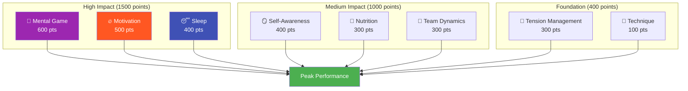

# Ambition

Our mission is to help elite players take the next step in their development.

::: tip Our Vision
**Transform elite players from technically proficient to mentally unstoppable.** We use a data-driven approach to identify your highest-impact improvement areas.
:::

## The 8-Factor Performance Model

Research and experience show that elite pétanque performance depends on **8 interconnected factors**. Most players over-invest in technique while neglecting the factors that actually separate good from great.

### Why Technique Has the Lowest Weight

::: warning The Uncomfortable Truth
**Technique accounts for only 100 of 2,900 total points** in our model.

This isn't because technique doesn't matter—it's because elite players have already developed adequate technique. The marginal improvement from perfecting your release is tiny compared to optimizing your sleep, managing tension, or strengthening your mental game.
:::

## The ROI Principle

Not all improvements are equal. We use **Return on Investment (ROI)** calculations to identify where your training time will have the biggest impact.

| Your Level | Factor Weight | ROI Potential |
|------------|---------------|---------------|
| Low skill in high-weight area | High (e.g., 600) | **Maximum** |
| High skill in high-weight area | High (e.g., 600) | Low (diminishing returns) |
| Low skill in low-weight area | Low (e.g., 100) | Moderate |
| High skill in low-weight area | Low (e.g., 100) | **Minimal** |

**Example:** Improving your sleep from 30% to 60% (high-weight factor, low current skill) will likely have more impact than improving technique from 75% to 85% (low-weight factor, already high skill).

## The 8 Factors Explained

| Factor | Weight | What It Covers |
|--------|--------|----------------|
| 🧠 **Mental Game** | 600 | Thought patterns, focus, confidence, flow state access |
| 🔥 **Motivation** | 500 | Drive, purpose, goal orientation, persistence |
| 😴 **Sleep & Recovery** | 400 | Quality rest, pre-competition protocols, energy management |
| 🪞 **Self-Awareness** | 400 | Accurate self-perception, blind spot recognition, feedback use |
| 🥗 **Nutrition** | 300 | Blood sugar stability, hydration, competition fueling |
| 🤝 **Team Dynamics** | 300 | Communication, trust, role clarity, team contribution |
| 💆 **Tension Management** | 300 | Physical relaxation, breath control, optimal arousal |
| 🎯 **Technique** | 100 | Physical mechanics, throw repertoire, consistency |

## Discover Your Path

We've built a **free assessment tool** that analyzes your current levels across all 8 factors and calculates your personalized improvement priorities.

::: info Take the Assessment
**[→ Start Your Player Development Assessment](/en/assessment/)**

In 5 minutes, you'll receive:
- Your radar chart across all 8 factors
- ROI-ranked recommendations for what to work on
- Links to specific educational content for your top priorities
- Option to get peer feedback from teammates
:::

## What We Offer

| Offering | Description | Link |
|----------|-------------|------|
| **Assessment Tool** | Identify your highest-ROI improvement areas | [Take Assessment](/en/assessment/) |
| **Education Modules** | Deep content on all 8 factors | [Browse Education](/en/education/) |
| **Workshops** | 3-4 hour sessions for groups of 6-8 players | [Workshop Guide](/en/guides/workshop/) |
| **Training Camps** | Weekend intensives mixing theory and practice | [Camp Guide](/en/guides/training-camp/) |

## Our Approach

### 1. Assess First
Start with honest self-evaluation. Get peer feedback to identify blind spots.

### 2. Prioritize by ROI
Focus on high-weight factors where you have room to grow—not what feels comfortable.

### 3. Learn the Science
Understand *why* something works, not just *what* to do.

### 4. Practice Deliberately
Apply techniques in training before competition. Build habits, not just knowledge.

### 5. Reassess Regularly
Track your progress. Your priorities will shift as you improve.

::: tip Ready to Take the Next Step?
**[→ Start with the Assessment](/en/assessment/)** — It's free and takes 5 minutes.

Or explore our [Education](/en/education/) section to dive into any of the 8 factors.
:::

