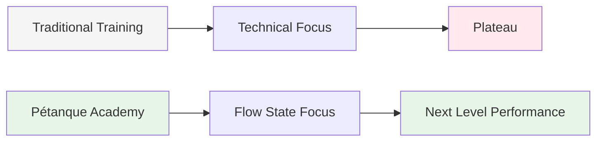
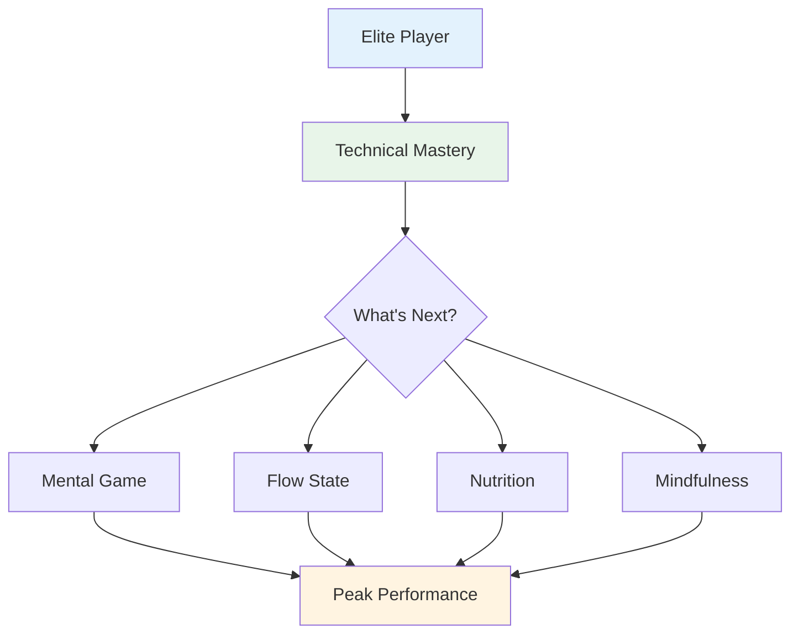

# Ambition

<AdBanner />

Our mission is to help elite players take the next step in their development.

::: tip Our Vision
**Transform elite players from technically proficient to mentally unstoppable.** We help you access the flow state where perfect boules become a natural expression of your mastery.
:::

## Moving Beyond Technique

Traditional training focuses heavily on technical aspects - the grip, the stance, the release. While these fundamentals are important, elite players have already mastered them.

::: info The Breakthrough
**The next level isn't about perfecting technique - it's about entering the flow state.**

We help players transition from a technical training perspective to a **flow (in the zone) perspective**, where perfect boules become a natural expression of their mastery rather than a conscious effort.
:::

## The Journey

## What We Offer

| Offering | Description | Impact |
|----------|-------------|--------|
| **Workshops** | Small groups of elite players (6-8) | Deep peer learning and support |
| **Education** | Mental aspects of peak performance | Practical techniques you can use immediately |
| **Community** | Like-minded players pushing boundaries | Accountability and shared growth |
| **Holistic Approach** | Nutrition, mindset, and mental training | Complete performance optimization |

::: tip Why It Works
Elite players already have the technical foundation. What separates good from great is the ability to access your best performance under pressure. That's what we focus on.
:::

## Our Approach

### 1. Flow State Training
Learn to enter "the zone" consistently, not by accident.

### 2. Mental Strength
Develop routines, mindfulness, and pressure management.

### 3. Smart Nutrition
Fuel your brain for stable focus and steady hands.

### 4. Peer Learning
Share experiences with other elite players in a safe, supportive environment.

::: info Ready to Take the Next Step?
Explore our [Education](/en/education/) section or learn about our [Workshops](/en/workshop).
:::

<AdBanner />

