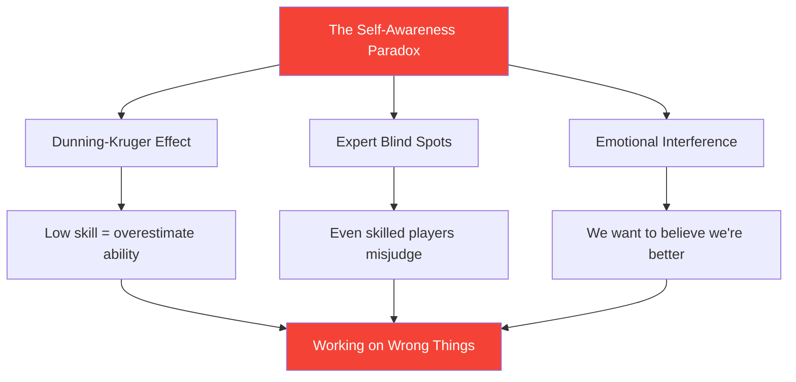

# Developing Self-Awareness: The Foundation of Improvement

> "You can't improve what you don't accurately perceive."

Self-awareness—knowing your actual strengths and weaknesses—is the foundation of effective development.

::: danger The Uncomfortable Truth
**Most players are working on the wrong things** because they don't see themselves clearly.
:::

---

## The Self-Awareness Paradox

---

## Why Pétanque Players Struggle

Pétanque makes self-assessment particularly difficult:

| Challenge | Why It's Hard |
|-----------|--------------|
| **Result Variance** | Good decisions can produce bad outcomes (and vice versa) |
| **Comparison Bias** | We remember best performances, explain away worst |
| **Identity Protection** | Admitting weakness feels threatening |

::: warning Memory Is Not Data
**We construct narratives that protect our self-image.** Objective tracking is essential.
:::

---

## The Components of Self-Awareness

True self-awareness requires insight into multiple domains:

| Domain | Key Questions |
|--------|---------------|
| **Technical** | Which throws are actually reliable? Which are inconsistent? |
| **Mental** | How do I respond to pressure? What triggers my inner critic? |
| **Physical** | When is my energy highest? How does fatigue affect me? |
| **Tactical** | Do I over-attack? Under-attack? How do I read situations? |
| **Emotional** | What frustrates me? When do I play tight? |
| **Interpersonal** | How do teammates perceive my communication? |

## External Feedback: The Mirror You Need

You cannot see your own blind spots. You need external perspectives.

### Structured Feedback Methods

**Video Analysis**
- Record matches and practice
- Watch with specific focus areas
- Notice patterns you miss in the moment

**Peer Assessment**
- Ask trusted teammates for honest feedback
- Use the [Assessment Tool](/en/assessment/) for peer validation
- Compare your self-rating with their rating

**Coach Observation**
- Fresh eyes see what familiar eyes miss
- Request specific feedback, not general impressions
- Track feedback themes over time

### The Feedback Gap

When your self-assessment differs significantly from external feedback, pay attention:

| Gap Type | Meaning | Action |
|----------|---------|--------|
| You rate higher | Possible blind spot | Investigate with video/data |
| You rate lower | Possible confidence issue | Focus on evidence of competence |
| Consistent gap | Systematic perception error | Recalibrate your mental model |

## Building Self-Awareness Habits

### Daily Reflection (5 minutes)

After each session, ask yourself:

1. **What went well?** (Be specific)
2. **What didn't go well?** (Be honest)
3. **What would I do differently?** (Be constructive)
4. **What surprised me?** (Be curious)

### Weekly Review (15 minutes)

Look for patterns:

- Which situations consistently challenge me?
- Where am I improving?
- What feedback have I received?
- What am I avoiding looking at?

### Monthly Assessment

Use the [Player Assessment](/en/assessment/) tool:

- Rate yourself on all 8 factors
- Request peer validation
- Compare to previous month
- Identify largest gaps

## The Data Advantage

Subjective perception is unreliable. Data provides objectivity:

### What to Track

**Performance Data**
- Success rates by throw type
- Performance under pressure vs. no pressure
- First set vs. later sets
- With different partners

**Process Data**
- Sleep quality before matches
- Pre-match routine compliance
- Mental state during key moments
- Recovery time after mistakes

### How to Use Data

1. **Identify patterns** — What correlates with good/poor performance?
2. **Challenge assumptions** — Does data match your beliefs?
3. **Guide training** — Focus on actual weaknesses, not perceived ones
4. **Track progress** — Improvement is often invisible without measurement

## Common Self-Awareness Blocks

::: warning Watch For These
- **Defensiveness** when receiving feedback
- **Explaining away** poor performances
- **Seeking confirmation** rather than truth
- **Avoiding measurement** of weak areas
- **Blaming external factors** consistently
:::

## The Growth Mindset Connection

Self-awareness requires accepting that:

- Current ability is not fixed
- Weakness is information, not identity
- Feedback is a gift, not an attack
- Improvement requires honest assessment

## Action Steps

1. **Today:** Complete the [Self-Assessment](/en/assessment/)
2. **This week:** Request peer feedback from 2 trusted teammates
3. **Ongoing:** Establish daily reflection habit
4. **Monthly:** Track progress with repeated assessments

---

## Related Content

- [Self-Awareness Module](/en/education/self-awareness/) — Complete education
- [Player Assessment](/en/assessment/) — Evaluate your 8 factors
- [The Inner Critic](/en/articles/inner-critic) — Managing self-judgment

