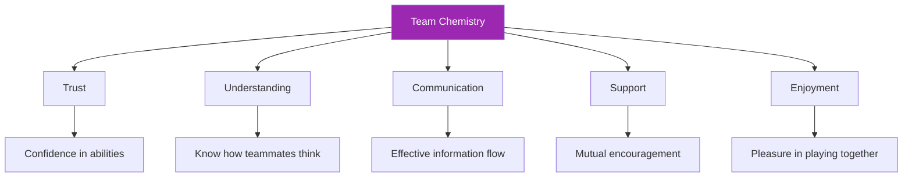

# Building Team Chemistry

> "You've seen it: teams where the whole exceeds the sum of parts."

Players who anticipate each other, support each other, and perform better together than alone. This is team chemistry — and it's not accidental.

::: tip Chemistry Is Built, Not Found
**Great teams aren't assembled — they're developed.** Chemistry requires intentional effort over time.
:::

---

## What Is Team Chemistry?

---

## Why Chemistry Matters

| With Chemistry ✅ | Without Chemistry ❌ |
|-------------------|----------------------|
| Make better collective decisions | Blame each other for failures |
| Recover faster from setbacks | Communicate poorly under stress |
| Perform consistently under pressure | Underperform relative to talent |
| Enjoy competition more | Experience conflict and frustration |
| Stay together longer | Team dissolves |

## The Building Blocks

### 1. Shared Goals

Chemistry starts with alignment:
- What are we trying to achieve?
- What does success look like?
- What are we willing to sacrifice?

Teams with conflicting goals (one wants fun, another wants to win at all costs) struggle to build chemistry.

### 2. Role Clarity

Each player needs to know:
- What's expected of them
- How they contribute to team success
- When to lead and when to follow

Unclear roles create friction and resentment.

### 3. Mutual Respect

Respect means:
- Valuing each teammate's contribution
- Accepting different styles and approaches
- Treating each other with dignity, especially under pressure

### 4. Psychological Safety

Players need to feel safe to:
- Make mistakes without harsh judgment
- Express opinions and concerns
- Be themselves without pretense

## Building Chemistry: Practical Steps

### Time Together

Chemistry requires investment:
- Practice together regularly
- Spend time together off the terrain
- Share experiences beyond pétanque

### Structured Team Building

Intentional activities help:
- Team goal-setting sessions
- Post-match debriefs (constructive)
- Discussions about playing styles and preferences

### Conflict Resolution

Address issues before they fester:
- Create space for honest conversation
- Focus on behaviors, not personalities
- Seek solutions, not blame

### Celebrate Together

Shared joy builds bonds:
- Acknowledge good performances
- Celebrate team achievements
- Mark milestones together

## Chemistry Killers

### Blame Culture

When mistakes lead to criticism rather than support, trust erodes quickly.

### Unequal Commitment

If some players invest more than others, resentment builds.

### Poor Communication

Misunderstandings and assumptions create distance.

### Ego Conflicts

When individual recognition matters more than team success, chemistry suffers.

### Unresolved Conflict

Issues that aren't addressed don't disappear — they grow.

## Chemistry in Competition

### Before Matches

- Arrive together, warm up together
- Brief team discussion on approach
- Positive energy and mutual encouragement

### During Matches

- Visible support for each other
- Constructive communication only
- Shared celebration of good plays
- Collective response to setbacks

### After Matches

- Win or lose, stay together
- Brief debrief (what worked, what to improve)
- Maintain positive relationships regardless of result

## Different Personalities

Strong teams often include different personality types:

- **The Steady One**: Calm under pressure, consistent
- **The Energizer**: Brings enthusiasm and motivation
- **The Strategist**: Thinks ahead, sees patterns
- **The Competitor**: Drives the will to win

Chemistry isn't about everyone being the same — it's about differences working together.

## When Chemistry Is Missing

### Signs of Poor Chemistry

- Visible frustration with teammates
- Blame after mistakes
- Lack of communication
- Playing as individuals, not a team
- Dreading rather than enjoying matches

### Rebuilding Chemistry

1. **Acknowledge the problem**: Name it openly
2. **Identify causes**: What's creating the friction?
3. **Commit to change**: All parties must invest
4. **Take action**: Specific steps to improve
5. **Be patient**: Chemistry takes time to rebuild

### When to Move On

Sometimes chemistry can't be fixed:
- Fundamental value differences
- Repeated broken trust
- Unwillingness to change

It's okay to recognize when a team isn't working.

## The Captain's Role

If you're the team leader:
- Model the behavior you want to see
- Address issues early and directly
- Create opportunities for connection
- Protect the team culture
- Balance individual needs with team needs

## Long-Term Chemistry

Chemistry isn't static — it requires maintenance:

### Regular Check-Ins

- How are we functioning as a team?
- What's working? What isn't?
- Any issues to address?

### Continuous Investment

- Keep spending time together
- Keep communicating openly
- Keep supporting each other

### Adaptation

- As players grow and change, so must the team
- Be willing to evolve roles and dynamics
- Stay curious about each other

---

*Related: [Team Dynamics](/en/education/team-dynamics/) | [Communication](/en/education/team-dynamics/communication) | [Leadership in Pétanque](/en/articles/team-leadership)*

