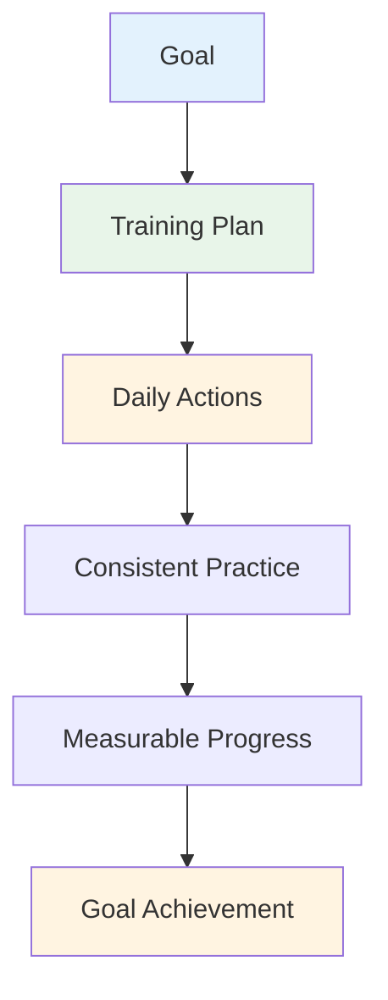

# Creating Your Training Plan

Goals without a plan are just wishes. This guide helps you turn your goals into a structured training plan that actually works.

::: tip The Big Idea
**Goals without a plan are just wishes.** A structured training plan transforms your goals into daily actions that compound into real progress.
:::

## The 8 Phases of Self-Directed Development

### Phase 1: Set Your Compass (Goals)
You've already learned about SMART goals. Now put them in a hierarchy:

1. **Long-term goal** (1-2 years): Your dream
2. **Annual goal**: This year's target
3. **Quarterly goals**: 3-month milestones
4. **Monthly goals**: Specific focus areas
5. **Weekly goals**: Training targets

### Phase 2: Assess Your Resources

Before planning, honestly evaluate what you have:

| Resource | Questions to Ask |
|----------|-----------------|
| **Time** | How many hours per week can you realistically train? |
| **Location** | Do you have access to a proper piste? What's the surface quality? |
| **Equipment** | Do you have appropriate boules? Measuring tools? Video capability? |
| **Knowledge** | What are your technical strengths and weaknesses? |
| **Physical condition** | Any limitations? Areas needing work? |

Be honest. A realistic plan beats an ambitious fantasy.

### Phase 3: Choose Your Exercises

Select exercises that directly support your goals:

**For pointing improvement:**
- Precision pointing to marked zones
- Distance variation drills
- Different surface practice

**For shooting improvement:**
- Shooting ladder (progressive distances)
- Obstacle shooting (forced high arc)
- Moving target practice

**For mental development:**
- Pre-shot routine practice
- Visualization sessions
- Pressure simulation

**Balance your program:**
- Technical work (pointing, shooting)
- Mental training (mindfulness, visualization)
- Physical conditioning (balance, flexibility)
- Match play (applying skills)

### Phase 4: Create Your Schedule

Build a realistic weekly schedule:

| Day | Morning | Afternoon | Evening | Focus |
|-----|---------|-----------|---------|-------|
| Mon | - | Technical: Pointing | Light mobility | Precision |
| Tue | - | Technical: Shooting | - | Power/accuracy |
| Wed | - | Mental training | - | Mindfulness |
| Thu | - | Mixed: Game scenarios | Light mobility | Application |
| Fri | - | Technical: Weakness | - | Improvement |
| Sat | Match play or competition | - | - | Performance |
| Sun | Rest | Weekly review | Planning | Recovery |

**Key principles:**
- Prioritize mental training (it's often neglected)
- Include rest days
- Balance different skills
- Leave flexibility for life

### Phase 5: Prepare for Obstacles

Things will go wrong. Plan for it.

| Risk | Likelihood | Impact | Backup Plan |
|------|------------|--------|-------------|
| Time shortage | High | Medium | Have a "minimum session" ready (20 min) |
| Bad weather | Medium | Medium | Indoor visualization, video study |
| Low motivation | High | Medium | Return to "why", smaller goals, take a break |
| Minor injury | Medium | High | Focus on mental training, non-affected skills |
| No practice partner | Medium | Low | Solo drills, video self-analysis |

### Phase 6: Track Your Progress

What gets measured gets managed.

**Keep a training diary:**
- Date and duration
- Exercises completed
- Scores/results
- How you felt (energy, focus, flow)
- Technical notes
- Weather/conditions

**Weekly review questions:**
- Did I complete my planned sessions?
- What scores did I achieve?
- What felt good? What was difficult?
- Any flow experiences?
- What should I adjust?

### Phase 7: Stay Motivated

Motivation fluctuates. Build systems to maintain it:

**Internal motivation:**
- Connect to your "why"
- Celebrate small wins
- Notice improvement over time
- Find joy in the process

**External support:**
- Training partners (even occasionally)
- Share goals with someone
- Join online communities
- Track streaks and consistency

**When motivation drops:**
- Do a minimum session (something beats nothing)
- Change your environment
- Review your progress
- Remember past successes
- Take a planned break if needed

### Phase 8: Review and Adapt

Your plan should evolve:

**Weekly:** Quick review, minor adjustments
**Monthly:** Assess progress toward monthly goals, adjust focus
**Quarterly:** Major review, set next quarter's goals
**Annually:** Full assessment, new annual plan

**Questions for review:**
- Am I making progress toward my goals?
- Is my training effective?
- Do I need different exercises?
- Are my goals still relevant?
- What have I learned?

## Sample 8-Week Plan

**Goal:** Improve shooting accuracy by 15%

| Week | Focus | Key Sessions |
|------|-------|--------------|
| 1 | Baseline | Test current level, video analysis |
| 2 | Technique | Identify and work on key issue |
| 3 | Repetition | High volume shooting practice |
| 4 | Test | Mid-point assessment, adjust |
| 5 | Variation | Different distances and angles |
| 6 | Pressure | Add consequences to drills |
| 7 | Integration | Game-like scenarios |
| 8 | Final test | Measure improvement |

## Key Takeaway

> Plan your work, then work your plan. But be ready to adapt.

The best plan is one you'll actually follow. Start simple, stay consistent, and adjust as you learn.

