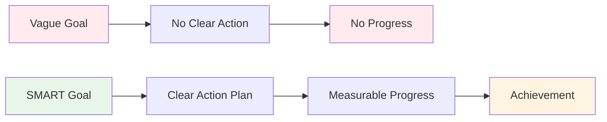

# SMART Goals for Pétanque

The SMART framework transforms vague wishes into actionable goals. Let's look at each element in detail, with specific examples for pétanque.

::: tip The Big Idea
**Vague goals lead to vague results.** SMART goals create clarity, action, and measurable progress. Transform "I want to get better" into specific targets you can actually achieve.
:::

## S - Specific

A specific goal answers these questions:
- **What** exactly do I want to achieve?
- **Where** will this happen?
- **Which** aspects are involved?

### Making Goals Specific

| Vague | Specific |
|-------|----------|
| "Improve my pointing" | "Improve my pointing accuracy on gravel surfaces at 7-9 meter distances" |
| "Get mentally stronger" | "Develop a consistent pre-shot routine that I use for every throw" |
| "Win more games" | "Win at least 60% of my competitive games this season" |

### Specificity Checklist
- [ ] Can someone else understand exactly what I'm trying to do?
- [ ] Have I defined the conditions (distance, surface, situation)?
- [ ] Is there only one interpretation of this goal?

## M - Measurable

If you can't measure it, you can't manage it. Measurable goals let you track progress and know when you've succeeded.

### Ways to Measure Pétanque Goals

**Quantitative measures:**
- Points scored in drills (e.g., 24/30)
- Percentage accuracy (e.g., 75% hit rate)
- Distance from target (e.g., average 30cm from jack)
- Consistency (e.g., 3 successful sessions in a row)

**Using Training Drills as Measures:**

| Drill | What It Measures | Target Example |
|-------|-----------------|----------------|
| Shooting Ladder | Shooting accuracy under pressure | Reach 10m within 30 boules |
| Pointing Precision | Pointing accuracy to zone | 24/30 points |
| Distance Variation | Depth control | 80% within 50cm |

### Tracking Your Measurements
Keep a simple log:
- Date
- Drill/exercise
- Score/result
- Conditions (surface, weather)
- Notes

## A - Achievable (but Challenging)

Goals should stretch you without being impossible.

### Finding the Right Level

**Too easy:** "Practice once this month"
- No growth, no motivation

**Too hard:** "Never miss a shot"
- Impossible, leads to frustration

**Just right:** "Improve shooting accuracy by 15% in 8 weeks"
- Challenging but realistic with effort

### Questions to Test Achievability
- Have others at my level achieved this?
- Do I have the time and resources needed?
- Is this within my control (mostly)?
- Am I willing to do what it takes?

### Stretch Goals
It's okay to have ambitious long-term goals. Just make sure your short-term goals are achievable steps toward them.

## R - Relevant

Your goals should align with your bigger picture.

### Relevance Questions
- Does this goal support my overall development?
- Is this the right priority right now?
- Does this fit with my available time and resources?
- Am I genuinely motivated by this goal?

### Example: Checking Relevance

**Situation:** You want to compete at national level

**Relevant goals:**
- Improve shooting accuracy (directly impacts results)
- Develop mental routines (helps in pressure situations)
- Increase training frequency (builds skill faster)

**Less relevant goals:**
- Learn trick shots (fun but not competitive priority)
- Buy expensive new boules (equipment isn't your limiting factor)

## T - Time-bound

Deadlines create urgency and enable planning.

### Setting Timeframes

| Goal Type | Typical Timeframe |
|-----------|------------------|
| Long-term | 1-3 years |
| Annual | 12 months |
| Quarterly | 3 months |
| Monthly | 4 weeks |
| Weekly | 7 days |
| Session | Single practice |

### Example Timeline

**Long-term (2 years):** Qualify for national team selection

**Annual:** Finish top 10 in regional rankings

**Quarterly (Q1):** 
- Establish consistent training routine
- Improve shooting to 70% accuracy

**Monthly (January):**
- Week 1: Assess current level, set baselines
- Week 2-3: Focus on shooting technique
- Week 4: Test and measure progress

**Weekly:**
- Monday: Technical shooting session
- Wednesday: Pointing and game situations
- Friday: Mental training and visualization
- Weekend: Competition or match practice

## Putting It All Together

### Goal Setting Worksheet

**My Goal (first draft):**
_________________________________

**Specific - What exactly?**
_________________________________

**Measurable - How will I know?**
_________________________________

**Achievable - Is it realistic?**
_________________________________

**Relevant - Why does this matter?**
_________________________________

**Time-bound - By when?**
_________________________________

**My SMART Goal (final version):**
_________________________________

### Example Completed

**First draft:** "Get better at shooting"

**SMART version:** "By April 30th, I will achieve a score of 24/30 or higher on the Shooting Ladder drill (6-10m with obstacles) in three consecutive training sessions, measured by my training log."

## Key Takeaway

> SMART goals turn dreams into plans and plans into results.

Take time to craft your goals properly. A well-defined goal is half the journey.

