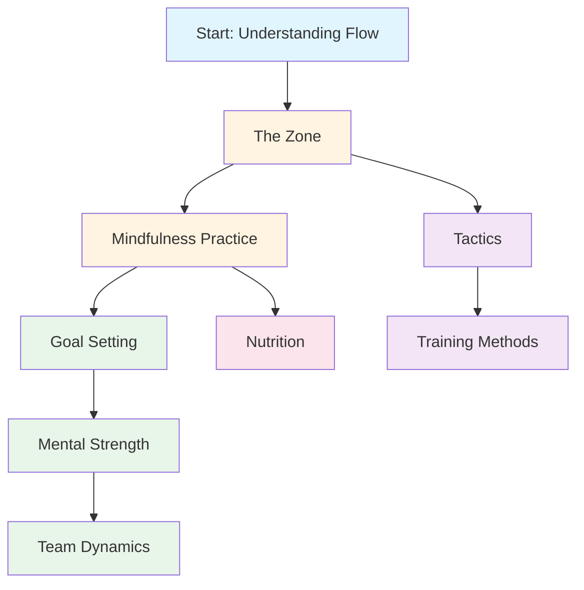

# Education
<AdBanner />

Welcome to the Pétanque Academy Education program. This is where elite players learn to master the mental game.

::: tip Core Principle
At the elite level, **mental training becomes more important than technical training**. The ratio inverts as you develop: beginners need 90% technical work, experts need 80% mental work.
:::

## Why Mental Training Matters

At the elite level, technical skill is just the starting point. Research shows that mental attitude can be as important as physical skill in precision sports like pétanque. The difference between good players and great players is often in their minds.

> "Sport is 100% mental. The mind is the driving force behind all physical abilities."

## Your Learning Journey

Here's the recommended path through our education program:

**Recommended sequence:**
1. **Foundation:** Start with The Zone and Mindfulness
2. **Structure:** Add Goal Setting and Training Methods
3. **Competition:** Build Mental Strength and Tactics
4. **Team Play:** Master Team Dynamics
5. **Optimization:** Fine-tune with Nutrition

## Our Learning Paths

### 🎯 [The Zone (Flow State)](/en/education/the-zone/)
Learn what "the zone" really is and how to access it. Understand the science behind flow states and discover practical techniques to perform at your best when it matters most.

### 🧘 [Mindfulness](/en/education/mindfulness/)
Master the art of being present. Learn scientifically-proven techniques to calm your mind, improve focus, and recover quickly from mistakes.

### 📊 [Goal Setting](/en/education/goals/)
Create a roadmap for your development. Learn the SMART framework adapted for pétanque and build a training plan that actually works.

### 💪 [Mental Strength](/en/education/mental-strength/)
Build the mental toughness needed for competition. Learn to handle pressure, overcome anxiety, and develop routines that trigger peak performance.

### 🤝 [Team Dynamics](/en/education/team-player/)
Become the teammate everyone wants to play with. Learn about communication, trust, and how to contribute to a winning team culture.

### ♟️ [Tactics](/en/education/tactics/)
Think strategically about every situation. Learn probability-based decision making and when to take risks.

### 🏋️ [Training Methods](/en/education/training/)
Train smarter, not just harder. Learn how to structure your practice for maximum improvement.

### 🥗 [Nutrition](/en/education/nutrition/)
Fuel your brain for precision performance. Learn how to maintain stable energy and focus throughout competition.

<AdInArticle />

## The Journey from Technique to Flow

As you develop as a player, your training ratio inverts - mental training becomes more important, not less:

| Level | Ratio (Tech:Mental) | Primary Objective |
|-------|---------------------|-------------------|
| **Beginner** | 90 : 10 | Build the Machine |
| **Intermediate** | 70 : 30 | Stabilize the Skill |
| **Advanced** | 50 : 50 | Trust the Machine |
| **Expert** | 20 : 80 | Freedom of Performance |

You cannot train a Beginner like an Expert (they lack the neural pathways), and you cannot train an Expert like a Beginner (high technical volume causes over-thinking).

## Quick Reference: Key Principles from Each Section

| Section | Core Principle | Key Takeaway |
|---------|---------------|--------------|
| **The Zone** | Switch from analytical to automatic mode | *"There are no techniques that always produce a perfect boule. But there is a mental state where perfect boules become natural."* |
| **Mindfulness** | Choose where to put your attention | *"Mindfulness isn't about emptying your mind. It's about choosing where to put your attention."* |
| **Goal Setting** | Focus on what you control | *"A goal without a plan is just a wish."* |
| **Mental Strength** | Perform well despite nerves | *"Mental strength isn't about eliminating nerves or never making mistakes. It's about performing well despite them."* |
| **Team Dynamics** | Trust and communication win games | *"The best teams aren't always the most skilled - they're the ones who play best together."* |
| **Tactics** | Decision-making beats technique | *"At elite level, the difference is rarely technique - it's decision-making."* |
| **Training** | Quality over quantity | *"Train smarter, not just harder."* |
| **Nutrition** | Stable energy = stable performance | *"Your brain is a precision instrument. Fuel it accordingly."* |

## All Key Rules & Takeaways

::: details Click to expand: Complete list of principles
This is your quick reference guide. Bookmark this section and return to it regularly.

### The Zone Rules
1. **The Switch Rule:** Analyze before the circle, execute in the circle, observe after
2. **The Inversion Rule:** As skill increases, mental training becomes more important than technical training
3. **The Trust Rule:** Your conscious mind plans, your subconscious executes

### Mindfulness Rules
1. **The Awareness Rule:** Observe without judgment
2. **The SOAS Rule:** Stop, Observe, Accept, Slip (let go)
3. **The Present Rule:** You can only control this moment, this throw

### Goal Setting Rules
1. **The Control Rule:** Focus on process goals (what you control) over outcome goals
2. **The SMART Rule:** Goals must be Specific, Measurable, Achievable, Relevant, Time-bound
3. **The Breakdown Rule:** Large goals need quarterly, monthly, and weekly milestones

### Mental Strength Rules
1. **The Routine Rule:** Consistent pre-shot routines trigger peak performance
2. **The Reset Rule:** Develop a 10-second reset routine after mistakes
3. **The Confidence Loop:** Better preparation → More confidence → Better performance

### Tactical Rules
1. **The Probability Rule:** Choose throws where success probability justifies the risk
2. **The Jack Control Rule:** The team that controls jack position has the advantage
3. **The Distance Rule:** Short distance favors shooting, long distance favors pointing
4. **The Style Rule:** Force the game into your team's strongest style
5. **The Boule Management Rule:** Sometimes conceding 1 point is better than risking 3

### Team Dynamics Rules
1. **The Communication Rule:** Clear, positive communication builds trust
2. **The Support Rule:** How you respond to teammates' mistakes matters more than your skill
3. **The Role Rule:** Know your role and execute it fully

### Training Rules
1. **The Specificity Rule:** Train what you want to improve
2. **The Variation Rule:** Random practice beats blocked practice for competition transfer
3. **The Recovery Rule:** Rest is when adaptation happens

### Nutrition Rules
1. **The Stability Rule:** Avoid blood sugar spikes and crashes
2. **The Hydration Rule:** Even 2% dehydration impairs performance
3. **The Timing Rule:** Eat 2-3 hours before competition
:::

## Start Your Journey

::: tip Recommended Starting Point
Begin with [The Zone](/en/education/the-zone/) to understand the foundation of elite performance, then explore [Mindfulness](/en/education/mindfulness/) for practical techniques you can use immediately.
:::

<AdBanner />
