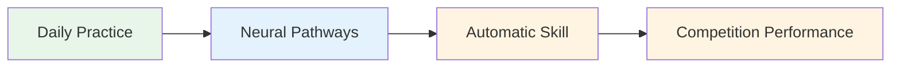
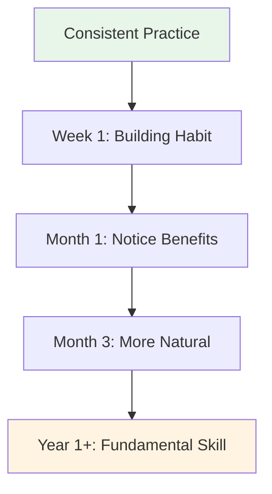

# Building a Daily Mindfulness Practice

The benefits of mindfulness come from consistent practice. Here's how to make it part of your life.

::: tip The Big Idea
**Consistency beats intensity.** Five minutes every day beats an hour once a week. Start small, be consistent, and the benefits compound over time.
:::

## Why Daily Practice Matters

::: info Mindfulness is Like Physical Fitness
- ❌ You can't get fit from one gym session
- ✅ Regular practice builds lasting change
- ✅ The effects compound over time
- ✅ It becomes easier with consistency
:::

::: tip Research-Backed
Research shows that even **3 minutes daily** creates measurable benefits. But you have to do it regularly.
:::

## Creating Your Routine

### Step 1: Choose Your Time

Pick a consistent time that works for your life:

| Time | Advantages | Considerations |
|------|------------|----------------|
| **Morning** | Sets tone for day, fewer interruptions | Need to wake earlier |
| **Midday** | Breaks up the day, resets focus | May forget, schedule conflicts |
| **Evening** | Wind down, reflect on day | May be tired, less alert |
| **Before practice** | Direct connection to pétanque | Depends on practice schedule |

**Best approach:** Link it to an existing habit (after coffee, before lunch, etc.)

### Step 2: Start Small

Don't aim for 30 minutes on day one.

**Recommended progression:**
- Week 1-2: 3-5 minutes
- Week 3-4: 5-10 minutes
- Month 2: 10-15 minutes
- Month 3+: 15-20 minutes

It's better to do 5 minutes every day than 30 minutes once a week.

### Step 3: Create Your Space

You don't need a meditation room, but having a consistent spot helps:
- Somewhere quiet (or use headphones)
- Comfortable seating
- Minimal distractions
- Same place each time if possible

### Step 4: Remove Barriers

Make it easy to practice:
- Put your phone on silent
- Tell family/housemates not to interrupt
- Have everything ready (cushion, timer)
- Don't wait for "perfect" conditions

## Sample Daily Schedules

### Minimal Practice (5 minutes)
- Morning: 3 minutes conscious breathing
- Throughout day: 3 mindfulness bell moments
- Evening: 2 minutes body awareness before sleep

### Standard Practice (15 minutes)
- Morning: 10 minutes seated meditation
- Midday: 2 minutes conscious breathing
- Evening: 3 minutes body scan

### Intensive Practice (30 minutes)
- Morning: 15 minutes seated meditation
- Midday: 5 minutes walking meditation
- Evening: 10 minutes body scan
- Plus: Mindful eating at one meal

## Integrating with Pétanque Training

### Before Practice
- 5 minutes seated meditation
- Set an intention for the session
- Body scan to notice any tension

### During Practice
- Use pre-shot routine as mindfulness practice
- Apply SOAS after mistakes
- Stay present between throws

### After Practice
- 3 minutes reflection (without judgment)
- Note any flow moments
- Conscious breathing to transition out

## Tracking Your Practice

Keeping track helps maintain consistency:

### Simple Log
| Date | Duration | Type | Notes |
|------|----------|------|-------|
| Mon | 10 min | Seated | Mind very busy |
| Tue | 10 min | Seated | Calmer today |
| Wed | 5 min | Body scan | Found tension in shoulders |

### What to Track
- Did you practice? (Yes/No)
- How long?
- What type?
- Brief note on experience (optional)

### Apps That Help
- Headspace
- Calm
- Insight Timer
- Simple habit trackers

## Overcoming Common Obstacles

### "I don't have time"
- You have 3 minutes
- It's about priority, not time
- Try linking to existing activities

### "I keep forgetting"
- Set a daily alarm
- Link to existing habit
- Put a visual reminder somewhere you'll see it

### "I'm not doing it right"
- There's no "right" way
- If you're paying attention, you're doing it
- Wandering mind is normal and expected

### "I don't see results"
- Benefits are subtle at first
- Keep a journal to notice changes over time
- Trust the research - it works

### "It's boring"
- Boredom is just another experience to observe
- Try different techniques
- Remember why you're doing it

## Signs of Progress

You might not notice dramatic changes, but look for:
- Catching yourself when mind wanders (faster)
- Recovering from frustration more quickly
- Noticing tension before it builds
- Feeling more present during games
- Better sleep
- Less reactive to bad throws

## The Long Game

Mindfulness is a lifetime practice. Elite athletes often say it's the most valuable skill they've developed.

**Month 1:** Building the habit
**Months 2-3:** Starting to notice benefits
**Months 4-6:** Becoming more natural
**Year 1+:** Fundamental part of who you are

## Key Takeaway

> Consistency beats intensity. Five minutes every day beats an hour once a week.

Start today. Start small. Keep going.

