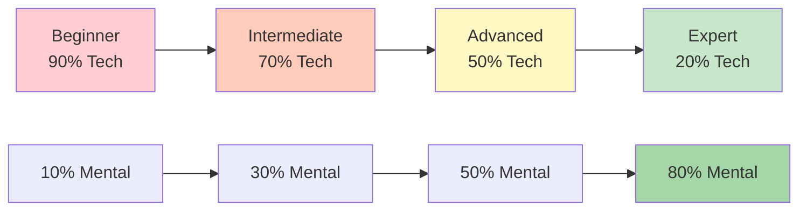

# Technical Training vs Flow Training

Understanding the difference between technical training and flow training is essential for elite development. Both are necessary, but they serve different purposes and require different approaches.

::: tip The Core Principle
**You cannot train a Beginner like an Expert** (they lack the neural pathways), and **you cannot train an Expert like a Beginner** (high technical volume causes over-thinking).
:::

## Two Types of Training

::: info Technical Training (Explicit Learning)
**Focus:** Mechanics and form
**Attention:** Conscious body movements
**Method:** Breaking down skills, repetitive practice
**Best for:** Learning new skills, correcting bad habits, building foundation

**Example:** Practicing your release point 50 times with video analysis
:::

::: info Flow Training (Implicit Learning)
**Focus:** Outcomes, not mechanics
**Attention:** Letting subconscious take over
**Method:** Varied, game-like practice, visualization
**Best for:** Competition preparation, building confidence, peak performance

**Example:** Playing practice games with pressure, focusing only on targets
:::

## The Dynamic Inversion Model

The correct training ratio is inversely correlated with technical competence. As you master technique, mental training becomes more important - not less.

### 1. Beginner (Cognitive Stage)
- You consciously think about *what* to do
- Movements feel awkward and require effort
- Brain is fully saturated with mechanics
- **Ratio:** 90% Technical / 10% Mental
- **Mental focus:** Enjoyment, external focus (look at target), not complex visualization

### 2. Intermediate (Associative Stage)
- You refine the skill with less conscious thought
- Movements become smoother, errors decrease
- You start to detect your own mistakes
- **Ratio:** 70% Technical / 30% Mental
- **Mental focus:** Developing your Pre-Performance Routine (PPR)

### 3. Advanced (Threshold of Autonomy)
- The skill is largely automated
- Your self-image often lags behind your physical ability
- Training focuses on pressure simulation
- **Ratio:** 50% Technical / 50% Mental
- **Mental focus:** Visualization, self-image, anxiety control

### 4. Expert (Autonomous Stage)
- Technical skills are fully subconscious
- Conscious attention to mechanics disrupts performance
- Maintenance volume is all you need technically
- **Ratio:** 20% Technical / 80% Mental
- **Mental focus:** Flow state, strategy, quieting the mind

## The Progression Table

| Level | Tech : Mental | Primary Objective |
|-------|---------------|-------------------|
| Beginner | 90 : 10 | Build the Machine |
| Intermediate | 70 : 30 | Stabilize the Skill |
| Advanced | 50 : 50 | Trust the Machine |
| Expert | 20 : 80 | Freedom of Performance |

## The Expert Trap

For advanced and expert players, reverting to high technical focus is dangerous.

**The problem:** When you've automated a skill but consciously monitor it during competition, you engage the conscious mind and override the subconscious. This causes performance anxiety and "choking."

**The science:** The volume required to maintain a skill is significantly lower (often 1/3 to 1/9th) than the volume required to build it. Experts need minimal technical work to retain their touch.

**Elite example:** Champions like Philippe Quintais and Dylan Rocher focus heavily on tactical scenarios and critical moments rather than mechanical drills.

Signs you're over-thinking technique:
- Paralysis by analysis
- Inconsistent performance despite good technique
- Worse results in competition than in practice
- Feeling "mechanical" instead of fluid

## Training Methods Compared

| Aspect | Technical Training | Flow Training |
|--------|-------------------|---------------|
| **Practice type** | Blocked (same skill repeatedly) | Random (varied skills) |
| **Feedback** | Immediate, detailed | Delayed, outcome-focused |
| **Environment** | Controlled, predictable | Variable, game-like |
| **Mental state** | Analytical, conscious | Intuitive, automatic |
| **Best time** | Off-season, skill building | Pre-competition, maintenance |

## Blocked vs Random Practice

**Blocked practice:** Repeat the same throw 20 times
- Feels productive (you see quick improvement)
- Good for initial learning
- Poor for long-term retention

**Random practice:** Vary distance, target, and throw type
- Feels harder (more mistakes)
- Better for competition transfer
- Builds adaptability and decision-making

## Practical Guidelines

### For Technical Sessions
1. Focus on ONE aspect at a time
2. Use video analysis
3. Get feedback from a coach or training partner
4. Accept that it will feel awkward at first
5. Keep sessions shorter (quality over quantity)

### For Flow Sessions
1. Create game-like pressure
2. Focus on the target, not your body
3. Use your pre-shot routine consistently
4. Don't analyze during the session
5. Trust your training

## The Integration Challenge

The real skill is knowing when to use each mode:

**During a competition game:**
- Technical thinking: NEVER during execution
- Flow mode: ALWAYS when throwing

**During practice:**
- Technical sessions: Scheduled, specific focus
- Flow sessions: Game simulation, pressure practice

## Weekly Balance Example

| Day | Session Type | Focus |
|-----|-------------|-------|
| Monday | Technical | Pointing precision |
| Tuesday | Technical | Shooting accuracy |
| Wednesday | Flow | Mental training, visualization |
| Thursday | Mixed | Game scenarios with flow focus |
| Friday | Technical | Weakness area |
| Saturday | Flow | Match play, competition simulation |
| Sunday | Rest | Recovery, reflection |

## Summary: Training Balance Rules

::: tip Rule #1: Match Training to Level
**Beginners (90/10):** Build the machine - focus on technique
**Intermediate (70/30):** Stabilize the skill - add mental work
**Advanced (50/50):** Trust the machine - balance both
**Expert (20/80):** Freedom of performance - mostly mental
:::

::: tip Rule #2: Blocked vs Random Practice
**Blocked practice** (same throw repeatedly): Good for initial learning, poor for retention
**Random practice** (varied throws): Harder in practice, better in competition
:::

::: tip Rule #3: The Expert Trap
**For experts:** High technical volume causes over-thinking and choking
**Solution:** Minimal technical maintenance, maximum mental training
:::

## Key Takeaway

> You cannot train a Beginner like an Expert (they lack the neural pathways for mental work), and you cannot train an Expert like a Beginner (high technical volume causes burnout and over-thinking).

The journey from technique to flow requires strategic inversion. Match your training to your developmental stage.

