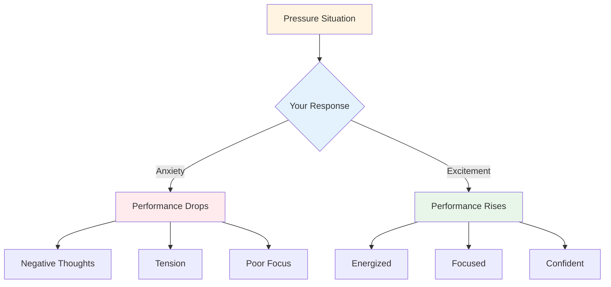

# Handling Pressure

Pressure is part of competition. The goal isn't to eliminate it - that's impossible. The goal is to perform well despite it, and even use it to your advantage.

::: tip The Big Idea
**Pressure doesn't go away with experience - you just get better at performing with it.** The best players aren't calm; they're skilled at using their arousal productively.
:::

## Understanding Pressure

### What Creates Pressure?
- High stakes (important game, decisive throw)
- Being watched (audience, teammates)
- Expectations (yours and others')
- Uncertainty (close score, unfamiliar opponents)
- Time (running out, waiting too long)

### What Pressure Does to Your Body
When you feel pressure, your body responds:
- Heart rate increases
- Breathing becomes shallow
- Muscles tense
- Hands may shake
- Focus narrows (sometimes too much)

This is your body preparing for action. It's not bad - it's energy you can use.

## Reframing Pressure

### Pressure as Excitement

The physical sensations of anxiety and excitement are almost identical. The difference is how you interpret them.

**Anxiety interpretation:** "I'm nervous, something bad might happen"
**Excitement interpretation:** "I'm energized, this is important to me"

**Try this:** When you feel pressure, say to yourself: "I'm excited" instead of "I'm nervous."

### Pressure as Privilege

Only important moments create pressure. If you're feeling it, you're in a situation that matters.

> "Pressure is a privilege - it only comes to those who earn it." - Billie Jean King

## Techniques for High-Pressure Moments

### 1. Breath Control

Your breath is the fastest way to change your state.

**The 4-7-8 Technique:**
1. Inhale for 4 counts
2. Hold for 7 counts
3. Exhale for 8 counts
4. Repeat 2-3 times

**Quick reset (in the circle):**
- One slow, deep breath
- Feel your feet on the ground
- Drop your shoulders on the exhale

### 2. Physical Grounding

Connect with physical sensations to get out of your head:
- Feel the weight of the boule
- Notice your feet on the ground
- Squeeze and release your non-throwing hand
- Roll your shoulders back

### 3. Focus Narrowing

In pressure moments, focus only on what matters:
- Not the score
- Not the audience
- Not what might happen
- Just this throw, this target, this moment

**Cue words:** "Here. Now. This."

### 4. Process Focus

Shift from outcome to process:

**Outcome focus (creates pressure):**
- "I need to make this"
- "If I miss, we lose"
- "Everyone is watching"

**Process focus (reduces pressure):**
- "Follow my routine"
- "See the target"
- "Trust my training"

### 5. The Left-Hand Squeeze

For right-handed players, squeezing your left hand for 10-15 seconds:
- Activates the right brain hemisphere
- Quiets analytical overthinking
- Helps access automatic execution

Use this when you notice yourself overthinking.

## Preparing for Pressure

### Simulate Pressure in Practice

You can't handle competition pressure if you never experience it in training.

**Ways to create practice pressure:**
- Set consequences (push-ups for misses, buy coffee for partner)
- Create "must-make" scenarios
- Practice with an audience
- Time pressure (shot clock)
- Fatigue (practice when tired)

### Visualization

Mentally rehearse high-pressure situations:
1. Close your eyes
2. Imagine a pressure scenario in detail
3. Feel the pressure sensations
4. See yourself handling it well
5. Execute successfully in your mind

Do this regularly, not just before competitions.

### Build a Pressure History

Keep track of times you've handled pressure well:
- What was the situation?
- How did you feel?
- What did you do?
- What was the result?

Review this before competitions to remind yourself: "I've done this before."

## During Competition

### Before the Pressure Throw
1. Step back, take a breath
2. Remind yourself of your routine
3. Focus on process, not outcome
4. Use your trigger word or cue

### In the Circle
1. Complete your routine exactly as practiced
2. Focus externally (target, not body)
3. Trust your training
4. Release without hesitation

### After the Throw
- Accept the result without judgment
- If good: brief acknowledgment, move on
- If bad: SOAS method, reset for next throw

## Common Pressure Mistakes

| Mistake | Better Approach |
|---------|----------------|
| Rushing | Slow down, use full routine |
| Overthinking | External focus, trust training |
| Changing technique | Stick with what you know |
| Focusing on outcome | Focus on process |
| Fighting nerves | Accept and use the energy |

## Key Takeaway

> Pressure doesn't go away with experience. You just get better at performing with it.

The best players aren't calm - they're skilled at using their arousal productively.

