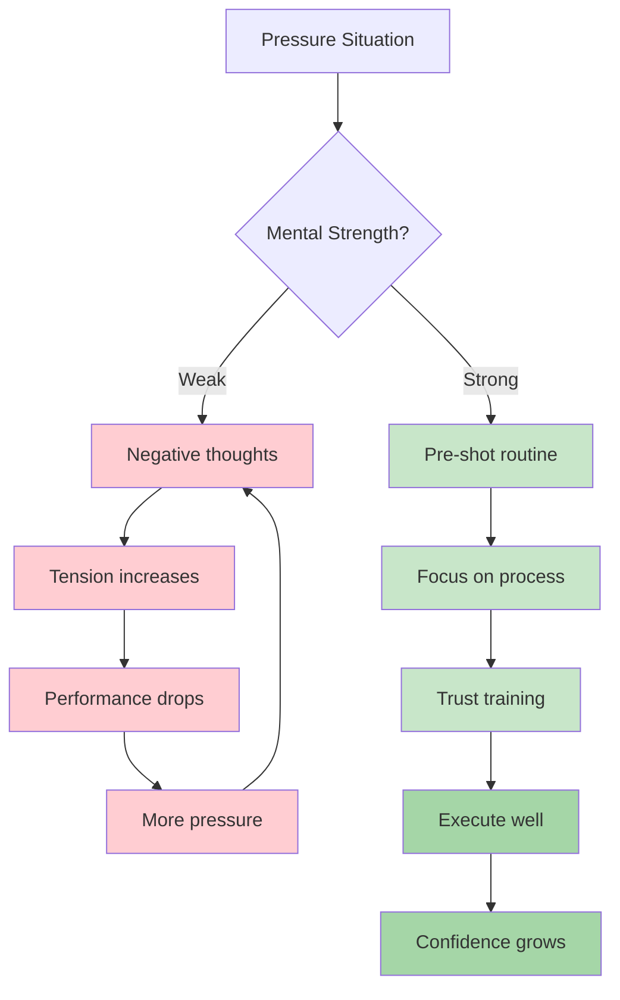
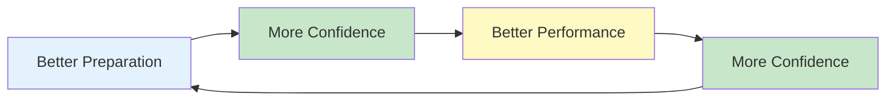

# Mental Strength
<AdBanner />

Mental strength is what separates players who perform well in practice from those who perform well when it matters. It's the ability to handle pressure, bounce back from setbacks, and maintain focus throughout long competitions.

::: tip The Core Principle
**Mental strength isn't about eliminating nerves or never making mistakes. It's about performing well despite them.** You can't control what happens. You can control how you respond.
:::

## What is Mental Strength?

Mental strength includes:
- **Confidence:** Believing in your ability
- **Focus:** Maintaining attention on what matters
- **Resilience:** Bouncing back from mistakes
- **Composure:** Staying calm under pressure
- **Motivation:** Sustaining effort over time

These aren't fixed traits - they're skills you can develop.

## The Mental Demands of Pétanque

Pétanque has unique mental challenges:

| Challenge | Why It's Hard |
|-----------|--------------|
| Time between throws | Opportunity for negative thoughts |
| Visible results | Everyone sees your mistakes |
| Team format | Pressure not to let partners down |
| Long competitions | Mental fatigue over many hours |
| Close games | High stakes on single throws |
| Momentum swings | Emotional rollercoaster |

## Building Mental Strength

### 1. Develop Self-Confidence

Confidence comes from:
- **Preparation:** Knowing you've done the work
- **Past success:** Remembering times you performed well
- **Positive self-talk:** How you speak to yourself
- **Body language:** Standing tall, moving with purpose

**Confidence builders:**
- Keep a success journal
- Visualize successful performances
- Prepare thoroughly for competitions
- Use confident body language (it affects your mind)

### 2. Master Your Self-Talk

<AdInArticle />

The voice in your head matters enormously.

**Destructive self-talk:**
- "I always miss these"
- "I'm going to choke"
- "My teammates are counting on me" (pressure)
- "That was terrible"

**Constructive self-talk:**
- "I've made this throw before"
- "Trust my training"
- "One throw at a time"
- "Next throw, fresh start"

**Changing your self-talk:**
1. Notice what you say to yourself
2. Challenge negative statements
3. Replace with realistic, helpful alternatives
4. Practice until it becomes automatic

### 3. Build Resilience

Resilience is the ability to recover from setbacks.

**The resilient mindset:**
- Mistakes are information, not failure
- One bad throw doesn't define you
- Setbacks are temporary
- You can always respond well to what happens

**Building resilience:**
- Practice recovering from mistakes in training
- Use the SOAS method (Stop, Observe, Accept, Slip)
- Focus on response, not the event
- Develop a short memory for bad throws

### 4. Manage Your Energy

Mental strength requires energy management:

**Physical energy:**
- Sleep well before competitions
- Eat properly (stable blood sugar)
- Stay hydrated
- Move between games (don't sit too long)

**Mental energy:**
- Take breaks when possible
- Don't over-analyze between throws
- Save intense focus for when you need it
- Have recovery routines

## The Confidence-Competence Loop

::: info The Positive Cycle

**Build it through:**
1. Quality practice (builds competence)
2. Tracking progress (builds confidence)
3. Successful performances (reinforces both)
:::

## In This Section

- **[Handling Pressure](/en/education/mental-strength/handling-pressure)** - Techniques for high-stakes situations
- **[Pre-Shot Routine](/en/education/mental-strength/pre-shot-routine)** - Building your performance trigger

## Summary: Mental Strength Rules

::: tip Rule #1: The Routine Rule
**Consistent pre-shot routines trigger peak performance.**
Same routine every time = reliable trigger for flow state
:::

::: tip Rule #2: The Reset Rule
**Develop a 10-second reset routine after mistakes.**
Physical reset (deep breath, shoulder roll) + mental reset (SOAS method)
:::

::: tip Rule #3: The Confidence Loop Rule
**Better preparation → More confidence → Better performance.**
The loop works both ways. Build it through quality practice and tracking progress.
:::

::: tip Rule #4: The Self-Talk Rule
**Talk to yourself like you'd talk to a teammate.**
Supportive, constructive, focused on what to do (not what went wrong)
:::

::: tip Rule #5: The Energy Management Rule
**Save intense focus for when you need it.**
Don't over-analyze between throws. Conserve mental energy for execution.
:::

## Key Takeaway

> Mental strength isn't about eliminating nerves or never making mistakes. It's about performing well despite them.

You can't control what happens. You can control how you respond.

<AdBanner />
