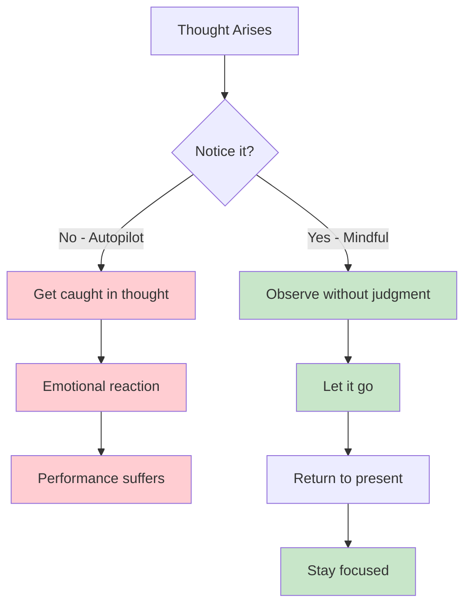
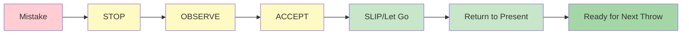

# Mindfulness for Pétanque Players

Mindfulness is one of the most powerful tools available to athletes. It's not mystical or complicated - it's simply the practice of paying attention to the present moment without judgment.

::: tip The Core Principle
**Mindfulness isn't about emptying your mind. It's about choosing where to put your attention.** You can't stop thoughts from arising, but you can choose not to follow them.
:::

## What is Mindfulness?

Mindfulness means being fully present and aware of:
- Where you are
- What you're doing
- How you're feeling

...without being overwhelmed by what's happening around you or reactive to it.

For pétanque players, this translates to:
- Being fully present for each throw
- Noticing thoughts without getting caught up in them
- Recovering quickly from mistakes
- Staying calm under pressure

## The Science Behind It

Mindfulness isn't just philosophy - it's backed by solid research:

### Effects on Your Brain
- **Reduces activity in the amygdala** (your brain's alarm system)
- **Strengthens the prefrontal cortex** (decision-making and focus) - this helps you think clearly during planning
- **Improves your ability to quiet the mind** when needed - essential for accessing flow state during execution
- **Improves connections** between brain regions
- **Creates lasting structural changes** with regular practice

### Effects on Performance
| Benefit | How It Helps Your Game |
|---------|----------------------|
| Stress reduction | Lower cortisol, steadier hands |
| Better focus | Fewer distractions, clearer decisions |
| Emotional control | Don't let bad throws spiral |
| Faster recovery | Bounce back from mistakes quickly |
| Improved sleep | Better rest, better performance |

## Why Pétanque Players Need Mindfulness

Pétanque has unique mental challenges:

1. **Time between throws** - Lots of opportunity for negative thoughts
2. **Visible mistakes** - Everyone sees when you miss
3. **Team pressure** - Your throw affects your partners
4. **Long competitions** - Mental fatigue over many hours
5. **Close games** - High pressure in decisive moments

Mindfulness helps you handle all of these.

## The Core Skill: Non-Judgmental Awareness

The key word is "non-judgmental."

::: danger Judgmental Thinking (Adds Emotional Weight)
❌ "That was a terrible throw"
❌ "I always miss these"
❌ "My teammates must be frustrated"

**Result:** Spiral of negative emotions, tension, worse performance
:::

::: tip Non-Judgmental Awareness (Just Observes)
✅ "The throw went left of target"
✅ "I notice I'm feeling tense"
✅ "My mind is wandering to the score"

**Result:** Clear observation, quick recovery, maintain focus
:::

**The difference?** Judgment adds emotional weight and triggers reactions. Awareness just observes and allows you to respond skillfully.

## Getting Started

You don't need hours of meditation. Start with these simple practices:

### 1. Conscious Breathing (2 minutes)
- Sit comfortably
- Focus on your breath
- When your mind wanders (it will), gently return to the breath
- No judgment about wandering - just return

### 2. Body Scan (5 minutes)
- Notice sensations in your feet
- Slowly move attention up through your body
- Just observe - don't try to change anything
- Notice areas of tension without fighting them

### 3. Mindful Moments
- Choose an everyday activity (drinking coffee, walking)
- Do it with full attention
- Notice all the sensations involved
- When your mind wanders, return to the activity

## Mindfulness in Competition

### Before the Game
- Take 2-3 minutes for conscious breathing
- Set an intention for how you want to play (not outcome, but process)
- Notice any nervousness without trying to eliminate it

### During the Game
- Use your pre-shot routine as a mindfulness anchor
- Between throws, return attention to the present
- Notice thoughts about score/outcome, then let them go

### After Mistakes

::: warning The SOAS Method (Your Reset Tool)
**S**top - Pause before reacting
**O**bserve - What happened? What am I feeling?
**A**ccept - It happened. It's done.
**S**lip (Let go) - Release it, return to now

**Time needed:** 10 seconds
**Use it:** After every mistake, bad bounce, or frustrating moment
:::

## In This Section

- **[Techniques](/en/education/mindfulness/techniques)** - Practical exercises you can use
- **[Daily Practice](/en/education/mindfulness/daily-practice)** - Building mindfulness into your life

## Summary: Mindfulness Rules

::: tip Rule #1: The Awareness Rule
**Observe without judgment.**
Notice thoughts and feelings without labeling them as good or bad.
:::

::: tip Rule #2: The SOAS Rule
**Stop, Observe, Accept, Slip (let go).**
Your 10-second reset after mistakes. Use it every time.
:::

::: tip Rule #3: The Present Rule
**You can only control this moment, this throw.**
Past throws are done. Future throws don't exist yet. Be here now.
:::

::: tip Rule #4: The Practice Rule
**Start small: 2-5 minutes daily.**
Consistency beats duration. Daily practice builds the skill.
:::

## Key Takeaway

> Mindfulness isn't about emptying your mind. It's about choosing where to put your attention.

You can't stop thoughts from arising. But you can choose not to follow them down the rabbit hole.

