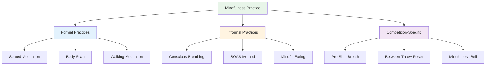

# Mindfulness Techniques
<AdBanner />

Here are practical techniques you can use to develop mindfulness. Start with one or two and build from there.

::: tip The Big Idea
**Mindfulness is a skill, not a talent.** Like pointing or shooting, it improves with practice. Start small, be consistent, and the benefits compound over time.
:::

## Formal Practices

These are dedicated mindfulness sessions - time set aside specifically for practice.

### Seated Meditation

The foundation of mindfulness practice.

**How to do it:**
1. Sit comfortably (chair or floor)
2. Close your eyes or soften your gaze
3. Focus on your breath - the sensation of air entering and leaving
4. When thoughts arise, notice them without judgment
5. Gently return attention to the breath
6. Start with 5 minutes, build to 15-20

**Tips:**
- Thoughts will come - that's normal
- Each time you notice you've wandered and return, you're building the skill
- Don't judge yourself for wandering
- Consistency matters more than duration

### Body Scan

Develops awareness of physical sensations.

**How to do it:**
1. Lie down or sit comfortably
2. Start at your feet - notice any sensations
3. Slowly move attention up: ankles, calves, knees...
4. Notice without trying to change anything
5. If you find tension, breathe into that area
6. Continue to the top of your head
7. Takes 10-20 minutes

**For pétanque:** Helps you notice tension before it affects your throw.

### Walking Meditation

Mindfulness in motion - great preparation for the piste.

**How to do it:**
1. Walk slowly and deliberately
2. Feel each part of the step: lift, move, place
3. Notice the sensations in your feet and legs
4. When your mind wanders, return to the physical sensations
5. 5-10 minutes is enough

## Informal Practices

<AdInArticle />

These integrate mindfulness into daily activities.

### Conscious Breathing

The simplest technique - available anytime.

**The practice:**
- Take 3 slow, deliberate breaths
- Focus completely on the sensation
- Use it as a reset button throughout the day

**When to use it:**
- Before stepping into the circle
- When you notice stress building
- Between games
- Any transition moment

### The SOAS Method

Your tool for handling difficult moments.

| Step | Action | Example |
|------|--------|---------|
| **S**top | Pause, don't react | Don't throw your hands up after a miss |
| **O**bserve | Notice what's happening | "I feel frustrated. My jaw is tight." |
| **A**ccept | Acknowledge without fighting | "This is how I feel right now." |
| **S**lip | Let it go, move on | Release the tension, return to present |

**Practice this in daily life** so it's automatic in competition.

### Mindful Eating

A surprisingly powerful practice.

**How to do it:**
- Eat one meal without distractions (no phone, TV)
- Notice the colors, smells, textures
- Chew slowly, taste fully
- Notice when you're satisfied

**Why it matters:** Builds the general skill of paying attention.

### Sensory Awareness

Engaging fully with your environment.

**The 5-4-3-2-1 technique:**
- Notice 5 things you can see
- Notice 4 things you can hear
- Notice 3 things you can feel
- Notice 2 things you can smell
- Notice 1 thing you can taste

**Use this:** When your mind is racing before a big game.

## Competition-Specific Techniques

### The Pre-Shot Breath

Integrate breathing into your routine:

1. Before entering the circle, take one conscious breath
2. Feel your feet on the ground
3. Let your shoulders drop on the exhale
4. Then begin your routine

### Between-Throw Reset

What to do while waiting:

- Notice where your attention goes
- If it goes to score/outcome, acknowledge and return to present
- Focus on something neutral (your breathing, the feel of a boule)
- Stay physically relaxed

### The "Mindfulness Bell"

Use triggers to remind you to be present:

- Every time you pick up a boule
- When you hear the jack being thrown
- When you step into the circle
- When a game ends

Each trigger = one conscious breath.

## Building Your Practice

### Week 1-2: Foundation
- 5 minutes seated meditation daily
- 3 conscious breaths before each meal
- Practice SOAS once when something minor goes wrong

### Week 3-4: Expansion
- Increase meditation to 10 minutes
- Add body scan twice per week
- Use mindfulness bell triggers in practice

### Week 5+: Integration
- 15-20 minute daily practice
- Full integration into pre-shot routine
- SOAS becomes automatic response to mistakes

## Common Challenges

| Challenge | Solution |
|-----------|----------|
| "I can't stop thinking" | You're not supposed to. Just notice and return. |
| "I don't have time" | Start with 3 minutes. Everyone has 3 minutes. |
| "I fall asleep" | Try sitting instead of lying down, or practice earlier in day. |
| "It feels pointless" | Benefits come with consistency. Trust the process. |
| "I forget to practice" | Set a daily reminder. Link it to existing habit. |

## Key Takeaway

> Mindfulness is a skill. Like any skill, it improves with practice.

Start small. Be consistent. The benefits compound over time.

<AdBanner />
