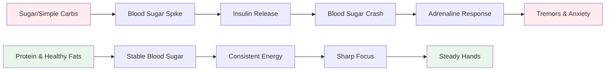
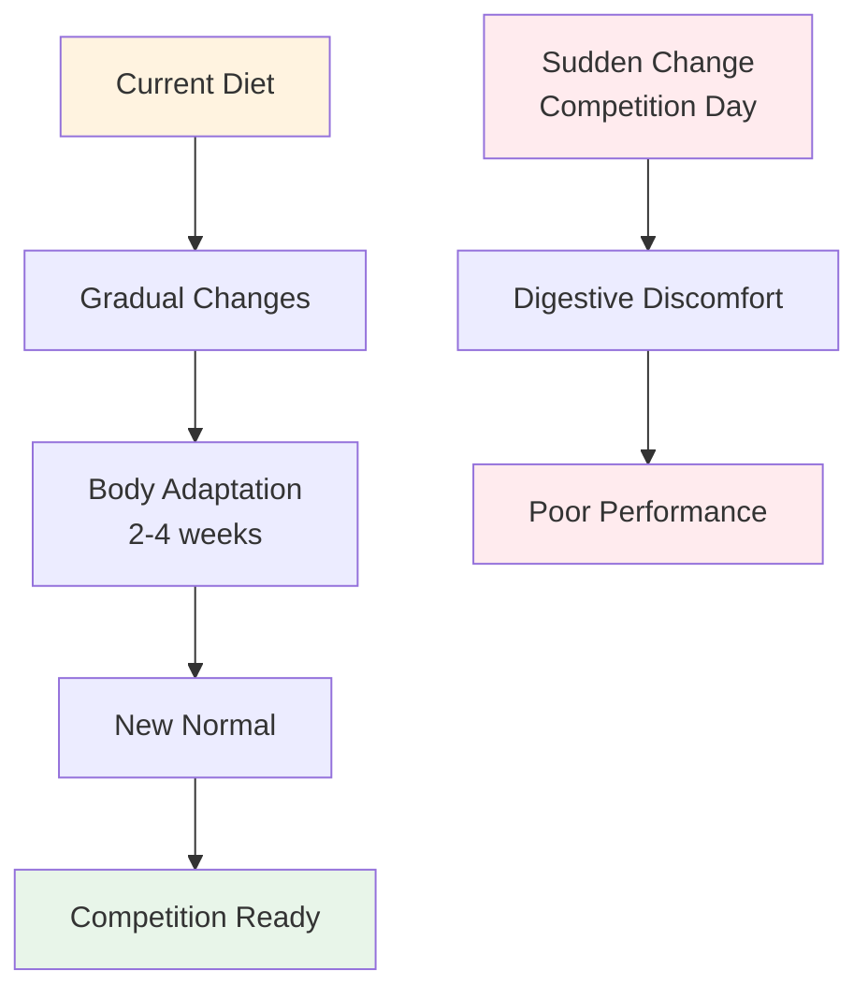

# Nutrition for Precision Performance

Pétanque is a precision sport, not an endurance sport. Your nutritional needs are different from a marathon runner or a football player. What matters most is **brain fuel stability** - keeping your mind sharp and your hands steady throughout a long competition day.

::: tip The Big Idea
**Your brain is your most important tool in pétanque. Feed it stable fuel, not roller coaster energy.** Focus on protein, healthy fats, and staying hydrated. Avoid sugar spikes.
:::



## The Precision Athlete's Challenge

Unlike high-intensity sports, pétanque doesn't require massive glycogen stores or rapid energy replenishment. What it requires is:

- **Stable blood sugar** - no spikes or crashes
- **Consistent mental clarity** - focus that lasts all day
- **Steady hands** - no tremors or shakes
- **Calm nerves** - low anxiety and stress response

Your nutrition strategy should optimize for these factors, not for raw energy output.

## The Problem with Sugar and Simple Carbs

Many athletes default to high-carbohydrate diets. For pétanque players, this can actually hurt performance.

### The Blood Sugar Roller Coaster

When you eat sugar or simple carbs:
1. Blood sugar spikes rapidly
2. Insulin is released to bring it down
3. Blood sugar crashes (hypoglycemia)
4. Your body releases adrenaline to compensate
5. You experience tremors, anxiety, and poor focus

**This is the opposite of what you need for precision.**

### Symptoms of Blood Sugar Instability

| Symptom | Impact on Performance |
|---------|----------------------|
| Trembling hands | Inconsistent release |
| Difficulty concentrating | Poor decision-making |
| Irritability | Team conflict, poor composure |
| Fatigue after meals | Afternoon slump |
| Anxiety | Pressure sensitivity |
| Brain fog | Slow tactical thinking |

## A Better Approach: Stable Energy

The goal is to provide your brain with consistent fuel without the roller coaster.

### Key Principles

1. **Prioritize protein and healthy fats** - They provide slow, steady energy
2. **Choose complex carbs over simple** - If you eat carbs, choose ones that digest slowly
3. **Avoid sugar spikes** - Especially before and during competition
4. **Stay hydrated** - Dehydration affects concentration significantly
5. **Eat regularly** - Don't let yourself get too hungry

### Foods That Help

| Food Type | Examples | Why It Works |
|-----------|----------|--------------|
| Protein | Eggs, nuts, cheese, meat | Slow digestion, stable energy |
| Healthy fats | Avocado, olive oil, nuts | Long-lasting fuel |
| Complex carbs | Vegetables, legumes | Fiber slows absorption |
| Low-sugar fruits | Berries, apples | Nutrients without spike |

### Foods to Limit

| Food Type | Examples | Why It's Problematic |
|-----------|----------|---------------------|
| Sugar | Candy, soda, pastries | Rapid spike and crash |
| White bread/pasta | Sandwiches, pasta dishes | Quick conversion to sugar |
| Fruit juice | Orange juice, smoothies | Concentrated sugar |
| Energy drinks | Most commercial brands | Sugar + caffeine crash |

## Competition Day Nutrition

### Before Competition

**2-3 hours before:**
- Balanced meal with protein, fat, and vegetables
- Avoid heavy carbs that might cause drowsiness
- Example: Eggs with vegetables, or salad with chicken

**1 hour before:**
- Light snack if needed
- Nuts, cheese, or a small portion of protein
- Avoid anything sugary

### During Competition

**Between games:**
- Water (most important)
- Small protein snacks (nuts, cheese, meat)
- Avoid sugary snacks and drinks

**Signs you need to eat:**
- Difficulty concentrating
- Irritability
- Feeling shaky
- Headache

### After Competition

- Replenish with a balanced meal
- Rehydrate fully
- Don't "reward" yourself with sugar - it will affect your recovery

## Hydration

Dehydration affects cognitive function before you feel thirsty.

### Guidelines

- **Start hydrated** - Drink water throughout the day before competition
- **During play** - Sip water regularly, don't wait until thirsty
- **Avoid excess caffeine** - It's a diuretic
- **Watch for signs** - Headache, dark urine, fatigue

### How Much?

A general guideline: aim for pale yellow urine. If it's dark, you need more water.

## The Low-Carb Option

Some precision athletes adopt low-carb or ketogenic diets. The theory:

**Potential benefits:**
- Very stable blood sugar (no spikes possible)
- Consistent mental clarity
- Reduced anxiety and tremors
- No afternoon energy crashes

**Considerations:**
- Requires adaptation period (1-2 weeks)
- Not suitable for everyone
- Requires planning and commitment
- Consult a healthcare provider first

This is an advanced strategy - not necessary for everyone, but worth considering if blood sugar stability is a significant issue for you.

## Food as Practice: Training Your Body

::: warning Critical Concept
**Food is not just fuel - it's something you practice with.** Just like you practice your throw, you must practice your nutrition to get your body comfortable with competition-day eating.
:::

### Why Food Practice Matters

Your digestive system is trainable. What you eat regularly becomes what your body expects and handles best. If you only eat protein and vegetables on competition days, your body won't be adapted to it.

**The problem:**
- Eating unfamiliar foods on competition day can cause digestive discomfort
- Your body needs time to adapt to new eating patterns
- Stress + unfamiliar food = potential stomach issues
- Performance anxiety is bad enough without adding digestive anxiety

**The solution:**
- Practice your competition nutrition during training
- Make your competition-day foods part of your regular routine
- Train your body to be comfortable with stable-energy foods

### The Adaptation Process



When you change your diet:
1. **Week 1-2:** Your body adjusts to new foods, may feel different
2. **Week 3-4:** Adaptation occurs, new foods feel normal
3. **Week 5+:** Your body is comfortable and efficient with these foods

**This is why you can't just "eat healthy" on competition day and expect optimal results.**

### How to Practice Your Nutrition

#### 1. Start During Training

**Practice your competition-day eating during training sessions:**
- Eat the same pre-training meal you'd eat pre-competition
- Bring the same snacks you'd bring to a tournament
- Notice how your body responds
- Adjust based on what works

**Example training day:**
```
2-3 hours before: Eggs with vegetables (same as competition)
During training: Water + nuts (same as competition)
After training: Balanced meal with protein
```

#### 2. Make It Your Normal

**Don't have a "competition diet" and a "regular diet"** - this creates two problems:
- Your body never fully adapts to either
- Competition food feels unfamiliar and stressful

**Instead:**
- Make stable-energy foods your daily norm
- Your body becomes efficient at using protein and fats
- Competition day feels normal, not different
- No digestive surprises

#### 3. Test and Refine

**Use training to experiment:**

| Test | What to Notice | Adjust |
|------|----------------|--------|
| Pre-training meal timing | Energy levels, focus | Find your optimal window |
| Different protein sources | Digestion, comfort | Identify what works best |
| Snack types | Sustained energy | Find your go-to snacks |
| Hydration amounts | Concentration, bathroom breaks | Balance intake |

**Keep a simple log:**
- What you ate and when
- How you felt during training
- Energy levels and focus
- Any digestive issues

#### 4. Build Comfort and Confidence

**The psychological benefit:**

When you've practiced your nutrition hundreds of times in training:
- You know exactly how your body will respond
- No anxiety about food choices
- One less thing to worry about on competition day
- Confidence in your preparation

**This is the same principle as practicing your throw** - repetition builds comfort and reliability.

### Common Adaptation Challenges

::: details Transitioning from High-Carb to Stable-Energy Diet

**Challenge:** You're used to bread, pasta, and sugary snacks

**Adaptation period:** 2-4 weeks

**What to expect:**
- Week 1: May feel different, cravings for old foods
- Week 2: Energy stabilizes, cravings reduce
- Week 3-4: New normal, body efficient with fats/protein

**How to practice:**
- Start with one meal at a time
- Replace simple carbs with complex carbs first
- Gradually increase protein and healthy fats
- Practice during low-stakes training first
:::

::: details Finding Foods That Work for You

**Challenge:** Not everyone digests the same foods well

**What to test:**
- Different protein sources (eggs vs. meat vs. nuts)
- Timing of meals (2 hours vs. 3 hours before)
- Portion sizes (too much = sluggish, too little = hungry)
- Specific foods that cause discomfort

**Practice approach:**
- Try one variable at a time
- Give each test 2-3 training sessions
- Note what makes you feel best
- Build your personal "competition menu"
:::

::: details Dealing with Tournament Food Environments

**Challenge:** Tournaments often have limited food options

**Practice solution:**
- Always bring your own snacks (practice this)
- Scout venues in advance when possible
- Have backup options you know work
- Practice eating in different environments

**Mental preparation:**
- Don't rely on venue food
- Treat food as part of your equipment
- Pack it like you pack your boules
:::

### The 30-Day Nutrition Practice Plan

**Goal:** Make stable-energy eating your comfortable normal

**Week 1-2: Foundation**
- Replace one meal per day with competition-style eating
- Practice pre-training nutrition
- Start bringing snacks to training
- Notice how your body responds

**Week 3-4: Expansion**
- Make two meals per day stable-energy focused
- Practice full competition-day eating on training days
- Refine your snack choices
- Build your go-to food list

**Week 5+: Mastery**
- Stable-energy eating is your new normal
- Body is fully adapted
- Competition day feels routine
- Confidence in your nutrition

### Your Competition Food Kit

**Practice packing this for every training session:**

**Pre-competition (2-3 hours before):**
- [ ] Protein source (eggs, meat, or nuts)
- [ ] Vegetables or salad
- [ ] Healthy fat (avocado, olive oil, cheese)

**During competition:**
- [ ] Water bottle (refillable)
- [ ] Mixed nuts (small portions)
- [ ] Hard-boiled eggs (if you can keep cool)
- [ ] Cheese cubes or string cheese
- [ ] Jerky or dried meat
- [ ] Backup snacks

**The more you practice with this kit, the more automatic it becomes.**

## Practical Tips

### Easy Competition Snacks
- Mixed nuts (unsalted)
- Hard-boiled eggs
- Cheese cubes
- Beef or turkey jerky
- Vegetables with hummus
- Olives

### What to Avoid
- Vending machine snacks
- Sugary sports drinks
- Pastries and baked goods
- Candy and chocolate bars
- Most "energy" bars (check sugar content)

## Key Takeaway

> Your brain is your most important tool in pétanque. Feed it stable fuel, not roller coaster energy. And practice your nutrition just like you practice your throw - repetition builds comfort and reliability.

Focus on protein, healthy fats, and staying hydrated. Avoid sugar spikes. **Most importantly: make your competition-day nutrition your everyday nutrition.** Your body needs practice to perform at its best.

**Remember:** You wouldn't show up to a tournament with a throwing technique you've never practiced. Don't show up with a nutrition strategy you've never practiced either.

