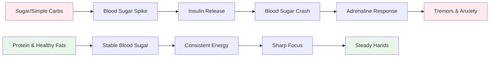

# Nutrition for Precision Performance

Pétanque is a precision sport, not an endurance sport. Your nutritional needs are different from a marathon runner or a football player. What matters most is **brain fuel stability** - keeping your mind sharp and your hands steady throughout a long competition day.

::: tip The Big Idea
**Your brain is your most important tool in pétanque. Feed it stable fuel, not roller coaster energy.** Focus on protein, healthy fats, and staying hydrated. Avoid sugar spikes.
:::

## The Precision Athlete's Challenge

Unlike high-intensity sports, pétanque doesn't require massive glycogen stores or rapid energy replenishment. What it requires is:

- **Stable blood sugar** - no spikes or crashes
- **Consistent mental clarity** - focus that lasts all day
- **Steady hands** - no tremors or shakes
- **Calm nerves** - low anxiety and stress response

Your nutrition strategy should optimize for these factors, not for raw energy output.

## The Problem with Sugar and Simple Carbs

Many athletes default to high-carbohydrate diets. For pétanque players, this can actually hurt performance.

### The Blood Sugar Roller Coaster

When you eat sugar or simple carbs:
1. Blood sugar spikes rapidly
2. Insulin is released to bring it down
3. Blood sugar crashes (hypoglycemia)
4. Your body releases adrenaline to compensate
5. You experience tremors, anxiety, and poor focus

**This is the opposite of what you need for precision.**

### Symptoms of Blood Sugar Instability

| Symptom | Impact on Performance |
|---------|----------------------|
| Trembling hands | Inconsistent release |
| Difficulty concentrating | Poor decision-making |
| Irritability | Team conflict, poor composure |
| Fatigue after meals | Afternoon slump |
| Anxiety | Pressure sensitivity |
| Brain fog | Slow tactical thinking |

## A Better Approach: Stable Energy

The goal is to provide your brain with consistent fuel without the roller coaster.

### Key Principles

1. **Prioritize protein and healthy fats** - They provide slow, steady energy
2. **Choose complex carbs over simple** - If you eat carbs, choose ones that digest slowly
3. **Avoid sugar spikes** - Especially before and during competition
4. **Stay hydrated** - Dehydration affects concentration significantly
5. **Eat regularly** - Don't let yourself get too hungry

### Foods That Help

| Food Type | Examples | Why It Works |
|-----------|----------|--------------|
| Protein | Eggs, nuts, cheese, meat | Slow digestion, stable energy |
| Healthy fats | Avocado, olive oil, nuts | Long-lasting fuel |
| Complex carbs | Vegetables, legumes | Fiber slows absorption |
| Low-sugar fruits | Berries, apples | Nutrients without spike |

### Foods to Limit

| Food Type | Examples | Why It's Problematic |
|-----------|----------|---------------------|
| Sugar | Candy, soda, pastries | Rapid spike and crash |
| White bread/pasta | Sandwiches, pasta dishes | Quick conversion to sugar |
| Fruit juice | Orange juice, smoothies | Concentrated sugar |
| Energy drinks | Most commercial brands | Sugar + caffeine crash |

## Competition Day Nutrition

### Before Competition

**2-3 hours before:**
- Balanced meal with protein, fat, and vegetables
- Avoid heavy carbs that might cause drowsiness
- Example: Eggs with vegetables, or salad with chicken

**1 hour before:**
- Light snack if needed
- Nuts, cheese, or a small portion of protein
- Avoid anything sugary

### During Competition

**Between games:**
- Water (most important)
- Small protein snacks (nuts, cheese, meat)
- Avoid sugary snacks and drinks

**Signs you need to eat:**
- Difficulty concentrating
- Irritability
- Feeling shaky
- Headache

### After Competition

- Replenish with a balanced meal
- Rehydrate fully
- Don't "reward" yourself with sugar - it will affect your recovery

## Hydration

Dehydration affects cognitive function before you feel thirsty.

### Guidelines

- **Start hydrated** - Drink water throughout the day before competition
- **During play** - Sip water regularly, don't wait until thirsty
- **Avoid excess caffeine** - It's a diuretic
- **Watch for signs** - Headache, dark urine, fatigue

### How Much?

A general guideline: aim for pale yellow urine. If it's dark, you need more water.

## The Low-Carb Option

Some precision athletes adopt low-carb or ketogenic diets. The theory:

**Potential benefits:**
- Very stable blood sugar (no spikes possible)
- Consistent mental clarity
- Reduced anxiety and tremors
- No afternoon energy crashes

**Considerations:**
- Requires adaptation period (1-2 weeks)
- Not suitable for everyone
- Requires planning and commitment
- Consult a healthcare provider first

This is an advanced strategy - not necessary for everyone, but worth considering if blood sugar stability is a significant issue for you.

## Practical Tips

### Easy Competition Snacks
- Mixed nuts (unsalted)
- Hard-boiled eggs
- Cheese cubes
- Beef or turkey jerky
- Vegetables with hummus
- Olives

### What to Avoid
- Vending machine snacks
- Sugary sports drinks
- Pastries and baked goods
- Candy and chocolate bars
- Most "energy" bars (check sugar content)

## Key Takeaway

> Your brain is your most important tool in pétanque. Feed it stable fuel, not roller coaster energy.

Focus on protein, healthy fats, and staying hydrated. Avoid sugar spikes. Your concentration, composure, and steady hands will thank you.

