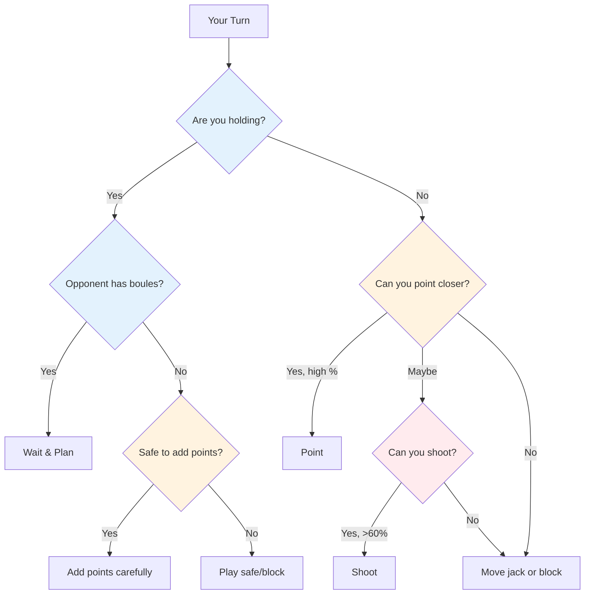

# Tactical Thinking in Pétanque
<AdBanner />


At the elite level, technical skill is assumed. What separates winners from the rest is tactical intelligence - knowing which throw to attempt and when. The best players read the game several moves ahead and exploit every advantage.

::: tip The Core Principle
**At elite level, the difference is rarely technique - it's decision-making.** The team that makes fewer tactical errors wins.
:::

## Quick Decision Framework



## The Tactical Mindset

### Think in Probabilities

Every throw has a probability of success. Good tactics means choosing throws where:
- Success probability is high enough
- The reward justifies the risk
- Failure doesn't hurt too much

**Example decision:**
- Difficult shot: 40% success, gains 3 points
- Safe point: 80% success, gains 1 point

Which is better? It depends on the score, the situation, and your confidence.

### Consider All Options

Before each throw, consider:
1. **Point:** Place a boule near the jack
2. **Shoot:** Remove an opponent's boule
3. **Block:** Place a boule to obstruct
4. **Move the jack:** Intentionally hit the jack
5. **Sacrifice:** Accept a bad position to set up later

Don't default to the obvious choice. Think through alternatives.

### Read the Situation

Factors to consider:
- Current score (who's ahead, by how much)
- Boules remaining (yours and theirs)
- Position on the terrain
- Opponent tendencies
- Your team's strengths

## Core Tactical Principles

::: tip The 6 Tactical Principles
1. **Control the Jack** - Position is power
2. **Distance & Surface Strategy** - Adapt to conditions
3. **Dictate the Game Style** - Force your strengths
4. **Manage Risk vs. Reward** - Match risk to situation
5. **Use Boules Wisely** - Sometimes concede 1 to avoid 3
6. **Think Ahead** - Visualize next 2-3 moves
:::

### Principle 1: Control the Jack

The team that controls the jack position has a significant advantage.

**Ways to control:**
- Win the right to throw the jack
- Move the jack to favorable terrain
- Protect the jack from being moved

**Jack placement strategy:**
- Short jack: Favors shooting, easier to hit targets at close range
- Long jack: Favors pointing, shooting becomes more difficult
- Near obstacles: Creates challenges for opponents

**Exploit opponent weaknesses:**
- Observe their pointing technique - do they always use the same arc or style?
- If they can't adapt (e.g., only roll, only lob), place the jack to force uncomfortable throws
- Place jack at distances or positions that expose their limitations
- Only exploit a weakness if you don't share it - consider your own team's strengths first

### Principle 2: Distance and Surface Strategy

The optimal balance between pointing and shooting depends heavily on distance and terrain:

::: info Distance Strategy
**Short (6-7m):** Favor shooting - easier to hit at close range
**Medium (7-9m):** Surface matters most
- Smooth surface → shoot more
- Rough surface → point more

**Long (9-11m):** Favor pointing - shooting accuracy drops significantly
:::

```mermaid
graph LR
    A[Distance] --> B[6-7m Short]
    A --> C[7-9m Medium]
    A --> D[9-11m Long]

    B --> E[Shoot More]
    C --> F{Surface?}
    D --> G[Point More]

<AdInArticle />

    F -->|Smooth| H[Shoot More]
    F -->|Rough| I[Point More]

    style E fill:#ffcdd2
    style H fill:#ffcdd2
    style I fill:#c8e6c9
    style G fill:#c8e6c9
```

**Your personal shooting percentage:**
- If you shoot at 75%+ success rate, shoot more often
- Consider shooting to reduce opponent's points (even if not taking the lead)
- Shooting to reduce opponent's scoring boules (from 3 down to 1) is valuable damage control

**Shooting as a long-term strategy:**
- If you shoot with all your boules, consider your cumulative success rate
- Calculate: when you hit all shots, you gain significantly more points
- Even missing some shots can reduce opponent's points
- Example: Miss 1-2 shots but still remove threats, then gain big when you hit all
- This is a calculated risk - accept some lost ends for bigger wins when it works

### Principle 3: Dictate the Game Style

At elite level, most players can both point and shoot well. The key is forcing the game into your team's strongest style.

**If your team has strong shooters:**
- Shoot as much as possible - use your advantage
- Don't waste your strength by pointing when you can dominate by shooting
- Control the game by removing threats before they accumulate
- Short to medium jack keeps shooting effective

**Against equally strong shooters:**
- Deny them easy targets by shooting first
- Play at long distance to reduce everyone's shooting percentage
- The team that shoots first often controls the end

**If opponents out-shoot you:**
- Play long jack consistently - even elite shooters drop percentage at 10m+
- Force a pointing battle where you can compete
- Make them shoot at difficult angles or through obstacles

### Principle 4: Manage Risk vs. Reward

| Situation | Risk Tolerance |
|-----------|---------------|
| Ahead comfortably | Low - protect your lead |
| Close game | Medium - calculated risks |
| Behind significantly | High - need to take chances |
| Final end | Depends on score differential |

### Principle 5: Use Your Boules Wisely

Boule management separates elite players:
- When opponent runs out of boules, decide carefully: add points or play safe?
- When behind, calculate if you can realistically take the point back
- Sometimes conceding 1 point is better than wasting boules and giving up 3
- Keep track of remaining boules - yours and theirs - at all times

### Principle 6: Think Multiple Moves Ahead

Elite thinking:
- Before throwing, visualize the next 2-3 boules from both teams
- What's your opponent's best response if you succeed? If you fail?
- How does this throw set up your next one?
- Consider the end-game scenario from the current position

## Common Tactical Situations

### You're Holding and Opponent Has Boules Left

You must wait - it's their turn to throw. Use this time to:
- Analyze what they're likely to do
- Plan your response to their possible throws
- Stay focused and ready

### You're Holding and Opponent Is Out of Boules

Now you can play your remaining boules. **Options:**
- Add more points if you can do so safely
- Block to protect against jack movement
- Play safe - don't risk turning a 2-point win into a loss

**Key decision:** Is the risk of adding points worth potentially opening up the game?

### You're Not Holding

You must throw. **Options:**
- Point closer than their best boule
- Shoot their best boule
- Move the jack to your boules
- Block to limit their scoring (if you can't take the point)

**Decision factors:** Your shooting percentage, number of boules remaining (both teams), current score

### Last Boule Situations

When you have the last boule:
- Maximum pressure but also maximum control
- Take your time - assess all options
- Consider: point, shoot, or move the jack?
- Execute with full commitment

When opponent has last boule:
- You've done what you can - accept the outcome
- If possible, create a situation with no easy answer for them
- Multiple threats are better than one

## Reading Your Opponents

At elite level, scouting matters. Know your opponents before you play.

### Pre-Match Intelligence
- What's their preferred game style (shooting vs pointing team)?
- Who's their strongest shooter? Pointer?
- What distances do they prefer?
- How do they perform under pressure in finals?

### In-Match Observation
- Track their success rates throughout the match
- Notice if someone is having an off day
- Identify who handles pressure well and who doesn't
- Adjust your jack placement based on what you observe

### Exploit What You Find
- Target the weaker players when possible
- Force their weak shooter to shoot, or their weak pointer to point
- If someone is struggling, keep the pressure on them

## In This Section

- **[Probability-Based Decisions](/en/education/tactics/probability)** - Using math to make better choices

## Summary: All Tactical Rules

::: tip Rule #1: The Probability Rule
**Choose throws where success probability justifies the risk.**
Consider: success rate, reward if successful, cost if failed
:::

::: tip Rule #2: The Jack Control Rule
**The team that controls jack position has the advantage.**
Use jack placement to exploit opponent weaknesses and favor your strengths
:::

::: tip Rule #3: The Distance Rule
**Short distance favors shooting, long distance favors pointing.**
Medium distance: surface quality determines the balance
:::

::: tip Rule #4: The Style Rule
**Force the game into your team's strongest style.**
If you're strong shooters, shoot more. Don't waste your advantage.
:::

::: tip Rule #5: The Boule Management Rule
**Sometimes conceding 1 point is better than risking 3.**
Know when to cut your losses and save boules for the next end
:::

::: tip Rule #6: The Thinking Ahead Rule
**Visualize the next 2-3 moves from both teams.**
What's their best response? How does this set up your next throw?
:::

::: tip Rule #7: The Scouting Rule
**Know your opponents before you play.**
Track their preferences, success rates, and pressure responses
:::

## Key Takeaway

> At elite level, the difference is rarely technique - it's decision-making. The team that makes fewer tactical errors wins.

Read the game. Know your strengths. Exploit their weaknesses. Execute with confidence.

<AdBanner />
