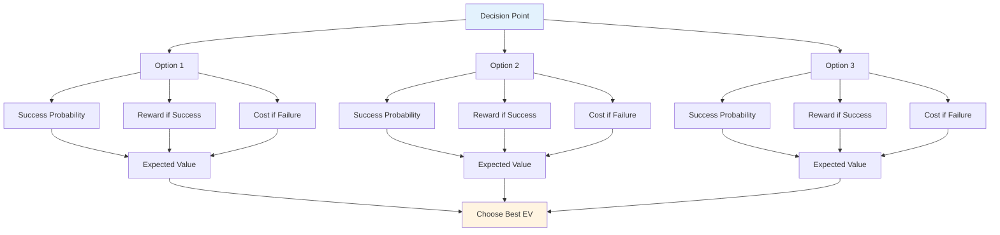

# Probability-Based Decision Making

Elite tactical thinking uses probability to make better decisions. Instead of guessing or going with gut feeling, you think systematically about your options.

::: tip The Big Idea
**Think in probabilities, not certainties.** The best decision isn't always the most aggressive or the safest - it's the one that gives you the best expected value over many similar situations.
:::

## The Basic Framework

Every throw has three components:

| Component | Question | Example |
|-----------|----------|---------|
| **Probability of success** | How likely am I to execute this? | 70% success rate at this distance |
| **Reward if successful** | What do I gain? | Win the point, gain position |
| **Cost if unsuccessful** | What do I lose? | Give opponent easy point |

::: info The Formula
**Expected Value = (Probability × Reward) - ((1 - Probability) × Cost)**

Good decisions maximize expected value over time.
:::

## Thinking in Probabilities

When deciding between options, consider:
- What's my realistic success rate for each option?
- What do I gain if it works?
- What's the cost if it fails?
- How does the game situation affect my choice?

The best option isn't always the most aggressive or the safest - it's the one that gives you the best outcome over many similar situations.

## Know Your Numbers

To use probability thinking, you need to know your actual success rates:

| Throw Type | Distance | Your Success Rate |
|------------|----------|-------------------|
| Point (close) | 6-7m | ___% |
| Point (medium) | 8-9m | ___% |
| Point (long) | 10m+ | ___% |
| Shoot (close) | 6-7m | ___% |
| Shoot (medium) | 8-9m | ___% |
| Shoot (long) | 10m+ | ___% |

Track these in practice. Be honest - most players overestimate their success rates.

## Adjusting for Conditions

Your base rates change based on:

| Factor | Effect on Success Rate |
|--------|----------------------|
| Unfamiliar terrain | -10 to -20% |
| Pressure situation | -5 to -15% |
| Fatigue | -5 to -10% |
| Confidence (high) | +5 to +10% |
| Recent success | +5% |
| Recent failure | -5 to -10% |

Be realistic about these adjustments.

## The Boule Advantage Principle

When you have more boules remaining than your opponent:

**Priority 1: Secure the point**
- First, ensure you're holding at least one point
- Don't get greedy before you've secured the basics

**Priority 2: Maximize points with calculated risk**
- Once you're holding, assess if you can add more points
- Each additional throw is a risk/reward decision
- Don't turn a safe 2-point win into a loss by overreaching

**Fewer boules remaining:** You need to make each throw count. Safe plays might not be enough - consider higher-reward options to get back in the end.

## The "Une Boule Devant" Principle

A boule in front of the jack (between jack and opponent) is extremely valuable:
- It blocks direct pointing lines
- It forces opponents to go around or over
- It can deflect incoming boules
- It's a "money boule" - worth protecting

**Tactical implication:** Sometimes placing a blocking boule is better than trying to get closest.

## Risk Tolerance by Game State

### With Time Limit

When playing with a time limit, score differential matters:

| Score Situation | Risk Approach |
|-----------------|---------------|
| Leading by 4+ | Very conservative - protect lead, run the clock |
| Leading by 1-3 | Conservative - don't give away points |
| Tied | Balanced - calculated risks |
| Behind by 1-3 | Aggressive - need to gain ground |
| Behind by 4+ | Very aggressive - must take chances, time is running out |

### Without Time Limit

When there's no time pressure:
- Stick to your game plan - don't change strategy just because of the score
- The score will fluctuate - trust your approach
- Only consider changing your game plan if it's clearly not working against this opponent
- Panic changes when behind often make things worse

### End-Game Adjustments

**If winning this end wins the game:**
- Be more conservative
- Don't risk giving away multiple points
- A single point might be enough

**If losing this end loses the game:**
- Take bigger risks
- Need to score multiple points
- Safe play won't save you

## Common Probability Mistakes

### 1. Overconfidence
"I can make that shot" - but can you make it 7 times out of 10? Be honest.

### 2. Ignoring Base Rates
Your shooting percentage doesn't change because the moment is important.

### 3. Sunk Cost Fallacy
"I've already missed twice, I should keep shooting" - each throw is independent.

### 4. Outcome Bias
A risky shot that worked was still risky. A safe play that failed was still correct.

### 5. Ignoring Opponent's Options
Consider what they'll do after your throw, successful or not.

## Practical Application

### Before Each Throw

1. **Identify options** (point, shoot, block, etc.)
2. **Estimate success probability** for each
3. **Consider outcomes** (success and failure)
4. **Factor in game state** (score, boules remaining)
5. **Choose** the option with best expected value
6. **Commit fully** - no second-guessing during execution

### Building Intuition

Over time, probability thinking becomes intuitive:
- Track your results honestly
- Review decisions after games
- Notice patterns in your success rates
- Adjust your mental model

## Key Takeaway

> Good decisions don't always lead to good outcomes. But good decisions over time lead to better results.

Think in probabilities. Know your numbers. Make the smart play, not the hopeful one.

