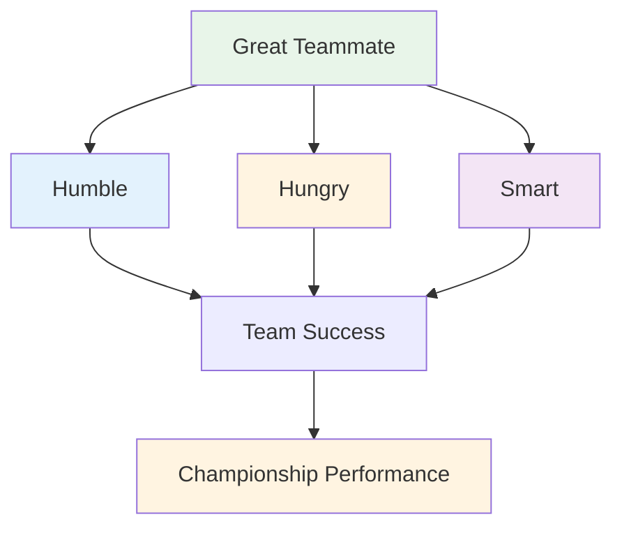

# Being a Great Team Player

Pétanque is often played in teams - doubles (doublettes) or triples (triplettes). Individual skill matters, but team dynamics can make or break your results. The best teams aren't always the most skilled - they're the ones that work best together.

::: tip The Big Idea
**The best teams aren't always the most skilled - they're the ones that work best together.** Being humble, hungry, and emotionally smart makes you a great teammate.
:::

## What Makes a Great Teammate?

Research and experience point to three key qualities:

### 1. Humble
- Prioritizes team success over personal glory
- Acknowledges others' contributions
- Admits mistakes without excuses
- Open to feedback and learning
- Doesn't need to be the star

### 2. Hungry
- Self-motivated and driven
- Does the work without being asked
- Always looking to improve
- Brings energy to the team
- Doesn't coast on talent

### 3. Smart (Emotionally)
- Reads situations and people well
- Knows when to speak and when to listen
- Manages their own emotions
- Supports teammates appropriately
- Handles conflict constructively

## The Foundations of Team Success

### Shared Goals and Vision

Strong teams have:
- Clear, agreed-upon objectives
- Individual goals aligned with team goals
- Shared understanding of what success looks like
- Commitment to the collective mission

**Questions to discuss with your team:**
- What are we trying to achieve together?
- What does success look like for us?
- How do our individual goals support the team?

### Effective Communication

Communication is the lifeblood of team performance.

**Good team communication:**
- Open and honest
- Respectful, even in disagreement
- Clear and specific
- Two-way (speaking AND listening)
- Timely (right information at right time)

**During games:**
- Discuss strategy before each end
- Share observations about terrain, opponents
- Coordinate who throws when
- Support each other after throws (good or bad)

### Trust and Respect

Without trust, teams fall apart under pressure.

**Building trust:**
- Be reliable (do what you say)
- Be competent (do your job well)
- Be honest (even when it's hard)
- Show vulnerability (admit struggles)
- Support others consistently

**Showing respect:**
- Value each person's contribution
- Listen to different perspectives
- Acknowledge effort, not just results
- Treat everyone's role as important

### Clear Roles

Everyone should understand:
- Their primary responsibilities
- How they contribute to the team
- What others are counting on them for
- When to step up and when to step back

**In triples:**
| Role | Primary Focus | Key Qualities |
|------|--------------|---------------|
| Pointer | Place boules near jack | Precision, consistency |
| Middle | Adapt to situation | Versatility, reading game |
| Shooter | Remove opponent boules | Accuracy under pressure |

Roles can be flexible, but clarity helps.

## Team Dynamics During Competition

### Before the Game
- Arrive together, warm up together
- Discuss general strategy
- Set the tone (positive, focused)
- Check in on how everyone's feeling

### During the Game
- Communicate between ends
- Stay positive regardless of score
- Support each other after mistakes
- Celebrate successes together (briefly)
- Stay focused on process, not outcome

### After Mistakes
What NOT to do:
- Show frustration visibly
- Criticize or blame
- Withdraw or go silent
- Dwell on what happened

What TO do:
- Quick acknowledgment ("no problem")
- Move focus to next throw
- Maintain positive body language
- Trust your teammate to recover

### After the Game
- Debrief together (what worked, what didn't)
- Acknowledge individual contributions
- Discuss improvements for next time
- Maintain relationships regardless of result

## Communication Patterns

### Constructive Feedback
**Poor:** "You keep missing those shots"
**Better:** "I noticed the shots are going left - want to try adjusting your stance?"

### Supportive Response to Mistakes
**Poor:** *Silence or visible frustration*
**Better:** "Tough one. You've got the next one."

### Strategic Discussion
**Poor:** "Just shoot it"
**Better:** "What do you think - point to block or try to shoot? I see pros and cons both ways."

## Building Team Culture

Great teams develop shared:
- **Values:** What we stand for
- **Norms:** How we behave
- **Language:** How we communicate
- **Rituals:** What we do together

**Examples:**
- Always shake hands before and after
- Specific encouragement phrases
- Pre-game routine together
- Post-game meal or drink

## In This Section

- **[Team Communication](/en/education/team-player/communication)** - Detailed guide to communicating effectively

## Key Takeaway

> Your team is only as strong as its weakest relationship, not its weakest player.

Invest in your teammates. Build trust. Communicate well. Win together.

