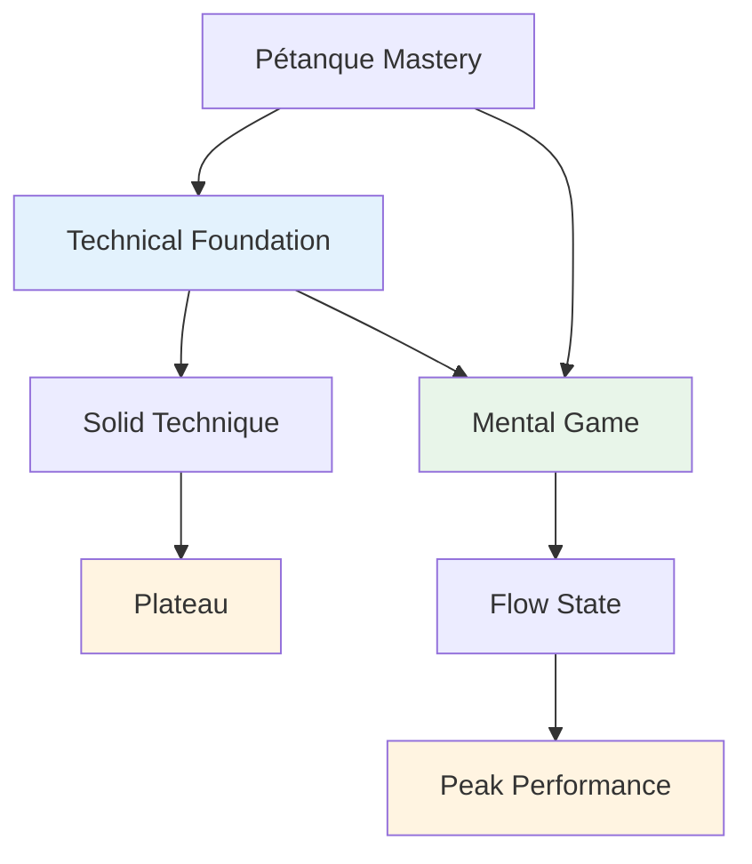

# Technical Advice

## A Note on Technique

While our primary focus is on the mental game and flow state, we recognize that technique is the foundation upon which everything else is built.

::: info Our Philosophy
**Technique is the foundation, but flow is the ceiling.** You need solid technique to reach elite level, but mental mastery is what takes you beyond.
:::

## The Most Common Mistake in Technical Training

::: info This Section Is For Experienced Players
If you're new to pétanque, you'll naturally need to develop your basic technique from the ground up — and that's a different journey.

**This advice is for players who have played for years** and already have an established technique that feels natural, relaxed, and reliable. You've found your way of throwing. Now the question is: how do you grow from here?
:::

::: warning The Common Trap
When experienced players want to improve, they often go back to basics — adjusting their grip, arm swing, release point, body position. Hours of drilling. Endless tweaking.

**But they've skipped the most important question:** What exactly do you want the boule to do?
:::

Before you touch your technique, you need clarity on the **result** you're trying to achieve. Not "I want to hit more" or "I want to be more consistent" — those aren't results, they're wishes.

A real result looks like this:
- "I want a high-arc lob that stops within 20cm of where it lands"
- "I want a rolling shot that curves left on this type of terrain"
- "I want a soft devant shot that barely touches the target boule"

**First, explore the [Palette of Throws](/en/education/technique/throws)** to understand what's possible. Then decide which specific throw you want to add to your repertoire. Only then should you start working on how your arm, wrist, and body need to move to create that result.

## The Right Way to Work on Technique

We're not saying you should never work on your arm, wrist, release, or body position. **Technical work on execution is absolutely valid** — but it must have the right purpose.

::: info The Right Purpose for Technical Work
**Correct purpose:** "I want to add a new throw to my palette"

**Wrong purpose:** "I want to make more shots" or "I want to be more consistent"
:::

Here's the process:

1. **Explore the [Palette of Throws](/en/education/technique/throws)** — Identify what throw or technique you want to add to your repertoire
2. **Visualize the result** — What should the boule do? What trajectory, landing, spin, and behavior do you need?
3. **Then work on execution** — Now you can focus on arm, wrist, body position, and release to achieve that specific result

This approach gives your technical training **clear direction and measurable progress**. You're not just "practicing" — you're deliberately expanding your capabilities.

::: tip Example: Adding a Plombée
**Goal:** Add a drop shot (plombée) to your pointing repertoire

**Result visualization:** The boule should arc high, land softly with backspin, and stop almost immediately

**Technical focus:** Higher release point, more wrist action for backspin, softer grip

**Success measure:** Can you execute this throw when you choose to? That's the goal.
:::

## Better Shots vs. More Shots: Understanding the Difference

There's a crucial distinction that many players miss:

::: tip The Key Insight
**If you want to make BETTER shots** → Work on your technique

**If you want to make MORE shots** → Work on your mental strength
:::

### What Does This Mean?

**Making better shots** means expanding your technical repertoire:
- Adding new types of throws (plombée, portée, demi-portée)
- Improving precision on specific shot types
- Developing new skills you don't currently have
- **This requires technical practice and physical training**

**Making more shots** means executing what you already know how to do:
- Hitting the shots you can already make in practice
- Performing consistently under pressure
- Trusting your technique when it matters
- **This requires mental training and flow state access**

### The Reality Check

Ask yourself honestly:
- Can you make the shot in practice when relaxed? ✅ **Then you have the technique**
- Do you struggle to make it in competition? ⚠️ **Then you need mental work, not more technical drilling**

::: warning Common Mistake
Many experienced players spend years refining technique they already have, when what they really need is to develop the mental strength to execute it under pressure.

**You don't need a better arm swing. You need a quieter mind.**
:::

### The Path Forward

**For better shots (new capabilities):**
- Explore the [Palette of Throws](/en/education/technique/throws)
- Choose a specific new throw to develop
- Practice the technical execution

**For more shots (consistency under pressure):**
- Work on [Mental Strength](/en/education/mental-game/mental-strength/)
- Learn to access [The Zone](/en/education/mental-game/the-zone/)
- Develop [Pre-Shot Routines](/en/education/mental-game/mental-strength/pre-shot-routine)

## Our Perspective

::: tip You Don't Need to Master Everything
**You don't need to master all techniques**, but understanding the full palette of possibilities helps you:

- ✅ Know what's possible
- ✅ Make informed choices about what to develop
- ✅ Appreciate the game at a deeper level
- ✅ Understand what elite players can do
:::

::: info The Goal
If you have a technical focus and want to expand your repertoire, this section outlines the end goal - the complete palette of throws available to a pétanque player.

**Remember:** The goal isn't to master everything. It's to have enough technical foundation that you can enter the zone and let your body choose the right throw naturally.
:::

## Topics

### [Palette of Throws](/en/education/technique/throws)
What are all the throws out there? A comprehensive overview of the technical possibilities in pétanque.

::: tip After Technique, What's Next?
Once you have solid technique, the real growth comes from:
- **[The Zone](/en/education/mental-game/the-zone/)** - Accessing flow states
- **[Mental Strength](/en/education/mental-game/mental-strength/)** - Handling pressure
- **[Training Methods](/en/education/technique/training/)** - How to practice effectively
:::

