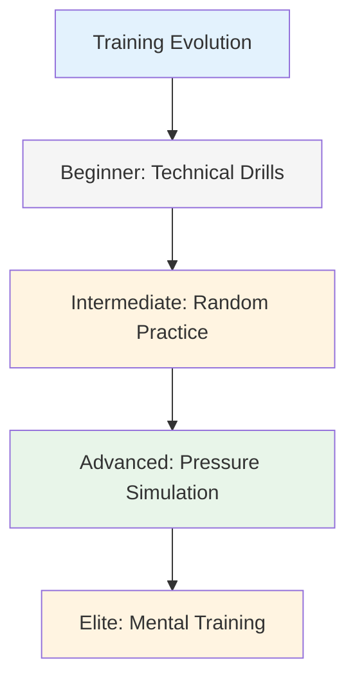
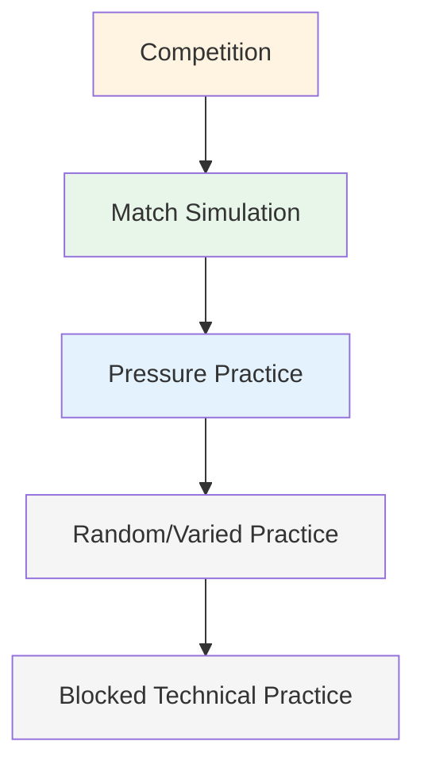

# Training Methods

When your technique is solid, what do you practice? This is where many players plateau - they keep drilling technique when the real growth lies elsewhere.

::: tip The Big Idea
**Most players plateau because they keep drilling technique when the real growth lies elsewhere.** Elite players train adaptability, decision-making, and mental toughness - not just mechanics.
:::

## Beyond Technical Repetition

Most players train by repeating throws. That's important for beginners, but advanced players need more:

| Training Type | What It Develops | When to Use |
|--------------|------------------|-------------|
| Technical drills | Mechanics, form | Learning new skills, fixing issues |
| Random practice | Adaptability, decision-making | Competition preparation |
| Pressure simulation | Mental toughness | Before important events |
| Mental training | Focus, recovery, confidence | Ongoing, often neglected |

## The Training Pyramid

::: warning Common Mistake
**Most players spend too much time at the bottom.** Elite players work at all levels of the pyramid, with emphasis on the top levels as they advance.
:::

## Blocked vs. Random Practice

### Blocked Practice
Repeat the same throw many times:
- 20 points from 7 meters
- 20 shots at the same target
- Same distance, same throw

**Good for:** Initial learning, building confidence, warming up
**Limitation:** Doesn't transfer well to competition

### Random Practice
Vary everything:
- Different distances each throw
- Alternate pointing and shooting
- Change targets constantly

**Good for:** Competition preparation, building adaptability
**Feels:** Harder, more mistakes, less "productive"
**Reality:** Better long-term retention and transfer

### The Research

Studies consistently show:
- Blocked practice feels better (quick improvement visible)
- Random practice produces better competition performance
- The "struggle" of random practice is where learning happens

## Pressure Simulation

You can't handle competition pressure if you never experience it in training.

### Creating Practice Pressure

**Consequences:**
- Push-ups for misses
- Loser buys coffee
- Points count toward something

**Scenarios:**
- "Must make" situations
- Down 12-10, need to score
- Last boule of the game

**Audience:**
- Practice with people watching
- Record yourself on video
- Announce what you're trying to do

**Fatigue:**
- Practice when tired
- End of long session
- After physical exercise

### The Shooting Ladder

A classic pressure drill:
1. Start at 6 meters
2. Hit the target = move back one meter
3. Miss = move forward one meter (or start over)
4. Goal: Reach 10 meters

This creates natural pressure as you progress.

## Mental Training Sessions

Dedicate time specifically to mental skills:

### Visualization Session (15-20 min)
1. Find a quiet place
2. Close your eyes
3. Visualize yourself at a competition
4. See successful throws in detail
5. Feel the confidence and flow
6. Practice handling pressure moments

### Pre-Shot Routine Practice
- Practice your routine without throwing
- Focus on the mental transitions
- Build the habit of consistent preparation

### Recovery Practice
- Intentionally make mistakes in practice
- Practice your SOAS response
- Build the habit of quick mental reset

## Structuring Your Training Week

### Example: Serious Amateur (6 hours/week)

| Day | Duration | Focus |
|-----|----------|-------|
| Monday | 1.5 hr | Technical: Pointing drills |
| Wednesday | 1.5 hr | Technical: Shooting drills |
| Friday | 1 hr | Mental: Visualization, routine practice |
| Saturday | 2 hr | Match play with pressure elements |

### Example: Competitive Player (10 hours/week)

| Day | Duration | Focus |
|-----|----------|-------|
| Monday | 2 hr | Technical: Pointing (blocked → random) |
| Tuesday | 1 hr | Mental training + visualization |
| Wednesday | 2 hr | Technical: Shooting (blocked → random) |
| Thursday | 1 hr | Video review + mental work |
| Friday | 2 hr | Pressure simulation, game scenarios |
| Saturday | 2 hr | Competition or match play |

## Training Principles

### 1. Quality Over Quantity
- 30 focused minutes beats 2 hours of mindless repetition
- Stop when focus drops
- Better to end early than practice bad habits

### 2. Deliberate Practice
- Have a specific goal for each session
- Work at the edge of your ability
- Get feedback (video, partner, results)
- Adjust based on what you learn

### 3. Recovery Matters
- Rest days are part of training
- Sleep affects performance significantly
- Mental fatigue is real - respect it

### 4. Track Everything
- Keep a training log
- Note what works and what doesn't
- Review regularly
- Adjust your plan based on data

## In This Section

- **[Training Drills](/en/education/technique/training/drills)** - Specific exercises for different skills

## Key Takeaway

> How you train determines how you perform. Train like you want to play.

Mix your training. Include mental work. Create pressure. Track your progress.

