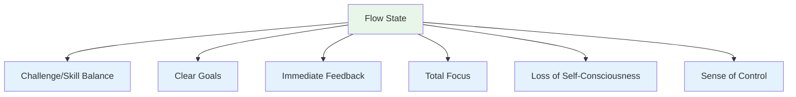
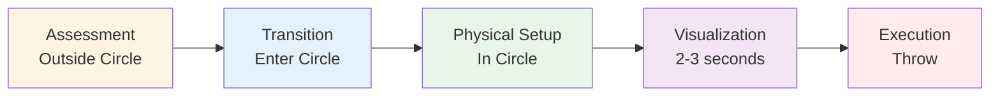
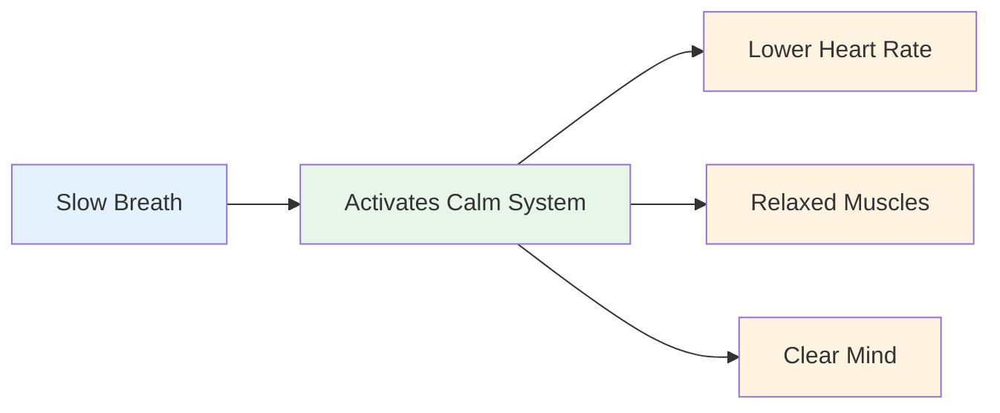
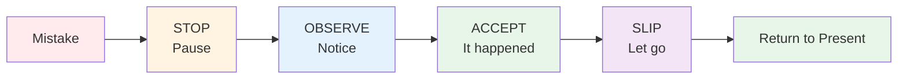

# Entering the Zone: Practical Techniques

The zone isn't something that just happens to you. With practice, you can learn to access it more consistently. Here are proven techniques used by elite athletes.

::: tip The Big Idea
**You can train yourself to enter flow states more reliably.** The zone isn't magic - it's a skill you develop through specific techniques and consistent practice.
:::

## The Six Conditions for Flow

Research shows that flow states require certain conditions:

| Condition | What It Means | In Pétanque |
|-----------|---------------|-------------|
| **Challenge/Skill Balance** | Task stretches you but is achievable | Competing at your level, not too easy or impossible |
| **Clear Goals** | You know exactly what you're trying to do | Specific target, clear intention for each throw |
| **Immediate Feedback** | You see results of your actions | Ball lands, you know if it worked |
| **Total Focus** | Attention fully on the task | No distractions, present moment only |
| **Loss of Self-Consciousness** | Not worried about how you look | Don't care who's watching |
| **Sense of Control** | Feel capable of handling it | Trust your training and ability |

::: info Key Insight
When these six conditions align, flow becomes possible. Your job is to create these conditions deliberately.
:::

## Technique 1: The Pre-Shot Routine

Your pre-shot routine is your gateway to the zone. It's a consistent sequence that signals your brain: "It's time to execute."

### Building Your Routine

A good routine has these elements:

::: details 1. Visual Assessment (Outside the Circle)
- Read the terrain
- Choose your target and landing spot
- Decide on the throw type

**This is where thinking happens.** Take your time here.
:::

::: details 2. Transition (Entering the Circle)
- Take a breath
- Let go of analysis
- Shift to execution mode

**This is the switch.** Analysis stops here.
:::

::: details 3. Physical Trigger (In the Circle)
- A consistent stance setup
- A specific grip check
- A small movement that feels natural to you

**Make it consistent.** Same every time.
:::

::: details 4. Visualization (Brief, 2-3 seconds)
- See the ball's path
- Feel the successful throw
- Connect with your target

**Keep it short.** Too long = overthinking.
:::

::: details 5. Execution
- Focus only on the target
- Trust your body
- Release without hesitation

**External focus only.** Target, not technique.
:::

### Why Routines Work

Your routine becomes a "mindfulness bell" - a signal that shifts your brain state. With enough repetition, simply starting your routine triggers the mental shift to flow.

::: tip Practice Tip
Use your routine on EVERY throw in practice - not just competitions. The routine must become automatic.
:::

## Technique 2: External Focus

Where you put your attention matters enormously.

| Focus Type | What You Think About | Example Thoughts |
|------------|---------------------|------------------|
| **Internal** ❌ | Your body mechanics | "Keep my elbow straight" "Follow through properly" "Don't grip too tight" |
| **External** ✅ | Target and outcome | "Land it right there" "See the path" "Hit the target" |

::: tip Research Finding
Studies consistently show that **external focus produces better results** for skilled players. Your body knows what to do - let it work.
:::

### Practice External Focus
- Pick a specific spot on the ground (not just "near the jack")
- Visualize the ball's entire path
- Keep your eyes on the target, not your hand

::: warning Common Mistake
Under pressure, players often revert to internal focus ("Don't mess up my technique"). This is exactly when you need external focus most.
:::

## Technique 3: The Left-Hand Squeeze

This unusual technique has scientific backing.

::: info The Science
Squeezing your left hand (if right-handed) for 10-15 seconds before throwing:
- ✅ Activates the right hemisphere of your brain (spatial, intuitive)
- ✅ Quiets the left hemisphere (verbal, analytical)
- ✅ Reduces overthinking
:::

**How to use it:**
1. Make a fist with your non-throwing hand
2. Squeeze firmly for 10-15 seconds
3. Release and begin your routine
4. Throw

::: tip When to Use
This works best when you notice yourself overthinking or feeling pressure. It's a "reset button" for your brain.
:::

## Technique 4: Breath Control

Your breath directly affects your mental state.

**Before stepping into the circle:**
- Take one slow, deep breath
- Exhale completely
- Feel your shoulders drop

**In the circle:**
- Breathe naturally
- Don't hold your breath during the throw
- Let the exhale accompany your release

::: details The 4-7-8 Technique (For High Pressure)
1. Inhale for 4 counts
2. Hold for 7 counts
3. Exhale for 8 counts
4. Repeat once or twice

**Why it works:** This activates your parasympathetic nervous system (the "calm down" system).
:::

## Technique 5: Trigger Words

A trigger word or phrase can instantly shift your mental state.

::: tip Popular Trigger Words
- "Smooth"
- "Trust"
- "See it, be it"
- "Let go"
- "Flow"
- "Easy"
:::

**How to develop yours:**
1. Think of a time you performed perfectly
2. What word captures that feeling?
3. Use that word in your routine
4. Say it silently as you prepare to throw

::: info Why It Works
With repetition, the word becomes linked to your best performance state. It's a mental shortcut to flow.
:::

## Technique 6: Reset After Mistakes

Mistakes will happen. The key is not letting one bad throw become two.

**The SOAS Method:**

| Step | Action | What It Means |
|------|--------|---------------|
| **S**top | Pause, don't react immediately | Don't throw hands up, don't curse |
| **O**bserve | Notice what happened without judgment | "The ball went left" not "I'm terrible" |
| **A**ccept | It happened, it's done | Can't change the past |
| **S**lip | Let go, release it | Return to the present moment |

::: warning Critical Skill
This takes practice, but it prevents the spiral of frustration that kills flow. Practice SOAS in daily life so it's automatic in competition.
:::

## Building Your Flow Toolkit

Not every technique works for everyone. Experiment and find what helps you:

| Situation | Try This |
|-----------|----------|
| Overthinking | Left-hand squeeze, external focus |
| Nervous/tense | Breath control, trigger word |
| After a mistake | SOAS method |
| Important throw | Full pre-shot routine |
| Losing focus | Return to routine basics |

## Practice Makes Permanent

These techniques only work if you practice them:

1. **Use your routine in every practice throw** - not just competitions
2. **Simulate pressure** - create consequences in practice
3. **Notice when you're in flow** - what triggered it?
4. **Review after sessions** - what helped, what didn't?

## Key Takeaway

::: tip Remember
**The zone isn't luck. It's a skill you can develop.**

Start with your pre-shot routine. Make it consistent. Trust it. The zone will follow.
:::

