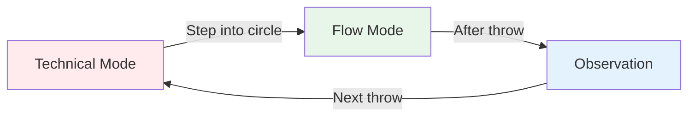
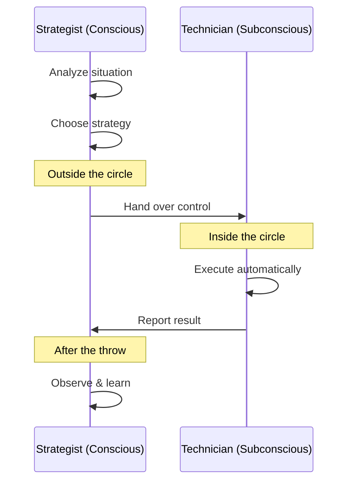

# The Zone: Understanding Flow State

Have you ever had a game where everything just clicked? Where you didn't think about your technique, and every boule landed exactly where you wanted? That's "the zone" - and learning to access it consistently is what separates elite players from the rest.

::: tip The Big Idea
**Flow state is when your analytical brain quiets down and your trained instincts take over.** You can't think your way into the zone - you have to let go.
:::

## What is The Zone?

The zone, also called "flow state," is a mental state where you become completely absorbed in what you're doing. Time seems to slow down. Your movements feel effortless. You're not thinking about technique - you're just *doing*.

Scientists call this state **transient hypofrontality**. In simple terms, the analytical part of your brain (the prefrontal cortex) quiets down, allowing your trained instincts to take over.

### The Two Brain Modes

**Technical Mode (Planning):**
- Analyze the situation
- Choose your strategy
- Decide what throw to make

**Flow Mode (Execution):**
- Trust your training
- Focus only on the target
- Let your body execute automatically

**Observation (Learning):**
- Notice the result without judgment
- Learn from what happened
- Reset for next throw

## The Paradox of Pétanque

Here's the challenge: pétanque gives you a lot of time to think between throws. Unlike fast sports where you react instantly, you have time to walk to the circle, assess the situation, and prepare your throw.

This "time to think" is both a gift and a curse:
- **Gift:** You can plan strategy and make smart decisions
- **Curse:** You can overthink and interfere with your natural ability

The elite player learns to use this time wisely - thinking during planning, then "switching off" during execution.

## Two Modes of Playing

Your brain operates in two different modes:

| Feature | Technical Mode | Flow Mode |
|---------|---------------|-----------|
| **When to use** | Training, learning new skills | Competition, execution |
| **Brain activity** | High analytical thinking | Quiet, automatic |
| **Focus** | Internal (body mechanics) | External (target) |
| **Feeling** | Effortful, conscious | Effortless, natural |

The key skill is learning to **switch** between these modes at the right time.

## The "Switch" Moment

::: warning The Switch Rule
**Before the circle:** Analyze, strategize, decide what throw to make
**In the circle:** Let go of analysis, trust your training, focus only on the target
**After the throw:** Observe the result without judgment
:::

The transition happens when you step into the circle. This is the most important skill in elite pétanque.

Think of it like this: your conscious mind is the **strategist** who makes the plan, and your subconscious mind is the **technician** who executes it. The strategist needs to step back and let the technician work.

## Why Overthinking Kills Performance

When you consciously monitor your movements during execution, you disrupt the automatic processes you've trained. This is called "choking" - and it happens to everyone.

::: danger Signs You're Overthinking
- ❌ Thinking about arm position mid-throw
- ❌ Worrying about the outcome before you release
- ❌ Feeling tense or mechanical
- ❌ Second-guessing yourself in the circle
:::

::: tip The Solution
The solution isn't to think *less* - it's to think about the **right things** at the **right time**.

✅ **Right thinking:** "I see the target clearly"
❌ **Wrong thinking:** "Keep my elbow straight"
:::

## In This Section

Learn how to master the zone:

- **[Technical vs Flow Training](/en/education/the-zone/technical-vs-flow)** - Understanding when to focus on technique and when to let go
- **[Entering the Zone](/en/education/the-zone/entering-the-zone)** - Practical techniques to access flow state

## Summary: The Zone Rules

::: tip Rule #1: The Switch Rule
**Analyze before the circle, execute in the circle, observe after.**
Your conscious mind plans, your subconscious executes.
:::

::: tip Rule #2: The Inversion Rule
**As skill increases, mental training becomes more important than technical training.**
Beginners: 90% technical / 10% mental
Experts: 20% technical / 80% mental
:::

::: tip Rule #3: The Trust Rule
**You cannot think your way to perfect execution.**
Trust your training. Focus on the target, not your technique.
:::

## Key Takeaway

> There are no techniques that always produce a perfect boule. But there is a mental state where perfect boules become natural.

Your technique is the foundation. The zone is where that foundation becomes art.

