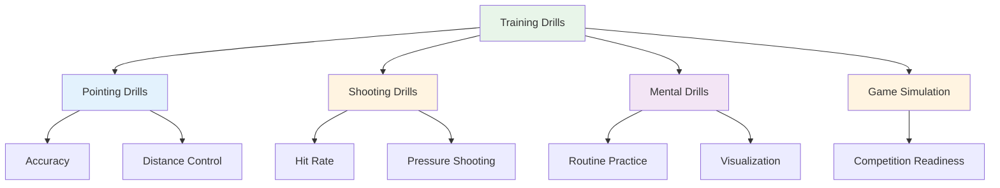

# Training Drills

Here are proven drills used by elite players. Each drill has a specific purpose - choose based on what you need to develop.

::: tip The Big Idea
**Each drill has a specific purpose.** Don't just throw boules randomly - choose drills that target your weaknesses and support your goals. Track your progress to see improvement.
:::

## Pointing Drills

### The Alley
**Purpose:** Isolate release angle and line consistency

**Setup:**
- Place two markers 30-40cm apart, about 1 meter from the circle
- Target is 7-9 meters away

**Drill:**
- Throw through the "alley" (between the markers)
- Any throw that hits a marker is "dead"
- Focus on consistent release point

**Progression:**
- Narrow the alley as you improve
- Vary the target distance
- Add a specific landing zone

### Precision Zones
**Purpose:** Develop accuracy to specific areas

**Setup:**
- Mark zones around a target (e.g., circles at 20cm, 40cm, 60cm)
- Or use natural markers on the terrain

**Scoring:**
- Inside 20cm: 3 points
- Inside 40cm: 2 points
- Inside 60cm: 1 point
- Outside: 0 points

**Drill:**
- Throw 10 boules, track your score
- Goal: Consistent improvement over sessions

### Distance Variation
**Purpose:** Develop depth control

**Setup:**
- Place targets at 6m, 7m, 8m, 9m, 10m

**Drill:**
- Throw to each distance in random order
- Partner calls out the distance
- Focus on adjusting weight, not technique

**Variation:**
- Add "short" and "long" calls after you release
- Must adjust mid-flight (develops feel)

## Shooting Drills

### The Shooting Ladder
**Purpose:** Build accuracy under progressive pressure

**Setup:**
- Place a target boule at 6 meters
- Mark distances at 7m, 8m, 9m, 10m

**Drill:**
- Start at 6 meters
- Hit = move back one meter
- Miss = move forward one meter (or restart)
- Goal: Reach 10 meters

**Variations:**
- Strict version: Any miss returns to 6m
- Timed version: How far can you get in 10 minutes?
- Team version: Alternate with partner

### The Barrier (Blox)
**Purpose:** Force high arc shooting

**Setup:**
- Place a barrier (stick, string, or obstacle) between you and target
- Barrier should be high enough to require a lob

**Drill:**
- Must clear the barrier to hit the target
- Any throw that hits the barrier is "dead"
- Develops high release point

**Why it matters:**
- Competition often requires shooting over obstacles
- Builds versatility in your shooting

### Obstacle Course
**Purpose:** Develop shooting from different angles

**Setup:**
- Place target boule in center
- Add obstacles (other boules, markers) around it

**Drill:**
- Shoot from different positions around the circle
- Must find the angle that works
- Develops reading of shooting lines

## Mental Training Drills

### Routine Repetition
**Purpose:** Make your pre-shot routine automatic

**Drill:**
- Practice your full routine without throwing
- Go through every step deliberately
- Do 10-20 repetitions
- Then add the throw

**Focus:**
- Consistent timing
- Clear transition from thinking to executing
- Same routine every time

### Pressure Points
**Purpose:** Practice performing under pressure

**Setup:**
- Create a "must make" scenario
- Set consequences for missing

**Examples:**
- "Make 3 in a row or start over"
- "Miss and do 10 push-ups"
- "Announce your target before throwing"

**Key:**
- The pressure should feel real
- Practice your mental response to pressure
- Use your routine exactly as in competition

### Recovery Practice
**Purpose:** Build the habit of quick mental reset

**Drill:**
- Intentionally throw a bad boule
- Immediately practice SOAS (Stop, Observe, Accept, Slip)
- Throw the next boule with full commitment

**Focus:**
- Don't dwell on the miss
- Reset completely before next throw
- Maintain positive body language

## Game Simulation Drills

### Millieu's Delight
**Purpose:** Break rhythm lock, build versatility

**Drill:**
- Alternate between pointing and shooting every throw
- No two consecutive throws of the same type
- Develops ability to switch modes

### Scenario Play
**Purpose:** Practice tactical decision-making

**Setup:**
- Set up realistic game situations
- Assign scores and boule counts

**Examples:**
- "You're down 10-8, opponent has 2 points, you have 2 boules"
- "Tied 6-6, you have last boule, they have 1 point"

**Drill:**
- Decide what to do
- Execute with full commitment
- Review the decision afterward

### Match Play with Rules
**Purpose:** Competition simulation

**Variations:**
- Play to 13 (full game)
- Play to 7 (shorter, more games)
- "Pressure points" - certain ends worth double
- "Sudden death" - first to lose an end loses the game

## Tracking Your Drills

Keep a log for each drill:

| Date | Drill | Score/Result | Notes |
|------|-------|--------------|-------|
| | | | |

**Track over time:**
- Are you improving?
- Which drills help most?
- Where do you struggle?

## Building a Drill Session

### Warm-up (10 min)
- Easy throws to loosen up
- No pressure, just feel

### Technical Focus (20-30 min)
- One or two drills targeting specific skills
- Blocked practice for new skills
- Random practice for established skills

### Pressure/Game Simulation (20-30 min)
- Add consequences
- Create realistic scenarios
- Practice mental skills

### Cool-down (10 min)
- Easy throws
- Reflect on the session
- Note what to work on next

## Key Takeaway

> Drills are tools. Choose the right tool for what you need to build.

Don't just throw boules. Train with purpose.

