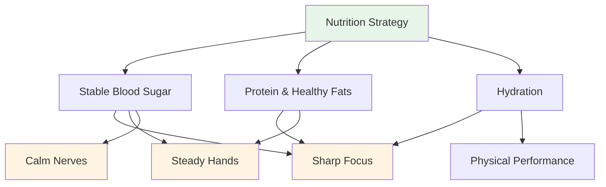
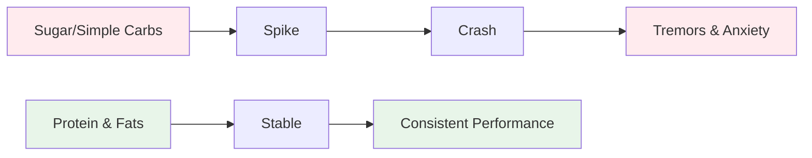
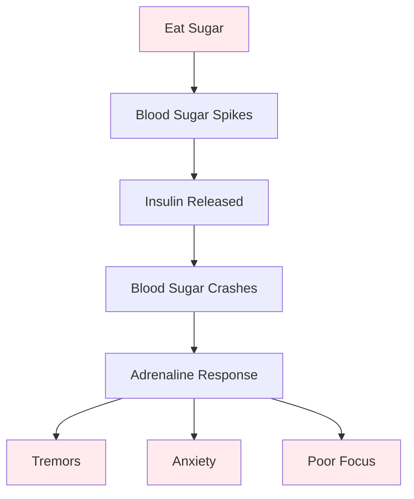

# Food & Nutrition

## Fueling Precision Performance

Pétanque is a precision sport. Your brain is your most important tool - feed it stable fuel, not roller coaster energy.

::: tip The Core Principle
**Stable blood sugar = Sharp focus + Steady hands**

Avoid sugar spikes. Prioritize protein and healthy fats. Stay hydrated.
:::

## Key Principles

### Stable Blood Sugar is Everything

::: warning Blood Sugar Crashes Impact
Sugar and simple carbs cause blood glucose spikes and crashes, which directly impact:
- ❌ Mental focus and clarity
- ❌ Steady hands (tremors from blood sugar drops)
- ❌ Decision-making quality
- ❌ Emotional stability and composure
:::

### Prioritize Protein and Healthy Fats

::: tip Best Foods for Precision
Fat and protein provide sustained energy without the crashes:
- ✅ Nuts, avocado, olive oil, eggs, cheese
- ✅ Slow digestion = consistent energy all day
- ✅ No afternoon slump during long tournaments
:::

### Avoid the Sugar Trap

::: danger Foods to Avoid
Be especially careful with:
- ❌ "Energy" bars and drinks (often sugar-heavy)
- ❌ Fruit juice and smoothies (concentrated sugar)
- ❌ White bread, pastries, vending machine snacks
:::

## Competition Day Quick Guide

| Timing | What to Eat | Why |
|--------|-------------|-----|
| **2-3 hours before** | Balanced meal: protein, fat, vegetables | Stable energy without drowsiness |
| **During competition** | Water + small protein snacks (nuts, cheese, jerky) | Maintain focus and steady hands |
| **Avoid all day** | Sugary snacks and drinks | Prevent crashes and tremors |

::: tip Quick Competition Snacks
**Bring these:**
- Mixed nuts (unsalted)
- Hard-boiled eggs
- Cheese cubes
- Beef or turkey jerky
- Vegetables with hummus

**Leave these at home:**
- Candy and chocolate
- Energy drinks
- Pastries
- Fruit juice
:::

## The Science

::: info Why This Matters for Pétanque
Unlike endurance sports, pétanque requires:
- **Precision** - Steady hands, no tremors
- **Mental clarity** - Sharp decision-making all day
- **Calm nerves** - Low anxiety under pressure

Sugar-based energy works against all of these.
:::

## Learn More

For detailed nutrition strategies, competition day protocols, and the science behind stable energy:

::: tip Complete Nutrition Guide
→ **[Nutrition for Precision Performance](./education/nutrition/)** - Complete guide in our Education section

Includes:
- Detailed meal planning
- Competition day protocols
- The low-carb option for precision athletes
- Hydration strategies
- Foods that help vs. foods that hurt
:::

